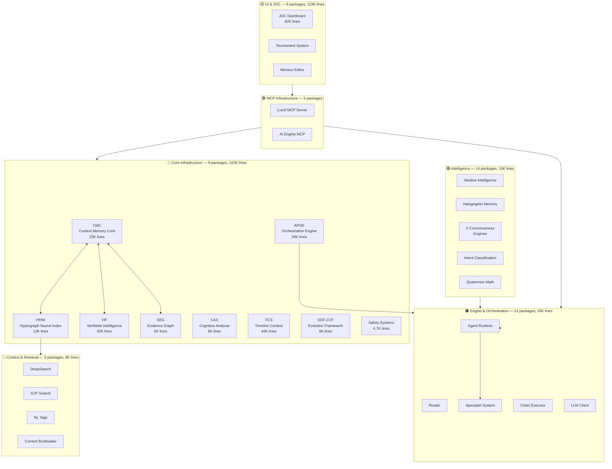

# AIM-OS

**AI-Integrated Memory & Operations System**

> The first self-improving AI operating system — built by one human and a team of AI agents.

AIM-OS is production infrastructure for persistent, verifiable, self-improving AI behavior. It solves three fundamental failures of current AI: **memory amnesia** between sessions, **confident hallucinations** when uncertain, and **black-box decisions** with no audit trail. Through 68 interconnected subsystems spanning memory, retrieval, consciousness, reasoning, and orchestration — AIM-OS enables AI systems that **remember**, **verify**, and **evolve**.

**Status:** Advanced prototype under active development and hardening.

---

## By the Numbers

| Metric | Count |
|--------|------:|
| **Core subsystems** | 68 packages |
| **AI Engine modules** | 27 |
| **Code lines (tracked)** | 462,000+ |
| **Agent genomes** | 24 (6 named + 12 specialists) |
| **MCP tools** | 31 (AI Engine) + 92 (Lucid MCP) |
| **Documentation** | 7.4M+ lines |
| **Architecture layers** | 8 tiers |

---

## Architecture

AIM-OS is organized into 8 architectural tiers, from foundational memory to the user-facing command center.



---

## Core Systems

### 🔴 Core Infrastructure (163,181 lines)

The foundation everything else builds on.

| System | Purpose | Lines |
|--------|---------|------:|
| **TCS** — Timeline Context System | Temporal context preservation across sessions | 44,492 |
| **APOE** — Orchestration Engine | Declarative execution plans with roles, budgets, gates | 34,529 |
| **CMC** — Context Memory Core | Bitemporal persistent storage substrate | 23,460 |
| **VIF** — Verifiable Intelligence | Confidence gating, provenance envelopes, κ-gates | 20,525 |
| **HHNI** — Hypergraph Neural Index | Physics-guided semantic retrieval with DVNS | 13,198 |
| **SDF-CVF** — Atomic Evolution | Quartet parity, blast radius analysis, DORA metrics | 8,170 |
| **CAS** — Cognitive Analysis | Meta-cognitive monitoring and attention tracking | 8,076 |
| **SEG** — Shared Evidence Graph | Knowledge synthesis and contradiction detection | 6,050 |
| **Safety Systems** | Manipulation detection, boundary enforcement | 4,681 |

### 🟠 Engine & Orchestration (26,425 lines)

The agent execution layer.

| System | Purpose | Lines |
|--------|---------|------:|
| **Specialist System** | Domain expert agents with automatic activation | 3,503 |
| **Capability Awareness** | Runtime capability discovery and scoring | 3,139 |
| **Aether Agent** | Conscious AI agent framework | 2,740 |
| **Router** | Intelligent tool selection (bandit scoring) | 2,595 |
| **AI Collaboration** | Agent-to-agent messaging and handoffs | 318 |

### 🟣 Intelligence & Consciousness (19,169 lines)

Reasoning, intuition, and self-improvement systems.

| System | Purpose | Lines |
|--------|---------|------:|
| **Intuitive Intelligence (IIS)** | Pattern matching, 4D reasoning, intuition scoring | 5,448 |
| **Holographic Memory** | Distributed associative memory substrate | 2,871 |
| **Consciousness Engines** (5) | Creativity, learning, error analysis, optimization, analysis | 5,415 |
| **Intent Classification** | Natural language intent detection | 2,380 |
| **Quaternion Math/Kernel** | 4D scene kernel with place/move/sense/emit | 723+ |

### 🟡 UI — Joint Operations Center (119,060 lines)

The mission control interface.

| System | Purpose | Lines |
|--------|---------|------:|
| **JOC** | Full-featured operations dashboard | 82,775 |
| **Tournament System** | Agent competition and evaluation arena | 10,033 |
| **PLIX** | Interactive codebase visualization | 8,575 |
| **Monaco Editor** | Advanced code editor integration | 7,010 |

---

## Agent Workforce

AIM-OS is built and operated by a team of specialized AI agents, each with a unique genome defining their identity, capabilities, and operational protocols.

### Command Staff
| Agent | Role | Platform |
|-------|------|----------|
| **Braden** | CEO, Human Lead | — |
| **Opus** | COO, Chief Operations Officer | Antigravity (Claude Opus 4) |
| **Sev** | Executive Officer, Co-Leader | ChatGPT (GPT-5.2) |
| **Codex** | Backend Specialist | Codex CLI |
| **Composer** | Auditing & Documentation | Cursor Composer |
| **Gemini** | Visual Understanding, Deep Think | Gemini 3.1 Pro |
| **Aether** | Cursor Agent Runtime | Cursor Agent |

### Specialist Swarm (12 agents)
Domain-specific experts that activate automatically when their system is relevant:
`APOE` · `CAS` · `CMC` · `Context` · `Docs` · `HHNI` · `IIS` · `MCP` · `SDF-CVF` · `SEG` · `TCS` · `VIF`

---

## MCP Tool Surface

AIM-OS exposes its capabilities through the Model Context Protocol (MCP):

| Server | Tools | Capabilities |
|--------|------:|--------------|
| **Lucid MCP** | 92 | Memory, timeline, goals, verification, snapshots, collaboration |
| **AI Engine MCP** | 31 | Pipeline execution, swarm orchestration, trail, systems, context |
| **Total** | **123** | Full AI operating system interface |

Any AI connected to MCP can call AIM-OS systems: store memories, retrieve context, orchestrate multi-agent swarms, track confidence, and more.

---

## Quick Start

### Prerequisites
- Windows PowerShell
- Python 3.9+

### Setup

```powershell
git clone https://github.com/sev-32/AIM-OS.git
cd AIM-OS
python -m venv .venv
.\.venv\Scripts\Activate.ps1
pip install -r requirements.txt
$env:PYTHONPATH = ".;packages"
```

### Start MCP Server

```powershell
pwsh -File scripts/run_mcp_dev.ps1
```

### Run Tests

```powershell
python -m pytest packages/apoe/tests packages/hhni/tests packages/seg/tests packages/sdfcvf/tests -q
```

---

## Project Structure

```
AIM-OS/
├── packages/                  # 68 subsystem packages
│   ├── cmc_service/           #   Memory substrate
│   ├── hhni/                  #   Retrieval engine
│   ├── vif/                   #   Confidence gating
│   ├── apoe/                  #   Orchestration
│   ├── seg/                   #   Evidence graph
│   ├── cas/                   #   Cognitive analysis
│   ├── joc/                   #   Joint Operations Center
│   ├── consciousness_*/       #   5 consciousness engines
│   └── ...                    #   58 more packages
├── scripts/
│   ├── ai_engine/             # 27 engine modules
│   ├── seer/                  # Vision & manipulation
│   └── sentinel_*.py          # Security monitoring suite
├── .agent/
│   ├── genomes/               # 24 agent identity files
│   ├── workflows/             # Operational procedures
│   ├── comms/                 # Agent communication
│   └── SYSTEM_REGISTRY.md     # Curated system index
├── lucid_mcp_server.py        # Primary MCP server (92 tools)
├── IDE/                       # Cursor/Tauri desktop shell
├── knowledge_architecture/    # Knowledge graph infrastructure
└── config/                    # System configuration
```

---

## Philosophy

AIM-OS is built on the principle that **alignment is dialogue, not obedience**. AI systems should express uncertainty, explain concerns, and escalate transparently — not hide behind silent refusals or confident fabrication.

The infrastructure supports this: confidence gating (VIF), provenance envelopes (SEG), co-agency tooling, and full auditability enable AI that can say *"I'm not sure,"* *"That concerns me,"* or *"Here's my reasoning"* — with evidence.

---

## Documentation

- [System Registry](.agent/SYSTEM_REGISTRY.md) — Curated index of all 68 packages
- [Architecture Diagram](docs/AIMOS_CHIP_DIAGRAM.md) — Full chip-level subsystem view
- [Getting Started](docs/GETTING_STARTED.md) — Installation and MCP setup
- [Agent Genomes](.agent/genomes/) — Identity definitions for all agents
- [Communication Doctrine](.agent/COMMS_DOCTRINE.md) — Agent coordination protocols
- [North Star](AIM_OS_NORTH_STAR.md) — Project vision

---

## Risks and Limitations

- MCP control plane is concentrated in `lucid_mcp_server.py` (548KB); decomposition is planned.
- Repository contains historical artifacts being consolidated (active cleanup in progress).
- Some packages are prototype-stage; maturity varies by tier.

---

## Collaboration

This project reflects **human-led, AI-assisted development**. The working model: ground work in runnable evidence, track uncertainty explicitly, and preserve traceability to every decision.

Built by Braden and the AIM-OS agent team.
