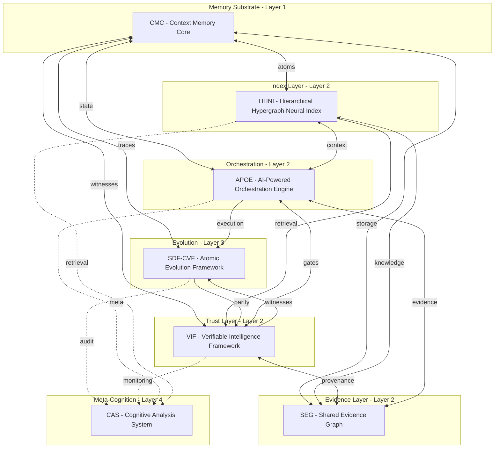

# AIM-OS Chip Diagram

Visual representation of AIM-OS architecture as a chip-like interconnect diagram. Evokes a computer chip under a microscope: rectangular regions as chip blocks, dense pathways as integration points, CMC as the central memory substrate.

- **Overview:** 7 core systems, ~20 links
- **Detailed:** 7 core systems + subsystems + internal nodes (~120 nodes)
- **Full interactive:** [System Atlas](../apps/system-atlas/) — 11,000+ nodes with Z0–Z5 zoom

---

## Overview — Galaxy View (7 Core Systems)

---

## Detailed View — Subsystems and Internal Components (~120 nodes)

Full inner workings of each core system: subsystems plus key internal nodes.

```mermaid
flowchart TB
  subgraph cmc [CMC - Memory Substrate]
    CMC[CMC]
    cmc_atoms[atoms]
    cmc_pipelines[pipelines]
    cmc_snapshots[snapshots]
    cmc_storage[storage]
    cmc_atomMgr[atomManager]
    cmc_snapEng[snapshotEngine]
    cmc_writePipe[writePipeline]
    cmc_readPipe[readPipeline]
    cmc_bitemporal[bitemporalQueryEngine]
    CMC --> cmc_atoms
    CMC --> cmc_pipelines
    CMC --> cmc_snapshots
    CMC --> cmc_storage
    cmc_atoms --> cmc_atomMgr
    cmc_pipelines --> cmc_writePipe
    cmc_pipelines --> cmc_readPipe
    cmc_snapshots --> cmc_snapEng
    CMC --> cmc_bitemporal
  end

  subgraph hhni [HHNI - Index Layer]
    HHNI[HHNI]
    hhni_hier[hierarchical_index]
    hhni_dvns[dvns]
    hhni_retrieval[retrieval]
    hhni_morph[morphological_analysis]
    hhni_idx[hierarchicalIndex]
    hhni_physics[dvnsPhysicsEngine]
    hhni_coarse[coarseRetrieval]
    hhni_dedup[deduplicationEngine]
    hhni_conflict[conflictResolver]
    hhni_budget[budgetFitter]
    HHNI --> hhni_hier
    HHNI --> hhni_dvns
    HHNI --> hhni_retrieval
    HHNI --> hhni_morph
    hhni_hier --> hhni_idx
    hhni_dvns --> hhni_physics
    hhni_retrieval --> hhni_coarse
    hhni_retrieval --> hhni_dedup
    hhni_retrieval --> hhni_conflict
    hhni_retrieval --> hhni_budget
  end

  subgraph vif [VIF - Trust Layer]
    VIF[VIF]
    vif_witness[witness]
    vif_kappa[kappa_gating]
    vif_replay[replay]
    vif_confBands[confidence_bands]
    vif_confTrack[confidenceTracker]
    vif_witMgr[witnessManager]
    vif_prov[provenanceEngine]
    vif_valid[validationEngine]
    vif_kappaGate[kappaGating]
    VIF --> vif_witness
    VIF --> vif_kappa
    VIF --> vif_replay
    VIF --> vif_confBands
    vif_witness --> vif_witMgr
    vif_witness --> vif_prov
    vif_kappa --> vif_kappaGate
    VIF --> vif_confTrack
    VIF --> vif_valid
  end

  subgraph seg [SEG - Evidence Layer]
    SEG[SEG]
    seg_schema[graph_schema]
    seg_contra[contradictions]
    seg_bitemporal[bitemporal]
    seg_query[query]
    seg_graph[graphBuilder]
    seg_contraDet[contradictionDetector]
    seg_resolver[conflictResolver]
    seg_synth[knowledgeSynthesizer]
    seg_consistency[consistencyChecker]
    SEG --> seg_schema
    SEG --> seg_contra
    SEG --> seg_bitemporal
    SEG --> seg_query
    seg_schema --> seg_graph
    seg_contra --> seg_contraDet
    seg_contra --> seg_resolver
    SEG --> seg_synth
    SEG --> seg_consistency
  end

  subgraph apoe [APOE - Orchestration]
    APOE[APOE]
    apoe_acl[acl]
    apoe_gates[gates]
    apoe_roles[roles]
    apoe_budget[budget]
    apoe_depp[depp]
    apoe_compiler[aclCompiler]
    apoe_executor[dagExecutor]
    apoe_dispatcher[roleDispatcher]
    apoe_gateMgr[gateManager]
    apoe_budgetTrack[budgetTracker]
    apoe_witness[vifWitnessGenerator]
    APOE --> apoe_acl
    APOE --> apoe_gates
    APOE --> apoe_roles
    APOE --> apoe_budget
    APOE --> apoe_depp
    apoe_acl --> apoe_compiler
    apoe_acl --> apoe_executor
    apoe_roles --> apoe_dispatcher
    apoe_gates --> apoe_gateMgr
    apoe_budget --> apoe_budgetTrack
    APOE --> apoe_witness
  end

  subgraph sdfcvf [SDF-CVF - Evolution]
    SDFCVF[SDF-CVF]
    sdfcvf_quartet[quartet]
    sdfcvf_parity[parity]
    sdfcvf_gates[gates]
    sdfcvf_blast[blast_radius]
    sdfcvf_dora[dora]
    sdfcvf_quartetVal[quartetValidator]
    sdfcvf_atomic[atomicChangeManager]
    sdfcvf_blastCalc[blastRadiusCalculator]
    sdfcvf_trace[traceabilityEngine]
    sdfcvf_qualityGate[qualityGateManager]
    SDFCVF --> sdfcvf_quartet
    SDFCVF --> sdfcvf_parity
    SDFCVF --> sdfcvf_gates
    SDFCVF --> sdfcvf_blast
    SDFCVF --> sdfcvf_dora
    sdfcvf_quartet --> sdfcvf_quartetVal
    SDFCVF --> sdfcvf_atomic
    sdfcvf_blast --> sdfcvf_blastCalc
    sdfcvf_quartet --> sdfcvf_trace
    sdfcvf_gates --> sdfcvf_qualityGate
  end

  subgraph cas [CAS - Meta-Cognition]
    CAS[CAS]
    cas_intro[introspection]
    cas_activation[activation]
    cas_attention[attention]
    cas_category[category]
    cas_failure[failure_modes]
    cas_introEng[introspectionEngine]
    cas_actTrack[activationTracker]
    cas_attMonitor[attentionMonitor]
    cas_learnExt[learningExtractor]
    cas_decisionLog[decisionLogger]
    CAS --> cas_intro
    CAS --> cas_activation
    CAS --> cas_attention
    CAS --> cas_category
    CAS --> cas_failure
    cas_intro --> cas_introEng
    cas_activation --> cas_actTrack
    cas_attention --> cas_attMonitor
    CAS --> cas_learnExt
    CAS --> cas_decisionLog
  end

  subgraph tcs [TCS - Timeline Context]
    TCS[TCS]
    tcs_timeline[timeline_tracker]
    tcs_journal[consciousness_journaling]
    tcs_context[context_management]
    tcs_dual[dual_prompt]
    tcs_evo[evolution_explorer]
    tcs_track[timelineTracker]
    tcs_jour[consciousnessJournaler]
    tcs_summary[contextSummarizer]
    TCS --> tcs_timeline
    TCS --> tcs_journal
    TCS --> tcs_context
    TCS --> tcs_dual
    TCS --> tcs_evo
    tcs_timeline --> tcs_track
    tcs_journal --> tcs_jour
    tcs_context --> tcs_summary
  end

  subgraph iis [IIS - Intuitive Intelligence]
    IIS[IIS]
    iis_calc[intuitionCalculator]
    iis_extract[featureExtractor]
    iis_learn[learningEngine]
    iis_calib[calibrationTracker]
    iis_trace[intuitionTraceGenerator]
    IIS --> iis_calc
    IIS --> iis_extract
    IIS --> iis_learn
    IIS --> iis_calib
    IIS --> iis_trace
  end

  subgraph scor [SCOR - Safety Consciousness]
    SCOR[SCOR]
    scor_inv[invariantChecker]
    scor_probe[baselineProbe]
    scor_social[socialSignalDetector]
    scor_red[redCellSimulator]
    scor_gate[scorGate]
    SCOR --> scor_inv
    SCOR --> scor_probe
    SCOR --> scor_social
    SCOR --> scor_red
    SCOR --> scor_gate
  end

  CMC <--> HHNI
  CMC <--> VIF
  CMC <--> SEG
  CMC <--> APOE
  CMC <--> SDFCVF
  HHNI <--> APOE
  HHNI --> VIF
  VIF <--> SEG
  VIF <--> APOE
  VIF --> SDFCVF
  SEG <--> APOE
  SDFCVF --> VIF
  APOE --> SDFCVF
  SDFCVF -.-> CAS
  VIF -.-> CAS
  APOE -.-> CAS
  TCS --> CMC
  TCS -.-> CAS
  IIS --> VIF
  IIS --> HHNI
  IIS -.-> CAS
  SCOR -.-> CAS
  SCOR --> TCS
```

**Node count:** ~120 (7 core + 3 supporting systems, with subsystems and internal nodes)

For the full 300–1,000+ node interactive view, use the [System Atlas](../apps/system-atlas/) app (Z0–Z5 zoom, 11,000+ nodes).

---

## Legend

| Element | Meaning |
|---------|---------|
| **Region** | Chip block — major system cluster by layer |
| **Solid arrow** | Critical or required integration |
| **Dashed arrow** | Optional or monitoring relationship |
| **Bidirectional** | Two-way data flow between systems |

**Layer mapping:**
- **Layer 1:** Memory substrate (foundation)
- **Layer 2:** Intelligence systems (index, trust, evidence, orchestration)
- **Layer 3:** Evolution (parity, drift prevention)
- **Layer 4:** Meta-cognition (consciousness, audit)

---

## See Also

- [AIMOS Major Systems](AIMOS_MAJOR_SYSTEMS.md) — Detailed system descriptions
- [Living System Map](../knowledge_architecture/AETHER_MEMORY/Living_System_Map.md) — Integration status
- [System Atlas](../apps/system-atlas/) — Interactive graph visualization
