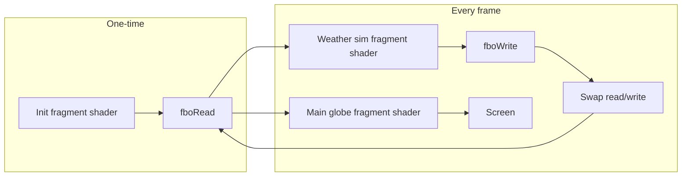

# IONv4c Weather GCM Integration — Maximum-Detail Implementation Plan

**Part of Globe docs:** [docs/Globe/INDEX.md](Globe/INDEX.md)

This document is the single source of truth for integrating a 2D GPU Global Circulation Model (GCM-lite) and weather-driven cloud morphology (Phenomenon Cards) into [apps/Globe/IONv4c.html](apps/Globe/IONv4c.html). It specifies every insertion point, full shader and JS code blocks, data flow, and testing steps.

**Constraints:** GTX 1050 Ti–class performance; no 3D fluid volume; 2D simulation only; constant-time raymarch (no heavy branching).

**Line numbers:** All line references in this document are for the current [apps/Globe/IONv4c.html](apps/Globe/IONv4c.html) at time of writing. Line numbers can shift after edits. **Use the code-context anchors (surrounding quotes and symbol names) as the authoritative insertion points**, not the raw line numbers.

---

## 1. Executive Summary

| Item | Description |
|------|-------------|
| **Goal** | Replace "noise value here?" with "what is the weather here, and what noise represents that?" so clouds emerge from T, q, u, v and produce hurricanes, monsoons, stratocumulus, squall lines, and cirrus-style effects. |
| **Approach** | (1) Run a 2D GCM-lite on the GPU via ping-pong framebuffers (RGBA = T, q, u, v). (2) Main shader samples this texture at lat/lon and evaluates Phenomenon Cards to get weights and cloud bounds. (3) getCloudDensity uses those weights to blend stratified, street, and deep-convection noise. (4) Card 44 (bright band) modulates extinction and phase (g) in the raymarch by freezing level. |
| **File** | All changes in **apps/Globe/IONv4c.html** (single HTML file: one vertex shader, one main fragment shader, one sim fragment shader, JS setup and animate). |
| **New assets** | Two WebGLRenderTargets (1024×512), one sim scene (ortho camera + fullscreen quad), one init shader pass (one-time), one sim shader pass (every frame). |

---

## 2. Architecture and Data Flow



```mermaid
flowchart TB
    subgraph simTex [Weather texture RGBA]
        T[T temperature]
        q[q moisture]
        u[u wind x]
        v[v wind y]
    end
    subgraph mainShader [Main shader]
        UV[getWeatherUV(normalize(p))]
        Sample[texture2D(uWeatherTex, UV)]
        Eval[evaluateWeather(UV, uWeatherTex)]
        WX[WeatherState: stratus/street/squall weights, cloudBase, cloudTop]
        Density[getCloudDensity(p, time, UV, uWeatherTex)]
        Card44[Card 44: g_cloud, extinctionMult from z0C]
        Ray[Raymarch: eCld, pC, inSc]
    end
    Sample --> Eval
    Eval --> WX
    WX --> Density
    WX --> Card44
    Density --> Ray
    Card44 --> Ray
```

- **Equirectangular layout:** UV x = longitude [0,1], UV y = latitude [0,1] with v=0.5 at equator; lat = (v - 0.5)*PI.
- **Units in texture:** T and q in [0,1] proxy space; u, v in velocity proxy (advection scale and thermal wind scale are tunable).

---

## 3. Phase 1: GPU Weather Simulation (Ping-Pong GCM-lite)

### 3.1 Insertion point (JavaScript)

**Location:** Immediately after the line that creates `orthoCamera` and before the line that starts `const material = new THREE.ShaderMaterial({`. **Anchor:** search for `const orthoCamera = new THREE.OrthographicCamera(-1, 1, 1, -1, 0, 1);` then insert after it; do not insert after `const material = new THREE.ShaderMaterial({`.

**Exact surrounding context:**
```javascript
        const orthoCamera = new THREE.OrthographicCamera(-1, 1, 1, -1, 0, 1);

        // --- INSERT WEATHER SIM SETUP HERE (Phase 1) ---

        const material = new THREE.ShaderMaterial({
```

### 3.2 Render target configuration

- **Resolution:** Width 1024, height 512 (equirectangular map; aspect 2:1).
- **Format:** `THREE.RGBAFormat`.
- **Type:** Prefer `THREE.HalfFloatType` (16-bit float per channel) if the extension is available; otherwise `THREE.FloatType`. Do **not** use UnsignedByteType for the sim (insufficient precision for physics).
- **Filtering:** `minFilter: THREE.LinearFilter`, `magFilter: THREE.LinearFilter`.
- **No depth or stencil:** `depthBuffer: false`, `stencilBuffer: false`.

**HalfFloat detection (insert before creating render targets):**
```javascript
        const simRes = 1024;
        const simHeight = 512;
        const useHalfFloat = renderer.extensions.get('EXT_color_buffer_half_float');
        const rtType = useHalfFloat ? THREE.HalfFloatType : THREE.FloatType;
        const rtOptions = {
            minFilter: THREE.LinearFilter,
            magFilter: THREE.LinearFilter,
            format: THREE.RGBAFormat,
            type: rtType,
            depthBuffer: false,
            stencilBuffer: false
        };
        let fboRead = new THREE.WebGLRenderTarget(simRes, simHeight, rtOptions);
        let fboWrite = new THREE.WebGLRenderTarget(simRes, simHeight, rtOptions);
```

### 3.3 Sim scene and camera

```javascript
        const simScene = new THREE.Scene();
        const simCamera = new THREE.OrthographicCamera(-1, 1, 1, -1, 0, 1);
```

### 3.4 Initial state (one-time seed)

Before any sim step, `fboRead` must contain valid (T, q, u, v). Use a dedicated **init** fragment shader that does not sample a previous state.

**Init fragment shader (string, inject as `initWeatherFragmentShader`):**
```glsl
        const initWeatherFragmentShader = `
            precision highp float;
            varying vec2 vUv;
            #define PI 3.14159265359
            void main() {
                float lat = (vUv.y - 0.5) * PI;
                float T = 0.5 + 0.3 * cos(lat);
                float q = 0.4 + 0.2 * (1.0 - abs(lat) / (PI * 0.5));
                gl_FragColor = vec4(T, q, 0.0, 0.0);
            }
        `;
```

- **Init material:** `new THREE.ShaderMaterial({ vertexShader: vertexShader, fragmentShader: initWeatherFragmentShader })`.
- **Init quad:** `new THREE.Mesh(new THREE.PlaneGeometry(2, 2), initMaterial)`, add to a temporary scene or `simScene`.
- **One-time render:** `renderer.setRenderTarget(fboRead); renderer.render(simScene, simCamera); renderer.setRenderTarget(null);` using the init material. After this, replace the init quad with the sim quad (see below) so the sim scene only contains the sim quad for all subsequent frames.

**Alternative (simpler):** Use the same `simScene` and one quad; for the very first frame only, use the init material on that quad and render to `fboRead`. Then switch the quad’s material to `simMaterial` for all later frames.

### 3.5 Weather sim fragment shader (full source)

**Variable name in JS:** `weatherSimFragmentShader` (string).

```glsl
        const weatherSimFragmentShader = `
            precision highp float;
            varying vec2 vUv;
            uniform sampler2D uPrevState;
            uniform float uDeltaTime;
            uniform float uTime;
            #define PI 3.14159265359
            void main() {
                vec4 state = texture2D(uPrevState, vUv);
                float T = state.r;
                float q = state.g;
                vec2 u = state.ba;
                float lat = (vUv.y - 0.5) * PI;
                vec2 advectUV = vUv - u * vec2(1.0 / (cos(lat) + 0.001), 1.0) * uDeltaTime * 0.01;
                advectUV.x = fract(advectUV.x);
                advectUV.y = clamp(advectUV.y, 0.001, 0.999);
                vec4 advectedState = texture2D(uPrevState, advectUV);
                T = advectedState.r;
                q = advectedState.g;
                u = advectedState.ba;
                float solarInsolation = 0.5 * cos(lat);
                T += (solarInsolation - T) * uDeltaTime * 0.1;
                q += (T * 0.8 - q) * uDeltaTime * 0.05;
                float coriolis = 2.0 * sin(lat) * 0.5;
                vec2 coriolisDeflection = vec2(-u.y, u.x) * coriolis * uDeltaTime;
                u += coriolisDeflection;
                float dx = 1.0 / 1024.0;
                float dy = 1.0 / 512.0;
                float tRight = texture2D(uPrevState, vec2(fract(vUv.x + dx), vUv.y)).r;
                float tLeft  = texture2D(uPrevState, vec2(fract(vUv.x - dx), vUv.y)).r;
                float tUp    = texture2D(uPrevState, vec2(vUv.x, clamp(vUv.y + dy, 0.0, 1.0))).r;
                float tDown  = texture2D(uPrevState, vec2(vUv.x, clamp(vUv.y - dy, 0.0, 1.0))).r;
                vec2 gradT = vec2(tRight - tLeft, tUp - tDown);
                u += gradT * uDeltaTime * 5.0;
                u *= 0.99;
                gl_FragColor = vec4(T, q, u.x, u.y);
            }
        `;
```

- **WebGL 1:** Use `texture2D` as above. For WebGL2/GLSL ES 3.0 you would use `texture()`; IONv4c is currently WebGL1.
- **Uniforms:** `uPrevState` (sampler2D), `uDeltaTime` (float), `uTime` (float).
- **Pole wrapping (optional):** The sim uses `clamp(advectUV.y, 0.001, 0.999)` so latitude does not wrap at the poles. That creates a "wall" at north/south poles where fluid can accumulate and clouds may cluster. For a lightweight GCM this is acceptable. If pole artifacts appear, an optional fix is to wrap the pole mathematically (e.g. when sampling neighbors, use `fract(vUv.x + 0.5)` for longitude and reflect latitude when `vUv.y` goes past 0 or 1). Document the clamp artifact if you keep the lightweight version.

### 3.6 Sim material and quad

```javascript
        const simMaterial = new THREE.ShaderMaterial({
            vertexShader: vertexShader,
            fragmentShader: weatherSimFragmentShader,
            uniforms: {
                uPrevState: { value: null },
                uDeltaTime: { value: 0.016 },
                uTime: { value: 0 }
            },
            depthWrite: false,
            depthTest: false
        });
        const simQuad = new THREE.Mesh(new THREE.PlaneGeometry(2, 2), simMaterial);
        simScene.add(simQuad);
```

- Use the **existing** `vertexShader` (the one that sets `varying vec2 vUv` and `gl_Position = vec4(position, 1.0)`).

### 3.7 Initial state render and first-frame safety (one-time, before animate())

**Critical:** Run the init block **once, immediately before** the call to `animate();` so that on the first frame `uWeatherTex` is never null. Use the **same** `simQuad` with material swap.

**Insert location:** Right before the line `animate();` (anchor: search for the final `animate();` at the end of the script block).

After creating `fboRead`/`fboWrite`, `simScene`, `simCamera`, and the sim quad:

1. Add the init quad (or reuse simQuad with init material) to `simScene`.
2. `renderer.setRenderTarget(fboRead); renderer.render(simScene, simCamera); renderer.setRenderTarget(null);` with the quad using the **init** material.
3. Replace the quad’s material with `simMaterial` (or remove init quad and add sim quad) so that from the first `animate()` onward only the sim material is used.

**Exact initialization block (insert immediately before `animate();`):** Run once so `uWeatherTex` is never null on first frame. Use same `simQuad`; swap to init material, render to fboRead, swap back to simMaterial, then setRenderTarget(null) and material.uniforms.uWeatherTex.value = fboRead.texture. Full code block to insert before `animate();`:

```javascript
        const initMaterial = new THREE.ShaderMaterial({ vertexShader, fragmentShader: initWeatherFragmentShader });
        simQuad.material = initMaterial;
        renderer.setRenderTarget(fboRead);
        renderer.render(simScene, simCamera);
        simQuad.material = simMaterial;
        renderer.setRenderTarget(null);
        material.uniforms.uWeatherTex.value = fboRead.texture;
```

Do not rely on first-frame null in the shader.

### 3.8 Animate loop: sim step and swap

**Location:** Inside `animate()`, at the **very beginning** of the function (before camera kinematics and before any `material.uniforms` updates).

**Exact order:**

1. Update sim uniforms:  
   `simMaterial.uniforms.uPrevState.value = fboRead.texture;`  
   `simMaterial.uniforms.uDeltaTime.value = clock.getDelta();`  
   `simMaterial.uniforms.uTime.value = clock.getElapsedTime();`
2. Render sim to write target:  
   `renderer.setRenderTarget(fboWrite);`  
   `renderer.render(simScene, simCamera);`
3. Swap:  
   `let temp = fboRead; fboRead = fboWrite; fboWrite = temp;`
4. Bind default framebuffer:  
   `renderer.setRenderTarget(null);`
5. Pass weather texture to main material:  
   `material.uniforms.uWeatherTex.value = fboRead.texture;`
6. Then run the rest of `animate()` as today (camera, `material.uniforms.iTime`, `uInvProj`, `uInvView`, `uCameraPos`, and `renderer.render(scene, orthoCamera)`).

**Clock order (mandatory):** In Three.js, `clock.getDelta()` advances internal state. Call **`getDelta()` before `getElapsedTime()`** in the loop so both the sim and the main material receive consistent timing. The order given above does this; do not rearrange (sim delta/time first, then later `material.uniforms.iTime.value = clock.getElapsedTime()`).

---

## 4. Phase 2: Main Shader — Weather Sampling and Proxy Gating

### 4.1 New uniform

- **In main fragment shader:** Add to the existing `uniform` block (e.g. after `uCityLightsBright`):  
  `uniform sampler2D uWeatherTex;`
- **In material.uniforms (JS):** Add:  
  `uWeatherTex: { value: null }`  
  (assigned each frame in `animate()` to `fboRead.texture`).

**Exact fragment shader location:** In the main fragment shader's `uniform` block, after `uniform float uCityLightsBright;` (anchor: search for `uCityLightsBright` in the uniform list), add:
```glsl
            uniform sampler2D uWeatherTex;
```

### 4.2 getWeatherUV

**Insert:** In the main fragment shader, immediately after the `#define PI` and constants (e.g. after `R_CLOUD_T`), or in a dedicated "Weather helpers" block before VOLUMETRICS. Suggested: **before the VOLUMETRICS section** (before line 366 "VOLUMETRICS (Clouds, Haze, Aurora)").

```glsl
            vec2 getWeatherUV(vec3 nPos) {
                float u = 0.5 + atan(nPos.z, nPos.x) / (2.0 * PI);
                float v = 0.5 + asin(clamp(nPos.y, -1.0, 1.0)) / PI;
                return vec2(u, v);
            }
```

### 4.3 WeatherState struct and evaluateWeather

**Insert:** In the main fragment shader, immediately after `getWeatherUV` and before `getCloudDensity`.

```glsl
            struct WeatherState {
                float stratusWeight;
                float streetWeight;
                float squallWeight;
                vec2 windDir;
                float cloudBase;
                float cloudTop;
            };

            WeatherState evaluateWeather(vec2 uv, sampler2D weatherTex) {
                float dx = 1.0 / 1024.0;
                float dy = 1.0 / 512.0;
                vec4 dataCenter = texture2D(weatherTex, uv);
                vec4 dataRight  = texture2D(weatherTex, vec2(fract(uv.x + dx), uv.y));
                vec4 dataUp     = texture2D(weatherTex, vec2(uv.x, clamp(uv.y + dy, 0.0, 1.0)));
                float T = dataCenter.r;
                float q = dataCenter.g;
                vec2 u = dataCenter.ba;
                float divergence = (dataRight.b - u.x) / dx + (dataUp.a - u.y) / dy;
                float convergence = max(0.0, -divergence * 0.5);
                vec2 windDir = length(u) > 0.001 ? normalize(u) : vec2(1.0, 0.0);
                float windSpeed = length(u);
                float instability = smoothstep(0.3, 0.8, T * q);
                float inversionStrength = smoothstep(0.5, 0.1, instability) * smoothstep(0.2, 0.6, q);
                WeatherState state;
                state.windDir = windDir;
                state.stratusWeight = inversionStrength * smoothstep(0.4, 0.8, q);
                float shearAlignment = smoothstep(0.002, 0.01, windSpeed);
                state.streetWeight = smoothstep(0.3, 0.6, instability) * inversionStrength * shearAlignment;
                state.squallWeight = convergence * instability * smoothstep(0.6, 1.0, q);
                state.cloudBase = mix(0.1, 0.02, q);
                state.cloudTop = mix(0.15, 0.8, state.squallWeight + (1.0 - inversionStrength) * 0.5);
                return state;
            }
```

- **Units:** `dx`/`dy` in UV space; divergence scaled by 0.5 (tunable). `cloudBase` and `cloudTop` are in normalized height fraction 0–1, consistent with `hFrac` in the cloud layer.

### 4.4 Replace getCloudDensity

**Current signature and location:**  
`float getCloudDensity(vec3 p, float time)` at lines 370–385.

**New signature:**  
`float getCloudDensity(vec3 p, float time, vec2 weatherUV, sampler2D weatherTex)`

**Full replacement body:**

```glsl
            float getCloudDensity(vec3 p, float time, vec2 weatherUV, sampler2D weatherTex) {
                WeatherState wx = evaluateWeather(weatherUV, weatherTex);
                float h = length(p) - R_PLANET;
                float hFrac = clamp((h - (R_CLOUD_B - R_PLANET)) / ((R_CLOUD_T - R_PLANET) - (R_CLOUD_B - R_PLANET)), 0.0, 1.0);
                float heightMask = smoothstep(wx.cloudBase - 0.05, wx.cloudBase, hFrac) * smoothstep(wx.cloudTop + 0.1, wx.cloudTop, hFrac);
                if (heightMask < 0.01) return 0.0;
                vec3 np = normalize(p);
                float finalDensity = 0.0;
                if (wx.stratusWeight > 0.01) {
                    vec3 cellPos = np * 150.0;
                    float cells = 1.0 - abs(fbm(cellPos, 3) * 2.0 - 1.0);
                    float closedCells = smoothstep(0.2, 0.6, cells);
                    finalDensity += closedCells * wx.stratusWeight;
                }
                if (wx.streetWeight > 0.01) {
                    vec2 n_perp = vec2(-wx.windDir.y, wx.windDir.x);
                    float lambda = 80.0;
                    float phi = dot(weatherUV * lambda, n_perp) + time * 0.2;
                    float bands = smoothstep(0.2, 0.8, sin(phi * PI * 2.0) * 0.5 + 0.5);
                    float breakup = fbm(np * 80.0 + vec3(time * 0.1, 0.0, 0.0), 3);
                    finalDensity += (bands * breakup) * wx.streetWeight;
                }
                if (wx.squallWeight > 0.01) {
                    vec3 stormPos = np * 40.0 - vec3(wx.windDir.x, 0.0, wx.windDir.y) * time * 0.5;
                    float stormNoise = fbm(stormPos, 5);
                    float anvilGrad = smoothstep(0.0, 0.1, hFrac) * smoothstep(1.0, 0.7, hFrac);
                    finalDensity += (stormNoise * anvilGrad * 2.0) * wx.squallWeight;
                }
                finalDensity = max(0.0, finalDensity - (1.0 - uCloudCoverage));
                return finalDensity * heightMask * 35.0;
            }
```

- **fbm:** The existing `fbm(vec3 p, int octaves)` in the same shader is used as-is.
- **uCloudCoverage:** Existing uniform; acts as global coverage gate.

### 4.5 Update cloudShadowMarch

**Current code (lines 387–400):** The inner call is `d += getCloudDensity(lp, time) * stepSize;`.

**Change to:** For each `lp`, compute `weatherUV = getWeatherUV(normalize(lp))` and call `getCloudDensity(lp, time, weatherUV, uWeatherTex)`. The main shader has access to `uWeatherTex` as a uniform, so `cloudShadowMarch` can use it (either pass `uWeatherTex` as a parameter or rely on the global uniform). For consistency with the rest of the shader, use the global `uWeatherTex` inside `cloudShadowMarch`.

**Replacement for the inner block:**

```glsl
            float cloudShadowMarch(vec3 p, vec3 sunDir, float time) {
                if (uCloudsEnabled < 0.5) return 1.0;
                float d = 0.0;
                float stepSize = (R_CLOUD_T - R_CLOUD_B) / 3.0;
                vec3 lp = p + sunDir * stepSize * 0.5;
                for (int i = 0; i < 3; i++) {
                    float h = length(lp) - R_PLANET;
                    if (h > (R_CLOUD_B - R_PLANET) && h < (R_CLOUD_T - R_PLANET)) {
                        vec2 weatherUV = getWeatherUV(normalize(lp));
                        d += getCloudDensity(lp, time, weatherUV, uWeatherTex) * stepSize;
                    }
                    lp += sunDir * stepSize;
                }
                return exp(-d * 0.45);
            }
```

### 4.6 Update the main raymarch loop (density call only)

**Location:** Inside the `for (float i = 0.0; i < 50.0; i++)` block, where `dCld` is currently set (lines 620–623).

**Current:**
```glsl
                    float dCld = 0.0;
                    if (uCloudsEnabled > 0.5 && h > (R_CLOUD_B - R_PLANET) && h < (R_CLOUD_T - R_PLANET)) {
                        dCld = getCloudDensity(p, time);
                    }
```

**Replace with:**
```glsl
                    float dCld = 0.0;
                    vec2 weatherUV = getWeatherUV(normalize(p));
                    if (uCloudsEnabled > 0.5 && h > (R_CLOUD_B - R_PLANET) && h < (R_CLOUD_T - R_PLANET)) {
                        dCld = getCloudDensity(p, time, weatherUV, uWeatherTex);
                    }
```

- `weatherUV` is then reused for Card 44 in the same iteration (Phase 3).

---

## 5. Phase 3: Card 44 — Bright Band and Dynamic Optics

### 5.1 Where to apply

All of the following happen **inside the same raymarch step** where `dCld` and `weatherUV` are computed: after the `getCloudDensity` call and before `vec3 eCld = vec3(dCld * 0.15);`. We need a **per-step** `g_cloud` and `extinctionMult`, and we must use them **only** for the cloud term (phase and extinction) in that step.

### 5.2 Reuse WeatherState

We already have `weatherUV` in the loop. Call `evaluateWeather(weatherUV, uWeatherTex)` once per step and use the result for both density (already done in getCloudDensity) and Card 44. To avoid evaluating twice, either:

- **Option A:** Compute `WeatherState wx = evaluateWeather(weatherUV, uWeatherTex)` in the loop first; then call a version of `getCloudDensity` that accepts `wx` instead of `weatherUV`/`weatherTex`, **or**
- **Option B:** Keep `getCloudDensity(p, time, weatherUV, uWeatherTex)` as is (it calls `evaluateWeather` internally) and call `evaluateWeather(weatherUV, uWeatherTex)` again in the loop for Card 44.

**Recommendation:** Option B (second evaluation) to avoid changing the signature of `getCloudDensity` and to keep the raymarch loop simple. The cost is one extra `evaluateWeather` per step (neighbor samples and smoothsteps); acceptable on a 1050 Ti. Document that a future optimization could return `WeatherState` from a single evaluation and pass it into density and Card 44.

### 5.3 Per-step variables and Card 44 math

**Insert** immediately after the block that sets `dCld` (and after the closing `}` of the `if (uCloudsEnabled > 0.5 && h > ...)`), and **before** the line `vec3 eAtm = BETA_R * rhR + ...`:

```glsl
                    float g_cloud = 0.8;
                    float extinctionMult = 1.0;
                    if (uCloudsEnabled > 0.5 && dCld > 0.0) {
                        WeatherState wx = evaluateWeather(weatherUV, uWeatherTex);
                        if (wx.stratusWeight > 0.1) {
                            float z0C = (R_CLOUD_B - R_PLANET) + 2.0 + (wx.cloudBase * (R_CLOUD_T - R_CLOUD_B));
                            float dz_melt = 0.5;
                            float m = clamp((z0C - h) / dz_melt, 0.0, 1.0);
                            float f_snow = smoothstep(0.0, 1.0, m);
                            float f_rain = 1.0 - f_snow;
                            float f_wet = exp(-pow((h - z0C) / (dz_melt * 0.5), 2.0));
                            float bb = f_wet * wx.stratusWeight;
                            extinctionMult = 1.0 + 1.5 * bb;
                            g_cloud = 0.8 + 0.1 * bb - 0.1 * f_snow;
                        }
                    }
```

- **z0C:** Freezing level in **km** (altitude above planet center minus R_PLANET). Here we derive it from cloud base in world space: e.g. `(R_CLOUD_B - R_PLANET) + 2.0` plus a small offset from `wx.cloudBase` so it sits a few km above the layer. The formula above uses `wx.cloudBase * (R_CLOUD_T - R_CLOUD_B)` to keep z0C in the same vertical range as the cloud layer. Tune 2.0 and dz_melt to taste.
- **h:** Already in km (length(p) - R_PLANET).

### 5.4 Use g_cloud for cloud phase and extinctionMult for eCld

- **Cloud phase:** The main shader currently computes `pC` once before the loop. For the **cloud layer** we need a per-step phase using `g_cloud`. Inside the loop, after the Card 44 block, define:  
  `float pC_cloud = mix(pHG(mu, g_cloud), pHG(mu, -0.2), 0.4);`  
  Then **replace every use of `pC` in the cloud block with `pC_cloud`** so the bright band affects all cloud scattering consistently:
  - **Direct sun term:** `inSc += eCld * pC * Ls * powder;` → use `pC_cloud` instead of `pC` (this is the only line that currently uses a phase in the cloud block).
  - **Terminator/ambient terms:** The lines `inSc += eCld * cloudAmb;` and `inSc += eCld * sunTr * 4.0 * tStr * terminatorZone;` do not use `pC` today. If they are later given a phase factor, use `pC_cloud` there as well so the whole cloud layer respects Card 44 phase.

- **Extinction:** Replace the line that sets `eCld` in this step from  
  `vec3 eCld = vec3(dCld * 0.15);`  
  to  
  `vec3 eCld = vec3(dCld * 0.15 * extinctionMult);`

**Exact locations (use anchors):**
- Find the single line that sets `eCld` from `dCld` in the raymarch loop; change it to include `* extinctionMult`.
- Find the line `inSc += eCld * pC * Ls * powder;` inside the `if (dCld > 0.0)` block; change `pC` to `pC_cloud`. Ensure `pC_cloud` is defined in the same step (after `g_cloud` and Card 44).

---

## 6. Phase 4: First-Frame and Null Safety

### 6.1 Ensuring uWeatherTex is never null when sampled

- Use the **exact initialization block** in Section 3.7 (run once **before** `animate();`): render init shader to fboRead, swap simQuad to simMaterial, set render target to null, set `material.uniforms.uWeatherTex.value = fboRead.texture`. That way on the first frame the main shader always receives a bound texture.
- Do **not** rely on "first frame might be null" logic in the shader; seal the leak in JS.

### 6.2 Optional: Fallback when weather is disabled

If you later add a UI toggle "Weather-driven clouds" (e.g. `uWeatherEnabled`):
- When `uWeatherEnabled < 0.5`, the main shader could use a legacy path: e.g. `getCloudDensity(p, time)` with the **old** single-FBM implementation (either a separate function or a branch at the top of `getCloudDensity` that ignores weatherTex and uses only uCloudCoverage and fbm). This plan does not require that toggle; the document assumes weather is always on once the sim is running.

---

## 7. Constants and Units Reference

| Symbol | Meaning | Units / Range |
|--------|---------|----------------|
| R_PLANET | Earth radius | 6371 km |
| R_CLOUD_B | Cloud layer bottom radius | 6373 km |
| R_CLOUD_T | Cloud layer top radius | 6388 km |
| h | Altitude of sample point | km (length(p) - R_PLANET) |
| hFrac | Normalized height in cloud layer | 0 = base, 1 = top |
| weatherUV.x | Longitude (equirectangular) | 0–1 |
| weatherUV.y | Latitude (equirectangular) | 0–1 |
| T, q | Temperature and moisture proxy | 0–1 |
| u, v | Wind velocity proxy | Advection scale |
| cloudBase, cloudTop | WeatherState heights | 0–1 (normalized) |
| z0C | Freezing level (Card 44) | km |
| g_cloud | Henyey-Greenstein g for clouds | 0.8 default, modified by Card 44 |

---

## 8. File Edit Summary (Checklist)

| # | File | Action | Approx. line / section |
|---|------|--------|------------------------|
| 1 | IONv4c.html | Insert FBOs, rtOptions, simScene, simCamera | After 747 |
| 2 | IONv4c.html | Insert initWeatherFragmentShader string | JS block |
| 3 | IONv4c.html | Insert init material + quad, one-time render to fboRead | After FBOs |
| 4 | IONv4c.html | Insert weatherSimFragmentShader string | JS block |
| 5 | IONv4c.html | Insert simMaterial and simQuad, add to simScene | After init |
| 6 | IONv4c.html | In animate(): sim uniforms, setRenderTarget(fboWrite), render sim, swap, setRenderTarget(null), uWeatherTex = fboRead.texture | Start of animate() |
| 7 | IONv4c.html | Add uniform sampler2D uWeatherTex (fragment) | After uCityLightsBright |
| 8 | IONv4c.html | Add uWeatherTex to material.uniforms | In uniforms object |
| 9 | IONv4c.html | Add getWeatherUV | Before VOLUMETRICS |
| 10 | IONv4c.html | Add WeatherState struct and evaluateWeather | After getWeatherUV |
| 11 | IONv4c.html | Replace getCloudDensity body and signature | Lines 370–385 |
| 12 | IONv4c.html | Update cloudShadowMarch to use getWeatherUV and new getCloudDensity | Lines 387–400 |
| 13 | IONv4c.html | In raymarch loop: add weatherUV, call getCloudDensity(..., weatherUV, uWeatherTex) | Lines 620–623 |
| 14 | IONv4c.html | In raymarch loop: add g_cloud, extinctionMult, Card 44 block, pC_cloud | After dCld block, before eCld |
| 15 | IONv4c.html | Set eCld = vec3(dCld * 0.15 * extinctionMult) | Same step |
| 16 | IONv4c.html | Use pC_cloud in cloud inSc terms | Where pC is used for clouds |

---

## 9. Testing and Validation

1. **Init:** After load, inspect or dump fboRead (e.g. render to screen once): expect gradient T (warm equator), q band, zero wind.
2. **Sim:** Let run a few seconds; sample a few UVs in the shader (or visualize T/q/u/v on screen): T and q should advect and Coriolis should produce rotation in u,v.
3. **Cards:** With sim running, verify stratus over cool/moist/inversion regions, streets where instability and shear align, squall where convergence and instability are high.
4. **Bright band:** In stratiform (high stratusWeight) regions, look for a horizontal band of increased brightness/extinction near the freezing level; tune z0C and dz_melt if needed.
5. **Performance:** Profile on a 1050 Ti–class GPU; sim pass (1024×512) + 50-step raymarch should remain within budget (target 60 fps or documented 30 fps minimum).

---

## 10. Review Refinements (Summary)

These refinements were applied to the plan after external review (Gemini):

| Item | Correction |
|------|------------|
| **Line numbers** | Use code-context anchors (e.g. "after orthoCamera", "uniform uCityLightsBright") as authoritative; line numbers can differ across file versions. |
| **First-frame null** | Standardized the exact init block (Section 3.7): run once before `animate();`, same simQuad with material swap, then bind uWeatherTex so the shader never sees null. |
| **Pole wrapping** | Documented (Section 3.5): clamp at poles can cause cloud clustering; optional fix is longitude/latitude wrap; keeping clamp is acceptable for a lightweight GCM. |
| **Clock order** | getDelta() must be called before getElapsedTime() in the loop (Section 3.8); do not rearrange. |
| **Card 44 / pC_cloud** | Replace pC with pC_cloud in the direct cloud term (eCld * pC * Ls * powder); if terminator/ambient cloud terms are ever given a phase factor, use pC_cloud there too (Section 5.4). |

## 11. Document History

- Created: Full implementation plan for IONv4c weather GCM integration (Phase 1–4), with line-level and code-block detail for [apps/Globe/IONv4c.html](apps/Globe/IONv4c.html).
- Updated: Line-number note (anchors authoritative); first-frame init block (exact snippet before animate()); pole-wrap note; clock order; Card 44 pC_cloud scope (all cloud terms).
