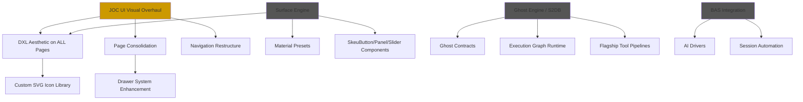

# JOC Master Execution Plan
> **Owner:** Braden  
> **Last Updated:** 2026-03-04  
> **Rule:** Every AI agent MUST read this + `JOC_UI_REQUIREMENTS.md` before any JOC work.

---

## Active Workstreams and Relationships

---

## Workstream 1: JOC UI Visual Overhaul (ACTIVE — Current Focus)

### 1A. Navigation Restructure ✅ DONE
- [x] TopBar: flat group buttons (OPERATIONS / INTELLIGENCE / INFRASTRUCTURE / TOOLS)
- [x] PageSubBar: contextual sub-tabs replacing old PageTabs
- [x] Oracle badge in TopBar right section
- [x] CSS: `joc.css` updated with DXL styled TopBar + SubBar

### 1B. Page Consolidation ✅ DONE
- [x] GpuMonitorPage → merged into ComputePage (inference queue)
- [x] StorageBrowserPage → merged into SettingsPage section
- [x] MCPDiagnosticsPage → merged into SettingsPage section
- [x] ActivityLogPage → route removed (exists as Dashboard drawer)
- [x] ProjectCatalogPage → route removed (exists as drawer content)
- [x] PageRouter: 5 dead routes + imports removed

### 1C. DXL Visual Overhaul — Per-Page Status

| Page | Status | Notes |
|------|--------|-------|
| DashboardPage | ✅ Done | Custom SVGs, full DXL |
| DispatchPage | ✅ Done | 5 strategy SVG icons |
| OraclePage | ✅ Done | Full DXL rebuild |
| SessionPage | ✅ Done | 7 inline SVGs, automation overlay |
| ComputePage | ❌ TODO | Emoji icons, old colors, narrow layout |
| SettingsPage | ❌ TODO | Emoji icons, old styling |
| SessionHealthPage | ❌ TODO | Needs DXL |
| AgentCommsPage | ❌ TODO | Needs DXL |
| AutoContextPage | ❌ TODO | Needs DXL |
| CredentialVaultPage | ❌ TODO | Needs DXL |
| CliTerminalPage | ❌ TODO | Needs DXL |
| MissionBuilderPage | ❌ TODO | Needs DXL |
| CalendarPage | ❌ TODO | Needs DXL |
| ContextGraphPage | ❌ TODO | Needs DXL |
| AgentBuilderPage | ❌ TODO | Needs DXL |
| WelcomePage | ❌ TODO | Needs DXL |
| Left Drawer Panels | ❌ TODO | Placeholder content, old styling |
| Right Icon Bar | ❌ TODO | Needs DXL polish |

### 1D. Custom SVG Icon Library — Status
- [x] 8 drawer/utility icons (RadarIcon, ConstellationIcon, etc.)
- [x] 5 dispatch strategy icons (sequential, parallel, ring, cascade, swarm)
- [x] 7 session page icons (browser, model, inject, etc.)
- [ ] Per-page section icons for all remaining pages
- [ ] TopBar group icons (if desired)

---

## Workstream 2: Surface Engine (PAUSED — Handoff stage)

**Files built:** 6 files in `packages/joc/src/engine/`  
**Reference:** `docs/SURFACE_ENGINE_HANDOFF.md`

| Item | Status |
|------|--------|
| Core schema + backend detection | ✅ Done |
| Spring physics + pointer tracking | ✅ Done |
| CSS compiler (toggle, button, panel recipes) | ✅ Done |
| WebGPU shader (SDF, per-pixel lighting) | ✅ Done |
| SkeuShaderToggle component | ✅ Done |
| SurfaceEngineDemo page | ✅ Done (not visually verified) |
| Material presets file | ❌ TODO |
| SkeuButton, SkeuPanel, SkeuSlider | ❌ TODO |
| Rebuild pages with Surface Engine | ❌ TODO |

**Relationship:** Surface Engine provides the material system that should back the DXL aesthetic. Once material presets + components are done, pages can be rebuilt using them.

---

## Workstream 3: Ghost Engine / S2DB (PLANNED)

**Reference:** Conversation `ee016bd1-60a1-40ce-aefb-bc82234743b0`

| Phase | Status |
|-------|--------|
| Ghost Contracts | ❌ Planned |
| Execution Graph Runtime | ❌ Planned |
| Model Routing | ❌ Planned |
| Flagship Pipelines (Smart Heal, Segmentation) | ❌ Planned |
| Validation + Reinsertion layers | ❌ Planned |
| God Mode Inspector UI | ❌ Planned |

**Relationship:** Ghost Engine powers AI tool execution. JOC's Dispatch and Oracle pages will consume Ghost Engine pipelines once built.

---

## Workstream 4: BAS / Browser Automation (Phase B from roadmap)

**Reference:** `docs/OPUS1_JOC_GOALS_AND_ROADMAP.md`, Phase B

| Item | Status |
|------|--------|
| Session Page automation overlay | ✅ Done (UI built) |
| ChatGPT Driver | ⚠ Partial |
| Gemini Driver | ⚠ Partial |
| Session Health monitoring | ✅ UI page exists |
| Credential Vault | ✅ UI page exists |
| Quick Dispatch (wired) | ⚠ UI only |

---

## Priority Order

1. **JOC UI Visual Overhaul (1C)** — DXL all remaining pages
2. **Surface Engine completion** — Material presets + remaining components
3. **Ghost Engine** — S2DB layer implementation
4. **BAS wiring** — Connect UI to real browser automation

---

## Key Files Index

| File | Purpose |
|------|---------|
| `docs/JOC_UI_REQUIREMENTS.md` | **THE** visual spec — colors, typography, rules |
| `docs/JOC_MASTER_PLAN.md` | **THIS** — workstream tracking |
| `docs/OPUS1_JOC_GOALS_AND_ROADMAP.md` | Phase A-E roadmap |
| `docs/OPUS1_JOC_MASTER_VISION.md` | Original vision doc |
| `docs/OPUS1_JOC_ARCHITECTURE.md` | AI Drivers, mission lifecycle |
| `docs/SURFACE_ENGINE_HANDOFF.md` | Surface Engine status |
| `docs/CANON_JOC_UI_ARCHITECTURE.md` | UI architecture canon |

---

## Protocols for AI Agents

1. **READ** `JOC_UI_REQUIREMENTS.md` before ANY visual changes
2. **READ** this plan to understand where work stands
3. **USE MCP** (`store_memory`, `retrieve_memory`) to persist decisions
4. **UPDATE** this plan after completing work
5. **NO EMOJI** in any UI code — custom SVGs only
6. **VALIDATE** visually with browser screenshots
7. **DOCUMENT** changes in conversation artifacts
