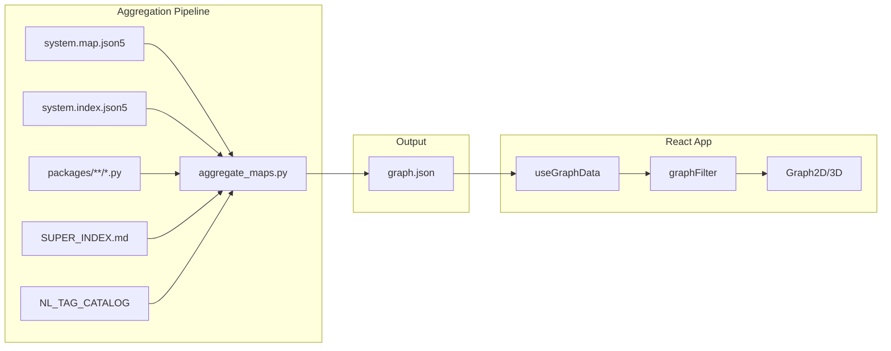

# System Atlas Graph Architecture — Full Technical Reference

**Purpose:** Monolith documentation of how the AIM-OS System Atlas graph system works: aggregation pipeline, data model, filtering, rendering, and UI. This doc describes the **implementation**, not the data itself.

**Status:** Complete reference  
**Last Updated:** 2026-02-22

---

## 1. Overview

The System Atlas is an interactive graph visualization that aggregates AIM-OS system maps into a unified graph and renders it in 2D or 3D with zoom-level filtering. Two main parts:

1. **Aggregation pipeline** (Python): Parses system maps, indexes, and source files → outputs `graph.json`
2. **Visualization app** (React + Vite): Loads graph, filters by zoom level, renders with react-force-graph



---

## 2. Aggregation Pipeline (aggregate_maps.py)

**Location:** `apps/system-atlas/scripts/aggregate_maps.py`  
**Output:** `apps/system-atlas/data/graph.json` and `apps/system-atlas/public/data/graph.json`  
**Entry point:** `main()` → `build_graph()`

### 2.1 Data Sources

| Source | Pattern | Purpose |
|--------|---------|---------|
| system.map.lucid.json5 | `knowledge_architecture/systems/**/`, `cursor-addon/docs/systems/**/` | Systems, subsystems, internal nodes, ports, edges |
| system.index.lucid.json5 | Same dirs | Doc paths (L0–L4), component structure |
| packages/**, knowledge_architecture/**, cursor-addon/**, scripts/** | File walk | File nodes (Z3) |
| NL_TAG_CATALOG.md | Repo-wide (excl. ProEarth) | NL tag nodes (Z4) |
| packages/**/*.py | Python AST | Function/class nodes (Z4) |
| SUPER_INDEX.md | knowledge_architecture/ | Concept nodes (Z5) |

### 2.2 JSON5 Parsing

The pipeline uses JSON5 (comments, trailing commas, unquoted keys). Fallback if `json5` is not installed: regex preprocessing to strip comments and quote unquoted keys, then `json.loads()`.

```python
# Core logic
def load_json5(path: Path) -> dict:
    # Uses json5.load() or preprocess + json.loads()
```

### 2.3 Node ID Conventions

| Node Type | ID Format | Example |
|-----------|-----------|---------|
| system | `system:{sys_id}` | `system:cmc` |
| subsystem | `subsystem:{sys_id}:{sub_id}` | `subsystem:cmc:atoms` |
| internalNode | `node:{sys_id}:{inode_id}` | `node:cmc:atomManager` |
| doc | `doc:{sys_id}:{path}` | `doc:cmc:knowledge_architecture/systems/cmc/L0_executive.md` |
| file | `file:{relpath}` | `file:packages/vif/witness.py` |
| nl_tag | `tag:{tag_id}` | `tag:VIF-WITNESS-001` |
| function/class | `func:{path}:{name}` | `func:packages/vif/witness.py:create_witness` |
| concept | `concept:{concept_id}` | `concept:Atoms` |

### 2.4 Zoom Level Assignment (zoomMin)

| zoomMin | Node Types | Data Source |
|---------|------------|-------------|
| 0 | systems | system.map |
| 1 | subsystems | system.map |
| 2 | internalNodes | system.map |
| 3 | doc, file | system.index + file walk |
| 4 | nl_tag, function, class | NL_TAG_CATALOG + AST |
| 5 | concept | SUPER_INDEX |

### 2.5 Link Enrichment

Every link is enriched with `strength`, `category`, `bidirectional` for pathway styling:

```python
def _enrich_link(e: dict, strength: str, category: str, bidirectional: bool = False) -> dict:
    out = dict(e)
    out["strength"] = strength   # critical | required | optional | related
    out["category"] = category   # partOf | contains | provides_to | depends_on | related | indexes
    out["bidirectional"] = bidirectional
    return out
```

- **Ports / externalEdges** to core systems → `strength: "critical"`
- **relatedSystems** → `strength: "related"`, `bidirectional: True`
- **internalEdges** → `strength: "required"`

### 2.6 build_graph() Flow

1. `find_system_maps()` → list of system.map.lucid.json5 paths
2. For each map: parse → system node (zoomMin 0) → subsystems (zoomMin 1) → internalNodes (zoomMin 2) → internalEdges, ports, externalEdges, relatedSystems
3. `add_z3_nodes()`: parse system.index for doc paths; walk file tree for file nodes
4. `add_z4_nodes()`: parse NL_TAG_CATALOG; AST walk packages/**/*.py
5. `add_z5_nodes()`: parse SUPER_INDEX for concept blocks and Where/Code paths
6. Deduplicate edges (source, target, type)
7. Return `{ nodes, links, metadata }`

### 2.7 Output Schema

```json
{
  "nodes": [
    {
      "id": "system:cmc",
      "label": "Context Memory Core",
      "type": "system",
      "zoomMin": 0,
      "layer": 1,
      "status": "production",
      "color": "#e74c3c"
    }
  ],
  "links": [
    {
      "source": "system:cmc",
      "target": "system:hhni",
      "type": "connects",
      "zoomMin": 0,
      "strength": "critical",
      "category": "provides_to",
      "bidirectional": false
    }
  ],
  "metadata": {
    "systemsCount": 39,
    "subsystemsCount": 36,
    "internalNodesCount": 249,
    "docCount": 17,
    "fileCount": 7294,
    "tagCount": 298,
    "funcCount": 3576,
    "conceptCount": 122,
    "linksCount": 6392
  }
}
```

---

## 3. Graph Filter (graphFilter.ts)

**Location:** `apps/system-atlas/src/utils/graphFilter.ts`  
**Purpose:** Filter nodes and links by zoom level.

### 3.1 Types

```typescript
export type ZoomLevel = 0 | 1 | 2 | 3 | 4 | 5

export interface GraphNode {
  id: string
  label?: string
  type?: string
  zoomMin?: number  // default 0
  layer?: number
  color?: string
  description?: string
  status?: string
  systemId?: string
  parent?: string
  responsibility?: string
  [key: string]: unknown
}

export type LinkStrength = 'critical' | 'required' | 'optional' | 'related'

export interface GraphLink {
  source: string
  target: string
  type?: string
  zoomMin?: number  // default 0
  strength?: LinkStrength
  category?: string
  bidirectional?: boolean
  whatIsExchanged?: string[]
  [key: string]: unknown
}

export interface GraphData {
  nodes: GraphNode[]
  links: GraphLink[]
}
```

### 3.2 Filter Logic

```typescript
export function filterByZoomLevel(data: GraphData, zoom: ZoomLevel): GraphData {
  const visibleIds = new Set(
    data.nodes.filter((n) => (n.zoomMin ?? 0) <= zoom).map((n) => n.id)
  )

  const filteredNodes = data.nodes.filter((n) => visibleIds.has(n.id))
  const filteredLinks = data.links.filter(
    (l) =>
      visibleIds.has(String(l.source)) &&
      visibleIds.has(String(l.target)) &&
      (l.zoomMin ?? 0) <= zoom
  )

  return { nodes: filteredNodes, links: filteredLinks }
}
```

- Node visible if `zoomMin <= zoom`
- Link visible only if both endpoints visible and `zoomMin <= zoom`

---

## 4. Link Styling (linkStyle.ts)

**Location:** `apps/system-atlas/src/utils/linkStyle.ts`  
**Purpose:** Map link metadata to visual encoding (width, dash, color).

### 4.1 Strength → Width

| strength | width (px) |
|----------|------------|
| critical | 2.0 |
| required | 1.0 |
| optional | 0.5 |
| related  | 0.5 |

### 4.2 Strength → Dash (2D only)

| strength | dash pattern |
|----------|--------------|
| critical | solid `[]` |
| required | solid `[]` |
| optional | `[4, 4]` |
| related  | `[2, 2]` |

### 4.3 Category → Color

| category   | color   |
|------------|---------|
| partOf     | #484f58 |
| contains   | #484f58 |
| related    | #8b949e |
| (default)  | source node color or #30363d |

```typescript
export function getLinkWidth(link: GraphLink): number
export function getLinkDash(link: GraphLink): number[] | null
export function getLinkColor(link: GraphLink, sourceColor?: string): string
```

---

## 5. Data Loading (useGraphData.ts)

**Location:** `apps/system-atlas/src/hooks/useGraphData.ts`

```typescript
export function useGraphData(): {
  raw: GraphData | null
  filtered: GraphData | null
  zoom: ZoomLevel
  setZoom: (z: ZoomLevel) => void
  loading: boolean
  error: string | null
}
```

- Fetches `/data/graph.json` (served from `public/data/graph.json` by Vite)
- Filters raw data by current zoom level
- Default zoom: 0 (galaxy view)

---

## 6. Rendering Components

### 6.1 Graph2D (react-force-graph-2d)

**Location:** `apps/system-atlas/src/components/Graph2D.tsx`

- Uses `ForceGraph2D` from `react-force-graph-2d`
- Node size: system=12, subsystem=8, else=5
- Node color: from `node.color` or default `#58a6ff`
- Link styling: `getLinkWidth`, `getLinkColor`, `getLinkDash` (linkLineDash)
- Background: `#0d1117`
- `cooldownTicks: 100` for layout stabilization

### 6.2 Graph3D (react-force-graph-3d)

**Location:** `apps/system-atlas/src/components/Graph3D.tsx`

- Uses `ForceGraph3D` from `react-force-graph-3d` (Three.js)
- Same node size/color logic as 2D
- Link: `getLinkWidth`, `getLinkColor` — no native dash; uses width/opacity as proxy

### 6.3 ZoomLevelController

**Location:** `apps/system-atlas/src/components/ZoomLevelController.tsx`

- Dropdown for Z0–Z5
- Labels: Z0 Galaxy, Z1 Solar System, Z2 Planetary, Z3 Surface, Z4 Molecular, Z5 Atomic
- Displays filtered node/link counts

### 6.4 NodeDetailPanel

**Location:** `apps/system-atlas/src/components/NodeDetailPanel.tsx`

- Side panel when a node is clicked
- Shows: label, type, systemId, description/responsibility, status, layer
- Close button

---

## 7. App Structure (App.tsx)

**Location:** `apps/system-atlas/src/App.tsx`

- `useGraphData()` → raw, filtered, zoom, setZoom, loading, error
- View mode: 2D | 3D (toggle buttons)
- `selectedNode` for NodeDetailPanel
- Layout: ZoomLevelController (left), view toggle (top center), Graph2D/Graph3D (full), NodeDetailPanel (right when node selected)
- Error state: shows message + instruction to run `aggregate_maps.py`

---

## 8. Build and Launch

### 8.1 Vite Config

**Location:** `apps/system-atlas/vite.config.ts`

- Port: 3003
- `open: true` (browser opens on dev start)
- React plugin

### 8.2 Launcher (LAUNCHER_CANON)

**LAUNCH_SYSTEM_ATLAS.bat** → invokes **LAUNCH_SYSTEM_ATLAS.ps1**

- `cd apps/system-atlas`
- `npm install` if no node_modules
- Run `aggregate_maps.py` if no `public/data/graph.json`
- `npm run dev`
- Stop: Ctrl+C, then close window

### 8.3 Dependencies

```json
{
  "dependencies": {
    "react": "^18.2.0",
    "react-dom": "^18.2.0",
    "react-force-graph-2d": "^1.29.0",
    "react-force-graph-3d": "^1.29.0",
    "three": "^0.158.0"
  }
}
```

---

## 9. File Tree

```
apps/
  LAUNCH_SYSTEM_ATLAS.bat
  LAUNCH_SYSTEM_ATLAS.ps1
  system-atlas/
    index.html
    package.json
    vite.config.ts
    scripts/
      aggregate_maps.py      # Aggregation pipeline
    data/
      graph.json             # Generated (gitignored or committed)
    public/
      data/
        graph.json           # Served at /data/graph.json
    src/
      main.tsx
      App.tsx
      index.css
      hooks/
        useGraphData.ts      # Fetch + filter
      utils/
        graphFilter.ts       # Zoom filtering, types
        linkStyle.ts         # Pathway styling
      components/
        Graph2D.tsx          # 2D force graph
        Graph3D.tsx          # 3D force graph
        ZoomLevelController.tsx
        NodeDetailPanel.tsx
```

---

## 10. Data Flow Summary

1. **Aggregation:** `aggregate_maps.py` reads system maps, indexes, files, catalogs, SUPER_INDEX → builds nodes + links with zoomMin, strength, category → writes `graph.json` to data/ and public/data/.
2. **Load:** Vite dev server serves `public/data/graph.json` at `/data/graph.json`; `useGraphData` fetches it.
3. **Filter:** `filterByZoomLevel(raw, zoom)` returns nodes/links where zoomMin <= zoom and both endpoints visible for links.
4. **Render:** Graph2D or Graph3D receives filtered data; react-force-graph computes force-directed layout; linkStyle maps metadata to width/dash/color.
5. **Interact:** User changes zoom (dropdown) or selects node (click) → state updates → re-filter / re-render.

---

## 11. References

- [COMPLETE_RELATIONSHIP_GRAPH_DESIGN](../knowledge_architecture/investigations/COMPLETE_RELATIONSHIP_GRAPH_DESIGN.md) — Zoom levels, design principles
- [AIMOS_MAJOR_SYSTEMS](AIMOS_MAJOR_SYSTEMS.md) — System descriptions
- [AIMOS_CHIP_DIAGRAM](AIMOS_CHIP_DIAGRAM.md) — Static chip-style mermaid diagram
- `apps/LAUNCHER_CANON.md` / `.cursor/rules/` — Launcher design (one window, Ctrl+C to stop)
