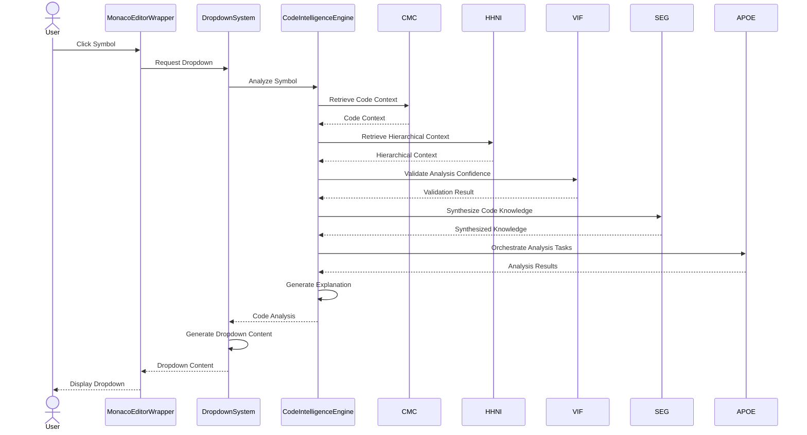
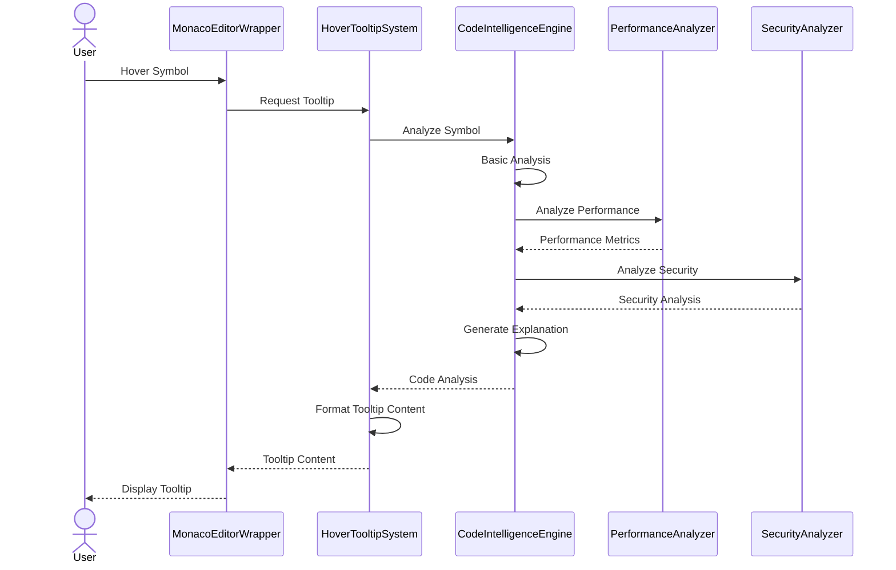
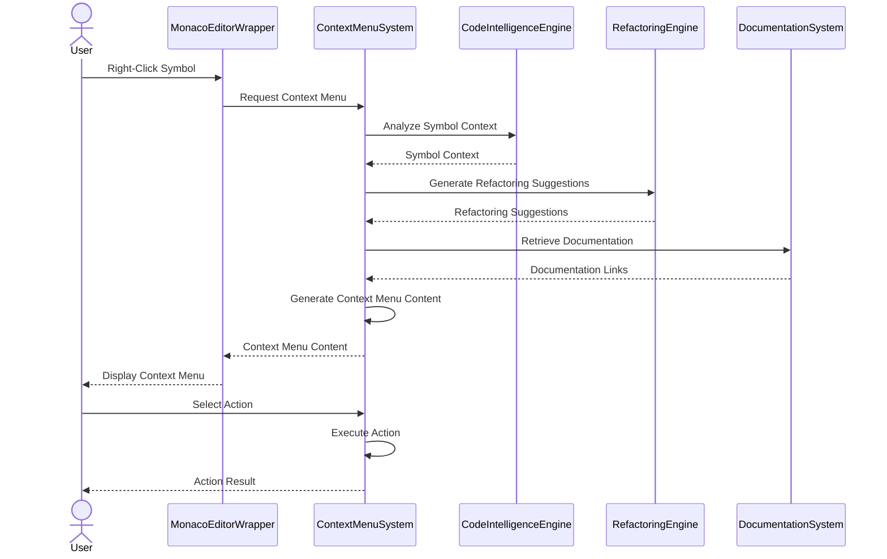
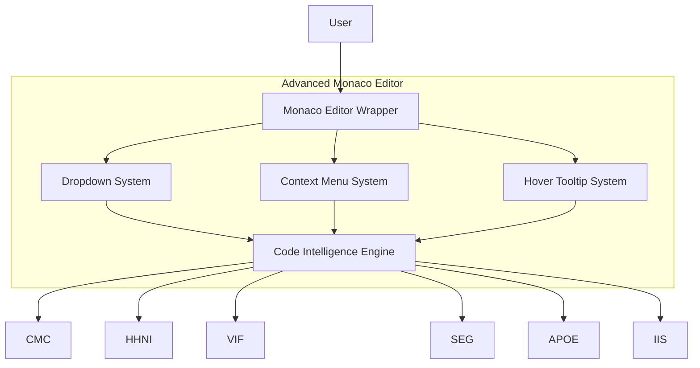
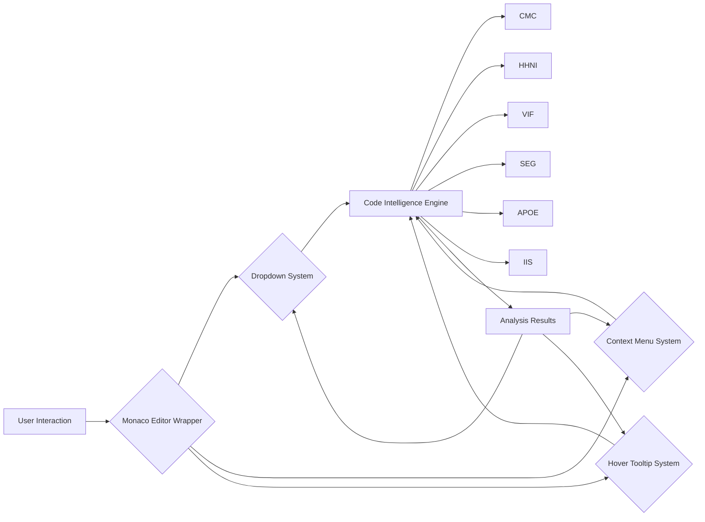

> TRANSITIONAL T-LEVEL DOCUMENT – Do not overwrite existing L-level docs. This T-level will supersede L-level after review/acceptance.

# Advanced Monaco Editor – T2 Architecture (≈2000 words)

## System Overview

Advanced Monaco Editor (AME) implements a layered architecture that transforms the standard Monaco editor into a consciousness-driven code intelligence platform. The system provides natural language understanding of every code element through dropdown menus, context menus, and hover tooltips, powered by AIM-OS consciousness infrastructure.

AME provides three core architectural guarantees:

1. **Consciousness-Driven Design:** Every component leverages AIM-OS consciousness infrastructure (CMC, HHNI, VIF, SEG, APOE) for persistent code understanding, hierarchical context retrieval, confidence tracking, knowledge synthesis, and orchestration of analysis tasks.

2. **Real Intelligence Integration:** No mock data - everything is powered by real AI understanding through Code Property Graph analysis, streaming analytics, and natural language processing. Genuine code comprehension enables accurate explanations and insights.

3. **Interactive User Experience:** Every feature is designed for interaction and exploration. Click-to-explore code relationships, hover-to-understand code elements, right-click-to-act on code context, and dropdown-to-learn from natural language explanations.

## Components

### 1. Monaco Editor Enhancement Layer

**Purpose:** Wrap standard Monaco editor with enhanced features including dropdown system, context menu system, hover tooltip system, and code intelligence engine integration.

**Responsibilities:**
- **Editor Wrapping:** Wrap standard Monaco editor instance with enhanced features
- **Event Handling:** Handle user interactions (click, hover, right-click) and route to appropriate component systems
- **State Management:** Manage editor state, configuration, and UI component lifecycle
- **Component Coordination:** Coordinate between dropdown system, context menu system, hover tooltip system, and code intelligence engine

**Key Operations:**
- `initialize_editor(config: EditorConfig) -> MonacoEditorWrapper` - Initialize Monaco editor with enhanced features
- `handle_symbol_click(symbol: CodeSymbol, position: Position) -> void` - Handle symbol click event
- `handle_symbol_hover(symbol: CodeSymbol, position: Position) -> void` - Handle symbol hover event
- `handle_context_menu(symbol: CodeSymbol, position: Position) -> void` - Handle context menu event
- `update_editor_state(state: EditorState) -> void` - Update editor state and configuration

**Dependencies:** Monaco Editor, Dropdown System, Context Menu System, Hover Tooltip System, Code Intelligence Engine

### 2. Dropdown System

**Purpose:** Provide rich dropdown menus for every code symbol with natural language explanations, context, usage information, related code elements, performance insights, and security analysis.

**Responsibilities:**
- **Dropdown Generation:** Generate rich dropdown content for code symbols based on symbol type (function, class, variable, etc.)
- **Natural Language Processing:** Process code symbols and generate natural language explanations
- **Code Analysis:** Analyze code symbols for complexity, performance, security, and maintainability
- **Relationship Discovery:** Discover code relationships (dependencies, dependents, related symbols)
- **Action Generation:** Generate code actions and refactoring suggestions

**Key Operations:**
- `show_dropdown(symbol: CodeSymbol, position: Position) -> void` - Show dropdown menu for symbol
- `hide_dropdown() -> void` - Hide dropdown menu
- `update_dropdown(symbol: CodeSymbol) -> void` - Update dropdown content for symbol
- `generate_dropdown_content(symbol: CodeSymbol) -> DropdownContent` - Generate dropdown content
- `analyze_symbol(symbol: CodeSymbol) -> CodeAnalysis` - Analyze symbol for dropdown content

**Dependencies:** Code Intelligence Engine, Natural Language Processor, Code Analyzer

### 3. Context Menu System

**Purpose:** Provide intelligent right-click menus with code-specific actions, refactoring suggestions, analysis actions, documentation links, and learning resources.

**Responsibilities:**
- **Context Menu Generation:** Generate intelligent context menus based on code symbol type and context
- **Action Provision:** Provide code-specific actions (refactoring, analysis, documentation, learning)
- **Refactoring Suggestions:** Generate refactoring suggestions based on code analysis
- **Documentation Integration:** Integrate documentation and learning resources into context menus
- **Menu Management:** Manage context menu lifecycle (show, hide, update)

**Key Operations:**
- `show_context_menu(symbol: CodeSymbol, position: Position) -> void` - Show context menu for symbol
- `hide_context_menu() -> void` - Hide context menu
- `update_context_menu(symbol: CodeSymbol) -> void` - Update context menu content
- `generate_context_menu_content(symbol: CodeSymbol) -> ContextMenuContent` - Generate context menu content
- `execute_context_action(action: ContextAction, symbol: CodeSymbol) -> ActionResult` - Execute context menu action

**Dependencies:** Code Intelligence Engine, Refactoring Engine, Documentation System

### 4. Hover Tooltip System

**Purpose:** Provide rich hover tooltips with detailed explanations, real-time code analysis, performance metrics, optimization hints, security analysis, and recommendations.

**Responsibilities:**
- **Tooltip Generation:** Generate rich tooltip content for code symbols on hover
- **Real-Time Analysis:** Perform real-time code analysis for tooltip content
- **Content Formatting:** Format tooltip content for optimal display
- **Performance Metrics:** Calculate and display performance metrics
- **Security Analysis:** Perform security analysis and display recommendations

**Key Operations:**
- `show_tooltip(symbol: CodeSymbol, position: Position) -> void` - Show tooltip for symbol
- `hide_tooltip() -> void` - Hide tooltip
- `update_tooltip(symbol: CodeSymbol) -> void` - Update tooltip content
- `generate_tooltip_content(symbol: CodeSymbol) -> TooltipContent` - Generate tooltip content
- `analyze_for_tooltip(symbol: CodeSymbol) -> TooltipAnalysis` - Analyze symbol for tooltip

**Dependencies:** Code Intelligence Engine, Performance Analyzer, Security Analyzer

### 5. Code Intelligence Engine

**Purpose:** Provide real code understanding powered by AIM-OS consciousness infrastructure, integrating with CMC, HHNI, VIF, SEG, and APOE for genuine code comprehension.

**Responsibilities:**
- **Code Analysis:** Perform comprehensive code analysis (syntax, semantic, complexity, performance, security)
- **Natural Language Processing:** Process code symbols and generate natural language explanations
- **Relationship Discovery:** Discover code relationships and dependencies
- **AIM-OS Integration:** Integrate with AIM-OS systems (CMC, HHNI, VIF, SEG, APOE) for code understanding
- **Analysis Orchestration:** Orchestrate complex code analysis tasks through APOE

**Key Operations:**
- `analyze_code(symbol: CodeSymbol) -> CodeAnalysis` - Analyze code symbol comprehensively
- `generate_explanation(symbol: CodeSymbol) -> string` - Generate natural language explanation
- `find_relationships(symbol: CodeSymbol) -> List[CodeRelationship]` - Find code relationships
- `store_code_understanding(symbol: CodeSymbol, analysis: CodeAnalysis) -> void` - Store code understanding in CMC
- `retrieve_code_context(symbol: CodeSymbol) -> CodeContext` - Retrieve code context from HHNI
- `synthesize_code_knowledge(symbol: CodeSymbol) -> SynthesizedKnowledge` - Synthesize code knowledge via SEG

**Dependencies:** CMC Integration, HHNI Integration, VIF Integration, SEG Integration, APOE Integration

## Data Models

### 1. CodeSymbol

```python
from dataclasses import dataclass
from typing import Dict, Any, List, Optional
from datetime import datetime
from enum import Enum

class SymbolType(str, Enum):
    FUNCTION = "function"
    CLASS = "class"
    VARIABLE = "variable"
    INTERFACE = "interface"
    TYPE = "type"
    MODULE = "module"

@dataclass
class CodeSymbol:
    """Represents a code symbol (function, class, variable, etc.)"""
    
    # Identity
    symbol_id: str
    symbol_name: str
    symbol_type: SymbolType
    
    # Location
    file_path: str
    line_number: int
    column_number: int
    position: Position
    
    # Code Content
    code_content: str
    signature: Optional[str] = None
    
    # Metadata
    language: str  # e.g., "python", "typescript"
    namespace: Optional[str] = None
    visibility: str = "public"  # "public", "private", "protected"
```

**Purpose:** Represents a code symbol (function, class, variable, etc.) for analysis and understanding.

### 2. DropdownContent

```python
@dataclass
class DropdownContent:
    """Content for dropdown menu display"""
    
    # Basic Information
    symbol: CodeSymbol
    symbol_name: str
    symbol_type: SymbolType
    symbol_location: Position
    
    # Natural Language Explanation
    explanation: str
    purpose: str
    context: str
    usage_examples: List[str] = field(default_factory=list)
    
    # Code Analysis
    complexity: ComplexityAnalysis
    performance: PerformanceAnalysis
    security: SecurityAnalysis
    maintainability: MaintainabilityAnalysis
    
    # Relationships
    dependencies: List[CodeSymbol] = field(default_factory=list)
    dependents: List[CodeSymbol] = field(default_factory=list)
    related_symbols: List[CodeSymbol] = field(default_factory=list)
    
    # Actions
    actions: List[CodeAction] = field(default_factory=list)
    refactoring_suggestions: List[RefactoringSuggestion] = field(default_factory=list)
    
    # Metadata
    confidence: float = Field(default=0.0, ge=0.0, le=1.0)
    generated_at: datetime = Field(default_factory=datetime.utcnow)
```

**Purpose:** Represents complete dropdown content for a code symbol including explanations, analysis, relationships, and actions.

### 3. ContextMenuContent

```python
@dataclass
class ContextMenuContent:
    """Content for context menu display"""
    
    # Basic Actions
    basic_actions: List[ContextAction] = field(default_factory=list)
    
    # Code-Specific Actions
    refactoring_actions: List[RefactoringAction] = field(default_factory=list)
    analysis_actions: List[AnalysisAction] = field(default_factory=list)
    documentation_actions: List[DocumentationAction] = field(default_factory=list)
    
    # Intelligence Actions
    explain_action: Optional[ExplainAction] = None
    explore_action: Optional[ExploreAction] = None
    optimize_action: Optional[OptimizeAction] = None
    
    # Learning Actions
    learn_action: Optional[LearnAction] = None
    examples_action: Optional[ExamplesAction] = None
    best_practices_action: Optional[BestPracticesAction] = None
    
    # Metadata
    symbol: CodeSymbol
    generated_at: datetime = Field(default_factory=datetime.utcnow)
```

**Purpose:** Represents complete context menu content with code-specific actions, intelligence actions, and learning resources.

### 4. TooltipContent

```python
@dataclass
class TooltipContent:
    """Content for hover tooltip display"""
    
    # Basic Information
    symbol: CodeSymbol
    symbol_name: str
    symbol_type: SymbolType
    symbol_location: Position
    
    # Detailed Explanation
    explanation: str
    purpose: str
    context: str
    examples: List[str] = field(default_factory=list)
    
    # Analysis Results
    complexity: ComplexityAnalysis
    performance: PerformanceAnalysis
    security: SecurityAnalysis
    maintainability: MaintainabilityAnalysis
    
    # Metrics
    metrics: CodeMetrics
    trends: CodeTrends
    recommendations: List[Recommendation] = field(default_factory=list)
    
    # Metadata
    confidence: float = Field(default=0.0, ge=0.0, le=1.0)
    generated_at: datetime = Field(default_factory=datetime.utcnow)
```

**Purpose:** Represents complete tooltip content for a code symbol including explanations, analysis, metrics, and recommendations.

### 5. CodeAnalysis

```python
@dataclass
class CodeAnalysis:
    """Comprehensive code analysis result"""
    
    # Symbol Information
    symbol: CodeSymbol
    
    # Analysis Results
    syntax_analysis: SyntaxAnalysis
    semantic_analysis: SemanticAnalysis
    complexity_analysis: ComplexityAnalysis
    performance_analysis: PerformanceAnalysis
    security_analysis: SecurityAnalysis
    
    # Natural Language
    explanation: str
    purpose: str
    context: str
    
    # Relationships
    relationships: List[CodeRelationship] = field(default_factory=list)
    
    # Confidence
    confidence: float = Field(default=0.0, ge=0.0, le=1.0)
    
    # Metadata
    analyzed_at: datetime = Field(default_factory=datetime.utcnow)
    analysis_duration_ms: float = 0.0
```

**Purpose:** Represents comprehensive code analysis result including syntax, semantic, complexity, performance, and security analysis.

## Key Flows

### 1. Code Symbol Analysis Flow (End-to-End)



**Description:** Complete flow from user clicking a code symbol through analysis, AIM-OS integration, and dropdown display.

### 2. Hover Tooltip Flow



**Description:** Flow for displaying hover tooltips with real-time code analysis and metrics.

### 3. Context Menu Action Flow



**Description:** Flow for displaying context menus and executing context menu actions.

## Integrations

### 1. CMC (Context Memory Core)
- **Purpose:** Provides persistent storage for code understanding and analysis results
- **Integration Points:** Code Intelligence Engine stores code understanding, retrieves code context, and updates code understanding
- **Data Flow:** Code analysis results flow through CMC for persistent storage and retrieval
- **Benefits:** Enables persistent code understanding across sessions, supports code context reconstruction

### 2. HHNI (Hierarchical Hypergraph Neural Index)
- **Purpose:** Provides hierarchical retrieval of code context and related code elements
- **Integration Points:** Code Intelligence Engine retrieves hierarchical context and finds related symbols
- **Data Flow:** Code symbol queries flow through HHNI for hierarchical context retrieval
- **Benefits:** Enables comprehensive code understanding through hierarchical context

### 3. VIF (Verifiable Intelligence Framework)
- **Purpose:** Ensures confidence tracking and validation of code analysis results
- **Integration Points:** Code Intelligence Engine tracks analysis confidence and validates analysis results
- **Data Flow:** Analysis confidence scores and validation results flow through VIF
- **Benefits:** Provides verifiable confidence scores for code analysis, ensures trustworthy explanations

### 4. SEG (Shared Evidence Graph)
- **Purpose:** Provides knowledge synthesis for code insights and pattern recognition
- **Integration Points:** Code Intelligence Engine synthesizes code knowledge and generates insights
- **Data Flow:** Code knowledge synthesis requests flow through SEG
- **Benefits:** Enables pattern recognition and code insight generation

### 5. APOE (AI-Powered Orchestration Engine)
- **Purpose:** Orchestrates complex code analysis tasks and coordinates understanding workflows
- **Integration Points:** Code Intelligence Engine uses APOE to orchestrate analysis tasks
- **Data Flow:** Code analysis orchestration requests flow through APOE
- **Benefits:** Enables orchestrated complex code analysis operations

### 6. IIS (Intuitive Intelligence System)
- **Purpose:** Provides intuitive code insights and pattern recognition
- **Integration Points:** Code Intelligence Engine uses IIS for intuitive guidance
- **Data Flow:** Intuitive insights flow through IIS to Code Intelligence Engine
- **Benefits:** Enhances code understanding with intuitive guidance

## Non‑Functional Requirements (NFRs)

### 1. Response Time
- **Requirement:** Fast response time for dropdown, tooltip, and context menu display
- **Metric:** Dropdown display < 200ms (p95), Tooltip display < 100ms (p95), Context menu display < 150ms (p95)
- **Mechanism:** Caching of analysis results, lazy loading of non-critical content, parallel analysis where possible

### 2. Analysis Accuracy
- **Requirement:** High accuracy in code analysis and explanations
- **Metric:** Analysis accuracy > 0.90 (0.0-1.0), Explanation quality > 0.85 (0.0-1.0)
- **Mechanism:** VIF confidence tracking, AIM-OS integration, comprehensive analysis pipelines

### 3. Resource Usage
- **Requirement:** Efficient resource usage for code analysis
- **Metric:** CPU usage < 20% during analysis, Memory usage < 500MB per analysis session
- **Mechanism:** Caching, lazy loading, resource limits, timeout protection

### 4. Scalability
- **Requirement:** Scalable to handle multiple concurrent users and large codebases
- **Metric:** Support > 100 concurrent users, Handle codebases > 1M LOC
- **Mechanism:** Horizontal scaling, load balancing, efficient caching, distributed analysis

### 5. User Experience
- **Requirement:** Smooth and responsive user experience
- **Metric:** UI responsiveness > 60 FPS, No blocking operations > 100ms
- **Mechanism:** Asynchronous operations, progressive loading, non-blocking UI updates

## Diagrams

### 1. Component Diagram



**Description:** Component diagram showing the five core components and their relationships with AIM-OS systems.

### 2. Data Flow Diagram (High-Level)



**Description:** High-level data flow diagram showing the flow from user interaction through component systems, AIM-OS integration, and back to UI components.

## References

- System map: `systems/advanced_monaco_editor/system.map.lucid.json5`
- Validation gates: `knowledge_architecture/validation/T0_T6_DOCUMENTATION.validation.md`
- Templates: `knowledge_architecture/PERFECT_TEMPLATES_LIBRARY.md`
- L-level docs: `systems/advanced_monaco_editor/L0_executive.md` through `L4_complete.md`
