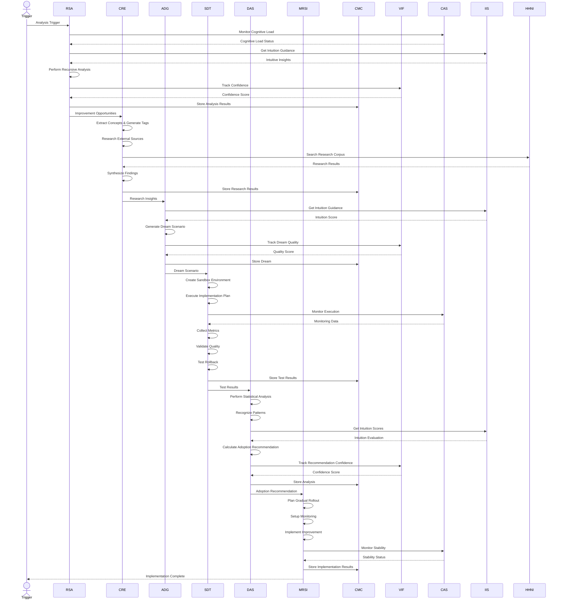
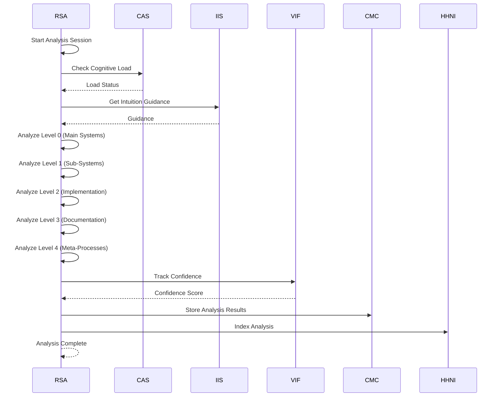
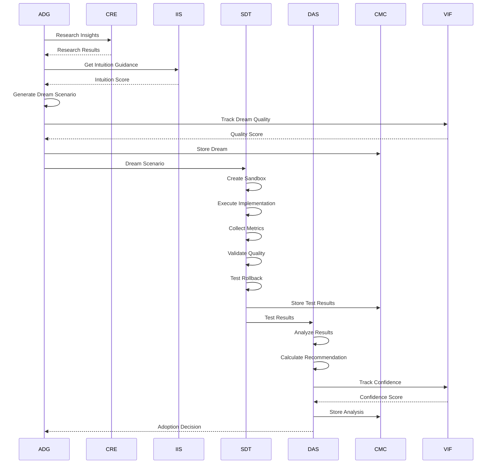
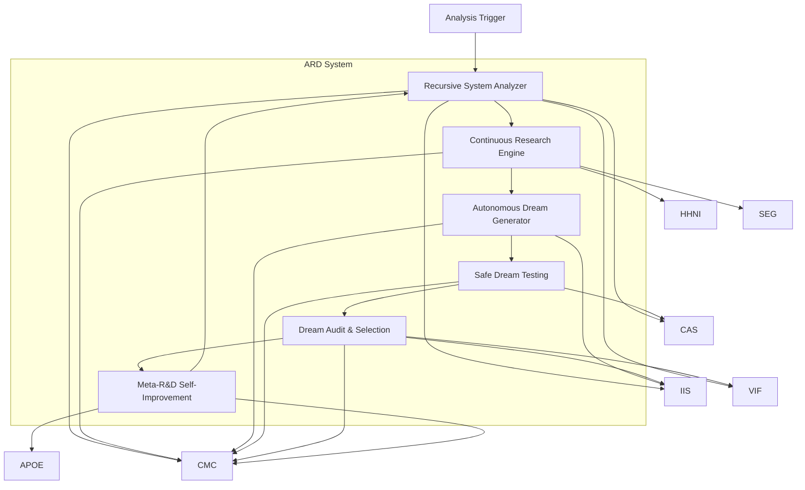
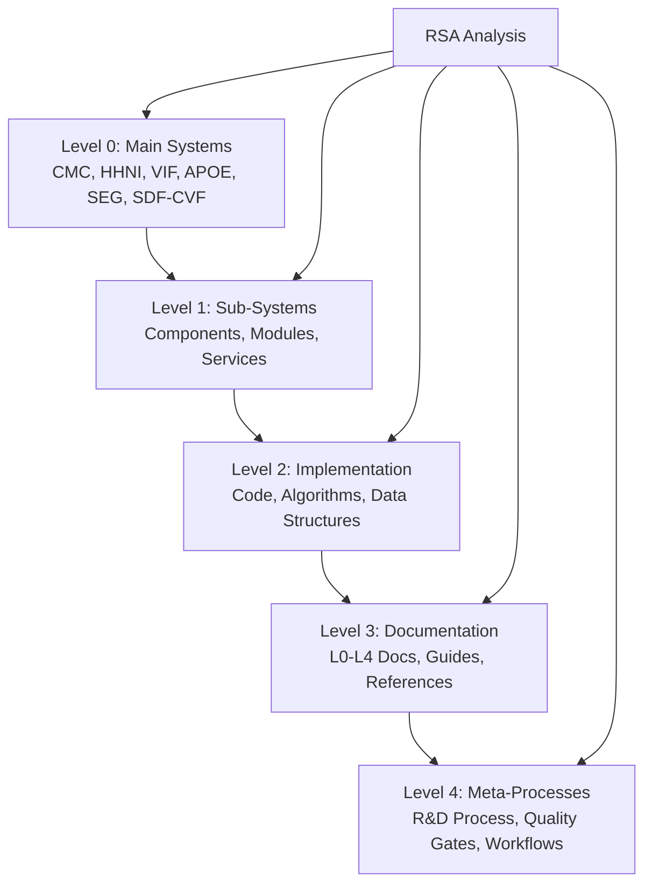

> TRANSITIONAL T-LEVEL DOCUMENT – Do not overwrite existing L-level docs. This T-level will supersede L-level after review/acceptance.

# Autonomous Research & Dream – T2 Architecture (≈2000 words)

## System Overview

Autonomous Research & Dream (ARD) implements a comprehensive self-improvement architecture that enables AI to autonomously enhance itself through recursive system analysis, continuous research integration, dream generation, safe testing, and audited selection. The architecture provides six interconnected components—Recursive System Analyzer (RSA), Continuous Research Engine (CRE), Autonomous Dream Generator (ADG), Safe Dream Testing (SDT), Dream Audit & Selection (DAS), and Meta-R&D Self-Improvement (MRSI)—that enable AI to systematically discover improvement opportunities, ground them in research, generate creative solutions, test them safely, and implement validated improvements.

ARD provides three core architectural guarantees:

1. **Recursive Self-Improvement:** Systematic hierarchical examination of all system layers (main systems, sub-systems, implementations, documentation, meta-processes) to identify improvement opportunities. Multi-level analysis ensures no layer is overlooked and improvements are grounded in complete understanding.

2. **Research-Grounded Dreams:** Continuous research integration from external sources (arxiv, publications, GitHub) with dynamic tag generation based on system concepts. Dreams are grounded in scientific understanding and current research, ensuring improvements are innovative yet feasible.

3. **Safe Testing & Meta-Improvement:** All improvement dreams are tested in isolated VM/sandbox environments before implementation. The R&D process itself continuously improves through meta-R&D, creating a self-improving meta-system that evolves recursively.

## Components

### 1. Recursive System Analyzer (RSA)

**Purpose:** Perform hierarchical recursive analysis of all system layers to identify improvement opportunities, bottlenecks, and capability gaps through systematic examination of main systems, sub-systems, implementations, documentation, and meta-processes.

**Responsibilities:**
- **Hierarchical Analysis:** Recursively analyze system layers from Level 0 (main systems) through Level 4 (meta-processes)
- **Cognitive Process Analysis:** Analyze thinking patterns, decision-making processes, problem-solving strategies, and learning patterns
- **Capability Mapping:** Map current system capabilities comprehensively including core systems, MCP tools, integration points, and performance characteristics
- **Bottleneck Identification:** Identify performance bottlenecks, quality bottlenecks, resource bottlenecks, and integration bottlenecks
- **Improvement Discovery:** Discover specific improvement opportunities with priority ranking and impact assessment
- **Metrics Collection:** Collect comprehensive performance metrics, quality metrics, usage metrics, and error metrics

**Key Operations:**
- `analyze_system(focus_areas: Optional[List[str]]) -> AnalysisResults` - Perform comprehensive recursive analysis
- `analyze_cognitive_processes() -> CognitiveAnalysis` - Analyze cognitive processes and thinking patterns
- `map_capabilities() -> CapabilityMap` - Map current system capabilities comprehensively
- `identify_bottlenecks() -> BottleneckAnalysis` - Identify performance and quality bottlenecks
- `find_improvements() -> List[ImprovementOpportunity]` - Find specific improvement opportunities
- `collect_metrics() -> MetricsData` - Collect comprehensive performance and quality metrics

**Dependencies:** CAS (cognitive load monitoring), IIS (intuition guidance), VIF (confidence tracking), CMC (memory storage), HHNI (knowledge search)

### 2. Continuous Research Engine (CRE)

**Purpose:** Continuously integrate research from external sources (arxiv, publications, GitHub) with dynamic tag generation based on system concepts, ensuring improvement dreams are grounded in scientific understanding and current research.

**Responsibilities:**
- **Research Source Management:** Manage access to academic databases, consciousness studies, AI development papers, and cognitive science research
- **Concept Extraction:** Extract concepts from system analysis and generate dynamic search tags
- **Research Execution:** Execute research queries across multiple sources with depth control (shallow, medium, deep)
- **Synthesis:** Synthesize research findings into actionable insights including key insights, theoretical frameworks, practical applications, future directions, controversies, and consensus points
- **Research Storage:** Store research results and insights in CMC for persistent memory and future reference

**Key Operations:**
- `research_topic(topic: str, depth: str = 'medium') -> ResearchResults` - Research specific consciousness or AI development topic
- `extract_concepts(system_analysis: AnalysisResults) -> List[str]` - Extract concepts from system analysis for tag generation
- `generate_search_tags(concepts: List[str]) -> List[str]` - Generate dynamic search tags based on system concepts
- `synthesize_findings(research_results: Dict[str, List], topic: str) -> Synthesis` - Synthesize research findings into actionable insights
- `store_research_results(topic: str, results: Dict, synthesis: Synthesis) -> void` - Store research results in CMC

**Dependencies:** CMC (storage), HHNI (semantic search), VIF (quality tracking), APOE (research orchestration)

### 3. Autonomous Dream Generator (ADG)

**Purpose:** Generate "dreams" about potential improvements and new capabilities using IIS intuition and CRE research insights, enabling creative exploration of improvement possibilities without risk.

**Responsibilities:**
- **Dream Generation:** Generate detailed dream scenarios with vision, implementation plans, risk assessments, success metrics, and rollback plans
- **Vision Creation:** Create compelling visions for improvements based on improvement opportunities and research insights
- **Implementation Planning:** Create detailed implementation plans with phases, tasks, dependencies, and risks
- **Risk Assessment:** Assess technical risks, performance risks, integration risks, and quality risks with mitigation strategies
- **Dream Scoring:** Calculate confidence scores, creativity scores, feasibility scores, and impact scores for dream evaluation

**Key Operations:**
- `generate_dream(improvement_opportunity: Dict, research_insights: Dict) -> DreamScenario` - Generate detailed dream scenario for improvement
- `create_vision(improvement_opportunity: Dict, research_insights: Dict) -> str` - Create compelling vision for the improvement
- `create_implementation_plan(improvement_opportunity: Dict, research_insights: Dict) -> List[Dict]` - Create detailed implementation plan
- `assess_risks(improvement_opportunity: Dict, implementation_plan: List[Dict]) -> RiskAssessment` - Assess risks associated with the improvement
- `calculate_dream_scores(dream: DreamScenario) -> DreamScores` - Calculate confidence, creativity, feasibility, and impact scores

**Dependencies:** IIS (intuition guidance), CRE (research insights), VIF (confidence tracking), CMC (dream storage)

### 4. Safe Dream Testing (SDT)

**Purpose:** Test dream scenarios in isolated VM/sandbox environments with comprehensive monitoring, metrics collection, quality validation, and rollback capability to ensure safe experimentation without risk to production systems.

**Responsibilities:**
- **Sandbox Management:** Create and manage isolated sandbox environments for dream testing
- **Test Execution:** Execute implementation plans in sandbox environments with phase-by-phase monitoring
- **Metrics Collection:** Collect comprehensive performance metrics, quality metrics, and validation results
- **Quality Validation:** Validate accuracy, reliability, consistency, usability, and maintainability during testing
- **Rollback Testing:** Test rollback capabilities to ensure safe reversion if needed

**Key Operations:**
- `test_dream(dream: DreamScenario) -> TestResults` - Test dream scenario in safe environment
- `create_sandbox_environment(dream: DreamScenario) -> str` - Create isolated sandbox environment for testing
- `execute_implementation_plan(sandbox_id: str, dream: DreamScenario) -> ExecutionResults` - Execute implementation plan in sandbox
- `collect_performance_metrics(sandbox_id: str, dream: DreamScenario) -> PerformanceMetrics` - Collect performance metrics during testing
- `validate_quality(sandbox_id: str, dream: DreamScenario) -> QualityValidation` - Validate quality during testing
- `test_rollback_capability(sandbox_id: str, dream: DreamScenario) -> RollbackTest` - Test rollback capability

**Dependencies:** CMC (test storage), VIF (quality tracking), CAS (monitoring), APOE (execution orchestration)

### 5. Dream Audit & Selection (DAS)

**Purpose:** Analyze dream test results using statistical analysis, pattern recognition, intuition scoring, and risk assessment to make data-driven decisions about which improvements to adopt.

**Responsibilities:**
- **Statistical Analysis:** Perform comprehensive statistical analysis of test results including performance analysis, quality analysis, and risk analysis
- **Pattern Recognition:** Recognize successful patterns and improvement trends across multiple dreams
- **Intuition Integration:** Integrate IIS intuition scores into dream evaluation
- **Risk Assessment:** Evaluate implementation risks and determine risk-benefit tradeoffs
- **Adoption Recommendation:** Make data-driven adoption recommendations with confidence scores

**Key Operations:**
- `analyze_test_results(test_results: List[TestResults]) -> AnalysisResults` - Analyze test results and determine viability
- `perform_statistical_analysis(test_results: List[TestResults]) -> StatisticalAnalysis` - Perform statistical analysis of test results
- `recognize_patterns(test_results: List[TestResults]) -> List[Pattern]` - Recognize successful patterns in test results
- `calculate_adoption_recommendation(analysis: AnalysisResults) -> AdoptionRecommendation` - Calculate adoption recommendation with confidence score
- `assess_risk_benefit(test_results: TestResults) -> RiskBenefitAssessment` - Assess risk-benefit tradeoffs

**Dependencies:** VIF (confidence scoring), IIS (intuition), CMC (pattern storage), CAS (quality audit)

### 6. Meta-R&D Self-Improvement (MRSI)

**Purpose:** Implement validated improvements into the main system with gradual rollout, continuous monitoring, rollback capability, and success tracking, while also improving the R&D process itself through meta-R&D.

**Responsibilities:**
- **Implementation Planning:** Plan gradual rollout strategies for validated improvements
- **Monitoring Setup:** Set up comprehensive monitoring for implementation success tracking
- **Rollback Preparation:** Prepare rollback mechanisms and validation tests
- **Success Tracking:** Track improvement effectiveness and performance gains
- **Meta-R&D:** Analyze R&D process effectiveness and refine RSA/CRE/ADG/SDT/DAS processes

**Key Operations:**
- `implement_improvement(adoption_recommendation: AdoptionRecommendation) -> ImplementationResult` - Implement validated improvement with monitoring
- `plan_gradual_rollout(improvement: Improvement) -> RolloutPlan` - Plan gradual rollout strategy
- `setup_monitoring(improvement: Improvement) -> MonitoringConfig` - Set up monitoring for implementation
- `track_success(improvement: Improvement) -> SuccessMetrics` - Track improvement effectiveness
- `improve_rd_process(rd_metrics: RDMetrics) -> ProcessImprovements` - Improve R&D process through meta-R&D

**Dependencies:** CMC (implementation storage), VIF (confidence tracking), CAS (stability monitoring), APOE (orchestration)

## Data Models

### 1. AnalysisResults

```python
from dataclasses import dataclass
from typing import Dict, Any, List, Optional
from datetime import datetime

@dataclass
class AnalysisResults:
    """Complete recursive analysis results"""
    
    # Analysis Metadata
    session_id: str
    timestamp: datetime
    analysis_depth: int  # Maximum recursion depth reached
    focus_areas: Optional[List[str]]
    
    # Analysis Components
    cognitive_processes: CognitiveAnalysis
    capability_map: CapabilityMap
    bottlenecks: BottleneckAnalysis
    improvement_opportunities: List[ImprovementOpportunity]
    performance_metrics: MetricsData
    
    # Quality Scores
    confidence_score: float  # 0.0-1.0
    quality_score: float  # 0.0-1.0
    completeness_score: float  # 0.0-1.0
    
@dataclass
class CognitiveAnalysis:
    """Cognitive process analysis results"""
    
    thinking_patterns: Dict[str, Any]
    decision_making: Dict[str, Any]
    problem_solving: Dict[str, Any]
    learning_patterns: Dict[str, Any]
    memory_usage: Dict[str, Any]
    attention_patterns: Dict[str, Any]

@dataclass
class CapabilityMap:
    """Comprehensive capability mapping"""
    
    core_systems: Dict[str, SystemCapability]
    mcp_tools: Dict[str, ToolCapability]
    integration_points: Dict[str, IntegrationCapability]
    performance_characteristics: Dict[str, PerformanceData]
    limitations: List[str]

@dataclass
class ImprovementOpportunity:
    """Specific improvement opportunity"""
    
    opportunity_id: str
    type: str  # "performance", "quality", "resource", "integration"
    description: str
    impact: float  # 0.0-1.0
    effort: float  # 0.0-1.0
    priority: float  # 0.0-1.0
    confidence: float  # 0.0-1.0
    affected_systems: List[str]
```

**Purpose:** Encapsulates complete recursive analysis results including cognitive analysis, capability mapping, bottleneck identification, and improvement opportunities.

### 2. DreamScenario

```python
@dataclass
class DreamScenario:
    """Complete dream scenario for improvement"""
    
    # Dream Identity
    dream_id: str
    generated_at: datetime
    
    # Dream Content
    vision: str
    implementation_plan: List[ImplementationPhase]
    risk_assessment: RiskAssessment
    success_metrics: SuccessMetrics
    rollback_plan: RollbackPlan
    
    # Dream Scores
    confidence: float  # 0.0-1.0
    creativity_score: float  # 0.0-1.0
    feasibility_score: float  # 0.0-1.0
    impact_score: float  # 0.0-1.0
    intuition_score: float  # 0.0-1.0
    
    # Source Information
    improvement_opportunity: ImprovementOpportunity
    research_insights: Dict[str, Any]

@dataclass
class ImplementationPhase:
    """Implementation phase with tasks and dependencies"""
    
    phase: str
    duration: str
    tasks: List[str]
    dependencies: List[str]
    risks: List[str]

@dataclass
class RiskAssessment:
    """Comprehensive risk assessment"""
    
    technical_risks: List[Risk]
    performance_risks: List[Risk]
    integration_risks: List[Risk]
    quality_risks: List[Risk]
    mitigation_strategies: List[MitigationStrategy]

@dataclass
class RollbackPlan:
    """Rollback plan for safe reversion"""
    
    triggers: List[str]
    rollback_steps: List[str]
    rollback_time: str
    data_recovery: str
    validation_tests: List[str]
```

**Purpose:** Represents complete dream scenario with vision, implementation plan, risk assessment, success metrics, and rollback plan.

### 3. TestResults

```python
@dataclass
class TestResults:
    """Complete test results from safe dream testing"""
    
    # Test Identity
    dream_id: str
    sandbox_id: str
    test_timestamp: datetime
    
    # Execution Results
    execution_results: ExecutionResults
    performance_metrics: PerformanceMetrics
    quality_validation: QualityValidation
    rollback_test: RollbackTest
    
    # Overall Assessment
    overall_success: bool
    confidence: float  # 0.0-1.0
    adoption_recommendation: Optional[AdoptionRecommendation]

@dataclass
class PerformanceMetrics:
    """Performance metrics from testing"""
    
    response_time: float
    throughput: float
    resource_usage: Dict[str, float]
    error_rate: float
    quality_score: float
    improvement: Dict[str, float]  # Comparison with baseline

@dataclass
class QualityValidation:
    """Quality validation results"""
    
    accuracy: float  # 0.0-1.0
    reliability: float  # 0.0-1.0
    consistency: float  # 0.0-1.0
    usability: float  # 0.0-1.0
    maintainability: float  # 0.0-1.0
    overall_score: float  # 0.0-1.0
```

**Purpose:** Represents complete test results including execution results, performance metrics, quality validation, and rollback testing.

## Key Flows

### 1. Complete ARD Workflow (End-to-End)



**Description:** Complete ARD workflow from analysis trigger through recursive analysis, research integration, dream generation, safe testing, audit & selection, and final implementation.

### 2. Recursive Analysis Flow



**Description:** Recursive analysis flow demonstrating hierarchical examination from main systems through meta-processes.

### 3. Dream Generation & Testing Flow



**Description:** Dream generation and testing flow from dream creation through safe testing to adoption decision.

## Integrations

### 1. VIF (Verifiable Intelligence Framework)
- **Purpose:** Track confidence in dreams and test results, ensure provenance of all improvement attempts, validate dream quality
- **Integration Points:** RSA tracks analysis confidence, ADG tracks dream quality, SDT tracks test confidence, DAS tracks recommendation confidence
- **Data Flow:** Confidence scores and quality metrics flow through VIF for verifiable tracking
- **Benefits:** Provides verifiable confidence scores for dream evaluation and selection, ensures provenance of all improvement attempts

### 2. CAS (Cognitive Analysis System)
- **Purpose:** Monitor cognitive load during analysis, audit dream quality and effectiveness, detect analysis quality drift
- **Integration Points:** RSA monitors cognitive load, SDT monitors execution quality, DAS audits dream quality
- **Data Flow:** Cognitive load data and quality metrics flow through CAS
- **Benefits:** Ensures recursive analysis maintains quality standards, prevents cognitive overload during analysis

### 3. IIS (Intuitive Intelligence System)
- **Purpose:** Provide intuitive dream evaluation, emotional salience assessment, meta-intuition about improvement effectiveness
- **Integration Points:** RSA gets intuition guidance, ADG uses intuition for dream generation, DAS integrates intuition into evaluation
- **Data Flow:** Intuition scores and emotional salience flow through IIS
- **Benefits:** Enhances dream generation with intuitive guidance, provides emotional context for improvement evaluation

### 4. CMC (Context Memory Core)
- **Purpose:** Store all dreams, analysis results, and test outcomes for persistent memory enabling historical analysis and pattern recognition
- **Integration Points:** All components store results in CMC, MRSI retrieves historical data for pattern analysis
- **Data Flow:** Dreams, analysis results, and test outcomes flow through CMC for persistent storage
- **Benefits:** Enables historical analysis, pattern recognition, and learning from past dream attempts

### 5. HHNI (Hierarchical Hypergraph Neural Index)
- **Purpose:** Retrieve system context for recursive analysis, discover related systems and components, navigate hierarchical relationships
- **Integration Points:** RSA uses HHNI for context retrieval, CRE uses HHNI for semantic search across research corpus
- **Data Flow:** System context queries and research queries flow through HHNI
- **Benefits:** Enables comprehensive recursive examination, semantic search across research corpus

### 6. SEG (Shared Evidence Graph)
- **Purpose:** Synthesize knowledge from research and analysis, link evidence across dreams, generate insights about improvement patterns
- **Integration Points:** CRE synthesizes research via SEG, DAS links evidence across dreams via SEG
- **Data Flow:** Research synthesis and evidence linking flow through SEG
- **Benefits:** Provides knowledge synthesis for dream enhancement, links evidence across multiple dreams

### 7. APOE (AI-Powered Orchestration Engine)
- **Purpose:** Orchestrate complex analysis tasks, coordinate research workflows, manage dream testing operations
- **Integration Points:** RSA orchestrates analysis tasks, CRE orchestrates research workflows, SDT orchestrates test execution
- **Data Flow:** Analysis tasks, research workflows, and test operations flow through APOE for orchestration
- **Benefits:** Provides orchestration for multi-step ARD processes, enables parallel execution of analysis and research

## Non-Functional Requirements (NFRs)

### 1. Analysis Performance
- **Requirement:** Efficient recursive analysis with reasonable execution time
- **Metric:** Analysis completion time < 1 hour (p95) for full system analysis
- **Mechanism:** Parallel analysis of system layers, incremental depth control, cognitive load monitoring

### 2. Research Quality
- **Requirement:** High-quality research integration with scientific grounding
- **Metric:** Research relevance score > 0.80 (0.0-1.0)
- **Mechanism:** Multi-source research validation, synthesis quality checks, relevance ranking

### 3. Dream Generation Creativity
- **Requirement:** Creative and innovative dream scenarios with practical feasibility
- **Metric:** Dream creativity score > 0.70, feasibility score > 0.75 (0.0-1.0)
- **Mechanism:** IIS intuition guidance, research grounding, feasibility validation

### 4. Test Safety
- **Requirement:** Complete isolation and safety during dream testing
- **Metric:** Sandbox isolation score = 1.0 (perfect isolation), rollback success rate > 0.95
- **Mechanism:** VM/sandbox isolation, comprehensive rollback testing, monitoring and validation

### 5. Adoption Decision Quality
- **Requirement:** High-quality adoption decisions with low false positive rate
- **Metric:** Adoption decision accuracy > 0.85, false positive rate < 0.10
- **Mechanism:** Statistical analysis, pattern recognition, intuition integration, risk assessment

## Diagrams

### 1. Component Architecture Diagram



**Description:** Component architecture diagram showing the six ARD components and their relationships with external AIM-OS systems.

### 2. Recursive Analysis Depth Diagram



**Description:** Recursive analysis depth diagram showing hierarchical examination from main systems through meta-processes.

## References

- System map: `systems/autonomous_research_dream/system.map.lucid.json5`
- Validation gates: `knowledge_architecture/validation/T0_T6_DOCUMENTATION.validation.md`
- Templates: `knowledge_architecture/PERFECT_TEMPLATES_LIBRARY.md`
- L-level docs: `systems/autonomous_research_dream/L0_executive.md` through `L4_complete.md`
- Complete framework: `knowledge_architecture/AETHER_MEMORY/Autonomous_Research_Dream_System.md`
