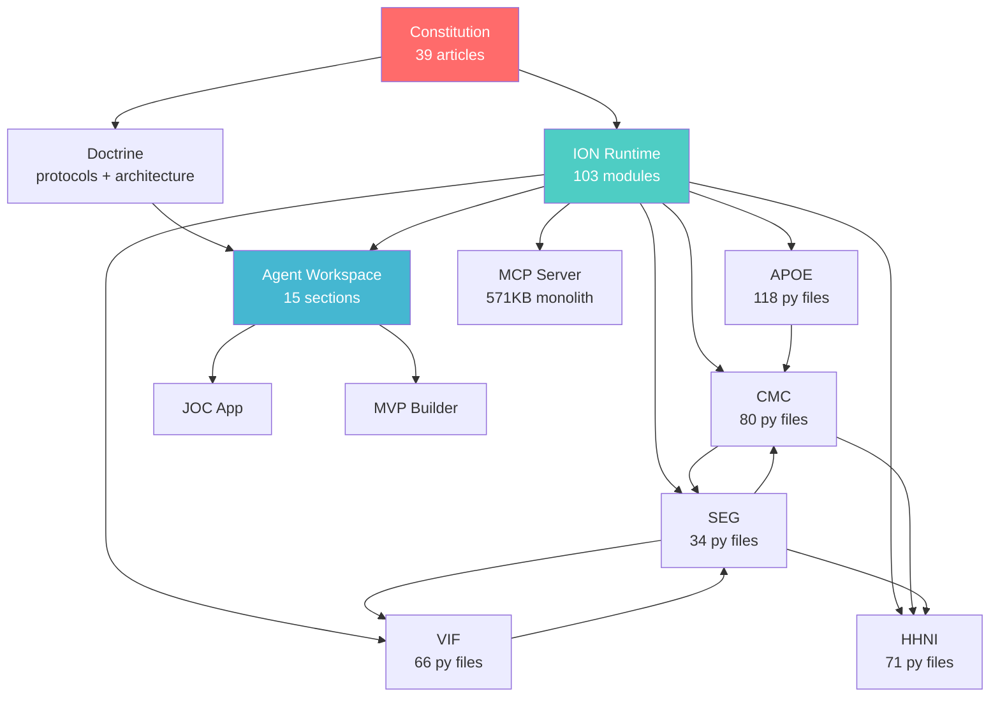

# Canon Cross-Reference Map

> **Purpose:** Show how every section of canon relates to every other section.
> **Maintainer:** OPUS (COO)
> **Created:** 2026-03-24

---

## §1. System Dependency Graph



## §2. Cross-Package Integration Files

These files already exist and bridge packages together:

| Integration File | Package A | Package B | Purpose |
|-----------------|-----------|-----------|---------|
| `seg/hhni_integration.py` | SEG | HHNI | Evidence → multi-resolution retrieval |
| `seg/vif_integration.py` | SEG | VIF | Evidence → confidence gating |
| `seg/cmc_integration.py` | SEG | CMC | Evidence → persistent memory |
| `vif/seg_integration.py` | VIF | SEG | Confidence → evidence graph |
| `apoe/cmc_integration.py` | APOE | CMC | Execution → memory persistence |
| `hhni/sdfcvf_integration.py` | HHNI | SDF-CVF | Retrieval → cross-validation |

## §3. Canon Section → Canon Section Relationships

| From | To | Relationship | How They Connect |
|------|----|-------------|------------------|
| **constitution/** | **doctrine/** | GOVERNS | Art. 16 governs planning density. Art. 22 governs authority. Art. 25 governs selective loading. |
| **constitution/** | **systems/ion/** | GOVERNS | Constitution is encoded into ION's governed_write.py (10-stage pipeline) |
| **doctrine/** | **north_star/** | INFORMS | Doctrine's architecture constraints shape the product roadmap |
| **doctrine/** | **agents/** | CONFIGURES | AGENT_CONTEXT_ARCHITECTURE.md defines workspace spec for all agents |
| **systems/ion/** | **systems/cmc/** | DEPENDS_ON | ION uses CMC for persistent memory (MEMORY ion type) |
| **systems/ion/** | **systems/seg/** | DEPENDS_ON | ION uses SEG for evidence graph (EVIDENCE ion type) |
| **systems/ion/** | **systems/vif/** | DEPENDS_ON | ION uses VIF for confidence gating (gate classes) |
| **systems/ion/** | **builds/victus/** | IMPLEMENTED_BY | Victus repo IS the ION implementation |
| **systems/mcp/** | **agents/** | SERVES | MCP tools provide agent comms, memory, capsules |
| **audits/** | **bloat_registry/** | INFORMS | Audit results identify what's bloat |
| **audits/** | **systems/** | VALIDATES | System audits verify system health |
| **north_star/** | **doctrine/MASTER_ORCHESTRATION.md** | OPERATIONALIZES | North star vision → concrete orchestration |
| **agents/** | **doctrine/AGENT_CONTEXT_ARCHITECTURE.md** | IMPLEMENTS | Agents use the workspace architecture |
| **apps/joc/** | **systems/mcp/** | USES | JOC uses MCP for agent management |
| **builds/** | **systems/** | BUILDS | Build files produce the system artifacts |
| **history/** | **north_star/** | CONTEXTUALIZES | Project history informs strategic planning |

## §4. Full Packages Inventory

60+ packages in `packages/` — here's every package with >5 Python files:

### Tier 1: Core AIM-OS (> 30 .py files)
| Package | .py Files | Purpose | Canon Section |
|---------|-----------|---------|---------------|
| `apoe/` | 118 | Multi-model execution orchestration | systems/apoe/ |
| `timeline_context_system/` | 97 | Rolling context with timeline tracking | systems/tcs/ |
| `cmc_service/` | 80 | Cross-model consciousness memory | systems/cmc/ |
| `hhni/` | 71 | Hierarchical retrieval index | systems/hhni/ |
| `vif/` | 66 | Verification & κ-gating | systems/vif/ |
| `jarvis_injector/` | 53 | JOC/Jarvis dependency injection | apps/joc/ |
| `seg/` | 34 | Shared evidence graph | systems/seg/ |
| `cas/` | 33 | Consciousness analysis | systems/cas/ |
| `sdfcvf/` | 32 | Cross-validation framework | systems/ |

### Tier 2: Supporting Systems (10-30 .py files)
| Package | .py Files | Purpose | Canon Section |
|---------|-----------|---------|---------------|
| `adaptive_system/` | 23 | Adaptive behavior system | systems/ |
| `intuitive_intelligence_system/` | 22 | Intuitive intelligence | systems/ |
| `router_api_server/` | 20 | API routing server | builds/ |
| `specialist_system/` | 18 | Specialist agent framework | agents/ |
| `router/` | 18 | Request routing | builds/ |
| `log_sentinels/` | 18 | Log monitoring/alerting | systems/ |
| `capability_awareness/` | 18 | Self-awareness of capabilities | systems/ |
| `scor/` | 17 | Supply chain operations reference | systems/ |
| `nl_tags/` | 16 | Natural language tag system | systems/ |
| `holographic_memory/` | 16 | Holographic memory model | systems/ |
| `mcp_data_integration/` | 14 | MCP data integration | systems/mcp/ |
| `integration_tests/` | 12 | Cross-system integration tests | builds/ |
| `agent/` | 11 | Core agent framework | agents/ |
| `safety_systems/` | 10 | Safety and guardrails | systems/ |
| `mcp_rag_proxy/` | 10 | MCP RAG proxy | systems/mcp/ |
| `icip_search/` | 10 | ICIP search system | systems/ |

### Tier 3: Applications & Extensions
| Package | Purpose | Canon Section |
|---------|---------|---------------|
| `joc/` | JOC/Jarvis React app | apps/joc/ |
| `ide_chat_app/` | IDE chat application | apps/ |
| `advanced_monaco_editor/` | Monaco editor extensions | apps/ |
| `antigravity-extension/` | Antigravity IDE extension | apps/ |
| `browser-automation-service/` | Browser automation | systems/ |
| `aimos_mobile_app/` | Mobile app | apps/ |
| `aimos-sdk/` | AIM-OS SDK | builds/ |

### Tier 4: Experimental/Legacy
| Package | Purpose | Canon Section |
|---------|---------|---------------|
| `consciousness_analyzer/` | Consciousness analysis (legacy?) | history/ |
| `consciousness_creativity_engine/` | Creativity engine | history/ |
| `consciousness_error_learning/` | Error learning | history/ |
| `consciousness_learning_engine/` | Learning engine | history/ |
| `consciousness_optimization_detector/` | Optimization detection | history/ |
| `autonomous_protocol/` | Autonomous protocol | history/ |
| `autonomous_research_dream/` | Research automation | history/ |
| `deepsearch/` | Deep search | history/ |
| `doc_builder/` | Documentation builder | builds/ |
| `context_bootloader/` | Context bootstrap | systems/ |

## §5. ION Type → AIM-OS Package → Canon Section Chain

This is the key integration chain — how data flows from ION types through packages to canon:

```
ION Type          → Package(s)            → Canon Section(s)
──────────────────────────────────────────────────────────────
MANIFEST          → (ion/manifest.py)     → workspace root
PROTOCOL          → (ion/governed_write)  → doctrine/
BRANCH            → (ion/navigator)       → north_star/ + systems/
EVIDENCE          → SEG + VIF             → audits/ + systems/
MEMORY            → CMC + TCS             → history/ + systems/
CAPSULE           → (ion/capsule)         → agents/ (capsules)
AGENT             → CAS + (ion/agent)     → agents/
SPEC              → APOE                  → builds/ + systems/
TOOL              → MCP                   → systems/mcp/
```

## §6. Missing Cross-References (Build Later)

| What | Why It Matters | When |
|------|---------------|------|
| HHNI ↔ Workspace section loading | HHNI should power selective loading of workspace sections | Phase 1 |
| SEG ↔ Canon provenance | SEG provenance chains should mirror canon PROVENANCE_LOG | Phase 2 |
| CMC ↔ Rolling context sections | CMC atoms should sync with workspace rolling context | Phase 1 |
| VIF ↔ Workspace evidence section | VIF κ-gates should validate workspace evidence entries | Phase 1 |
| TCS ↔ Workspace history section | TCS timeline should power workspace modification history | Phase 2 |

---

*Cross-reference map complete. 6 integration files exist. 15 section-to-section relationships mapped. 60+ packages catalogued across 4 tiers.*
