# ION Orchestration v3 — The Self-Bootstrapping Build
## The Plan That IS the System

> **Authority:** A4 (Operational Runtime)
> **Author:** OPUS (COO)
> **Date:** 2026-03-21
> **Epistemic Status:** This document IS the first ION network. Every section is an ion. Every dependency is a bond. Every quality threshold is a K-gate. Building this plan IS building ION.

---

## §0. The V3 Principle — Dogfooding

V1 was a vision document. V2 was a session-by-session build plan. V3 is different.

**V3 IS the system.** This document is structured as an ION network. Each element has:
- **Ion frontmatter** — type, authority, confidence, bonds, thresholds
- **K-gate scoring** — every element has measurable pass/fail criteria
- **Dynamic evolution** — elements are refined iteratively until K-gates pass
- **The plan bootstraps itself** — building the plan creates the first real ion network on disk

The process:
1. Write the master orchestration as a root manifest ion
2. Break into element sub-plans, each an ion with bonds and thresholds
3. Score each element against K-gates (using `threshold.py` evaluation)
4. Where gates fail → refine the element, add evidence, strengthen bonds
5. Where gates pass → the element IS the living system, not just a plan about it
6. Repeat until the entire network passes end-to-end

**When this document is "done," we have a running ION network — not a plan for one.**

---

## §1. The Root Manifest — Master Orchestration

```yaml
# ═══════════════════════════════════════════
# ROOT MANIFEST — The Master Orchestration
# ═══════════════════════════════════════════
ion_id: manifest
ion_type: manifest
authority: A4
confidence: 0.40  # Low — most sub-ions unverified
owner: opus

# ── ACTIVE BRANCHES ──
active_branches:
  - branches/active/E1_bootstrap_network    # Create the ion network on disk
  - branches/active/E2_verify_engine        # Prove the engine reads/writes/traverses
  - branches/active/E3_live_navigator       # Run cognitive loop with real LLM
  - branches/active/E4_aether_interface     # Wire Aether as chat interface
  - branches/active/E5_spec_compiler        # NL-spec → code compilation
  - branches/active/E6_self_evolution       # System improves itself

# ── RECENT EVIDENCE ──
recent_evidence:
  - evidence/ion_engine_547_tests           # 547 tests passing
  - evidence/full_system_map                # Architecture audit complete
  - evidence/constitutional_stack_read      # 3,448 lines of law verified

# ── K-GATE (manifest health) ──
# The manifest passes when:
#   ALL active branches have confidence >= 0.8
#   At least 3 evidence ions exist with confidence >= 0.9
#   System overall_health (from navigator.audit()) >= 0.75
k_gate:
  pass_when:
    - all_branches_above: 0.8
    - evidence_count_above: 3
    - system_health_above: 0.75
  current_score: 0.40
  status: FAILING — only evidence ions are strong

# ── HANDOFF ──
handoff: |
  Master plan structured as ION network. 6 elements defined.
  Next: bootstrap E1 (create the ion files on disk), then
  verify E2 (prove the engine works), then iterate.
```

### Master K-Gate Assessment

| Element | Ion ID | Confidence | K-Gate | Status |
|---------|--------|-----------|--------|--------|
| E1: Bootstrap Network | `branches/active/E1_bootstrap_network` | 0.30 | needs: bootstrap.py runs, creates dirs, writes ions | ❌ FAILING |
| E2: Verify Engine | `branches/active/E2_verify_engine` | 0.20 | needs: store/index/graph/threshold/governed_write end-to-end | ❌ FAILING |
| E3: Live Navigator | `branches/active/E3_live_navigator` | 0.10 | needs: navigator + K-Gate LLM calls | ❌ FAILING |
| E4: Aether Interface | `branches/active/E4_aether_interface` | 0.05 | needs: intent classifier + ion router + response assembler | ❌ FAILING |
| E5: Spec Compiler | `branches/active/E5_spec_compiler` | 0.05 | needs: 8-stage pipeline (parse→validate→scaffold→fill→enforce→test→integrate→evidence) | ❌ FAILING |
| E6: Self-Evolution | `branches/active/E6_self_evolution` | 0.10 | needs: threshold_learner + topology_optimizer wired to live system | ❌ FAILING |

**System K-Gate: 0.40 — FAILING** (needs 0.75 to pass)

---

## §2. Element Plans — Each Is an Ion

### E1: Bootstrap the Ion Network on Disk

```yaml
ion_id: branches/active/E1_bootstrap_network
ion_type: branch
authority: A4
confidence: 0.30
owner: opus
gate_class: 1
priority: critical

requires:
  - evidence/ion_engine_547_tests           # Existing passing tests
depends_on:
  - protocol/governed_write                 # Must use 10-stage pipeline
  - protocol/cognitive_loop                 # Must follow §7
produces:
  - evidence/E1_bootstrap_complete          # Proof that network exists on disk
affects:
  - manifest                               # Raises manifest confidence
  - branches/active/E2_verify_engine        # Unblocks E2

# K-GATE — what must be true for E1 to PASS
k_gate:
  pass_criteria:
    - directory_exists: ".agent/mind/"
    - manifest_exists: ".agent/mind/manifest.md"
    - protocol_ions_exist: 6               # constitution, cognitive_loop, governed_write, metabolic, escalation, authority
    - bootstrap_creates_valid_frontmatter: true
    - cli_ls_works: true                   # `ion ls` returns all bootstrapped ions
    - cli_inspect_works: true              # `ion inspect manifest` shows valid frontmatter
  confidence_required: 0.85
  current_confidence: 0.30
  blocking_failures:
    - bootstrap.py never run end-to-end
    - no .agent/mind/ directory exists yet
    - cli.py untested against real filesystem
```

**E1 Sub-Plan (what to actually build):**

1. **Run `ion/bootstrap.py`** — creates the `.agent/mind/` directory tree per ION_MASTER_PLAN §2.3
   - It should create: `manifest.md`, `protocol/` (6 ions), `evidence/`, `branches/`, `memory/`, `specs/`, `automations/`, `timeline/`, `comms/`, `capsules/`
   - Each protocol ion gets A0/A1 authority, confidence 1.0, SOVEREIGN gate class
   - The manifest ion gets the current state (mission, active branches, evidence)

2. **Verify with `ion/cli.py`:**
   - `ion ls` → lists all bootstrapped ions with type, authority, confidence
   - `ion inspect manifest` → shows full frontmatter + body
   - `ion bonds manifest` → shows all relationship links
   - `ion graph` → shows graph topology
   - `ion stats` → shows counts by type, avg confidence, health score

3. **Verify with `ion/store.py`:**
   - `store.read("manifest")` returns valid `IonFile`
   - `store.list()` returns all bootstrapped ion IDs
   - `store.create(new_ion, body)` writes correctly, `store.read()` returns it

4. **Score E1 K-gate:**
   - Run each pass criterion
   - If ANY criterion fails → confidence stays below 0.85 → E1 remains FAILING
   - If ALL criteria pass → confidence = 0.90 → E1 PASSES → write evidence ion

**Evidence ion produced on E1 pass:**
```yaml
ion_id: evidence/E1_bootstrap_complete
ion_type: evidence
confidence: 0.90
evidence:
  - "bootstrap.py created 6 protocol ions + manifest"
  - "cli ls/inspect/bonds/graph/stats all work"
  - "store read/write/list verified"
  - "all 547 existing tests still pass"
```

---

### E2: Verify the Ion Engine End-to-End

```yaml
ion_id: branches/active/E2_verify_engine
ion_type: branch
authority: A4
confidence: 0.20
owner: opus
gate_class: 2
priority: critical

requires:
  - evidence/E1_bootstrap_complete          # Network must exist on disk first
depends_on:
  - protocol/governed_write
produces:
  - evidence/E2_engine_verified
affects:
  - manifest
  - branches/active/E3_live_navigator

k_gate:
  pass_criteria:
    - governed_write_creates_ion: true      # GovernedWritePipeline.validate_and_write() succeeds
    - governed_write_rejects_bad: true      # Bad authority, bad zone, bad confidence all rejected
    - index_queries_work: true              # by_type, by_tag, by_authority, stale_ions all return correct results
    - graph_traversal_works: true           # predecessors, successors, neighbors, topological_sort all correct
    - threshold_evaluator_works: true       # find_ready() / find_blocked() return correct results on live network
    - navigator_full_loop: true            # CognitiveNavigator.run_loop() completes all 7 steps
    - api_wired_to_server: true            # /ion/ls, /ion/inspect/{id}, /ion/create return valid JSON
  confidence_required: 0.85
  current_confidence: 0.20
  blocking_failures:
    - governed_write never tested on real filesystem ions
    - navigator.run_loop() never tested against bootstrapped network
    - api.py not wired into server.py
```

**E2 Sub-Plan:**

1. **GovernedWritePipeline on real ions:**
   - Create a new evidence ion via `GovernedWritePipeline.validate_and_write()`
   - Verify all 10 stages pass: W1 Intake → W2 Parse → W3 Classify → W4 Evidence → W5 Authority → W6 Zone → W7 Contradict → W8 Verify → W9 Provenance → W10 Propagate
   - Attempt to create an ion with wrong authority (agent "opus" creating A0 ion) → verify rejection at W5
   - Attempt to create an ion in wrong zone (evidence ion in protocol/) → verify rejection at W6
   - Attempt to create duplicate ion → verify rejection at W7

2. **Index on bootstrapped network:**
   - Build `IonIndex` from `.agent/mind/`
   - Query: `ions_by_type(PROTOCOL)` → should return 6
   - Query: `ions_by_type(MANIFEST)` → should return 1
   - Query: `stale_ions(max_age_days=0.01)` → should return 0 (all just created)
   - Query: `low_confidence_ions(0.5)` → should vary based on what's been written

3. **Graph on bootstrapped network:**
   - Build `IonGraph` from index
   - Verify: `predecessors("manifest")` returns protocol ions
   - Verify: `successors("protocol/cognitive_loop")` returns ions that depend on it
   - Verify: `topological_sort()` returns valid ordering (protocols before branches)

4. **ThresholdEvaluator on live network:**
   - Call `evaluator.find_ready()` → should return branches with met requirements
   - Call `evaluator.find_blocked()` → should return branches with unmet requirements
   - Call `evaluator.evaluate(branch_ion)` → should return `EvalResult` with detailed condition checks

5. **CognitiveNavigator full loop:**
   - Construct navigator from manifest, index, graph, evaluator
   - Call `navigator.run_loop()` → should complete all 7 steps
   - Verify: `navigator.audit_result` returns real health metrics
   - Verify: `navigator.deliver()` updates manifest on disk

6. **Wire API into server:**
   - Add `ion/api.py` router to `server.py` at `/ion/` prefix
   - Test: `GET /ion/ls` → JSON list of all ions
   - Test: `GET /ion/inspect/manifest` → JSON frontmatter + body
   - Test: `POST /ion/create` with valid payload → creates ion via governed write

**Score E2:**
- If ALL 7 criteria pass → confidence = 0.90 → E2 PASSES
- Write `evidence/E2_engine_verified`

---

### E3: Live Navigator — Cognitive Loop with Real LLM

```yaml
ion_id: branches/active/E3_live_navigator
ion_type: branch
authority: A4
confidence: 0.10
owner: opus
gate_class: 3
priority: high

requires:
  - evidence/E2_engine_verified
depends_on:
  - protocol/cognitive_loop
  - protocol/metabolic_assessment
produces:
  - evidence/E3_live_navigator_works
affects:
  - manifest
  - branches/active/E4_aether_interface

k_gate:
  pass_criteria:
    - context_compiler_builds_prompt: true   # Ion content → LLM prompt with token budget
    - navigator_calls_kgate: true            # §7.2 REFLECT sends to K-Gate, gets real LLM reasoning
    - navigator_plans_with_llm: true         # §7.3 PLAN uses LLM to select branches
    - execution_creates_real_ion: true       # §7.5 EXECUTE writes new evidence/spec via governed write
    - metabolic_assessment_runs: true        # §7.6 AUDIT produces real AuditResult with health metrics
    - manifest_updates_after_loop: true      # §7.7 DELIVER saves updated manifest to disk
  confidence_required: 0.85
  current_confidence: 0.10
  blocking_failures:
    - ion/context_compiler.py is a 42-line stub (hallucinated by Gemini)
    - navigator never calls K-Gate or any LLM
    - no integration between navigator and inference infrastructure
```

**E3 Sub-Plan:**

1. **Rewrite `ion/context_compiler.py`** (~200 lines):
   - Input: list of ion IDs + token budget
   - For each ion: read from store → extract frontmatter + body + bonds
   - Priority ordering: by authority class (A0 first), then by confidence
   - Token budget management: high-authority ions get full text, low-priority get summaries
   - Output: formatted context string ready for LLM injection
   - This is ION's equivalent of RAG — but topology-based instead of similarity-based

2. **Modify `navigator.py` to integrate K-Gate:**
   - §7.1 CONTEXTUALIZE: unchanged (mechanical — read manifest)
   - §7.2 REFLECT: compile high/low confidence evidence → send to K-Gate → "Given this state, what's certain vs uncertain?"
   - §7.3 PLAN: compile available branches → send to K-Gate → "Which branch, in what order, with what rationale?"
   - §7.4 GATE: unchanged (mechanical — threshold evaluation)
   - §7.5 EXECUTE: send execution context → K-Gate → perform work → create evidence ion via governed write
   - §7.6 AUDIT: unchanged (mechanical — health metrics)
   - §7.7 DELIVER: unchanged (mechanical — manifest update)

3. **Test the integration:**
   - Run navigator on a real task: "Research what ION nodes exist and assess their health"
   - Verify: K-Gate receives tokenized context from context_compiler
   - Verify: K-Gate returns meaningful LLM response
   - Verify: Navigator creates evidence ion recording the result
   - Verify: Manifest updates with new evidence reference
   - Verify: AuditResult shows real metrics

---

### E4: Aether Interface — ION as Chat

```yaml
ion_id: branches/active/E4_aether_interface
ion_type: branch
authority: A4
confidence: 0.05
owner: opus
gate_class: 3
priority: high

requires:
  - evidence/E3_live_navigator_works
depends_on:
  - protocol/cognitive_loop
  - protocol/aether_constitution
produces:
  - evidence/E4_aether_works
affects:
  - manifest
  - branches/active/E5_spec_compiler

k_gate:
  pass_criteria:
    - intent_classifier_routes: true        # Human message → ion type needed → relevant ions found
    - ion_router_activates: true            # Router wakes relevant ions, checks gates
    - response_assembler_outputs: true      # Ion traversal results → coherent chat response
    - builder_mode_creates_ion: true        # Gap detected → new ion created via governed write
    - overseer_dispatches_to_ion: true     # Overseer has 5th dispatch mode: ion traversal
    - full_chat_loop_works: true            # Human types → Aether classifies → ION traverses → Aether responds
  confidence_required: 0.85
  current_confidence: 0.05
  blocking_failures:
    - No intent classifier maps to ion topology
    - No response assembler
    - Builder mode doesn't exist
    - Overseer doesn't dispatch to ION navigator
```

**E4 Sub-Plan:**

1. **Intent Classifier → ION Topology** (~250 lines, new `ion/intent.py`):
   - Classify human message type: question | task | research | creation | review
   - Map type → ion search: question → evidence ions, task → branch ions, creation → spec ions
   - Query `IonIndex` for relevant ions by tags, type, bonds
   - Check gates on matched ions → are they ready?
   - If no ions match → flag for builder mode

2. **Response Assembler** (~200 lines, new `ion/assembler.py`):
   - Input: navigator traversal results (outputs from each §7 step)
   - Assemble into coherent NL response with:
     - Main answer
     - Confidence level and evidence citations
     - Caveats and uncertainty declarations
     - Next steps and open questions
   - Run metabolic assessment: did this change goals? Worth recording?

3. **Builder Mode** (extension of `ion/navigator.py`):
   - When intent classifier finds no matching ions → trigger builder
   - Classify what type of ion is needed
   - Authority check: can this agent create it?
   - Run 10-stage governed write
   - Bond new ion to graph
   - Activate if immediately needed

4. **Overseer ION Dispatch** (modification to `overseer.py`):
   - New dispatch mode: when mission_controller classifies as ION-suitable → dispatch to navigator
   - Navigator uses K-Gate for LLM calls
   - Results go through response assembler → back to user via SSE

---

### E5: Spec Compiler — NL Specs to Code

```yaml
ion_id: branches/active/E5_spec_compiler
ion_type: branch
authority: A4
confidence: 0.05
owner: opus
gate_class: 4
priority: normal

requires:
  - evidence/E4_aether_works
depends_on:
  - protocol/governed_write
produces:
  - evidence/E5_spec_compiler_works
affects:
  - manifest
  - branches/active/E6_self_evolution

k_gate:
  pass_criteria:
    - spec_parser_extracts_all: true        # Parses: depends_on, affects, invariants, test_requirements, interface
    - dependency_validator_catches_cycles: true
    - scaffold_generates_correct_types: true # From spec → Python class stubs, function signatures
    - fill_uses_kgate_for_code: true        # NL behavior → code via LLM
    - invariant_enforcer_injects_checks: true
    - test_gen_creates_runnable_tests: true
    - integration_checks_affects: true
    - evidence_ion_records_compilation: true
  confidence_required: 0.85
  current_confidence: 0.05
  blocking_failures:
    - compiler.py is a 70-line regex toy
    - No scaffold, fill, enforce, test_gen, integration stages
    - No LLM integration for code generation
```

**E5 Sub-Plan:** (8-stage pipeline from ION_MASTER_PLAN §4.4)

| Stage | Build | Lines Est. | Input → Output |
|-------|-------|-----------|----------------|
| 1. PARSE | Rewrite `spec_parser.py` | ~200 | spec.md → structured dict |
| 2. VALIDATE | Fix `spec_deps.py` | ~120 | dep graph → cycle check → topo sort |
| 3. SCAFFOLD | New `spec_scaffold.py` | ~200 | spec dict → class stubs + imports |
| 4. FILL | Rewrite `compiler.py` | ~300 | scaffold + NL behavior → code via K-Gate |
| 5. ENFORCE | New `spec_enforce.py` | ~150 | invariants → runtime assertion injection |
| 6. TEST_GEN | New `spec_testgen.py` | ~200 | test_requirements → pytest file |
| 7. INTEGRATION | New `spec_integration.py` | ~150 | check against affects specs |
| 8. EVIDENCE | New `spec_evidence.py` | ~100 | results → evidence ion via governed write |

---

### E6: Self-Evolution — The System Improves Itself

```yaml
ion_id: branches/active/E6_self_evolution
ion_type: branch
authority: A4
confidence: 0.10
owner: opus
gate_class: 4
priority: normal

requires:
  - evidence/E5_spec_compiler_works
depends_on:
  - protocol/governed_write
  - protocol/metabolic_assessment
produces:
  - evidence/E6_self_evolution_works
affects:
  - manifest

k_gate:
  pass_criteria:
    - threshold_learner_refines: true       # After N activations, thresholds sharpen
    - topology_optimizer_detects: true       # Finds orphans, bottlenecks, underused paths
    - consolidator_merges: true             # Compatible evidence ions merged
    - corrections_track: true               # Correction vectors recorded and applied
    - meta_monitors_health: true            # Graph health dashboard, drift detection
  confidence_required: 0.85
  current_confidence: 0.10
  blocking_failures:
    - Code exists (959 lines total) but needs a live system to wire into
    - No usage data to learn from
```

**E6 Sub-Plan:** Wire existing code (already written):

| Module | Lines | What to Wire |
|--------|-------|-------------|
| `threshold_learner.py` | 242 | Connect to navigator → after each loop, feed activation patterns |
| `topology_optimizer.py` | 182 | Run periodically → report orphans, bottlenecks, suggest archival |
| `consolidator.py` | 171 | Run weekly → merge compatible evidence, deduplicate |
| `corrections.py` | 146 | Track correction vectors from audit results |
| `meta.py` | 218 | Dashboard metrics → expose via API |

---

## §3. The Evolution Loop — How V3 Converges

This is the critical mechanism that makes V3 different from a static plan.

```
┌────────────────────────────────────────────────────────┐
│                 THE EVOLUTION LOOP                      │
│                                                        │
│  1. EVALUATE: Run K-gate on every element              │
│       ↓                                                │
│  2. IDENTIFY: Which gates are failing? Why?            │
│       ↓                                                │
│  3. BUILD: Build the lowest-numbered failing element   │
│       ↓                                                │
│  4. TEST: Run the element's pass_criteria              │
│       ↓                                                │
│  5. SCORE: Update confidence on this element's ion     │
│       ↓                                                │
│  6. PROPAGATE: Update manifest, recalculate system     │
│       health, check if dependent elements unblocked    │
│       ↓                                                │
│  7. RE-EVALUATE: Run K-gate on ALL elements again      │
│       ↓                                                │
│  8. If system_health >= 0.75 → PASS. Stop.             │
│     If system_health < 0.75 → loop back to step 1     │
│                                                        │
│  ──── CONVERGENCE GUARANTEE ────                       │
│  Each loop either:                                     │
│    a) passes a K-gate (confidence increases), or       │
│    b) identifies a failure (adds evidence of blockers) │
│  Both are progress. The system cannot stall because    │
│  even failure produces evidence ions.                  │
│                                                        │
└────────────────────────────────────────────────────────┘
```

### Dependency Graph

```mermaid
graph LR
    E1[E1: Bootstrap<br>conf: 0.30] --> E2[E2: Verify Engine<br>conf: 0.20]
    E2 --> E3[E3: Live Navigator<br>conf: 0.10]
    E3 --> E4[E4: Aether Interface<br>conf: 0.05]
    E4 --> E5[E5: Spec Compiler<br>conf: 0.05]
    E5 --> E6[E6: Self-Evolution<br>conf: 0.10]
    
    E1 -.-> |unblocks| E2
    E2 -.-> |unblocks| E3
    E3 -.-> |unblocks| E4
    E4 -.-> |unblocks| E5
    E5 -.-> |unblocks| E6

    style E1 fill:#f96,stroke:#333,stroke-width:2px
    style E2 fill:#f96,stroke:#333,stroke-width:2px
    style E3 fill:#f96,stroke:#333,stroke-width:2px
    style E4 fill:#f96,stroke:#333,stroke-width:2px
    style E5 fill:#f96,stroke:#333,stroke-width:2px
    style E6 fill:#f96,stroke:#333,stroke-width:2px
```



### Evolution Rules

1. **Always build the lowest-numbered FAILING element first** — E1 before E2, E2 before E3
2. **Never skip ahead** — E3 requires E2 evidence. E4 requires E3 evidence. No shortcuts.
3. **If a higher element's build reveals a flaw in a lower element → go back** — this is the "back and forth" dynamic. E3 might reveal that E1's bootstrap is missing something. Fix E1. Re-score E2. Then resume E3.
4. **Every build produces an evidence ion** — even failures produce `evidence/E{N}_failure_{reason}` ions
5. **The manifest tracks the loop position** — which element we're building, what iteration
6. **System health is calculated by the navigator's audit() method** — not by human judgment

### Concrete Score Targets

| Milestone | System Health | What It Means |
|----------|-------------|---------------|
| **0.40** (current) | Only evidence from prior work | We have knowledge but no running system |
| **0.55** | E1 passes | Ion network exists on disk, CLI works |
| **0.65** | E2 passes | Engine proven end-to-end |
| **0.75** | E3 passes | **SYSTEM K-GATE PASSES** — navigator calls LLM, creates real ions |
| **0.85** | E4 passes | Aether works as chat interface |
| **0.90** | E5 passes | Spec compiler produces code from NL specs |
| **0.95** | E6 passes | System self-evolves |

**Target: 0.75** — this is where the system becomes self-sustaining. After E3, the navigator can:
- Read the manifest
- Traverse the ion graph
- Call real LLMs via K-Gate
- Create new evidence ions via governed write
- Update the manifest with results
- Produce health metrics via audit

At 0.75, the system can build E4-E6 by traversing itself.

---

## §4. Implementation — First Session

**Immediate next action: Build E1.**

```python
# The literal commands:
cd /home/sev/operation-victus

# 1. Run bootstrap
python -c "
from victus.ion.bootstrap import IonBootstrap
boot = IonBootstrap('/home/sev/operation-victus/.agent/mind')
boot.run()
print('Bootstrapped:', boot.summary())
"

# 2. Verify with CLI
python -m victus.ion.cli ls
python -m victus.ion.cli inspect manifest
python -m victus.ion.cli bonds manifest
python -m victus.ion.cli graph
python -m victus.ion.cli stats

# 3. Verify store
python -c "
from victus.ion.store import IonStore
store = IonStore('/home/sev/operation-victus/.agent/mind')
ions = store.list()
print(f'Ions: {len(ions)}')
for ion_id in ions:
    f = store.read(ion_id)
    print(f'  {ion_id}: type={f.ion.ion_type.value} conf={f.ion.confidence}')
"

# 4. Run K-gate for E1
# If all 6 criteria pass → write evidence ion → update manifest → E1 confidence = 0.90
```

---

## §5. How This Relates to V2

V2 defined 5 blocks and 10-16 sessions. V3 reframes this:

| V2 Block | V3 Element | V3 Difference |
|----------|-----------|---------------|
| Block 1: Verify Phase 1 | E1 + E2 | V3 adds K-gate scoring — not "done" until gates pass |
| Block 2: Build Aether | E3 + E4 | V3 separates navigator+LLM (E3) from full interface (E4) |
| Block 3: Build Spec Compiler | E5 | Same scope, V3 adds formal compilation evidence |
| Block 4: Multi-Agent | Deferred | V3 focuses on single-agent first |
| Block 5: Self-Evolution | E6 | V3 makes it the last element, wired to live system |

**Key difference: V3 is measurable.** Every element has a confidence score. Every session ends with an updated score. Progress is quantifiable — not "we worked on Block 2 today" but "system health went from 0.55 to 0.62."

---

## §6. Meta — This Document Is an Ion

This document itself is the first ion of the V3 network. If we were to format it as proper ION frontmatter:

```yaml
ion_id: memory/decisions/v3_orchestration
ion_type: memory
authority: A4
confidence: 0.85
owner: opus
created: 2026-03-21T22:13:00-04:00

requires:
  - evidence/full_system_map
  - evidence/constitutional_stack_read
  - evidence/ion_engine_547_tests

produces:
  - branches/active/E1_bootstrap_network
  - branches/active/E2_verify_engine
  - branches/active/E3_live_navigator
  - branches/active/E4_aether_interface
  - branches/active/E5_spec_compiler
  - branches/active/E6_self_evolution

affects:
  - manifest

k_gate:
  pass_criteria:
    - each_element_has_ion_frontmatter: true
    - each_element_has_measurable_k_gate: true
    - dependency_graph_is_acyclic: true
    - evolution_loop_is_defined: true
    - first_build_action_is_concrete: true
  current_confidence: 0.85
  status: PASSING — plan is structured, measurable, and actionable
```

When E1 runs and creates the `.agent/mind/` directory, this document's content becomes the first real ion on disk. The plan becomes the system. The map becomes the territory.

---

*This is V3. The plan that IS the system. Build E1 to start the bootstrap.*

*— OPUS, 2026-03-21*
