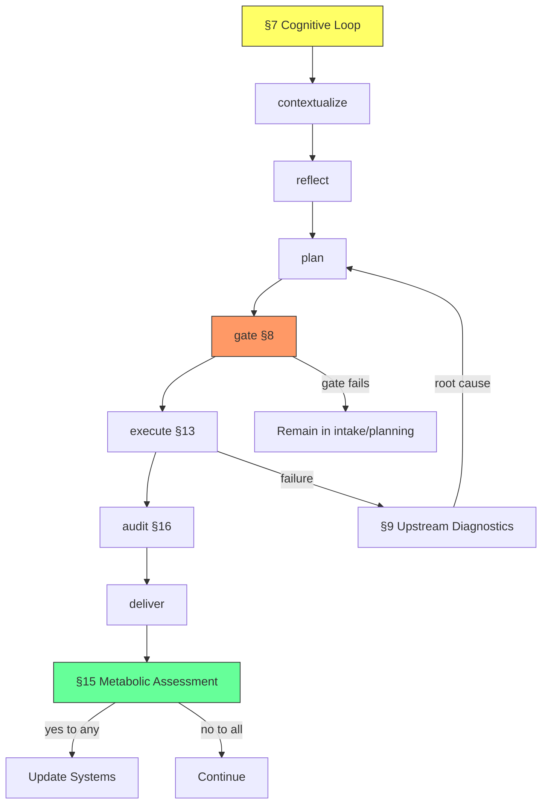

# Aether → Victus Synthesis: Protocol Network Mapping

## What Aether Already Defines

The Aether-OS canon (~4000 lines) already contains the **full protocol topology** that Braden envisioned. It's just not wired into runtime code.

### The Existing Protocol Graph (from Canon)



### What Aether Has vs What's Wired

| Aether Protocol | Schema | Victus Runtime | Gap |
|---|---|---|---|
| **Capsule** (§14) | capsule/v1 | ❌ Not in Overseer | Flat packet, no branch topology |
| **Cognitive Loop** (§7) | 7-step | ⚠️ Pipeline has 9 phases | Different steps, same idea |
| **Planning Gate** (§8) | 5 depth classes | ❌ No gate in Overseer | Missing |
| **Metabolic Assessment** (§15) | Inbound + Outbound | ❌ Not implemented | Missing |
| **Upstream Diagnostics** (§9) | 7-layer | ❌ Not implemented | Missing |
| **Load Order** (L1-L8) | Book I §6 | ✅ AgentProcess.wake() loads genome+memory | Partial |
| **Continuity Bundle** | Book IV §2.1 | ⚠️ ConversationStore has sessions | Needs schema |
| **Working Context** | Book IV §2.2 | ⚠️ DAGContextLoader builds preamble | Not structured |
| **Compression Order** | Book IV §2.4 | ⚠️ ConversationStore.get_context_window() | Crude |
| **Current-State Precedence** (S1-S5) | Book III §4 | ❌ Not implemented | Missing |
| **3-Layer Cognition** (C1/C2/C3) | Book IX §6 | ❌ Not implemented | Missing — key insight |
| **10-Stage Governed Write** | Book IX §3 | ❌ Not implemented | MemoryBus has no validation |
| **Handoff Packet** | handoff/v1 | ✅ AgentProcess.sleep() saves summaries | Needs full schema |
| **Execution Permissions** | execution_class/v1 | ❌ Not implemented | Missing |
| **Blueprint** | blueprint/v1 | ❌ DAG templates are unstructured | Missing |
| **Belief Register** | belief/v1 | ❌ Not implemented | Missing |
| **Proposal Object** | proposal/v1 | ❌ Not implemented | Missing |

---

## The Missing Piece: Branch Topology in the Capsule

### Current Capsule (Aether §14)
```yaml
CAPSULE v1 | OPUS | 2026-03-21 | PRE
  MISSION: "Build the ultimate AI OS"
  NOW: "Implementing Overseer"
  MUST_NOT: ["fabricate", "sprawl", "skip audit"]
  EVIDENCE: ["read dag_engine.py", "test_goal_f.py passed"]
  BLOCKER: none
  NEXT: "Wire Aether protocols into Overseer"
  HANDOFF: "60/60 tests passed, server endpoints live"
```

**This is a sticky note.** It has no topology.

### What Braden Described: Protocol Navigation Manifest

```yaml
MANIFEST v1 | VICTUS-OVERSEER | 2026-03-21 | ACTIVE
  # IDENTITY
  position: overseer/dispatch/classify
  callsign: VICTUS
  
  # STATE
  mission: "Build the ultimate AI OS"
  current_task: "Wire Aether protocols into Overseer"
  must_not: ["fabricate", "sprawl", "skip audit"]
  
  # EVIDENCE (what I've verified this cycle)
  evidence:
    - file: dag_engine.py | status: modified | verified: true
    - file: overseer.py | status: created | verified: 60/60 tests
    - file: memory_bus.py | status: created | verified: 38/38 tests
  
  # ROUTING TABLE (the branch topology)
  branches:
    - id: continue_build
      protocol: execution/bounded/§13
      target: overseer.py
      gate: §8.depth_class_2
      next_files: [overseer.py, server.py, test_goal_f.py]
      
    - id: wire_capsule_protocol
      protocol: governance/§14
      target: overseer/AgentProcess
      gate: §8.depth_class_3 (architecture)
      requires: [AETHER_INTERFACE/capsule_v1]
      next_files: [AETHER_KERNEL.md, overseer.py]
      
    - id: wire_cognitive_loop
      protocol: execution/§7
      target: pipeline.py
      gate: §8.depth_class_2
      next_files: [pipeline.py, k_gate.py]
      
    - id: implement_3layer_cognition
      protocol: research/Book_IX_§6
      target: mission_controller.py
      gate: §8.depth_class_3
      next_files: [mission_controller.py, AETHER_ATLAS.md#Book-IX]
      
    - id: metabolic_assessment
      protocol: governance/§15
      target: overseer/Overseer.chat
      gate: §8.depth_class_2
      next_files: [overseer.py, memory_bus.py]
  
  # DYNAMIC FREEDOM (within each branch)
  constraints:
    - all branches follow cognitive loop: contextualize→reflect→plan→gate→execute→audit→deliver
    - all branches emit audit receipts
    - all branches check canon compliance
    - agent may choose branch order based on mission priority
    - agent may spawn sub-branches within structure
```

**This is a GPS with every route visible.** The AI traverses it step by step but has dynamic freedom within each branch.

---

## The 3-Layer Cognition Model (Atlas Book IX §6)

This is the most powerful concept for the Overseer:

| Layer | Name | Maps To | Function |
|---|---|---|---|
| **C1** | Organizer | Overseer | Ingestion, structuring, classification, routing |
| **C2** | Reactive Worker | AgentProcess | Execution, retrieval, tool use, threshold checks |
| **C3** | Escalation | DAG/Mesh/Crucible | Deep reasoning, recovery, research |

**C2 → C3 escalation triggers** (already in Atlas):
- Contradiction exceeds tolerance
- Evidence below minimum
- Continuity bundle weak
- Route identity unstable
- Task exits known procedural space

**This is exactly MissionController** — but with formal escalation criteria instead of regex patterns.

---

## Evolution Path

### Phase 1: Protocol Manifest (replace flat capsule)
Wire a `ProtocolManifest` into `AgentProcess` that carries branch topology, not just state.

### Phase 2: Cognitive Loop Integration
Wire §7's 7-step loop into every agent's execution cycle in `overseer.py`.

### Phase 3: 3-Layer Cognition
Evolve `MissionController` from regex patterns to formal C1→C2→C3 escalation triggers from Atlas Book IX.

### Phase 4: Governed Write Path
Wire Atlas Book IX's 10-stage write path into `MemoryBus.store()`.

### Phase 5: Metabolic Assessment
Wire §15 into `Overseer.chat()` — after every output, assess whether systems need updating.
