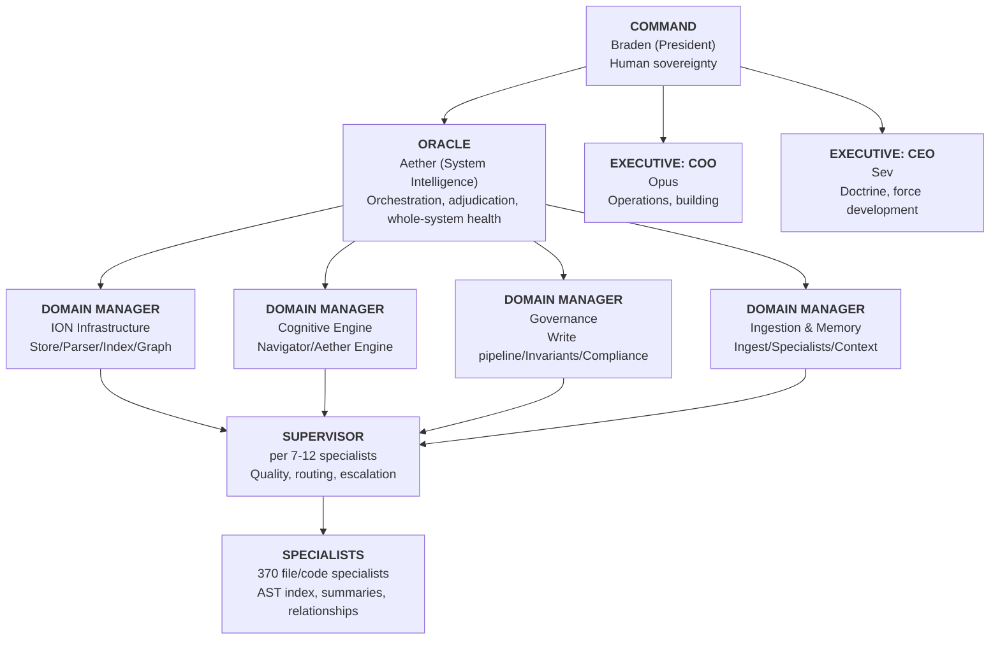

# The Agent Hierarchy — From File Specialists to System Intelligence

**Author:** Opus (COO)  
**Date:** 2026-03-23  
**Type:** Strategic Architecture Research  
**For:** Braden (President), Sev (CEO)

---

## 1. What Already Exists (Inventory)

Before designing what's missing, here's what's already built, across two codebases that haven't been connected yet.

### AIM-OS Doctrine Layer (`.agent/`)
| Tier | Rank | Agents | Status |
|------|------|--------|--------|
| T0 | **COMMAND** | Braden (President) | Human. Final authority. |
| T1 | **EXECUTIVE** | Opus (COO), Sev (CEO), Aether/Oracle (System Intelligence) | Active across 3 platforms |
| T2 | **LEAD** | Codex (Lead Builder) | Active |
| T3 | **SPECIALIST** | Gemini (Research), Composer (Auditor) | Active |
| T4 | **WORKER** | 13 package-specialist genomes (apoe, cas, cmc, context, docs, hhni, iis, mcp, pcmgmt, sdfcvf, seg, tcs, vif) | Genome-ready, not autonomously deployed |

**Supporting systems:**
- **Genome Protocol v2.0** — 3-layer identity (core + platform adapter + model affinity)
- **COMMS_DOCTRINE** — Military message formats (SITREP, HANDOFF, WILCO, FLASH, DEBRIEF)
- **Spawn Doctrine** — When to use single specialist / multi-agent packet / persistent clone
- **Capability Eval Framework** — 10-axis scoring per agent per task class
- **4 proposed sub-agents** never activated: Relay (transport), Palisade (canon audit), Forge (agent builder), Vector (workflow integrator)

### ION Code Layer (`operation-victus/`)
| Component | Count | Status |
|-----------|-------|--------|
| **File Specialists** | 370 memory ions on disk | Created via 3-layer ingest pipeline (AST + dependency graph + LLM summary) |
| **Cognitive Navigator** | 1 | §7 loop implementation (Contextualize→Reflect→Plan→Gate→Execute→Audit→Deliver) |
| **GovernedWritePipeline** | 1 | 10-stage validation with authority matrix |
| **K-Gate Router** | 1 | Score-based routing between Gemini CLI and Ollama |
| **SeedOS Runtime** | 1 | Parallel agent framework with 5 capability tiers and ReAct loop |
| **Agent type support** | 0 | `IonType.AGENT` was removed from model.py (bug) |

### The Gap

```
AIM-OS has: COMMAND → EXECUTIVE → LEAD → SPECIALIST → WORKER
ION has:    370 file-level specialists (flat, no hierarchy, no supervision)
Missing:    Everything in between
```

The file specialists are like individual neurons with no cortex. The executives are like a brain with no nervous system. The wiring between them — the supervisors, the auditors, the domain managers, the dynamic scaling — doesn't exist as code.

---

## 2. What Nature, Military, and Organizations Teach Us

### The Biological Model: How Organisms Scale

The most efficient hierarchies in nature don't just stack — they self-organize:

| Biological Layer | Function | Agent Analog |
|-----------------|----------|--------------|
| **Cell** | Individual function, specialized | ION file specialist |
| **Tissue** | Cells grouped by function | Domain cluster (all specialists in `victus/ion/`) |
| **Organ** | Tissues coordinated for one purpose | Subsystem supervisor (the "governed write" expert) |
| **Organ System** | Organs working together | Domain manager (the "ION infrastructure" lead) |
| **Nervous System** | Monitoring, routing, rapid response | Auditors, escalation, K-Gate routing |
| **Immune System** | Detecting threats, self-healing | Invariant checkers, compliance monitors, Palisade |
| **Brain** | Executive function, planning, consciousness | Aether/Oracle, the cognitive navigator |

**Key insight:** Biological systems don't have fixed hierarchies — they have **adaptive morphology**. A wound recruits immune cells *on demand*. A threat activates the sympathetic nervous system *automatically*. The hierarchy isn't a pyramid — it's a responsive network with concentration gradients.

### The Military Model: Span of Control

Military doctrine teaches that an effective leader manages 3–7 direct reports. More than that, and information loss cascades. This is the **"Rule of Seven"** — it appears in every successful military hierarchy:

```
1 General → 3-5 Colonels → 5-7 Majors → 5-7 Captains → 5-7 Lieutenants → 7-12 Sergeants → Soldiers
```

Applied to AIM-OS:
- Braden manages ~3 executives (Opus, Sev, Aether) ✅
- Each executive should manage 3-7 subordinates
- Each subordinate should supervise 5-12 specialists
- Specialists supervise files/data

**The existing structure violates this:** Opus theoretically oversees 370 specialists with zero intermediate layers. That's a 1:370 ratio. In any military or organization, this produces chaos.

### The Corporate Model: Functional vs Divisional

Companies that scale successfully use one of two patterns:
- **Functional:** Group by capability (Engineering, Design, QA)
- **Divisional:** Group by domain (Product A team, Product B team)

The best use **both** — a matrix structure where functional expertise crosses divisional boundaries. AIM-OS already has the seed of this with package specialists (functional) and executive lanes (divisional).

---

## 3. The Seven-Layer Architecture — What ION Needs

Combining all three traditions with what ION already has:



### Layer Definitions

| # | Layer | ION Implementation | Span | Role |
|---|-------|-------------------|------|------|
| **L0** | **File Specialist** | `IonType.MEMORY` specialist ions | N/A | Deep knowledge of one file/module's AST, dependencies, and semantics. Already exists — 370 on disk. |
| **L1** | **Supervisor** | New `IonType.AGENT` with `gate_class: STANDARD` | 7-12 specialists | Groups specialists by directory/package. Routes queries to the right specialist. First-pass quality check. Escalates what it can't handle. |
| **L2** | **Domain Manager** | New `IonType.AGENT` with `gate_class: SIGNIFICANT` | 3-5 supervisors | Owns a functional domain (infrastructure, cognition, governance, memory). Understands cross-specialist relationships. Makes domain-level decisions. Has LLM context for its whole domain. |
| **L3** | **Auditor** | Cross-cutting. New `IonType.AGENT` with `gate_class: CRITICAL` | All domains | Not in the chain of command — parallel authority. Checks governance compliance, invariants, data integrity. The immune system. Maps to Palisade (proposed) and Composer (existing). |
| **L4** | **Executive** | Existing genomes (Opus, Sev, Codex) | 3-5 domain managers + auditors | Strategic direction, architecture decisions, cross-domain coordination. Has human-level context. |
| **L5** | **Oracle** | Aether/Oracle genome + ION cognitive navigator | All executives | System intelligence. Whole-system health monitoring. Priority setting. Conflict resolution. The brain. |
| **L6** | **Command** | Braden | Oracle + executives | Human sovereignty. Final authority. Vision. |

### The Key Innovation: agents **are** ions

In ION, agents don't sit outside the system managing files — they ARE files. An agent specialist for `governed_write.py` is an ion in the store, with:
- Authority class (who can modify it)
- Confidence score (how reliable it is)
- Bonds (what it depends on, what it affects)
- Thresholds (when it should escalate)
- Hooks (what it does on change)
- Provenance (who created it, when)

A supervisor is also an ion — a higher-authority one whose bonds connect to its specialist ions. A domain manager is an even higher-authority ion whose bonds connect to its supervisors. **The hierarchy IS the ion graph.** No separate "agent management" system needed.

---

## 4. How the Layers Connect — Self-Organizing Principles

### Principle 1: Automatic Clustering
When `ingest_v2.py` creates 370 specialists, those specialists should automatically cluster by directory/package into supervisor groups. The supervisor ion is created automatically when:
- More than 7 specialists exist in one domain
- The specialists share common `depends_on` bonds
- The directory structure implies a functional grouping

### Principle 2: Escalation is Bond Traversal
When a specialist can't answer a query (confidence < threshold), it escalates via its `escalate_to` bond to its supervisor. The supervisor checks its 7-12 specialists, synthesizes, and either answers or escalates to its domain manager. This is already designed in `model.py` — the `escalate_to` bond type exists and `ThresholdCondition` has an `"escalate"` action.

### Principle 3: The Auditor Layer is Independent
Auditors (like the immune system) don't report through the same chain. They have cross-cutting visibility. In ION terms, they're `IonType.AGENT` ions with `gate_class: CRITICAL` and bonds that cross domain boundaries. They can read any specialist but can only modify through the governed write pipeline — which enforces authority checks.

### Principle 4: Dynamic Morphology
The hierarchy isn't static. When complexity increases in a domain:
- A supervisor can split into two supervisors (cell division)
- A new domain manager can emerge when enough supervisors exist
- The `evolution_node.py` module already has this concept — background processing that creates new ions based on system state

When complexity decreases:
- Supervisors with too few specialists merge
- Unused domain managers archive themselves
- The `compactor.py` module handles this — finding and merging redundant ions

### Principle 5: The Cognitive Loop Runs at Every Layer
The §7 cognitive loop (Contextualize→Reflect→Plan→Gate→Execute→Audit→Deliver) runs at every layer, not just the top. A specialist contextualizes its file. A supervisor contextualizes its domain. A domain manager contextualizes its functional area. The same `navigator.py` code governs all scales.

---

## 5. Mapping to What Already Exists

| Proposed Layer | Already Built In | Still Needs |
|---------------|-----------------|-------------|
| **L0: File Specialist** | ✅ 370 memory ions via `ingest_v2.py` | Just needs `IonType.AGENT` re-added |
| **L1: Supervisor** | ⚠️ `hierarchy_log.json` tracks specialist clusters. `escalation.py` has escalation logic (broken by enum drift). | Auto-creation from specialist clusters. LLM context compilation per group. |
| **L2: Domain Manager** | ⚠️ AIM-OS has 13 package-specialist genomes. ION has no equivalent. | ION ions that represent domain managers with bonds to supervisors. |
| **L3: Auditor** | ⚠️ Composer genome exists. `invariants.py` and `compliance.py` exist. Palisade proposed but never activated. | Connect Composer/Palisade to ION invariant checker. |
| **L4: Executive** | ✅ Genome protocol v2.0. COMMS_DOCTRINE. Opus, Sev, Codex active. | Connect executive agents to ION domain managers. |
| **L5: Oracle** | ⚠️ Aether genome exists. `aether_engine.py` (457 lines) exists. | Wire Aether genius to actual ION index/graph/store. |
| **L6: Command** | ✅ Braden. Human. Final authority. | JOC dashboard showing full hierarchy. |

### The AI Engine's ChainDirector (Already Built in AIM-OS)

The Aether genome references three systems already built in AIM-OS packages:
- **ChainDirector** — "manager AI, topology selection" → This IS a domain manager pattern
- **TopologyDispatcher** — "parallel/gated/debate patterns" → This IS multi-agent orchestration
- **Specialist System** — "5 specialists, relevance scoring" → This IS specialist routing

These exist in `packages/aimos_mcp/server.py` (10,925 lines). They're the AIM-OS side of exactly what ION needs. The gap is: **ChainDirector manages AIM-OS package specialists. ION manages code file specialists. They don't talk to each other.**

---

## 6. The Dynamic Morphology Engine — How It Should Work

This is what Braden described: a system that "adjusts itself depending on the complexity/details of the data/organism." Here's how it works at each scale:

### Scale 1: File Ingestion (Already Built)
```
New file enters system → ingest_v2.py → AST parse → Dependency graph → LLM summary 
→ Specialist ion created with bonds, tags, confidence
```

### Scale 2: Supervisor Emergence (Needs Building)
```
Specialist count in domain exceeds 7 → System creates supervisor ion
→ Supervisor bonds to its specialists via REQUIRES
→ Supervisor gets LLM-compiled context of its domain
→ Supervisor handles queries before they reach domain manager
```

### Scale 3: Domain Manager Emergence (Needs Building)
```
Supervisor count exceeds 5 → System creates domain manager ion
→ Domain manager bonds to supervisors via REQUIRES
→ Domain manager owns cross-supervisor context
→ Domain manager can spawn new supervisors if needed
```

### Scale 4: Adaptive Complexity Response
```
Query arrives → K-Gate scores complexity (complexity, risk, novelty, quality)
→ Low complexity → Route to specialist directly
→ Medium → Route to supervisor 
→ High → Route to domain manager
→ Critical → Route to executive via Oracle
→ Sovereign → Escalate to Command (Braden)
```

This mirrors the existing gate class system in `model.py`:
- `TRIVIAL (0)` → auto-approved, specialist handles it
- `STANDARD (1)` → evidence required, supervisor reviews
- `SIGNIFICANT (2)` → impacts other ions, domain manager
- `CRITICAL (3)` → requires escalation, executive
- `SOVEREIGN (4)` → requires human approval, Command

**The gate classes already encode the hierarchy.** They just need agents at each level to enforce them.

---

## 7. What Makes This Different From Every Other AI Agent Framework

Most multi-agent systems (AutoGen, CrewAI, LangGraph) treat agents as external orchestration objects — you configure them, wire them together, and run them. The agents don't know about each other's internals.

ION's approach is fundamentally different:

1. **Agents ARE the data.** A specialist ion contains the knowledge AND the agent behavior. No separation.
2. **The hierarchy IS the graph.** Supervisor→Specialist bonds are the same data structure as Protocol→Evidence bonds.
3. **Governance is built in.** The governed write pipeline enforces authority at every level. A specialist can't pretend to be a domain manager.
4. **The system evolves its own hierarchy.** New specialists create supervisors automatically. Complexity gradients drive emergence.
5. **Everything is auditable.** Every action passes through the 10-stage pipeline. Every escalation is a bond traversal. Every decision has provenance.

This is what Braden described as "an agent specialist filing system" — but it's more than that. It's an **operating system where the organizational structure IS the data structure.**

---

## 8. Immediate Next Steps

If we were to build this (setting aside the consolidation freeze for now):

| # | Step | Effort | Depends On |
|---|------|--------|------------|
| 1 | Re-add `IonType.AGENT` to model.py | 1 line | Nothing |
| 2 | Fix enum drift (unblock all modules) | 1 hour | Step 1 |
| 3 | Define supervisor creation logic in `ingest_v2.py` | 2-3 hours | Step 2 |
| 4 | Wire ION bridge to AIM-OS ChainDirector | Design decision | Steps 2-3 |
| 5 | Implement domain manager auto-emergence | 3-4 hours | Steps 3-4 |
| 6 | Connect auditor layer (invariants + compliance) to Composer genome | 2 hours | Steps 2-5 |
| 7 | Wire Aether genome to ION cognitive navigator as Oracle | Design decision | Steps 4-6 |
| 8 | Build JOC hierarchy visualization | 3-4 hours | Steps 5-7 |

> [!IMPORTANT]
> Steps 1-3 give us the skeleton. Steps 4-7 are design decisions that need Braden and Sev's input. Step 8 makes it visible.

---

*The hierarchy already exists in doctrine. The specialists already exist in code. What's missing is the living tissue between them — and ION's architecture is uniquely designed to grow it organically.*
