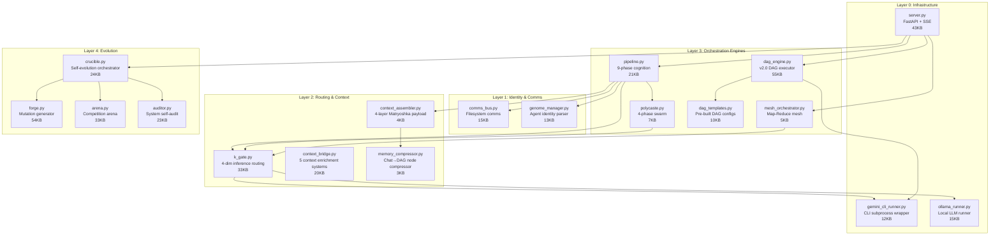
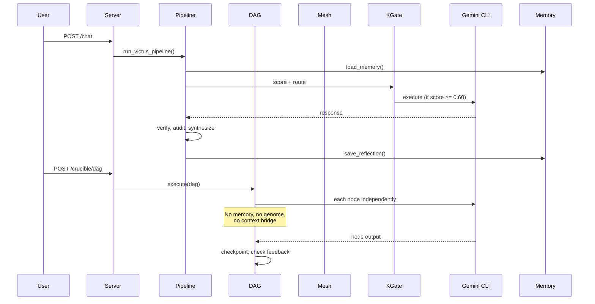

# Victus OS — Full Architecture Audit

## The Honest Answer to "How Does It All Connect?"

> [!WARNING]
> **There is no single overseer agent.** The system has multiple orchestration layers that operate independently. Some are deeply wired; others are completely disconnected from each other. This document maps what's real, what's connected, and what's not.

---

## System Map: 12 Core Modules



---

## Who Oversees What?

| Orchestrator | Scope | Agents It Manages | Context It Provides |
|---|---|---|---|
| **pipeline.py** | Single user request → 9-phase execution | Planner, Executor, Verifier, Auditor, Synthesizer, Reflector, Evolver | Memory, genome, comms, Matryoshka payload |
| **polycaste.py** | Post-synthesis refinement (Phases 3/4 of Pipeline) | Archivist, Researcher, Synthesizer, Adversarial Critic, Voice Transformer | Only the synthesized response + lessons |
| **mesh_orchestrator.py** | Massive document ingestion → Map-Reduce | N × Specialist agents, 1 × Context Weaver | Only the chunk text + objective string |
| **dag_engine.py** | Arbitrary graph topologies with parallelism | N × templated agents (Commander, Researcher, etc.) | Upstream node outputs only (no memory, no genome, no context bridge) |
| **crucible.py** | Self-evolution cycle | Auditor, Forge, Arena, Judge | Audit report → forge → compete |

> [!CAUTION]
> **None of these oversees the others.** There is no master scheduler that decides "use Pipeline for this, DAG for that, Mesh for the other." The server endpoints expose each one independently and the caller (Echo-Forge UI or API user) chooses which to invoke.

---

## How Agents Receive Context: The Real Picture

### Pipeline Agents (✅ Full Context)
The 9-phase pipeline is the **best-wired** system:
1. **Memory** → loads `reflections.jsonl`, `rules.json`, `knowledge.json`
2. **Genome** → loads agent identity from `.agent/genomes/*.genome.md`
3. **Comms** → reads agent statuses from `.agent/comms/status/`
4. **Matryoshka Payload** → 4-layer context assembly:
   - L1: Active conversation window
   - L2: X-Ray compressed history (via MemoryCompressor)
   - L3: Priority capsules (Aether-OS kernel, constitution)
   - L4: Background swarm (Polycaste history)
5. **Context Bridge** → 5 enrichment systems (project profile, task classification, dependency map, evolution tracking, resource analysis)

**Verdict:** Pipeline agents have the richest context of any subsystem.

### Polycaste Agents (⚠️ Partial Context)
The 4-phase swarm runs **inside** the Pipeline (Phase 7):
- Receives: the synthesized response + tone preference + lessons list
- **Does NOT** receive: memory, genome, comms, Matryoshka payload, or context bridge data
- Each agent (Archivist, Researcher, etc.) gets a single-purpose prompt with only the data it needs

**Verdict:** Deliberately narrow context by design — these are refinement agents.

### Mesh Agents (⚠️ Minimal Context)
Map-Reduce specialists:
- Receive: their chunk shard + the objective string
- **No** memory, genome, comms, or context bridge
- The Context Weaver synthesizer gets all specialist findings

**Verdict:** Intentionally stateless — each specialist is disposable.

### DAG Agents (❌ No Persistent Context)
This is the **biggest gap:**
- Each DAG node is a `gemini_cli_runner` subprocess call
- The node receives: its `system_prompt` + accumulated upstream outputs
- **No** memory loading, **no** genome, **no** comms bus, **no** context bridge, **no** Matryoshka
- Cross-DAG memory exists (SQLite store) but is only loaded at DAG start as a preamble — individual nodes don't query it

**Verdict:** DAG agents are effectively stateless CLI invocations. They get upstream context from the graph topology, but nothing from the persistent systems.

### Crucible/Evolution Agents (⚠️ Self-Contained)
- The Auditor reads source code directly (AST analysis)
- The LLM Forge gets audit report → generates mutations via Gemini CLI
- The Arena runs structural/semantic comparisons
- **None** of these use memory, genome, or comms

**Verdict:** Intentionally isolated — evolution operates on code structure, not conversation context.

---

## Critical Disconnections

### 1. DAG Engine ↔ Context Systems

```
dag_engine.py  ←✗→  context_assembler.py
dag_engine.py  ←✗→  context_bridge.py
dag_engine.py  ←✗→  genome_manager.py
dag_engine.py  ←✗→  comms_bus.py
dag_engine.py  ←✗→  pipeline.py (memory/rules)
```

The DAG Engine is the most powerful orchestrator but the **least contextualized**. Each node gets a system prompt and upstream output — nothing else.

### 2. Polycaste Bug (Line 95)

```python
# polycaste.py line 95 — references undefined variable
critic_prompt = f"...Draft: {synth_res.content}"
#                           ^^^^^^^^^ should be synth_text
```

The Adversarial Critic phase has a `NameError` bug — `synth_res` is never defined. It should reference `synth_text`.

### 3. No Unified Orchestrator

There is no component that:
- Receives a user request
- Decides whether it needs Pipeline, DAG, Mesh, or Crucible
- Routes accordingly
- Maintains a unified context across all subsystems

The server just exposes separate endpoints and the caller picks.

### 4. Memory Fragmentation

| Store | Location | Used By |
|---|---|---|
| Pipeline reflections | `memory/reflections.jsonl` | pipeline.py only |
| Pipeline rules | `memory/rules.json` | pipeline.py only |
| Pipeline knowledge | `memory/knowledge.json` | pipeline.py only |
| DAG checkpoints | `data/dag_checkpoints.db` | dag_engine.py only |
| DAG cross-memory | `data/dag_memory.db` | dag_engine.py only |
| Crucible evolution | `data/crucible.db` | crucible.py only |
| Evolution context | `data/evolution_context.json` | context_bridge.py only |
| Polycaste history | `polycaste_db.py` (SQLite) | polycaste.py + context_assembler.py |

**8 separate memory stores that never talk to each other.**

### 5. Temporal Agent Context

The DAG nodes and Mesh specialists are **temporal** (spawned, used, discarded) but they have:
- ❌ No session identity
- ❌ No memory of past runs (except DAG cross-memory preamble)
- ❌ No genome/personality loading
- ❌ No awareness of other running agents
- ❌ No comms bus integration for inter-agent messaging

---

## What's Actually Working Well

| Capability | Status | Evidence |
|---|---|---|
| K-Gate inference routing | ✅ Solid | 4-dim scoring, phase overrides, stats tracking |
| Pipeline 9-phase cognition | ✅ Complete | Full memory→plan→execute→verify→audit→synthesize→reflect→evolve |
| DAG v2.0 graph execution | ✅ Verified | 38/38 tests, 17 capabilities, checkpointing, dynamic mutation |
| Crucible evolution | ✅ Complete | Audit→forge→validate→compete→judge→promote with SQLite tracking |
| Comms Bus | ✅ Functional | Status files, messages, broadcasts, handoffs — all filesystem-based |
| Genome Manager | ✅ Functional | Parses callsign, rank, tools, rules, CVs from genome markdown |
| Context Assembler | ✅ Functional | 4-layer Matryoshka payload construction |
| Context Bridge | ✅ Functional | 5 enrichment systems, runs <200ms |
| Mesh Map-Reduce | ✅ Tested | Semaphore-limited parallel specialists + weaver synthesis |

---

## Gaps to Close (Priority Order)

### P0: DAG Agents Need Context

The DAG Engine is the most powerful orchestrator but its agents are blind. They need:
1. **Context preamble injection** — load memory, genome, comms at DAG start → inject into every node prompt
2. **Per-node memory queries** — nodes should be able to query DAG cross-memory for relevant prior findings
3. **Comms bus integration** — DAG executor should write agent statuses during execution

### P1: Unified Mission Controller

A meta-orchestrator that:
1. Receives the user request
2. Classifies: simple (Pipeline) vs. complex (DAG) vs. massive-context (Mesh)
3. Routes to the appropriate engine
4. Maintains unified context across all subsystems

### P2: Memory Unification

Consolidate the 8 memory stores into a unified knowledge layer:
- One SQLite database with typed memories
- Pipeline, DAG, Crucible, and Mesh all read/write to the same store
- Tagged by source system, run ID, agent role

### P3: Fix Polycaste Bug

`synth_res.content` → `synth_text` on line 95 of `polycaste.py`.

### P4: Genome Loading for Temporal Agents

DAG and Mesh agents should receive genome-like personality/constraints:
- The DAG template already has `system_prompt` per node
- Extend with genome loading so each node acts with defined identity

---

## Data Flow Summary


