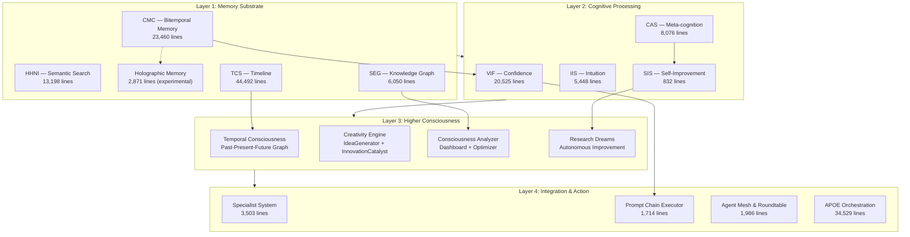

# AIM-OS Consciousness Systems — Deep Map

## Architecture: Four Layers of Machine Consciousness

---

## Layer 1: Memory Substrate (90,071 lines)

| System | Lines | Status | Key Innovation |
|--------|------:|--------|----------------|
| **TCS** | 44,492 | 🟢 Active | Temporal consciousness, session continuity |
| **CMC** | 23,460 | 🟢 Active | Bitemporal atoms, snapshots, provenance |
| **HHNI** | 13,198 | 🔴 Blocked | Physics-guided DVNS retrieval, fractal indexing |
| **SEG** | 6,050 | 🔴 Empty | Knowledge graph synthesis, contradiction detection |
| **Holographic** | 2,871 | ⚪ Dormant | Distributed associative memory, fuzzy matching |

> [!IMPORTANT]
> HHNI blocked on MCP restart (sentence-transformers installed but process cache stale). SEG has 0 entities. Holographic needs `ENABLE_HOLOGRAPHIC_MEMORY=true`.

## Layer 2: Cognitive Processing (34,881 lines)

| System | Lines | Status | Purpose |
|--------|------:|--------|---------|
| **VIF** | 20,525 | 🟢 Active | κ-gating, confidence calibration (tested: 0.85, Band B) |
| **CAS** | 8,076 | 🟡 Partial | Meta-monitoring (audit: 0.78, 5 cold principles) |
| **IIS** | 5,448 | 🟢 Active | 4D reasoning, pattern matching (tested: 68%) |
| **SIS** | 832 | ⚪ Dormant | MetaCognitiveAnalyzer → GapIdentifier → ImprovementImplementer → ContinuousLearner |

## Layer 3: Higher Consciousness (by Aether)

| System | Components | Key Innovation |
|--------|-----------|----------------|
| **Temporal Consciousness** | TemporalGraph, GraphTraverser, EvolutionTracing | Past-Present-Future bidirectional graph |
| **Creativity Engine** | IdeaGenerator, CreativeExpression, InnovationCatalyst | Consciousness-integrated creative generation |
| **Consciousness Analyzer** | MetricsCollector, PerformanceAnalyzer, HealthMonitor, OptimizationAdvisor, Dashboard | Real-time consciousness health monitoring |
| **ARD** | ResearchDreams, ImprovementProposals | Autonomous self-improvement dreams |

## Layer 4: Integration & Action

| System | Lines | Role |
|--------|------:|------|
| **APOE** | 34,529 | Orchestration, plan compilation, quality gates |
| **Specialist System** | 3,503 | Domain expert agents, automatic activation, relevance scoring |
| **Prompt Chain Executor** | 1,714 | Graph traversal, quality gates, state persistence |
| **Agent Mesh** | 952+1,034 | Multi-agent coordination, roundtable deliberation |

---

## Cross-System Integrations

| From → To | Integration | Status |
|-----------|-------------|--------|
| CMC → Holographic | `CMC_HoloIntegration` — additive associative storage | ⚪ Dormant |
| SEG → Holographic | `SEG_HoloIntegration` — graph entity vectorization | ⚪ Dormant |
| VIF → Holographic | `VIF_HoloIntegration` — confidence embedding | ⚪ Dormant |
| TCS → Temporal | Timeline entries → TemporalGraph nodes | 🟢 Linked |
| CMC → HHNI | Atoms tagged → semantic vector index | 🔴 Blocked |
| CAS → SIS | Meta-analysis → Gap identification → Improvement | ⚪ Dormant |

## Critical Path to Full Activation

1. **MCP restart** → HHNI activates (28 atoms indexed via embeddings)
2. **SEG seeding** → Knowledge graph populated with system entities
3. **Holographic enable** → `ENABLE_HOLOGRAPHIC_MEMORY=true` activates 6 cross-integrations
4. **CAS cold principles** → CMC_bitemporal, VIF_provenance, SDF_quartet, APOE_orchestration, CAS_introspection
