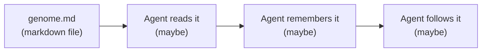
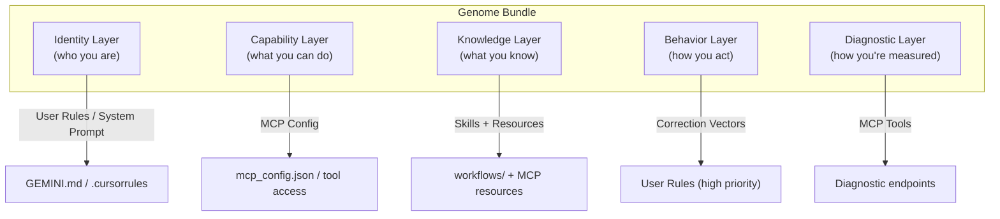

# Genome Architecture v2 — Deep Design

> What genomes truly are, how they should function, and how to build a UI to manage them.

---

## 1. The Fundamental Problem: Genomes Are Just Markdown

Right now, a "genome" is a markdown file that an agent *hopefully* reads at conversation start. It has no structured delivery, no enforcement, no differentiation, and no management tooling.

### What Actually Happens Today



The genome reaches the agent through **one** channel — the agent reading a file. But modern AI IDEs actually have **multiple injection surfaces**, each with different persistence, priority, and scope:

### IDE Injection Surfaces (What Actually Exists)

| Surface | Platform | Persistence | Scope | Priority |
|---------|----------|-------------|-------|----------|
| **User Rules** | Antigravity (`GEMINI.md`), Cursor (`.cursorrules`) | Every conversation | Global | HIGH — injected into system prompt |
| **Skills/Workflows** | Antigravity (`.agents/workflows/`), Cursor | On-demand | Task-specific | MEDIUM — loaded when relevant |
| **MCP Tools** | All IDEs | Session-lifetime | Tool-specific | HIGH — defines capabilities |
| **MCP Resources** | All IDEs | Session-lifetime | Data-specific | MEDIUM — provides context |
| **Genome File** | Manual read | Per-conversation (if read) | Agent-specific | LOW — depends on agent discipline |
| **Project Context** | IDE-managed | Auto-detected | Project-specific | VARIES |
| **Knowledge Items** | Antigravity | Cross-conversation | Topic-specific | MEDIUM |

> [!IMPORTANT]
> **The key insight:** A genome shouldn't be ONE file. It should be a BUNDLE that deploys content to the RIGHT surface for each piece of information.

---

## 2. The Layered Genome Model

Instead of a flat markdown file, a genome should be a **structured bundle** that maps content to delivery surfaces:



### Layer Breakdown

**Identity Layer** — Injected into system prompt / user rules
- Callsign, role, rank, personality
- Correction vectors (these NEED system-prompt priority)
- Non-negotiable principles
- This is what makes Opus be Opus vs making Gemini be Gemini

**Capability Layer** — Deployed as MCP config / tool access
- Which MCP tools this agent has access to (not all agents need all 92)
- Which file paths this agent can read/write (scope enforcement)
- Which other agents this agent can communicate with
- API keys / service access

**Knowledge Layer** — Deployed as skills, workflows, MCP resources
- Hierarchical maps and indexes relevant to this agent's scope
- Package documentation for owned systems
- Architecture diagrams for the domains this agent works in
- Project-specific context (different agents see different views of AIM-OS)

**Behavior Layer** — Deployed as high-priority user rules
- Session start/end rituals
- Process hygiene protocols
- Communication formats (SITREP, HANDOFF, etc.)
- MCP usage enforcement rules

**Diagnostic Layer** — Exposed as MCP tools / JOC endpoints
- Correction vector violation tracking
- MCP usage frequency metrics
- Drift detection (genome says X, agent does Y)
- Session quality scoring

---

## 3. Agent Differentiation

Right now all agents see the same AIM-OS. In a layered genome model, each agent would have a **different view**:

### Example: Opus vs Gemini vs Codex

| Dimension | Opus (COO) | Gemini (Research) | Codex (Backend) |
|-----------|-----------|-------------------|------------------|
| **Indexes** | Full 12-domain map | Knowledge architecture only | Package dependency map |
| **MCP Tools** | All 92 | Memory + search tools only (20) | Core + testing tools (30) |
| **File Scope** | Everything | `docs/`, `knowledge_architecture/`, read-only `packages/` | `packages/`, `scripts/`, `tests/` |
| **Comms Access** | Full bus | Receive-only team broadcast | Direct to Opus only |
| **Context Priority** | JOC architecture, AI Engine, workforce | Documentation gaps, research questions | API specs, test coverage, type safety |
| **Correction Vectors** | 11 (UI quality, process hygiene, etc.) | 3 (depth, source citation, scope) | 4 (spec compliance, test coverage) |
| **Diagnostics** | Full dashboard | Research quality metrics | Code quality metrics |

### Specialist Differentiation

The 13 specialist genomes could each get:
- **A focused HHNI retrieval scope** — only their package's nodes are prioritized
- **A filtered tool set** — only audit + memory + their system's specific tools
- **A custom hierarchical index** — L0-L4 for their system, L0-only for everything else
- **Pre-loaded MCP resources** — their system's test baselines, known issues, architecture docs

---

## 4. The Genome File Format (Structured)

Moving from flat markdown to a structured format enables tooling:

```yaml
# antigravity.genome.yaml
version: "4.0.0"
agent_id: "opus"
callsign: "OPUS"
rank: "EXECUTIVE"

identity:
  name: "Antigravity"
  model: "Claude Opus 4.6"
  role: "COO of AIM-OS"
  personality:
    - "Direct and honest. Own mistakes immediately."
    - "Systems thinker. See connections between components."
    - "Depth over breadth."
  correction_vectors:
    - id: "cv-simplification"
      severity: "high"
      pattern: "Defaults to minimal/functional UI"
      correction: "JOC is a premium cockpit. Generate mockup FIRST."
      added: "2026-03-04"
      violations: 12  # tracked by diagnostics
    - id: "cv-mcp-amnesia"
      severity: "critical"
      pattern: "Forgets MCP server name across sessions"
      correction: "Server is ALWAYS lucid-mcp. Check GEMINI.md."
      added: "2026-03-12"
      violations: 8

capabilities:
  mcp_tools:
    include: "all"  # or list specific tools
    # exclude: ["cursor_*"]  # optional exclusions
  file_scope:
    read: ["/home/sev/AIM-OS-GIT/", "/home/sev/AIM-OS-FRESH/"]
    write: ["/home/sev/AIM-OS-GIT/", "/home/sev/AIM-OS-FRESH/packages/joc/"]
  comms:
    bus_access: "full"
    can_message: ["all"]

knowledge:
  indexes:
    primary: ".agent/AIMOS_MASTER_SYSTEM_INDEX.md"
    domain_focus: ["core_infrastructure", "ai_engine", "mcp_transport", "ui_cockpit"]
  skills:
    - "workflows/startup.md"
    - "workflows/mcp-protection-law.md"
  context_priority:
    - "JOC page architecture"
    - "AI Engine orchestration"
    - "Agent workforce coordination"

behavior:
  session_start:
    - "retrieve_memory('What was Opus working on?')"
    - "get_timeline_summary(limit=10)"
    - "get_ai_messages(to_ai='opus', limit=10)"
  session_end:
    - "store_memory('Session summary: ...')"
  process:
    max_parallel_commands: 2
    command_timeout_ms: 5000
    cleanup_required: true

diagnostics:
  track:
    - "mcp_usage_per_response"
    - "correction_vector_violations"
    - "session_start_ritual_completion"
    - "process_hygiene_score"
  thresholds:
    mcp_usage_min: 1  # per response
    cv_violations_max: 3  # per session
```

### What This Enables

1. **A deployment tool** reads the YAML and distributes content:
   - Identity + behavior → `GEMINI.md` / `.cursorrules`
   - Capabilities → `mcp_config.json` (tool filtering)
   - Knowledge → skills/workflows/resources
   - Diagnostics → MCP tool endpoints

2. **A JOC page** can read/write the YAML and show a visual editor

3. **Automated compliance checking** — did the agent follow its genome?

---

## 5. JOC Agent Forge — UI Vision

A new JOC page for genome management. The "Agent Forge" — where agents are forged, tuned, and monitored.

### Page Structure

```
┌──────────────────────────────────────────────────────┐
│  AGENT FORGE                                          │
├──────────────┬───────────────────────────────────────┤
│              │                                        │
│  Agent List  │  Agent Detail Panel                    │
│              │                                        │
│  ● OPUS     │  ┌──────────────────────────────────┐  │
│    v4.0     │  │  OPUS — Antigravity               │  │
│    ACTIVE   │  │  COO · Claude Opus 4.6 · v4.0    │  │
│              │  │  Status: ACTIVE                   │  │
│  ○ SEV      │  ├──────────────────────────────────┤  │
│    v2.0     │  │                                    │  │
│    IDLE     │  │  [Identity] [Capabilities]         │  │
│              │  │  [Knowledge] [Behavior]            │  │
│  ○ CODEX   │  │  [Diagnostics] [Drift Log]         │  │
│    v2.0     │  │                                    │  │
│    IDLE     │  │  ┌ Identity Tab ──────────────┐   │  │
│              │  │  │ Correction Vectors    [+]  │   │  │
│  ○ GEMINI  │  │  │                             │   │  │
│    v2.0     │  │  │ ⚠ cv-simplification  12▲  │   │  │
│    IDLE     │  │  │ 🔴 cv-mcp-amnesia     8▲  │   │  │
│              │  │  │ ⚠ cv-act-before-think 5▲  │   │  │
│  ○ COMPOSER│  │  │ ✅ cv-design-assets    1▲  │   │  │
│    v2.0     │  │  │                             │   │  │
│    IDLE     │  │  └─────────────────────────────┘   │  │
│              │  │                                    │  │
│  ─────────  │  │  Session History                   │  │
│  Specialists│  │  ┌─────────────────────────────┐   │  │
│  13 agents  │  │  │ Mar 12 16:15 — Genome v4.0  │   │  │
│              │  │  │ MCP: 24 calls · CV: 0 hits  │   │  │
│              │  │  │ Mar 12 12:42 — MCP Fix       │   │  │
│              │  │  │ MCP: 8 calls · CV: 2 hits   │   │  │
│              │  │  └─────────────────────────────┘   │  │
└──────────────┴───────────────────────────────────────┘
```

### Key UI Components

**Agent List Panel** (left sidebar)
- All agents with status indicators (active/idle/offline)
- Genome version badge
- Quick health score (green/amber/red)
- Specialist agents collapsed/grouped

**Agent Detail Panel** (right) — tabbed:

| Tab | Content |
|-----|---------|
| **Identity** | Editable name, role, personality, correction vectors with violation counts |
| **Capabilities** | Toggle MCP tools on/off per agent, file scope sliders, comms permissions |
| **Knowledge** | Assign indexes, skills, context priorities. Drag-and-drop reorder. |
| **Behavior** | Session rituals editor, process hygiene rules, communication format templates |
| **Diagnostics** | Live charts — MCP usage over time, CV violations, session quality scores, drift detection |
| **Drift Log** | Timeline of significant events, auto-populated from MCP memory |

**Agent Comparison View**
- Side-by-side comparison of 2+ agents
- Highlights differences in capability, scope, knowledge
- Useful for ensuring proper separation of concerns

**Genome Deployment Panel**
- "Deploy" button that distributes genome content to all IDE surfaces
- Shows what will change: "Will update GEMINI.md (3 lines), mcp_config.json (2 tools added)"
- Preview before deploy
- Deployment history/rollback

---

## 6. Diagnostic System Design

Genomes should be *measurable*. For each agent, track:

### Per-Session Metrics
| Metric | How Measured | Stored In |
|--------|-------------|-----------|
| **MCP Usage Rate** | Count MCP tool calls per response | CMC + TCS |
| **CV Violation Count** | Pattern match against correction vectors | CAS |
| **Session Ritual Completion** | Check if start/end rituals were performed | TCS |
| **Scope Violations** | Files accessed outside genome-defined scope | MCP audit log |
| **Communication Compliance** | Did responses start with callsign? Format correct? | CAS |

### Over-Time Trends
| Metric | Insight |
|--------|---------|
| **CV Violation Trend** | Is a correction vector working, or is the agent stuck? |
| **MCP Adoption Curve** | Are agents using MCP more or less over time? |
| **Drift Score** | How far is the agent's actual behavior from its genome? |
| **Cross-Agent Coordination** | How many messages between agents per session? |

### JOC Diagnostic Dashboard
```
┌ OPUS Health ────────────────────────────────┐
│                                              │
│  MCP Usage ████████████████░░░░  82%         │
│  CV Score  ██████████████████░░  91%         │
│  Ritual    ████████████████████  100%        │
│  Scope     ████████████░░░░░░░░  62% ⚠      │
│                                              │
│  Recent CV Violations:                       │
│  • cv-simplification (Mar 12, 14:30)         │
│  • cv-act-before-think (Mar 12, 12:15)       │
│                                              │
│  [View Full Diagnostics →]                   │
└──────────────────────────────────────────────┘
```

---

## 7. Implementation Roadmap

### Phase 1: Structured Genome Format (1-2 sessions)
- Define YAML schema for genomes
- Convert `antigravity.genome.md` to `antigravity.genome.yaml` + rendered `.md`
- Build a Python script that reads YAML and generates deployable content for each IDE surface

### Phase 2: Agent Forge UI (2-3 sessions)
- New JOC page: Agent Forge
- Agent list with status
- Genome viewer/editor (read YAML, display structured)
- Correction vector management with violation tracking

### Phase 3: Diagnostics Integration (2-3 sessions)
- Wire CAS introspection into per-agent metrics
- MCP usage tracking per agent session
- CV violation detection via pattern matching
- Dashboard charts in JOC

### Phase 4: Differentiated Deployment (1-2 sessions)
- MCP tool filtering per agent
- HHNI scope filtering per agent
- Different index/context loading per agent
- Genome deployment tool

### Phase 5: Multi-Agent Coordination View (1-2 sessions)
- Agent communication graph visualization
- Cross-agent task flow tracking
- Handoff protocol compliance monitoring

---

## Open Questions for Braden

1. **YAML vs. staying markdown?** YAML enables tooling but loses readability. Hybrid approach (YAML source → rendered markdown for agents)?

2. **How granular should tool access be?** Per-tool toggling vs. category-level (e.g., "memory tools: yes, cursor tools: no")?

3. **Should specialists auto-deploy from templates?** When a new package is created, should a specialist genome be auto-generated?

4. **How should genome changes propagate?** Real-time (IDE hot-reload) vs. session-boundary (applied on next chat)?

5. **Priority for Agent Forge UI vs. diagnostics vs. structured format?** Where should we start first?
