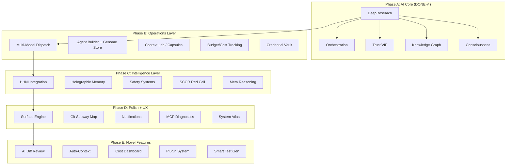

# Victus IDE — Master Integration Index & Architecture Audit

> **Status**: Full audit of 4 codebases across 231 components/modules/pages
> **Date**: March 14, 2026 — Session Audit

---

## 1. Inventory Summary

| Codebase | Items | Lines (est) | Key Domain |
|----------|-------|------------|------------|
| **Echo Forge** | 28 panels, 23 lib engines, 12 hooks, 4 drawers | ~15,000 | UI + client engines |
| **JOC (Jarvis)** | 26 pages, 8 stores, 6 engine files, 8 components | ~12,000 | Operations center + design system |
| **AIM-OS-GIT** | 69 packages | 44,000+ Python | Backend intelligence |
| **Victus Backend** | 20 modules | ~9,400 Python | Self-evolution engine |
| **TOTAL** | **231+ items** | **~80,000 lines** | |

---

## 2. Echo Forge — Full Component Index

### 2A. Core Lib Engines (23 modules)

> These are the **brain** of the system — runtime engines that power all UI panels.

| Engine | Lines | What It Does | Integration Priority |
|--------|-------|-------------|---------------------|
| [ai-kernel.ts](file:///home/sev/AIM-OS-FRESH/echo-forge-loop/src/lib/ai-kernel.ts) | 372 | AI-powered orchestration: plan→execute→verify loop with budget, checkpoints, reflection | 🔴 CRITICAL |
| [orchestration-kernel.ts](file:///home/sev/AIM-OS-FRESH/echo-forge-loop/src/lib/orchestration-kernel.ts) | 459 | Base orchestration: task queue, execution plans, snapshot replay | 🔴 CRITICAL |
| [vif.ts](file:///home/sev/AIM-OS-FRESH/echo-forge-loop/src/lib/vif.ts) | 313 | VIF: witness envelopes, κ-gating, ECE calibration, confidence bands | ✅ DONE (drawer) |
| [cas.ts](file:///home/sev/AIM-OS-FRESH/echo-forge-loop/src/lib/cas.ts) | 206 | CAS: cognitive monitoring, drift detection, failure modes, attention tracking | ✅ DONE (drawer) |
| [cmc.ts](file:///home/sev/AIM-OS-FRESH/echo-forge-loop/src/lib/cmc.ts) | 273 | CMC: bitemporal memory atoms, provenance tracking, snapshots | 🟡 HIGH |
| [seg.ts](file:///home/sev/AIM-OS-FRESH/echo-forge-loop/src/lib/seg.ts) | 356 | SEG: evidence graph, contradiction detection, Jaccard similarity | ✅ DONE (drawer) |
| [sdf-cvf.ts](file:///home/sev/AIM-OS-FRESH/echo-forge-loop/src/lib/sdf-cvf.ts) | 185 | SDF-CVF: quartet parity (code/docs/tests/traces), DORA metrics | 🟡 HIGH |
| [autonomy-governor.ts](file:///home/sev/AIM-OS-FRESH/echo-forge-loop/src/lib/autonomy-governor.ts) | 309 | Budget enforcement, risk policies, STOP handling, secrets redaction | 🔴 CRITICAL |
| [deep-research.ts](file:///home/sev/AIM-OS-FRESH/echo-forge-loop/src/lib/deep-research.ts) | 114 | Streaming research client: decompose→research→cross-ref→synthesize | ✅ DONE (tab) |
| [ai-service.ts](file:///home/sev/AIM-OS-FRESH/echo-forge-loop/src/lib/ai-service.ts) | — | AI inference abstraction: `callAIStep`, `callAIVerify`, `callAIJournal` | 🔴 CRITICAL |
| [ai-agents.ts](file:///home/sev/AIM-OS-FRESH/echo-forge-loop/src/lib/ai-agents.ts) | — | Agent definition + dispatch system | 🔴 CRITICAL |
| [context-manager.ts](file:///home/sev/AIM-OS-FRESH/echo-forge-loop/src/lib/context-manager.ts) | — | Context window management (capsules, banks) | 🟡 HIGH |
| [event-store.ts](file:///home/sev/AIM-OS-FRESH/echo-forge-loop/src/lib/event-store.ts) | — | Event sourcing: immutable event log | 🟡 HIGH |
| [task-queue.ts](file:///home/sev/AIM-OS-FRESH/echo-forge-loop/src/lib/task-queue.ts) | — | Priority task queue with dependencies | 🟡 HIGH |
| [journal.ts](file:///home/sev/AIM-OS-FRESH/echo-forge-loop/src/lib/journal.ts) | — | Structured execution journal | 🟢 MED |
| [verifier.ts](file:///home/sev/AIM-OS-FRESH/echo-forge-loop/src/lib/verifier.ts) | — | Output verification engine | 🟡 HIGH |
| [apoe.ts](file:///home/sev/AIM-OS-FRESH/echo-forge-loop/src/lib/apoe.ts) | — | APOE plan execution (plan→execute→verify→gate) | ✅ DONE (tab) |
| [test-harness.ts](file:///home/sev/AIM-OS-FRESH/echo-forge-loop/src/lib/test-harness.ts) | — | Test harness for AI output validation | 🟢 MED |
| [test-result-store.ts](file:///home/sev/AIM-OS-FRESH/echo-forge-loop/src/lib/test-result-store.ts) | — | Persistent test results | 🟢 MED |
| [persistence.ts](file:///home/sev/AIM-OS-FRESH/echo-forge-loop/src/lib/persistence.ts) | — | Local persistence adapter | 🟢 MED |
| [persistence-adapter.ts](file:///home/sev/AIM-OS-FRESH/echo-forge-loop/src/lib/persistence-adapter.ts) | — | Cloud persistence adapter | 🟢 MED |
| [persistence-adapter-local.ts](file:///home/sev/AIM-OS-FRESH/echo-forge-loop/src/lib/persistence-adapter-local.ts) | — | IndexedDB/localStorage adapter | 🟢 MED |
| [utils.ts](file:///home/sev/AIM-OS-FRESH/echo-forge-loop/src/lib/utils.ts) | — | Shared utilities | ⬜ UTIL |

### 2B. UI Panels (28 components)

| Component | Status | Integration |
|-----------|--------|-------------|
| [DeepResearchPanel](file:///home/sev/AIM-OS-FRESH/echo-forge-loop/src/components/DeepResearchPanel.tsx) | ✅ DONE | Bottom tab |
| [KnowledgeGraphPanel](file:///home/sev/AIM-OS-FRESH/echo-forge-loop/src/components/KnowledgeGraphPanel.tsx) | ✅ DONE | Right drawer |
| [ConsciousnessPanel](file:///home/sev/AIM-OS-FRESH/echo-forge-loop/src/components/ConsciousnessPanel.tsx) | ✅ DONE | Right drawer |
| [TrustPanel](file:///home/sev/AIM-OS-FRESH/echo-forge-loop/src/components/TrustPanel.tsx) | ✅ DONE | Right drawer |
| [OrchestrationPanel](file:///home/sev/AIM-OS-FRESH/echo-forge-loop/src/components/OrchestrationPanel.tsx) | ✅ DONE | Bottom tab |
| [EvolutionPanel](file:///home/sev/AIM-OS-FRESH/echo-forge-loop/src/components/EvolutionPanel.tsx) | 🔲 TODO | Bottom tab |
| [SwarmPanel](file:///home/sev/AIM-OS-FRESH/echo-forge-loop/src/components/SwarmPanel.tsx) | 🔲 TODO | Right drawer |
| [BudgetPanel](file:///home/sev/AIM-OS-FRESH/echo-forge-loop/src/components/BudgetPanel.tsx) | 🔲 TODO | Bottom tab |
| [CognitionPanel](file:///home/sev/AIM-OS-FRESH/echo-forge-loop/src/components/CognitionPanel.tsx) | 🔲 TODO | Right drawer |
| [PersonaControlPanel](file:///home/sev/AIM-OS-FRESH/echo-forge-loop/src/components/PersonaControlPanel.tsx) | 🔲 TODO | Right drawer |
| [RegressionDashboard](file:///home/sev/AIM-OS-FRESH/echo-forge-loop/src/components/RegressionDashboard.tsx) | 🔲 TODO | Bottom tab |
| [TestHarnessPanel](file:///home/sev/AIM-OS-FRESH/echo-forge-loop/src/components/TestHarnessPanel.tsx) | 🔲 TODO | Bottom tab |

### 2C. Agent Forge Panels (12 panels)

| Panel | Purpose | Priority |
|-------|---------|----------|
| [WarRoomPanel](file:///home/sev/AIM-OS-FRESH/echo-forge-loop/src/components/agent-forge/WarRoomPanel.tsx) | Strategic command center | 🟡 HIGH |
| [MissionBoardPanel](file:///home/sev/AIM-OS-FRESH/echo-forge-loop/src/components/agent-forge/MissionBoardPanel.tsx) | Mission tracking kanban | 🟡 HIGH |
| [MissionTimelinePanel](file:///home/sev/AIM-OS-FRESH/echo-forge-loop/src/components/agent-forge/MissionTimelinePanel.tsx) | Live MCP message timeline | 🟡 HIGH |
| [CommsNetworkPanel](file:///home/sev/AIM-OS-FRESH/echo-forge-loop/src/components/agent-forge/CommsNetworkPanel.tsx) | Agent communication graph | 🟢 MED |
| [CommsTerminalPanel](file:///home/sev/AIM-OS-FRESH/echo-forge-loop/src/components/agent-forge/CommsTerminalPanel.tsx) | Agent message terminal | 🟢 MED |
| [DiagnosticsDeckPanel](file:///home/sev/AIM-OS-FRESH/echo-forge-loop/src/components/agent-forge/DiagnosticsDeckPanel.tsx) | System diagnostics | 🟢 MED |
| [GenomeLabPanel](file:///home/sev/AIM-OS-FRESH/echo-forge-loop/src/components/agent-forge/GenomeLabPanel.tsx) | Genome editing lab | 🟡 HIGH |
| [CrucibleSwarmPanel](file:///home/sev/AIM-OS-FRESH/echo-forge-loop/src/components/agent-forge/CrucibleSwarmPanel.tsx) | Crucible swarm view | ✅ DONE |
| [ScopeMatrixPanel](file:///home/sev/AIM-OS-FRESH/echo-forge-loop/src/components/agent-forge/ScopeMatrixPanel.tsx) | Feature scope matrix | 🟢 MED |
| [TacticalOverviewPanel](file:///home/sev/AIM-OS-FRESH/echo-forge-loop/src/components/agent-forge/TacticalOverviewPanel.tsx) | Tactical system overview | 🟢 MED |
| [ToolArsenalPanel](file:///home/sev/AIM-OS-FRESH/echo-forge-loop/src/components/agent-forge/ToolArsenalPanel.tsx) | Available tools inventory | 🟢 MED |
| [ForcePulsePanel](file:///home/sev/AIM-OS-FRESH/echo-forge-loop/src/components/agent-forge/ForcePulsePanel.tsx) | Heartbeat monitor | 🔵 LOW |

### 2D. Hooks (12)

| Hook | Purpose | Priority |
|------|---------|----------|
| `use-ai-kernel.ts` | AI inference abstraction | 🔴 CRITICAL |
| `use-realtime-refresh.ts` | Live polling | 🟡 HIGH |
| `use-test-results.ts` | Test dashboard data | 🟢 MED |
| `use-victus-tests.ts` | Victus test data | 🟢 MED |
| `use-orchestration.ts` | APOE plan state | 🟡 HIGH |
| `use-mobile.tsx` | Mobile responsive | 🔵 LOW |
| `use-toast.ts` | Toast notifications | 🟢 MED |
| `use-code-analysis.ts` | Code analysis | 🟡 HIGH |
| `use-chat-stream.ts` | Chat streaming | 🟡 HIGH |
| `use-deep-research.ts` | Deep research hook | ✅ DONE |
| `use-session.ts` | Session management | 🟢 MED |
| `use-context-capsules.ts` | Context capsule operations | 🟡 HIGH |

### 2E. Drawers (4)

All wired: LiveFeedDrawer ✅, ChatDrawer ✅, RunHistoryDrawer ✅, VisualInspectorDrawer ✅

---

## 3. JOC (Jarvis) — Full Index

### 3A. Pages (26)

| Page | Lines | Purpose | Priority |
|------|-------|---------|----------|
| [DispatchPage](file:///home/sev/AIM-OS-FRESH/packages/joc/src/pages/DispatchPage.tsx) | 652 | **Multi-AI dispatch**: single, scatter, cascade, consensus, debate + Context Capsules | 🔴 CRITICAL |
| [AgentBuilderPage](file:///home/sev/AIM-OS-FRESH/packages/joc/src/pages/AgentBuilderPage.tsx) | 777 | **Agent genome editor**: BehavioralDNA, KnowledgeDNA, lineage, metrics | 🔴 CRITICAL |
| [ContextLabPage](file:///home/sev/AIM-OS-FRESH/packages/joc/src/pages/ContextLabPage.tsx) | 313 | Context capsule browser, fork/merge, generations | 🟡 HIGH |
| [MCPDiagnosticsPage](file:///home/sev/AIM-OS-FRESH/packages/joc/src/pages/MCPDiagnosticsPage.tsx) | — | MCP server health, tool listing, test execution | 🟡 HIGH |
| [DashboardPage](file:///home/sev/AIM-OS-FRESH/packages/joc/src/pages/DashboardPage.tsx) | — | JOC overview dashboard | 🟢 MED |
| [SessionPage](file:///home/sev/AIM-OS-FRESH/packages/joc/src/pages/SessionPage.tsx) | — | AI session management | 🟡 HIGH |
| [SessionHealthPage](file:///home/sev/AIM-OS-FRESH/packages/joc/src/pages/SessionHealthPage.tsx) | — | Session health monitoring | 🟡 HIGH |
| [AgentCommsPage](file:///home/sev/AIM-OS-FRESH/packages/joc/src/pages/AgentCommsPage.tsx) | — | Inter-agent communication | 🟡 HIGH |
| [AgentWorkforcePage](file:///home/sev/AIM-OS-FRESH/packages/joc/src/pages/AgentWorkforcePage.tsx) | — | Agent fleet overview | 🟡 HIGH |
| [InfraConsolePage](file:///home/sev/AIM-OS-FRESH/packages/joc/src/pages/InfraConsolePage.tsx) | — | Infrastructure monitoring | 🟢 MED |
| [ComputePage](file:///home/sev/AIM-OS-FRESH/packages/joc/src/pages/ComputePage.tsx) | — | GPU/compute resources | 🟢 MED |
| [GpuMonitorPage](file:///home/sev/AIM-OS-FRESH/packages/joc/src/pages/GpuMonitorPage.tsx) | — | GPU utilization charts | 🟢 MED |
| [MissionBuilderPage](file:///home/sev/AIM-OS-FRESH/packages/joc/src/pages/MissionBuilderPage.tsx) | — | Mission planning | 🟡 HIGH |
| [CliTerminalPage](file:///home/sev/AIM-OS-FRESH/packages/joc/src/pages/CliTerminalPage.tsx) | — | CLI terminal interface | 🟢 MED |
| [CredentialVaultPage](file:///home/sev/AIM-OS-FRESH/packages/joc/src/pages/CredentialVaultPage.tsx) | — | API key / secrets management | 🟡 HIGH |
| [StorageBrowserPage](file:///home/sev/AIM-OS-FRESH/packages/joc/src/pages/StorageBrowserPage.tsx) | — | File/storage explorer | 🟢 MED |
| [OraclePage](file:///home/sev/AIM-OS-FRESH/packages/joc/src/pages/OraclePage.tsx) | — | Predictive analytics | 🟢 MED |
| [SynthesizerPage](file:///home/sev/AIM-OS-FRESH/packages/joc/src/pages/SynthesizerPage.tsx) | — | Content synthesis | 🟢 MED |
| [ContextGraphPage](file:///home/sev/AIM-OS-FRESH/packages/joc/src/pages/ContextGraphPage.tsx) | — | Context visualization | 🟢 MED |
| [AutoContextPage](file:///home/sev/AIM-OS-FRESH/packages/joc/src/pages/AutoContextPage.tsx) | — | Auto context injection | 🟢 MED |
| [CalendarPage](file:///home/sev/AIM-OS-FRESH/packages/joc/src/pages/CalendarPage.tsx) | — | Calendar/scheduling | 🔵 LOW |
| [ProjectCatalogPage](file:///home/sev/AIM-OS-FRESH/packages/joc/src/pages/ProjectCatalogPage.tsx) | — | Projects browser | 🟢 MED |
| [ActivityLogPage](file:///home/sev/AIM-OS-FRESH/packages/joc/src/pages/ActivityLogPage.tsx) | — | Activity log | 🟢 MED |
| [SettingsPage](file:///home/sev/AIM-OS-FRESH/packages/joc/src/pages/SettingsPage.tsx) | — | Settings | 🔵 LOW |
| [WelcomePage](file:///home/sev/AIM-OS-FRESH/packages/joc/src/pages/WelcomePage.tsx) | — | Welcome/onboarding | 🔵 LOW |
| [SurfaceEngineDemo](file:///home/sev/AIM-OS-FRESH/packages/joc/src/pages/SurfaceEngineDemo.tsx) | — | Surface engine demo | 🔵 LOW |

### 3B. Stores (8)

| Store | Lines | Purpose | Priority |
|-------|-------|---------|----------|
| [agentGenomeStore](file:///home/sev/AIM-OS-FRESH/packages/joc/src/store/agentGenomeStore.ts) | 983 | **V3 Genome Spec**: BehavioralDNA, KnowledgeDNA, fission, tournaments, promotion gates, lineage | 🔴 CRITICAL |
| [jocStore](file:///home/sev/AIM-OS-FRESH/packages/joc/src/store/jocStore.ts) | 325 | Layout state: drawers, tabs, sessions, missions | 🟡 HIGH |
| [sessionStore](file:///home/sev/AIM-OS-FRESH/packages/joc/src/store/sessionStore.ts) | — | AI session lifecycle | 🟡 HIGH |
| [notificationStore](file:///home/sev/AIM-OS-FRESH/packages/joc/src/store/notificationStore.ts) | — | Toast/notification state | 🟢 MED |
| [oracleStore](file:///home/sev/AIM-OS-FRESH/packages/joc/src/store/oracleStore.ts) | — | Predictive analytics state | 🟢 MED |
| [vaultStore](file:///home/sev/AIM-OS-FRESH/packages/joc/src/store/vaultStore.ts) | — | Credential vault state | 🟡 HIGH |
| [calendarStore](file:///home/sev/AIM-OS-FRESH/packages/joc/src/store/calendarStore.ts) | — | Calendar state | 🔵 LOW |
| [panelRegistry](file:///home/sev/AIM-OS-FRESH/packages/joc/src/store/panelRegistry.ts) | — | Dynamic panel registry | 🟡 HIGH |

### 3C. Surface Engine (6 files)

| File | Purpose |
|------|---------|
| [surface-engine-core.ts](file:///home/sev/AIM-OS-FRESH/packages/joc/src/engine/surface-engine-core.ts) | 8 material presets, 4 shapes, GPU compositing |
| [surface-engine-css.ts](file:///home/sev/AIM-OS-FRESH/packages/joc/src/engine/surface-engine-css.ts) | CSS custom properties fallback |
| [surface-engine-materials.ts](file:///home/sev/AIM-OS-FRESH/packages/joc/src/engine/surface-engine-materials.ts) | Material definitions |
| [surface-engine-motion.ts](file:///home/sev/AIM-OS-FRESH/packages/joc/src/engine/surface-engine-motion.ts) | Animation/motion system |
| [surface-engine-webgpu.ts](file:///home/sev/AIM-OS-FRESH/packages/joc/src/engine/surface-engine-webgpu.ts) | WebGPU rendering |
| [webgpu.d.ts](file:///home/sev/AIM-OS-FRESH/packages/joc/src/engine/webgpu.d.ts) | WebGPU type declarations |

> **Priority**: 🟡 HIGH — Could become Victus IDE's visual identity

### 3D. Components (8)

| Component | Purpose | Priority |
|-----------|---------|----------|
| [CommandPalette](file:///home/sev/AIM-OS-FRESH/packages/joc/src/components/CommandPalette.tsx) | Enhanced command palette | 🟡 HIGH |
| [NotificationCenter](file:///home/sev/AIM-OS-FRESH/packages/joc/src/components/NotificationCenter.tsx) | Toast system | 🟢 MED |
| [KeyboardShortcutsOverlay](file:///home/sev/AIM-OS-FRESH/packages/joc/src/components/KeyboardShortcutsOverlay.tsx) | Shortcut help | 🟢 MED |
| [SystemAtlas](file:///home/sev/AIM-OS-FRESH/packages/joc/src/components/SystemAtlas.tsx) | System topology | 🟡 HIGH |
| [GitSubwayMap](file:///home/sev/AIM-OS-FRESH/packages/joc/src/components/GitSubwayMap.tsx) | Subway-style git graph | 🟡 HIGH |
| [GitTimelineV2](file:///home/sev/AIM-OS-FRESH/packages/joc/src/components/GitTimelineV2.tsx) | Git timeline | 🟡 HIGH |
| [CodeEditor](file:///home/sev/AIM-OS-FRESH/packages/joc/src/components/CodeEditor.tsx) | Code editor wrapper | 🟢 MED |
| [AgentCommsDrawer](file:///home/sev/AIM-OS-FRESH/packages/joc/src/components/AgentCommsDrawer.tsx) | Agent chat drawer | 🟡 HIGH |

---

## 4. AIM-OS-GIT Backend — Key Packages

### 4A. Core Intelligence Stack (44,000+ lines Python)

| Package | Lines | Purpose | Victus Integration |
|---------|-------|---------|-------------------|
| [apoe](file:///home/sev/AIM-OS-GIT/packages/apoe) | 12,551 | **APOE Protocol**: plan→execute→verify→gate pipeline | Backend bridge for orchestration tab |
| [vif](file:///home/sev/AIM-OS-GIT/packages/vif) | 7,392 | **VIF**: cross-model witnesses, HHNI + CMC integration, replay | Backend for TrustPanel |
| [hhni](file:///home/sev/AIM-OS-GIT/packages/hhni) | 5,742 | **HHNI**: hierarchical index, semantic blocks, vector search | Context system — **gap in Victus** |
| [sdfcvf](file:///home/sev/AIM-OS-GIT/packages/sdfcvf) | 5,121 | **SDF-CVF**: callgraph analysis, quartet parity, DORA metrics | Code quality tracking |
| [safety_systems](file:///home/sev/AIM-OS-GIT/packages/safety_systems) | 3,308 | Safety orchestrator, line removal detection, protocol education | 🔴 Security integration |
| [cas](file:///home/sev/AIM-OS-GIT/packages/cas) | 3,289 | CAS: failure modes, introspection, MCP integration | Backend for ConsciousnessPanel |
| [seg](file:///home/sev/AIM-OS-GIT/packages/seg) | 2,602 | SEG: evidence nodes, HHNI + VIF + CMC integration | Backend for KnowledgeGraph |
| [consciousness_analyzer](file:///home/sev/AIM-OS-GIT/packages/consciousness_analyzer) | 2,143 | Performance analyzer, optimization advisor | System intelligence |
| [holographic_memory](file:///home/sev/AIM-OS-GIT/packages/holographic_memory) | 1,594 | Vector-based holographic memory with CMC integration | Long-term memory |
| [deepsearch](file:///home/sev/AIM-OS-GIT/packages/deepsearch) | 907 | Web crawler, trust scorer, master index | Backend for DeepResearch |
| [scor](file:///home/sev/AIM-OS-GIT/packages/scor) | — | SCOR: red cell probes, adversarial testing | Security testing |

### 4B. Infrastructure Packages

| Package | Purpose |
|---------|---------|
| `apoe_runner` | APOE CLI executor |
| `llm_client` | LLM inference abstraction |
| `lucid_mcp_server` | MCP server implementation |
| `prompt_chain_executor` | Prompt chain orchestration |
| `router` + `router_api_server` | Request routing |
| `mcp_rag_proxy` | RAG via MCP |
| `browser-automation-service` | Browser automation |
| `api_service_registry` | Service discovery |
| `context_bootloader` | Context initialization |

### 4C. Intelligence Research Packages

| Package | Purpose |
|---------|---------|
| `quaternion_kernel` + `quaternion_math` | Quaternion-based computation |
| `consciousness_creativity_engine` | Creative generation |
| `consciousness_error_learning` | Error-driven learning |
| `consciousness_learning_engine` | Continuous learning |
| `consciousness_optimization_detector` | Pattern optimization |
| `intuitive_intelligence_system` | Intuitive reasoning |
| `meta_optimizer` + `meta_reasoning` | Meta-cognitive optimization |
| `temporal_consciousness` | Time-aware cognition |
| `igodn` | Intelligence Growth & Optimization |
| `capability_awareness` | Self-capability assessment |

---

## 5. Victus Backend — Complete Module Index

| Module | Lines | Purpose | Frontend Link |
|--------|-------|---------|---------------|
| [forge.py](file:///home/sev/operation-victus/victus/forge.py) | — | 11 AST mutation patterns + LLMForge | Crucible tab |
| [arena.py](file:///home/sev/operation-victus/victus/arena.py) | — | 5-dimension competition (CodeAnalyzer + Welch-t) | Crucible tab |
| [swarm.py](file:///home/sev/operation-victus/victus/swarm.py) | — | 5-agent parallel orchestration | Crucible tab |
| [k_gate.py](file:///home/sev/operation-victus/victus/k_gate.py) | — | LLM-graded code quality gate | Security tab |
| [pipeline.py](file:///home/sev/operation-victus/victus/pipeline.py) | — | Full evolution pipeline (forge→arena→promote) | Evolution sidebar |
| [context_bridge.py](file:///home/sev/operation-victus/victus/context_bridge.py) | — | 5-system context aggregator | AI Generate tab |
| [resource_builder.py](file:///home/sev/operation-victus/victus/resource_builder.py) | — | Codebase profiler + smell clusters | Diagnostics tab |
| [auditor.py](file:///home/sev/operation-victus/victus/auditor.py) | — | Code health scoring | Status bar |
| [server.py](file:///home/sev/operation-victus/victus/server.py) | — | FastAPI server (port 5099) | All tabs |
| [genome_manager.py](file:///home/sev/operation-victus/victus/genome_manager.py) | — | Code genome tracking | Evolution sidebar |
| [comms_bus.py](file:///home/sev/operation-victus/victus/comms_bus.py) | — | Inter-module communications | System bridge |
| [os_layer.py](file:///home/sev/operation-victus/victus/os_layer.py) | — | OS abstraction layer | Terminal tab |

---

## 6. Gap Analysis & New Feature Ideas

### 🔴 Critical Gaps (Nothing Like This Exists Yet)

| Gap | Description | Proposed Solution |
|-----|-------------|-------------------|
| **Multi-Model Dispatch** | No way to send prompts to multiple AIs simultaneously | Port JOC's DispatchPage: scatter/cascade/consensus/debate modes |
| **Agent Builder** | Can't create/edit agent genomes inside the IDE | Port JOC's AgentBuilderPage + agentGenomeStore |
| **Unified AI Chat** | Right drawer chat is basic placeholder | Build proper ChatDrawer with streaming, multi-provider, thread history |
| **Budget/Cost Tracking** | No visibility into token usage/costs | Wire AutonomyGovernor + BudgetPanel |
| **Context Capsules** | No context management system in Victus | Port ContextLabPage + context-manager.ts |
| **Credential Vault** | API keys hardcoded or env vars only | Port CredentialVaultPage + vaultStore |
| **MCP Diagnostics** | No way to debug MCP connections from within IDE | Port MCPDiagnosticsPage |

### 🟡 Enhancement Opportunities

| Enhancement | Description | Implementation |
|-------------|-------------|----------------|
| **Git Integration** | No git UI in the IDE | Port GitSubwayMap + GitTimelineV2 — show in sidebar |
| **System Atlas** | No topology visualization | Port SystemAtlas — show how all components connect |
| **Regression Tracking** | Tests run but no history | Wire RegressionDashboard + test-result-store.ts |
| **Notification System** | No toasts or alerts | Port NotificationCenter + notificationStore |
| **Persona Switching** | Can't switch AI behavior modes | Port PersonaControlPanel — bottom tab or drawer |
| **Mission Board** | No kanban for tracking work | Port MissionBoardPanel — new sidebar tab |
| **DORA Metrics** | No deployment health dashboard | Wire SDF-CVF tracker into a new status pill or panel |

### 🔵 My Proposed New Features (Not In Any Codebase)

| Feature | Description | Why |
|---------|-------------|-----|
| **Live Collaboration** | WebSocket-based multi-cursor editing (like Google Docs) | Differentiator from Cursor/Bolt |
| **AI Diff Review** | Side-by-side diff view with AI-generated explanations for each change | Every IDE lacks this |
| **Auto-Context Injection** | Automatically detect which files/functions are relevant and inject into AI context | Currently manual in Cursor |
| **Code Timeline** | Visual timeline showing how each function evolved over git history | GitHub doesn't show this well |
| **Smart Test Generator** | One-click test generation from selected function, using Crucible patterns | Novel combination |
| **Cost Dashboard** | Real-time token cost tracking per AI provider with budget alerts | Enterprise essential |
| **Plugin System** | Allow users to add custom panels/drawers via a plugin API | Extensibility like VS Code |
| **Offline Mode** | Full local-only operation with Ollama | Critical for air-gapped environments |
| **Voice Commands** | Voice-activated IDE commands and AI interactions | Accessibility + power user |
| **AI Pair Review** | AI reviews your code changes before commit, like a senior engineer | Beyond simple linting |

---

## 7. Recommended Integration Phases



### Priority Score Matrix

| Component | Value (1-5) | Complexity (1-5) | Dependencies | Score |
|-----------|-------------|-------------------|-------------|-------|
| Multi-Model Dispatch | 5 | 3 | ai-service, context-manager | **12** |
| Agent Builder | 5 | 4 | agentGenomeStore | **11** |
| Budget/Cost Tracking | 4 | 2 | autonomy-governor | **10** |
| Context Lab | 4 | 3 | context-manager, capsules | **9** |
| Credential Vault | 4 | 2 | vaultStore | **9** |
| Git UI | 3 | 2 | none | **8** |
| MCP Diagnostics | 3 | 2 | lucid-mcp | **8** |
| Surface Engine | 3 | 4 | WebGPU | **7** |
| System Atlas | 3 | 3 | topology data | **7** |
| HHNI Integration | 4 | 5 | hhni package | **7** |

---

## 8. Architecture Principles

> [!IMPORTANT]
> **Key Insight**: The codebase has a "triad architecture" — Echo Forge provides the **client engines/UI**, JOC provides the **operations layer/stores**, and AIM-OS-GIT provides the **backend intelligence**. Victus should be the **unified surface** that bridges all three.

### Integration Pattern
```
Victus IDE (unified UI)
    ↓ imports UI components from Echo Forge
    ↓ imports stores from JOC
    ↓ calls backends from Victus server + AIM-OS APIs
```

### Data Flow
```
User Action → Victus IDE → lib engine (EF) → store (JOC) → API call → backend (AIM-OS/Victus)
                                                                        ↓
                                                                    VIF witness → SEG node → CMC atom
```
