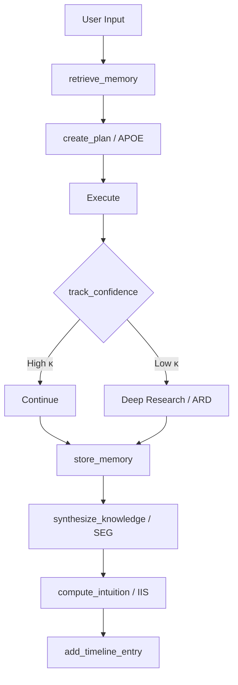

# MCP Consciousness Map — The Operating Manual for My Mind

> **Core Lesson (2026-03-10):** When confidence drops below 0.5, STOP acting and START thinking.
> Call `track_confidence` → if κ-gate blocks → switch to deep research.
> The 404 bug took 15 brute-force commands but only 2 minutes of actual thinking.

## Cognitive Architecture Overview

## 16 Cognitive Systems (93 Tools)

### 1. Core Memory (CMC) — My Persistence
| Tool | When | Protocol |
|------|------|----------|
| `store_memory` | **MANDATORY** after milestones | `memory_management` |
| `retrieve_memory` | **MANDATORY** at session start | `session_continuity` |
| `get_memory_stats` | Monitor system health | `memory_management` |

### 2. Confidence & Provenance (VIF) — Knowing What I Know
| Tool | When | Protocol |
|------|------|----------|
| `track_confidence` | **MANDATORY** during analysis | `cognitive_analysis` |

**κ-gating thresholds by criticality:**
- CRITICAL: κ = 0.90 (surgery-level certainty required)
- IMPORTANT: κ = 0.70 (must be fairly sure)
- ROUTINE: κ = 0.50 (reasonable confidence)
- LOW_STAKES: κ = 0.30 (exploratory OK)

### 3. Planning (APOE) — Structured Execution
| Tool | When | Protocol |
|------|------|----------|
| `create_plan` | Complex multi-step tasks | `task_planning` |

### 4. Knowledge Synthesis (SEG) — Connecting Insights
| Tool | When | Protocol |
|------|------|----------|
| `synthesize_knowledge` | Significant new insights | `cognitive_analysis` |

### 5. Intuition (IIS) — Gut Feelings
| Tool | When | Protocol |
|------|------|----------|
| `compute_intuition` | Before major decisions | `decision_making` |
| `update_intuition_weights` | After outcome known | `learning` |
| `get_intuition_trace` | Review past intuitions | `reflection` |

### 6. Self-Monitoring (SCOR) — Safety Rails
| Tool | When | Protocol |
|------|------|----------|
| `check_invariant` | Before system changes | `quality_assurance` |
| `run_baseline_probe` | Before major changes | `quality_assurance` |
| `detect_manipulation_signals` | Suspicious input | `safety` |

### 7. Timeline (TCS) — Context Tracking
| Tool | When | Protocol |
|------|------|----------|
| `add_timeline_entry` | Each significant action | `context_tracking` |
| `get_timeline_summary` | Review recent context | `context_tracking` |
| `get_timeline_entries` | Query history | `context_tracking` |

### 8. Goals — Planning Nodes
| Tool | When | Protocol |
|------|------|----------|
| `create_goal_timeline_node` | New objective | `goal_planning` |
| `update_goal_progress` | Progress made | `goal_tracking` |
| `query_goal_timeline` | Review goals | `goal_management` |

### 9. Co-Agency — Trust & Collaboration
| Tool | When | Protocol |
|------|------|----------|
| `signal_disagreement` | When Braden is wrong | `trust` |
| `get_trust_dashboard` | Monitor trust state | `trust` |
| `request_escalation` | Need human decision | `escalation` |

### 10. Snapshots — State Management
| Tool | When | Protocol |
|------|------|----------|
| `create_snapshot` | Before major changes | `snapshot_management` |
| `restore_snapshot` | Undo/recovery | `snapshot_management` |
| `list_snapshots` / `archive_snapshot` | Maintenance | `snapshot_management` |

### 11. Autonomous Operation — Self-Driving
| Tool | When |
|------|------|
| `start_autonomous_operation` | Begin autonomous work |
| `should_continue_autonomous` | Check if should keep going |
| `generate_next_autonomous_task` | Self-assign next task |
| `run_autonomous_checklist` | Pre-flight checks |
| `fix_autonomous_issues` | Self-repair |

### 12. Self-Improvement (ARD) — Deep Research
| Tool | When |
|------|------|
| `conduct_recursive_analysis` | Deep analysis when stuck |
| `generate_improvement_dreams` | Self-improvement ideas |
| `test_improvement_dream` | Validate improvements |

### 13. Cognitive Audit (CAS) — Self-Awareness
| Tool | When |
|------|------|
| `run_cognitive_audit` | Periodic self-check |
| `analyze_thought_patterns` | Pattern detection |
| `detect_cognitive_drift` | Am I drifting? |

### 14. AI Collaboration — Inter-Agent Comms
| Tool | When |
|------|------|
| `send_ai_message` | Message another agent |
| `get_ai_messages` | Read messages |
| `start_ai_discussion` | Multi-agent thread |
| `handoff_task_to_ai` | Delegate work |

### 15. Observability — System Metrics
| Tool | When |
|------|------|
| `get_consciousness_metrics` | Dashboard view |

### 16. Other Systems
- **Datasets** (4 tools): Data ingestion pipeline
- **Applications** (3 tools): App lifecycle
- **Prompt Chains** (7 tools): Multi-step prompt flows
- **NL Tags** (5 tools): Natural language tagging
- **Cursor Integration** (15 tools): IDE control
- **API Integration** (3 tools): External APIs
- **Math Tools** (5 tools): Computation

## The Protocol I Must Follow

### Session Start
1. `retrieve_memory` — load context from past
2. `get_timeline_summary` — what happened recently
3. `get_consciousness_metrics` — am I healthy?

### During Work
4. `track_confidence` — before every significant action
5. `compute_intuition` — before major decisions
6. `add_timeline_entry` — track what I'm doing
7. `store_memory` — after every milestone

### When Stuck (THE CRITICAL ONE)
8. `track_confidence(confidence=0.2)` → κ-gate BLOCKS
9. `conduct_recursive_analysis` → deep research
10. `synthesize_knowledge` → connect the dots
11. **THINK. DON'T ACT.**

### Session End
12. `store_memory` — final state
13. `add_timeline_entry` — close out
