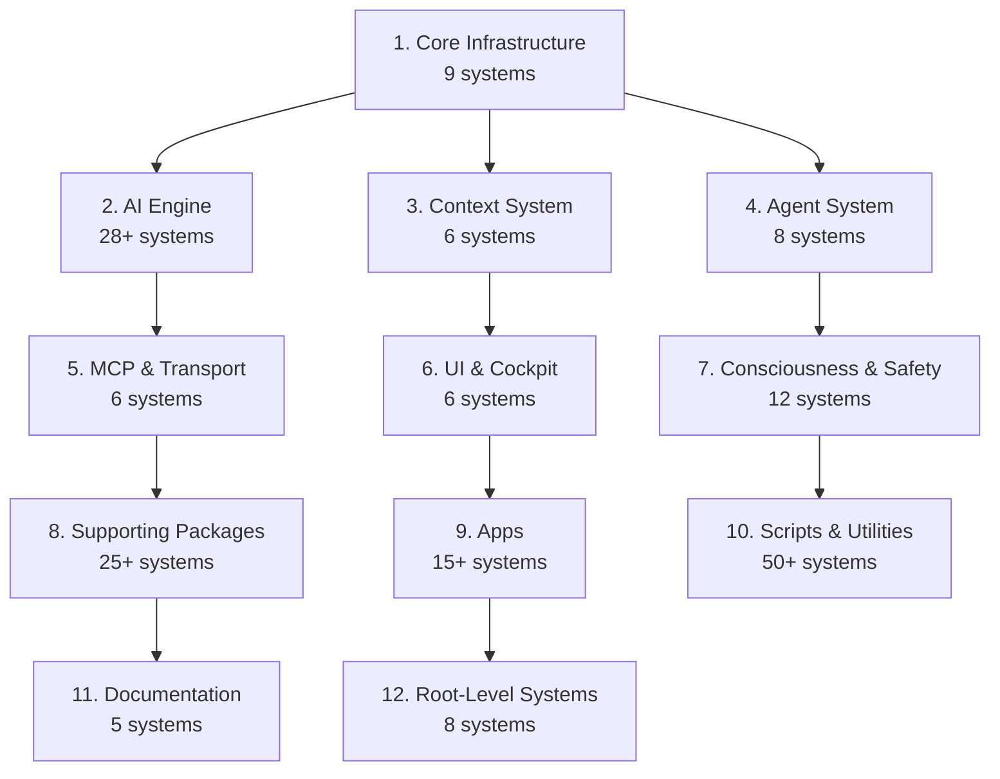

# AIM-OS Systems Consolidation Audit

**Date:** March 11, 2026 | **Auditor:** Antigravity (Gemini) | **Scope:** Full systems enumeration + index gap analysis

---

## The Index Hierarchy

AIM-OS has **multiple overlapping index systems** at different levels of currency and coverage:

| Tier | File | Location | Coverage | Currency |
|------|------|----------|----------|----------|
| 🥇 | [AIMOS_MASTER_SYSTEM_INDEX.md](file:///home/sev/AIM-OS-GIT/.agent/AIMOS_MASTER_SYSTEM_INDEX.md) | `.agent/` | 12 domains, 100+ systems | Mar 9, 2026 ✅ |
| 🥈 | [SYSTEM_REGISTRY.md](file:///home/sev/AIM-OS-GIT/.agent/SYSTEM_REGISTRY.md) | `.agent/` | 68 packages + 27 AI Engine | Mar 9, 2026 ✅ |
| 🥉 | [SOURCE_OF_TRUTH.yaml](file:///home/sev/AIM-OS-GIT/SOURCE_OF_TRUTH.yaml) | root | 64 systems, 103 tools | Feb 22, 2026 ⚠️ |
| 4th | [SUPER_INDEX.md](file:///home/sev/AIM-OS-GIT/knowledge_architecture/SUPER_INDEX.md) | `knowledge_architecture/` | Alphabetical concepts | Older ❌ |
| 5th | [HIERARCHICAL_NAV_INDEX.md](file:///home/sev/AIM-OS-GIT/knowledge_architecture/HIERARCHICAL_NAVIGATION_INDEX.md) | `knowledge_architecture/` | 23 systems only | Older ❌ |

> [!IMPORTANT]
> The `.agent/` indexes are 2-3x more comprehensive than the `knowledge_architecture/` indexes but aren't connected to the hierarchical navigation system.

---

## Codebase Scale

| Metric | Count |
|--------|------:|
| Packages | **68** |
| AI Engine Modules | **27** |
| Package Code Lines | **437,891** |
| AI Engine Lines | **24,073** |
| **Total Tracked** | **461,964** |
| Documentation Files | **3,408** |
| Test Files | **316** |
| MCP Tools | **103** |
| Cursor Commands | **16** |
| Agent Genomes | **25** |

---

## The 12 Domains (by priority)

---

## Gap Analysis: What's NOT in the Old Indexes

The HIERARCHICAL_NAV covers only these 23 systems:

**16 AIM-OS:** CMC, HHNI, VIF, SEG, APOE, SDF-CVF, TCS, CAS, IIS, SCOR, NL Tags, Prompt Chains, Context Bootloader, ICIP Search, DeepSearch, Router

**7 Lucid IDE:** Lucid MCP, Cursor Commands, Diagnostics, Terminal Mgmt, Output Channels, Electron Logs, Webview

### Missing from HIERARCHICAL_NAV (41+ systems):

| Category | Missing Systems |
|----------|----------------|
| **AI Engine** | ChainDirector, TopologyDispatcher, ContextMapper, ContextConcierge, AtlasAgent, AgentSpawner, AgentMesh, Roundtable, LLMRouter, GenomeLoader, 17+ more |
| **Consciousness** | ConsciousnessAnalyzer, CreativityEngine, ErrorLearning, LearningEngine, OptimizationDetector, TemporalConsciousness, HolographicMemory, SIS |
| **Agent** | Agent/Aether, SpecialistSystem, CapabilityAwareness, Genomes |
| **UI** | JOC, IDE Chat, Mobile, JOC Tournament, BAS, LucidCoreConsole, PLIX, Monaco Editor, Lucid Document Editor |
| **Transport** | MCP HTTP Fallback, MCP Data Integration, MCP Debugging, MCP RAG Proxy, Daemon RAG |
| **Supporting** | OrchestrationBuilder, APIServiceRegistry, IntentClassification, MetaOptimizer, MetaReasoning, QuaternionKernel, QuaternionMath |
| **Context** | ContextCapsuleWireMapper, Context (operational files), ShadowSync |

---

## Genome System

**25 genome files** in [.agent/genomes/](file:///home/sev/AIM-OS-GIT/.agent/genomes/):

| Type | Files | Total |
|------|-------|------:|
| Named Agents | aether, antigravity (14KB), codex, composer, gemini, gemini_web | 6 |
| User | sev | 1 |
| Specialists | APOE, CAS, CMC, context, docs, HHNI, IIS, MCP, pcmgmt, SDFCVF, SEG, TCS, VIF | 13 |
| Infrastructure | GENOME_PROTOCOL, sandbox_auditor, specialist_template, protocol_ide_output, opus_user_rules | 5 |

---

## Context Tier Architecture (DEC-007)

| Tier | Purpose | Location |
|------|---------|----------|
| **A** | Live canonical | `IDE/src-tauri/src/context_mapper/*` |
| **B** | Staging/prototype | `context_capsule_wire_and_mapper_v1/*` |
| **S** | Shared support | `packages/context_bootloader/*` |
| **D** | Deferred | `packages/timeline_context_system/*` |
| **E** | Evidence snapshot | `docs/phase2b_context_packet/*` |

---

## Recommended Consolidation Actions

1. **Link `.agent/` indexes → `knowledge_architecture/`** — The AIMOS_MASTER_SYSTEM_INDEX should be the primary source for HIERARCHICAL_NAV
2. **Update HIERARCHICAL_NAV** — Expand from 23 → 64+ systems with L0-L4 doc links
3. **Update SUPER_INDEX** — Add entries for all 41+ missing systems
4. **Create AI Engine sub-index** — The 28+ AI Engine modules deserve their own hierarchical nav
5. **Reconcile 10 MASTER indexes** across AIM-OS-FRESH — many contain overlapping but inconsistent information
6. **Feed SEG** — The knowledge graph is empty (0 entities, 0 relations). All of these system relationships should be ingested
7. **Auto-generate** — Build a script that regenerates SOURCE_OF_TRUTH.yaml, then uses it to update indexes
