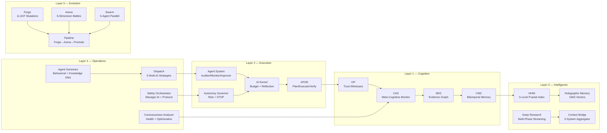
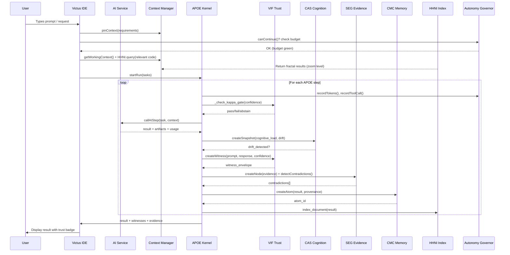

# Victus IDE — Deep Strategic Architecture Analysis

> **Scope**: Exhaustive audit of 231+ items across 4 codebases (~80,000 lines)
> **Date**: March 14, 2026

---

## 1. The Core Insight: What We Actually Have

After studying every major module, the picture is clear. We don't have _one_ system — we have **five interlocking systems** that, when unified, create something no existing IDE has:

> [!IMPORTANT]
> **The key realization**: No IDE on the market has an integrated cognition layer. Cursor, Bolt, Lovable — they all treat AI as a black box you talk to. We have the infrastructure to make AI operations **visible, auditable, and trustworthy**.

---

## 2. Competitive Landscape — Where Victus Fits

### 2A. Current Market Map

| Product | Code Editing | AI Chat | Multi-Model | Agent Orchestration | Trust/Audit | Context Mgmt | Self-Evolution |
|---------|:---:|:---:|:---:|:---:|:---:|:---:|:---:|
| **VS Code** | ✅ | via extension | 🔲 | 🔲 | 🔲 | 🔲 | 🔲 |
| **Cursor** | ✅ | ✅ | 🔲 | 🔲 | 🔲 | partial | 🔲 |
| **Bolt.new** | ✅ | ✅ | 🔲 | 🔲 | 🔲 | 🔲 | 🔲 |
| **Lovable** | ✅ | ✅ | 🔲 | 🔲 | 🔲 | 🔲 | 🔲 |
| **Base44** | ✅ | ✅ | 🔲 | 🔲 | 🔲 | 🔲 | 🔲 |
| **Windsurf** | ✅ | ✅ | 🔲 | partial | 🔲 | partial | 🔲 |
| **Devin** | minimal | ✅ | 🔲 | ✅ | 🔲 | 🔲 | 🔲 |
| **OpenHands** | ✅ | ✅ | 🔲 | ✅ | 🔲 | 🔲 | 🔲 |
| **Victus** | ✅ | ✅ | **✅** | **✅** | **✅** | **✅** | **✅** |

### 2B. Our Unfair Advantages

1. **VIF Trust Layer** — No competitor can prove their AI outputs are trustworthy. Our κ-gating + witness envelopes + ECE calibration is enterprise-grade.
2. **Multi-Model Dispatch** — 5 strategies (single/scatter/cascade/consensus/debate). Cursor only talks to one model at a time.
3. **HHNI Fractal Retrieval** — 5-level zoom (SYSTEM→SENTENCE) beats RAG. Cursor's context is flat token windows.
4. **Self-Evolution** — Forge→Arena→Promote pipeline. Literally no IDE evolves its own code quality.
5. **Cognitive Monitoring** — CAS tracks drift, attention, and failure modes. No IDE does introspection.
6. **Event Sourcing** — Hash-chained tamper-evident event log. Full replay from any snapshot.
7. **Agent Genome System** — BehavioralDNA + KnowledgeDNA + fission + tournaments. This is agent R&D infrastructure.

---

## 3. The Five Evolutionary Branches

Each branch represents a distinct path for Victus. We can (and should) pursue them in parallel, but the **order** matters.

### Branch A: "The Lovable Killer" (App Builder IDE)
> _MVP: A user opens Victus, describes an app, and it builds + deploys it._

**What it needs from our systems:**
- ✅ Monaco editor (done)
- ✅ Terminal (done)
- ✅ File explorer (done)
- 🔲 AI Chat → streaming chat with code insertion
- 🔲 Multi-Model routing → best model per task
- 🔲 One-click deploy → Vercel/Netlify/Docker
- 🔲 Preview pane → live preview of built app

**From our codebases:**

| System | Relevance | Notes |
|--------|-----------|-------|
| Deep Research | HIGH | Research tech before building |
| AI Service (`callAIStep`) | CRITICAL | Core code generation |
| APOE Orchestration | HIGH | Multi-step build plans |
| Context Manager | HIGH | Pin requirements, track artifacts |
| VIF Trust | MEDIUM | Verify outputs meet spec |

**Time to MVP**: 2-3 weeks
**Competitive edge**: Deep Research + APOE planning > Bolt's blind generation

---

### Branch B: "The Cursor Competitor" (Professional Dev IDE)
> _MVP: A developer uses Victus daily instead of VS Code + Cursor._

**What it needs on top of Branch A:**
- 🔲 LSP integration (go-to-def, autocomplete, diagnostics)
- 🔲 Git integration (diff, commit, branches)
- 🔲 Extension/plugin system
- 🔲 Workspace management (multi-file editing)
- 🔲 AI inline completions (like Copilot)
- 🔲 Smart context injection

**From our codebases:**

| System | Relevance | Notes |
|--------|-----------|-------|
| HHNI Fractal Index | CRITICAL | Smart context >> Cursor's flat context |
| Context Bridge | CRITICAL | 5-system aggregator for prompts |
| SDF-CVF DORA Metrics | HIGH | Code quality tracking |
| Git components (JOC) | HIGH | GitSubwayMap, GitTimelineV2 |
| Safety Orchestrator | MEDIUM | Safe file modifications |

**Time to MVP**: 6-8 weeks beyond Branch A
**Competitive edge**: HHNI fractal context + VIF trust > Cursor's context window

---

### Branch C: "The AI Operations Center" (Agent Platform)
> _MVP: A team manages a fleet of AI agents from within Victus._

**What it needs on top of Branch B:**
- 🔲 Agent genome builder (create/edit/clone agents)
- 🔲 Multi-model dispatch (scatter/consensus/debate)
- 🔲 Swarm orchestration (parallel agent execution)
- 🔲 Mission tracking (kanban board)
- 🔲 Agent comms (inter-agent messaging)
- 🔲 Session management (monitor AI health)

**From our codebases:**

| System | Relevance | Notes |
|--------|-----------|-------|
| Agent Genome Store (983L) | CRITICAL | Full V3 genome spec |
| AgentBuilderPage (777L) | CRITICAL | 6-panel genome editor |
| DispatchPage (652L) | CRITICAL | 5-strategy multi-AI dispatch |
| AgentSystem (ai-agents.ts) | CRITICAL | Auditor/monitor/improver agents |
| Swarm (swarm.py) | HIGH | 5-agent parallel orchestration |
| Comms components | HIGH | MissionBoard, WarRoom, CommsTerminal |

**Time to MVP**: 4-6 weeks beyond Branch B
**Competitive edge**: No IDE has agent genome management

---

### Branch D: "The Self-Aware System" (Cognitive Platform)
> _MVP: The IDE monitors its own cognitive state, detects problems, self-corrects._

**What it needs on top of Branch C:**
- 🔲 CAS introspection dashboard (cognitive load, drift alerts)
- 🔲 VIF calibration display (ECE plots, per-model confidence)
- 🔲 CMC bitemporal explorer ("what did we know when?")
- 🔲 SEG contradiction resolution UI
- 🔲 Holographic memory visualization
- 🔲 Consciousness analyzer integration

**From our codebases:**

| System | Relevance | Notes |
|--------|-----------|-------|
| CAS (Python + TS) | CRITICAL | Drift detection, failure modes, attention |
| VIF (Python + TS) | CRITICAL | κ-gating, ECE, calibration |
| CMC (Python + TS) | CRITICAL | Bitemporal atoms, provenance |
| Holographic Memory | HIGH | 10kD vectors, PLIx/SEG vectorization |
| Consciousness Analyzer | HIGH | Health + optimization advisor |
| Meta Reasoning package | MEDIUM | Meta-cognitive optimization |

**Time to MVP**: 4-6 weeks beyond Branch C
**Competitive edge**: Literally unprecedented — no AI system has visible cognitive state

---

### Branch E: "The Living Codebase" (Self-Evolving System)
> _MVP: Victus autonomously improves the code it's editing._

**What it needs on top of Branch D:**
- 🔲 Crucible pipeline exposed as IDE workflow
- 🔲 Auto-forge: continuous improvement suggestions
- 🔲 Arena battles visible in real-time
- 🔲 Genome evolution tracking (visualization)
- 🔲 Autonomous research loops
- 🔲 User-governed autonomy levels

**From our codebases:**

| System | Relevance | Notes |
|--------|-----------|-------|
| Forge (11 AST mutations) | CRITICAL | Core evolution engine |
| Arena (5D competition) | CRITICAL | Quality selection |
| Pipeline (forge→arena→promote) | CRITICAL | Full evolution loop |
| Autonomy Governor | CRITICAL | Budget/risk/STOP controls |
| Agent Genome fission | HIGH | Self-specialization |
| SDF-CVF quartet parity | HIGH | Evolution quality tracking |

**Time to MVP**: 4-6 weeks beyond Branch D
**Competitive edge**: First self-evolving IDE in existence

---

## 4. Cross-Codebase Dependency Chain (The Nervous System)

This is the most important diagram. It shows how data flows through ALL systems:

> [!CAUTION]
> This chain is what makes Victus unique, but it's also the most complex to implement correctly. Each step must be optional (graceful degradation) but powerful when all systems are connected.

---

## 5. Gap Analysis with Solutions

### 5A. Technical Gaps

| Gap | Impact | Existing Code | Solution |
|-----|--------|---------------|----------|
| **No streaming AI chat** | Blocks Branch A | EF: `ChatDrawer.tsx` (basic) | Build proper chat panel with `use-chat-stream.ts`, multi-provider, thread memory |
| **No LSP/Language Server** | Blocks Branch B | None | Use Monaco's built-in TS/JS support + custom LSP proxy via Victus server |
| **No file system access** | Blocks all | Partial (`os_layer.py`) | Expose Node.js `fs` API through Victus server + REST endpoints |
| **No real multi-model** | Limits dispatch | JOC `DispatchPage` (via BAS) | Build provider abstraction: OpenAI, Anthropic, Gemini, Ollama, local |
| **No git integration** | Limits B | JOC: `GitSubwayMap`, `GitTimelineV2` | Wire to `isomorphic-git` or server-side `git` CLI |
| **No preview pane** | Limits A | None | `<iframe>` with live reload for web apps |
| **No state persistence** | Data loss risk | EF: 3 persistence adapters | Wire IndexedDB + Supabase persistence |
| **No WebSocket bridge** | No real-time updates | `comms_bus.py` partial | WebSocket server in Victus backend for push events |

### 5B. Architectural Gaps

| Gap | Impact | Solution |
|-----|--------|----------|
| **Frontend ↔ Backend mismatch** | EF engines are TS, backends are Python | Build thin REST adapters that wrap Python backends for TS consumption |
| **Supabase dependency** | EF uses Supabase edge functions | Make all `callAI*` functions configurable: local, Supabase, or custom backend |
| **No plugin architecture** | No extensibility | Define a panel/drawer registration API + dynamic import system |
| **No user auth** | Can't do multi-user | Supabase auth already partially wired in EF |
| **No CI/CD** | Can't auto-deploy | GitHub Actions + Vercel/Netlify hooks |

---

## 6. Novel Feature Ideas (Our R&D Edge)

### 6A. AI-Native Features (No IDE Has These)

| Feature | Description | Leverages |
|---------|-------------|-----------|
| **Cognition HUD** | Always-visible bar showing AI cognitive load, drift score, attention breadth | CAS.ts |
| **Trust Badges** | Every AI-generated line of code has a confidence badge (A/B/C band) | VIF.ts |
| **Time-Travel Debug** | Replay any AI execution from any snapshot, see what AI "knew" at each point | EventStore + CMC bitemporal |
| **Contradiction Alerts** | Pop-up when AI generates output that contradicts its own evidence graph | SEG contradiction detection |
| **Auto-Zoom Context** | HHNI automatically selects optimal granularity level for each query | HHNI zoom_in/zoom_out |
| **Budget Speedometer** | Real-time gauge showing token/cost/time budget consumption | AutonomyGovernor |
| **Evolution TV** | Picture-in-picture view of Forge→Arena battles running in background | Pipeline + Swarm |
| **Agent DNA Lab** | Clone agents, mutate their BehavioralDNA, run tournaments between variants | AgentGenome + fission |
| **Safety Checkpoint** | Every destructive operation requires Safety Orchestrator approval | SafetyOrchestrator |
| **Dream Mode** | Overnight autonomous research + improvement proposals ready by morning | autonomous_research_dream package |

### 6B. Developer Experience Features

| Feature | Description | Priority |
|---------|-------------|----------|
| **Split Panel Editing** | Work on multiple files simultaneously | HIGH |
| **AI Diff Inspector** | Before accepting AI changes, see a VIF-annotated diff | HIGH |
| **Smart Test Runner** | Run tests relevant to current file changes (via SDF-CVF parity) | HIGH |
| **Context Capsule Manager** | Save, fork, merge context snapshots for different tasks | MEDIUM |
| **Prompt Library** | Save and reuse effective prompts with VIF confidence history | MEDIUM |
| **Code Archaeology** | See how any function evolved over time with AI explanations | MEDIUM |
| **Dependency Impact Map** | Before changing a function, see all affected modules (via context_bridge mapper) | HIGH |

---

## 7. Branch Decision Matrix

| Criterion | Branch A (App Builder) | Branch B (Pro IDE) | Branch C (Agent Platform) | Branch D (Cognitive) | Branch E (Self-Evolving) |
|-----------|:---:|:---:|:---:|:---:|:---:|
| **Time to demo** | 2-3 wks | 6-8 wks | 4-6 wks | 4-6 wks | 4-6 wks |
| **Market size** | ★★★★★ | ★★★★★ | ★★★☆☆ | ★★☆☆☆ | ★☆☆☆☆ |
| **Technical moat** | ★★☆☆☆ | ★★★☆☆ | ★★★★☆ | ★★★★★ | ★★★★★ |
| **Uses our stack** | 40% | 60% | 80% | 90% | 100% |
| **Revenue potential** | ★★★★★ | ★★★★☆ | ★★★☆☆ | ★★★☆☆ | ★★☆☆☆ |
| **Uniqueness** | Low (many competitors) | Medium | High | Very high | Unprecedented |
| **Risk** | Low | Medium | Medium | High | Very high |

> [!TIP]
> **Recommended Strategy**: Build sequentially A→B→C→D→E, but **design the architecture for E from day one**. Every feature should emit events, create witnesses, and feed the evidence graph — even if the cognitive layer isn't visible yet.

---

## 8. Recommended Path Forward

### Phase 1: Foundation (Weeks 1-3) — Branch A Core
1. **Streaming AI Chat panel** (right drawer) — multi-provider
2. **Real file system** — create/read/write/delete via Victus server
3. **Live preview pane** — `<iframe>` with hot reload
4. **Context Manager integration** — pin requirements, track artifacts
5. **VIF witness creation** — every AI output gets a trust badge

### Phase 2: Intelligence (Weeks 4-6) — Branch A+B
6. **Multi-Model Dispatch** — scatter + consensus over providers
7. **HHNI integration** — smart context retrieval (replaces flat @-mentions)
8. **Git sidebar** — GitSubwayMap component
9. **Budget panel** — AutonomyGovernor dashboard
10. **DORA metrics** — code quality tracking

### Phase 3: Operations (Weeks 7-10) — Branch C
11. **Agent Builder** — V3 genome editor with BehavioralDNA/KnowledgeDNA
12. **Mission Board** — kanban tracking for agent tasks
13. **Dispatch strategies** — full scatter/cascade/consensus/debate
14. **Session health** — monitor all active AI sessions
15. **Credential Vault** — secure API key management

### Phase 4: Cognition (Weeks 11-14) — Branch D
16. **CAS Dashboard** — cognitive load, drift alerts, failure modes
17. **Bitemporal Explorer** — "what did the AI know at time T?"
18. **Contradiction Resolution UI** — SEG contradictions with human resolution
19. **Holographic Memory browser** — explore vectorized knowledge
20. **Consciousness Metrics** — performance analyzer + optimization advisor

### Phase 5: Evolution (Weeks 15-18) — Branch E
21. **Crucible Pipeline UI** — visual forge→arena→promote workflow
22. **Evolution TV** — real-time mutation + battle visualization
23. **Genome fission** — auto-split agents that get too specialized
24. **Dream mode** — overnight autonomous improvement loops
25. **Full autonomy controls** — governor + safety integrated into every operation

---

## 9. Architecture Principles for the Build

1. **Every AI operation emits a VIF witness** — even if no one looks at it yet
2. **Every state change goes through EventStore** — enables replay from any point
3. **Context Manager is the gatekeeper** — all AI calls pass through it
4. **HHNI replaces manual file selection** — fractal retrieval beats @-mentions
5. **Autonomy Governor wraps everything** — budget/risk/STOP always enforced
6. **Safety Orchestrator gates destructive ops** — no unguarded file modifications
7. **Supabase is optional, not required** — local-first with cloud sync
8. **Every panel is a registered component** — panelRegistry enables plugins
9. **TypeScript on frontend, Python on backend** — REST bridge, not shared code
10. **Design for 100% of the stack, build 20% at a time** — incremental delivery

---

## 10. What Makes This Different From Everything Else

The fundamental difference is this: **every existing IDE treats AI as an external tool you invoke**. Victus treats AI as a **living process with visible internal state**.

When Cursor generates code, you see the output. When Victus generates code, you see:
- The **plan** (APOE steps with role assignments)
- The **confidence** (VIF κ-gate result per step)
- The **cognitive state** (CAS: is the AI focused? drifting? biased?)
- The **evidence** (SEG: what facts support this output?)
- The **memory** (CMC: what prior knowledge influenced this?)
- The **budget** (Governor: how much time/tokens/risk was used?)
- The **evolution** (SDF-CVF: did this improve code quality?)

This is not just an IDE. This is the first **AI Operations Control Center** embedded inside a code editor.
