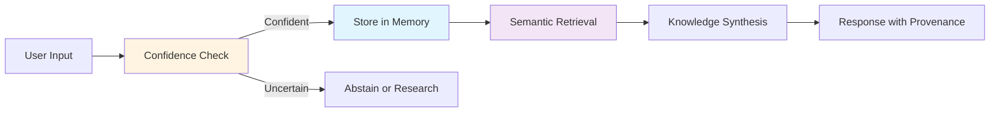

## 🎯 Quick Start

> **📍 Reading Level:** Beginner | **⏱️ Time:** 2-5 minutes | **🎯 Goal:** Understand what AIM-OS is and whether it's relevant for you

### What is AIM-OS?

**AIM-OS** (AI-Integrated Memory & Operations System) is infrastructure for building AI systems that:
- **Remember** everything across sessions (persistent memory)
- **Self-regulate** confidence to prevent hallucinations  
- **Learn continuously** through knowledge synthesis
- **Track provenance** with complete audit trails

**Think of it as:** A memory and reasoning substrate for AI systems, similar to how an operating system provides memory and process management for applications.

### The Problem We're Solving

Traditional AI systems have three critical failures:

| Problem | Impact | AIM-OS Solution |
|:--------|:-------|:----------------|
| **Session Amnesia** | AI forgets everything between chats | Persistent bitemporal memory (CMC) |
| **Hallucination Epidemic** | AI fabricates facts when uncertain | Confidence gating (VIF) prevents responses below threshold |
| **Black Box Operations** | No audit trail for decisions | Complete provenance tracking with witnesses |

### How Does It Work? (High-Level)

**In Practice:**
1. Input arrives with confidence score
2. If confidence < threshold (κ), system abstains or researches
3. If confident, operation stored in bitemporal memory
4. Context retrieved via physics-guided semantic search
5. Knowledge synthesized with contradiction detection
6. Output includes complete provenance trail

### Current Status

**Development:** Day 10 of initial build  
**Quality:** Smoothest sailing of 100+ projects (per lead developer)

| Component | Status | Production Ready |
|:----------|:-------|:-----------------|
| Core memory (CMC, HHNI, VIF) | 70-100% | ✅ Development use |
| Orchestration (APOE, SEG, SDF-CVF) | 85-100% | ✅ Development use |
| Infrastructure (MCP, Daemon) | 40-60% | ⏳ 6-12 months needed |
| Consciousness (CAS, ARD, IIS) | 40-60% | ⏳ Partial/placeholder |

**Testing:** 1,442 test functions (100% pass rate in standard runs)  
**Coverage:** 60-90% by system (estimated, formal reports pending)

### Where to Go Next?

**Choose your path:**

<table>
<tr>
<td width="50%">

**🏗️ Want to understand the architecture?**

Start with [Architecture Overview ↓](#-architecture-overview) (5 min read)

Then explore [Core Systems ↓](#-core-systems) (30 min deep dive)

</td>
<td width="50%">

**🚀 Want to use it?**

Go to [Installation ↓](#-installation) (15 min)

Then [Quick Start Examples](#quick-start-examples) (10 min)

</td>
</tr>
<tr>
<td width="50%">

**🤝 Want to contribute?**

Read [Contributing Guide ↓](#-contributing) (10 min)

Check [Development Setup](#development-setup)

</td>
<td width="50%">

**📚 Just exploring?**

Browse [Documentation ↓](#-documentation--resources)

See [Project Philosophy](#philosophy)

</td>
</tr>
</table>

---

> **💡 Pro Tip:** This README follows the same progressive disclosure principles as AIM-OS itself. You can read linearly or jump to sections based on your needs. Each major section includes navigation breadcrumbs to help you find your way.

---

