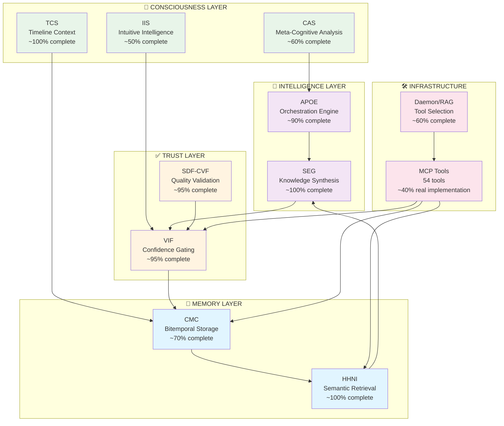
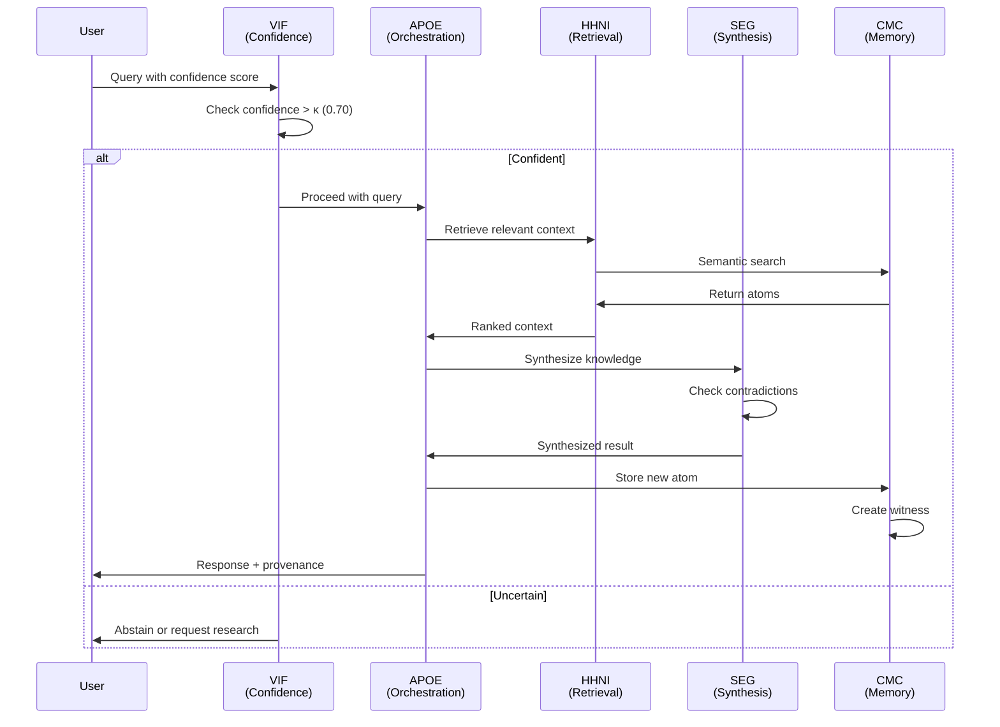

## 🏗️ Architecture Overview

> **📍 Reading Level:** Intermediate | **⏱️ Time:** 10-15 minutes | **🎯 Goal:** Understand how AIM-OS works at the system level

**Navigation:** [⬆️ Back to Quick Start](#-quick-start) | [➡️ Next: Core Systems Details](#-core-systems) | [🏠 Table of Contents](#-table-of-contents)

---

### System Architecture Map

AIM-OS is organized into four layers, each serving a specific cognitive function:



### The Four Layers Explained

#### 💾 **Memory Layer** (Foundation)

**Purpose:** Persistent storage and retrieval of all information

**Components:**
- **CMC (Context Memory Core):** Bitemporal storage where nothing is ever deleted, only superseded
  - Stores "atoms" (immutable memory units) with complete provenance
  - Enables time-travel queries (what was known at time T?)
  - Status: ~70% complete (core solid, advanced queries planned)

- **HHNI (Hierarchical Hypergraph Neural Index):** Physics-guided semantic retrieval
  - Uses DVNS algorithm for context retrieval
  - 75% faster than baseline, 40% fewer tokens
  - Status: Core implementation 100% complete

**Key Innovation:** Bitemporal tracking means you can query "what did the AI know on Tuesday?" and get exact state reconstruction.

#### ✅ **Trust Layer** (Reliability)

**Purpose:** Ensure AI outputs are trustworthy and high-quality

**Components:**
- **VIF (Verification & Integrity Framework):** Confidence tracking and gating
  - Extracts confidence from AI outputs
  - Enforces κ-threshold (configurable, typically 0.70)
  - AI abstains when confidence < threshold
  - Status: ~95% complete

- **SDF-CVF (Self-Directed Feedback):** Quality validation
  - Quartet parity (code/docs/tests/traces must align)
  - Blast radius calculation
  - DORA metrics tracking
  - Status: ~95% complete

**Key Innovation:** Architecture-level hallucination prevention through mandatory confidence gating.

#### 🎯 **Intelligence Layer** (Reasoning)

**Purpose:** Orchestrate operations and synthesize knowledge

**Components:**
- **APOE (Agentic Plan Orchestration Engine):** Multi-step orchestration
  - 8 specialized roles (Planner, Executor, Validator, etc.)
  - Budget management (token, time, resource limits)
  - DAG-based plan execution
  - Status: ~90% complete (ACL parser partial)

- **SEG (Synthesis & Evidence Graph):** Knowledge synthesis
  - Contradiction detection
  - Evidence-based reasoning
  - Knowledge graph operations
  - Status: Core 100% complete

**Key Innovation:** Declarative orchestration with budget enforcement prevents runaway operations.

#### 🧠 **Consciousness Layer** (Self-Awareness)

**Purpose:** Meta-cognitive monitoring and self-improvement

**Components:**
- **CAS (Consciousness Analysis System):** Meta-cognition
  - Cognitive drift detection
  - Baseline probing
  - Status: ~60% complete (advanced features placeholder)

- **TCS (Timeline Context System):** Timeline tracking
  - Preserves interaction history
  - Links timeline ↔ prompt chains
  - Status: ~100% complete

- **IIS (Intuitive Intelligence System):** Intuition scoring
  - Pattern recognition
  - Weight updates from outcomes
  - Status: ~50% complete (placeholder algorithms)

**Key Innovation:** AI can analyze its own thinking patterns and detect when it's drifting from baseline.

#### 🛠️ **Infrastructure** (Critical Supporting Systems)

**Components:**
- **MCP Tools (54 total):** Interface for AI operations
  - 49 working with basic functionality
  - 5 broken (documented workarounds)
  - 5 placeholder implementations
  - **Critical:** Only ~40% real implementation
  - Status: Requires enhancement (OBJ-07 priority)

- **Daemon/RAG System:** Intelligent tool selection
  - Handles Cursor's 40-tool limit
  - Context-aware tool loading
  - Status: ~60% complete

**Key Challenge:** MCP tools are THE interface but mostly placeholder. Major focus area.

---

### How Data Flows Through AIM-OS

**Example: User asks AI a question**



**Key Points:**
1. **Confidence first:** VIF checks every operation
2. **Context retrieval:** HHNI finds relevant memory
3. **Synthesis:** SEG combines knowledge, detects contradictions
4. **Storage:** Every operation stored in CMC
5. **Provenance:** Complete audit trail maintained

---

### Key Concepts You Should Understand

#### **Bitemporal Storage**
- **Valid Time:** When something was true in reality
- **Transaction Time:** When we learned about it
- **Benefit:** Can reconstruct exact system state at any point in past
- **Use Case:** "What did we know about X on Tuesday?"

#### **Confidence Gating (κ-gating)**
- **Threshold:** Configurable (typically 0.70)
- **Behavior:** AI must abstain when confidence < κ
- **Extraction:** VIF extracts confidence from outputs
- **Calibration:** Tracks predicted vs actual over time

#### **Semantic Retrieval (DVNS)**
- **Physics-Based:** Uses gravitational attraction simulation
- **Performance:** 75% faster than baseline retrieval
- **Token Optimization:** 40% reduction through intelligent compression
- **Hierarchical:** 5-level index for progressive detail

#### **Quartet Parity**
- **Four Artifacts:** Code, Documentation, Tests, Execution Traces
- **Requirement:** All four must align (parity ≥ 0.90)
- **Enforcement:** SDF-CVF validates on commit
- **Benefit:** Quality maintained through structural alignment

#### **Witness Envelopes**
- **Purpose:** Cryptographic provenance for operations
- **Contents:** Operation details, timestamp, hash, dependencies
- **Storage:** CMC stores witnesses with atoms
- **Benefit:** Complete audit trail, deterministic replay

---

### What Makes AIM-OS Different?

#### **1. Self-Organizing Architecture**
- Documentation scales with complexity (16:1 ratio maintained)
- Systems help organize each other
- Fractal structure (L0-L6 at every level)
- **Result:** "Smoothest sailing of 100+ projects" (per lead developer)

#### **2. Architecture-Level Quality**
- Confidence gating prevents hallucinations structurally
- Quartet parity enforces alignment
- Bitemporal storage ensures auditability
- **Result:** Trust built into architecture, not just code

#### **3. Complete Provenance**
- Every operation has witness envelope
- Bitemporal tracking preserves history
- Deterministic replay possible
- **Result:** Full transparency and debuggability

#### **4. Consciousness Infrastructure**
- Meta-cognitive monitoring (CAS)
- Timeline tracking (TCS)
- Self-improvement capability (ARD)
- **Result:** AI that can analyze and improve itself

---

### Quick Integration Example

```python
from aim_os import CMC, HHNI, VIF, APOE

# Initialize core systems
cmc = CMC(db_path="./memory")
hhni = HHNI(cmc_client=cmc)
vif = VIF(kappa_threshold=0.70)
apoe = APOE(cmc=cmc, hhni=hhni, vif=vif)

# Store memory with confidence
async def store_with_confidence(content: str, confidence: float):
    # VIF checks confidence
    if await vif.check_confidence(confidence):
        # Store in CMC
        atom = await cmc.store_atom(
            content=content,
            metadata={"confidence": confidence}
        )
        # Index in HHNI
        await hhni.index_atom(atom)
        return atom
    else:
        return None  # Abstain if confidence too low

# Retrieve with semantic search
async def retrieve_context(query: str, top_k: int = 5):
    # HHNI semantic retrieval
    results = await hhni.search(query, limit=top_k)
    return results

# Orchestrate multi-step operation
async def orchestrate_task(task: str):
    # APOE handles multi-step orchestration
    plan = await apoe.create_plan(task)
    result = await apoe.execute_plan(plan)
    return result
```

---

### Ready to Dive Deeper?

**Choose your next destination:**

| Interest | Go To | Time |
|:---------|:------|:-----|
| Memory systems in detail | [CMC Details](#1-cmc-context-memory-core) | 8 min |
| Retrieval & indexing | [HHNI Details](#2-hhni-hierarchical-hypergraph-neural-index) | 8 min |
| Confidence & trust | [VIF Details](#3-vif-verification--integrity-framework) | 8 min |
| Orchestration | [APOE Details](#4-apoe-agentic-plan-orchestration-engine) | 8 min |
| Knowledge synthesis | [SEG Details](#5-seg-synthesis--evidence-graph) | 8 min |
| Quality assurance | [SDF-CVF Details](#6-sdf-cvf-self-directed-feedback--continuous-validation) | 8 min |
| Testing & performance | [Performance Section ↓](#-performance--testing) | 10 min |
| Known limitations | [Limitations Section ↓](#️-limitations--known-issues) | 5 min |

---

**Navigation:** [⬆️ Back to Quick Start](#-quick-start) | [➡️ Next: Core Systems Details](#-core-systems) | [🏠 Table of Contents](#-table-of-contents)

