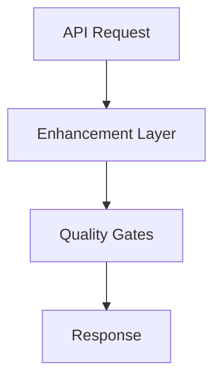

# Response to ChatGPT Research Questions

**Date:** 2025-11-07  
**Context:** External ChatGPT asked for clarification on research brief  
**Research Brief:** `ide_orchestration/research/RESEARCH_BRIEF_EXTERNAL_SYSTEMS.md`

---

## 📋 **RESPONSE TO CHATGPT'S QUESTIONS**

### **1. Which Codex?**

**Answer:** OpenAI's Codex model (the code generation model, predecessor to GPT-4 for code tasks)

**Clarification:**
- **NOT** referring to our internal AI agent "Codex" (that's a different entity)
- **YES** referring to OpenAI's Codex model/system
- Focus on how Codex (the OpenAI model) was used in systems that enhanced it beyond base API capabilities
- Research how systems built "operating systems" around Codex API (similar to how Cursor enhances ChatGPT API)

**Research Focus:**
- How did systems enhance Codex API beyond base capabilities?
- What architecture patterns enabled Codex to be used as part of larger systems?
- How did systems coordinate multiple Codex instances or combine Codex with other APIs?
- What quality/documentation systems were built around Codex?

**Note:** Since Codex was deprecated/superseded by GPT-4, you may find limited current documentation. Focus on:
- Historical analysis of Codex-based systems
- Patterns from systems that used Codex
- How those patterns apply to current GPT-4/ChatGPT API enhancement

---

### **2. Research Sources - Secondary Sources?**

**Answer:** YES - Include secondary sources (expert breakdowns, user reviews) when official docs are sparse

**Source Priority:**
1. **Primary Sources (Preferred):**
   - Official documentation
   - Official blog posts
   - GitHub repositories (if public)
   - Technical analysis from creators

2. **Secondary Sources (Use When Primary Unavailable):**
   - Expert technical breakdowns
   - User experiences and reviews
   - Community analysis
   - Academic papers (if relevant)

3. **Citation Requirements:**
   - Cite ALL sources (primary and secondary)
   - Clearly mark source type (official doc vs. expert analysis vs. user review)
   - Note when information is inferred vs. documented
   - Document limitations when official docs are sparse

**Why Secondary Sources:**
- Many systems (especially Codex) have limited official documentation
- Expert breakdowns provide architectural insights not in official docs
- User experiences reveal real-world patterns and limitations
- Critical analysis helps identify what works vs. what doesn't

**Quality Standard:**
- Deep analysis (not surface-level)
- Critical evaluation of sources
- Clear distinction between documented facts and inferred patterns
- Actionable insights for AIM-OS design

---

### **3. Output Format for Diagrams?**

**Answer:** Text descriptions preferred, but Markdown diagrams welcome if helpful

**Preferred Format:**
- **Text descriptions** of architecture (primary method)
- **Markdown diagrams** (Mermaid, ASCII art, or structured text) if they add clarity
- **No image files** (keep everything in Markdown)

**Diagram Guidelines:**
- Use Mermaid syntax for flowcharts/architecture diagrams (if helpful)
- Use ASCII art for simple diagrams (if helpful)
- Use structured text/indentation for component hierarchies
- Focus on clarity - if diagrams don't add value, text descriptions are fine

**Example Formats:**
```markdown
### Architecture Overview

**Component Hierarchy:**
- API Layer
  - Request Router
  - Enhancement Pipeline
  - Response Processor
- Quality Layer
  - Validation Gates
  - Confidence Tracking
```

OR

```markdown
### Architecture Flow


```

**Priority:** Clarity over format - use whatever format best communicates the architecture.

---

## ✅ **CONFIRMED RESEARCH SCOPE**

**Systems to Research:**
1. **Cursor** ⭐ PRIMARY FOCUS
   - Architecture analysis
   - API enhancement patterns
   - Chat/IDE integration

2. **Codex (OpenAI's Codex Model)**
   - Historical analysis (may be limited due to deprecation)
   - Patterns from Codex-based systems
   - How systems enhanced Codex API

3. **ChatGPT Browser**
   - Enhancement patterns beyond base API
   - Search/documentation integration
   - Context management

**Research Quality:**
- Deep and thorough (not surface-level)
- Comprehensive citations (primary + secondary)
- Critical analysis (what works, what doesn't)
- Actionable insights for AIM-OS

**Deliverable:**
- Report: `ide_orchestration/research/EXTERNAL_SYSTEMS_ANALYSIS_CHATGPT.md`
- Format: Markdown with text descriptions (diagrams optional but welcome)
- Citations: All sources cited (primary and secondary)

---

## 📝 **SAMPLE RESPONSE TO CHATGPT**

You can copy/paste this response:

---

**Thank you for the questions! Here are the clarifications:**

**1. Which Codex?**
- **OpenAI's Codex model** (the code generation model, predecessor to GPT-4)
- NOT referring to our internal AI agent "Codex"
- Focus on how systems enhanced Codex API beyond base capabilities
- Note: Codex was deprecated/superseded, so historical analysis is fine - focus on patterns that apply to current API enhancement

**2. Research Sources:**
- **YES - Include secondary sources** (expert breakdowns, user reviews) when official docs are sparse
- Priority: Official docs > Expert analysis > User reviews
- Cite ALL sources and mark source type
- Document limitations when official docs are unavailable

**3. Output Format:**
- **Text descriptions preferred** (primary method)
- **Markdown diagrams welcome** (Mermaid, ASCII art) if they add clarity
- **No image files** - keep everything in Markdown
- Focus on clarity - use whatever format best communicates architecture

**Research Focus:**
- Deep analysis (not surface-level)
- Comprehensive citations (primary + secondary)
- Critical analysis (what works, what doesn't)
- Actionable insights for AIM-OS design

**Ready to proceed with research!**

---

**Status:** Response template ready  
**Next:** Send this clarification to ChatGPT and begin research

