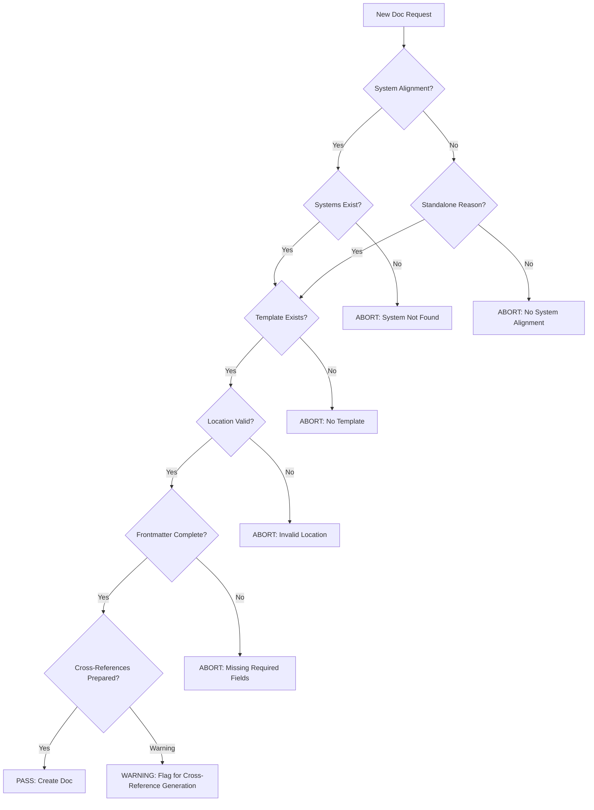

> **TRANSITIONAL T-LEVEL DOCUMENT** – Do not overwrite existing L-level docs. This T-level will supersede L-level after review/acceptance.

# Documentation Governance & Cross-Reference Protocol

**Date:** 2025-11-03  
**Status:** ✅ **MANDATORY PROTOCOL** - Required for All Documentation  
**Purpose:** Prevent orphaned documentation and ensure all docs align with existing systems  
**Integration:** PERFECT_VALIDATION_FRAMEWORK, L0_L4_CODING_STANDARDS_PROTOCOL, SYSTEM_HIERARCHY, Governance Policies

---

## 🎯 **PROTOCOL OVERVIEW**

### **Core Principle**
**NO DOCUMENTATION WITHOUT SYSTEM ALIGNMENT VALIDATION**

**AND:**

**NO DOCUMENTATION WITHOUT PRE-CREATION VALIDATION**

Before creating any documentation, the system must:
1. **🚨 Validate system alignment** (Which systems does this relate to?)
2. **Reference appropriate templates** (What doc type is this?)
3. **Validate location and naming** (Where should this live?)
4. **Prepare cross-references** (What should this reference?)
5. **Pass all validation gates** (All gates must pass before creation)

**Reference:** `knowledge_architecture/L0_L4_CODING_STANDARDS_PROTOCOL.md` for similar pre-creation checklist pattern

---

## 📋 **LAYER 1: DOCUMENTATION GOVERNANCE PROTOCOL**

### **Pre-Creation Checklist (MANDATORY)**

**Before creating ANY new documentation file:**

#### **1. System Alignment Check**
```yaml
questions:
  - Does this doc relate to an existing system?
  - Which system(s) does it relate to?
  - Is this a standalone doc?

validation:
  - IF relates to system(s):
      - Verify systems exist in SYSTEM_HIERARCHY.md
      - Add systems to frontmatter `systems` array
  - IF standalone:
      - Document reason in frontmatter `standalone_reason`
      - Justify why no system alignment

reference: knowledge_architecture/SYSTEM_HIERARCHY.md
```

**Example Frontmatter:**
```yaml
systems: ["cmc", "hhni"]  # Related to CMC and HHNI
# OR
standalone_reason: "Meta-analysis across all systems, not specific to one"
```

#### **2. Document Type Identification**
```yaml
questions:
  - What type of doc is this?
  - Does a template exist?
  - What standards apply?

validation:
  - Check PERFECT_TEMPLATES_LIBRARY.md for template
  - Check PERFECT_VALIDATION_FRAMEWORK.md for standards
  - Use appropriate template

reference: knowledge_architecture/PERFECT_TEMPLATES_LIBRARY.md
```

**Document Types:**
- **Ideas:** `ideas/{category}/{agent}/{type}_{name}.md`
- **System Docs:** `knowledge_architecture/systems/{system}/T{0-6}_{type}.md`
- **Protocols:** `knowledge_architecture/AETHER_MEMORY/protocols/T{0-6}_{name}.md`
- **Coordination:** `coordination/{date}_{topic}.md`
- **Analysis:** `analysis/{category}/{name}.md`

#### **3. Location & Naming Standards**
```yaml
validation:
  - Location follows conventions (based on doc type)
  - Naming follows standards (based on doc type)
  - Directory structure correct

standards:
  - System docs: knowledge_architecture/systems/{system}/
  - Ideas: ideas/{category}/{agent}/{type}_{name}.md
  - Coordination: coordination/{date}_{topic}.md
  - Analysis: analysis/{category}/{name}.md
  - Protocols: knowledge_architecture/AETHER_MEMORY/protocols/
```

**Naming Conventions:**
- **T-Level Docs:** `T{0-6}_{type}.md` (e.g., `T0_executive.md`, `T2_architecture.md`)
- **L-Level Docs:** `L{0-6}_{type}.md` (legacy, preserve alongside T-level)
- **Ideas:** `{TYPE}_{description}.md` (e.g., `SEED_memory_crystallization.md`)
- **Coordination:** `{YYYY-MM-DD}_{topic}.md` (e.g., `2025-11-03_doc_governance.md`)

#### **4. Required Frontmatter (Based on Doc Type)**
```yaml
required_fields:
  - id: Unique identifier
  - system: System name (or null for multi-system)
  - component: Component name (or null)
  - level: T0-T6 (for T-level docs)
  - type: Document type (executive, overview, architecture, etc.)
  - title: Document title
  - description: Brief description
  - audience: Target audience
  - confidence_threshold: Confidence threshold for reading
  - token_cost: Estimated token cost
  - word_count: Estimated word count
  - created: Creation timestamp
  - updated: Last update timestamp
  - author: Author name
  - status: Document status (draft, complete, production)
  - tags: Relevant tags array
  - dependencies: Dependencies array
  - related_docs: Related docs array
  - version: Document version

conditional_fields:
  - systems: Array of related systems (MANDATORY unless standalone)
  - standalone_reason: Reason for standalone doc (MANDATORY if standalone)
  - related_ideas: Related ideas array (for ideas)
```

**Template Reference:** `knowledge_architecture/PERFECT_TEMPLATES_LIBRARY.md`

#### **5. Cross-Reference Preparation**
```yaml
questions:
  - Which systems should this doc reference?
  - Which docs should this doc reference?
  - How should this doc be referenced by others?

validation:
  - Identify related systems from system maps
  - Identify related docs from system indexes
  - Plan reference strategy

reference: knowledge_architecture/NAVIGATION/cross_system_connections.yaml
```

### **Standards by Document Type**

#### **Ideas** (`ideas/` directory)
**Requirements:**
- MUST reference at least one system in `systems` array
- MUST include `related_ideas` array if related to other ideas
- MUST follow idea template format
- MUST be registered in `ideas/REGISTRY.md`

**Template:** `PERFECT_TEMPLATES_LIBRARY.md` → Idea Template

**Validation:**
```python
def validate_idea(idea_doc):
    assert "systems" in idea_doc.frontmatter, "Ideas must reference at least one system"
    assert len(idea_doc.frontmatter["systems"]) > 0, "Systems array cannot be empty"
    assert all(system_exists(s) for s in idea_doc.frontmatter["systems"]), "All referenced systems must exist"
    assert idea_doc.path.startswith("ideas/"), "Ideas must be in ideas/ directory"
    # Check if registered
    registry = load_file("ideas/REGISTRY.md")
    assert idea_doc.id in registry, "Idea must be registered in ideas/REGISTRY.md"
```

#### **Loose Documentation** (anywhere)
**Requirements:**
- MUST reference at least one system OR be explicitly standalone
- MUST include `standalone_reason` in frontmatter if standalone
- MUST include location justification in frontmatter
- MUST follow appropriate template
- MUST be discoverable (indexed somewhere)

**Validation:**
```python
def validate_loose_doc(doc):
    has_systems = "systems" in doc.frontmatter and len(doc.frontmatter["systems"]) > 0
    has_standalone_reason = "standalone_reason" in doc.frontmatter
    
    assert has_systems or has_standalone_reason, \
        "Loose docs must reference systems OR have standalone reason"
    
    if has_standalone_reason:
        assert len(doc.frontmatter["standalone_reason"]) > 0, \
            "Standalone reason cannot be empty"
    
    # Check discoverability
    assert is_discoverable(doc), "Doc must be indexed or linked from master doc"
```

#### **Analysis/Research Docs**
**Requirements:**
- MUST reference systems being analyzed in `systems` array
- MUST include methodology/approach
- MUST link to source systems/docs in `related_docs`

**Validation:**
```python
def validate_analysis_doc(doc):
    assert "systems" in doc.frontmatter, "Analysis must reference analyzed systems"
    assert len(doc.frontmatter["systems"]) > 0, "Must analyze at least one system"
    assert "methodology" in doc.content or "approach" in doc.content, \
        "Analysis must include methodology/approach"
    assert "related_docs" in doc.frontmatter, "Analysis must link to source docs"
```

#### **Coordination Files**
**Requirements:**
- MUST reference related systems/tasks
- MUST follow coordination file standards (max 500 lines, atomic topics)
- MUST be in appropriate coordination directory
- MUST update `coordination/INDEX.md` if needed

**Validation:**
```python
def validate_coordination_file(doc):
    assert doc.line_count <= 500, "Coordination files max 500 lines (governance.md policy)"
    assert doc.path.startswith("coordination/"), "Coordination files in coordination/ directory"
    
    # Check atomic topics
    topics = extract_topics(doc)
    assert len(topics) <= 3, "Max 3 topics per coordination file (governance.md policy)"
    
    # Check INDEX.md updated if needed
    if should_be_indexed(doc):
        index = load_file("coordination/INDEX.md")
        assert doc.filename in index, "Must be listed in coordination/INDEX.md"
```

**Reference:** `analysis/themes/governance.md` for coordination file policies

### **Pre-Creation Validation Gates**

**Gate 1: System Alignment Gate**
```yaml
checks:
  - System(s) exist in SYSTEM_HIERARCHY.md
  - OR standalone reason documented
  - System references in frontmatter `systems` array

failure_action: ABORT - Cannot create doc without system alignment
```

**Gate 2: Template Compliance Gate**
```yaml
checks:
  - Template exists for doc type
  - Frontmatter matches template
  - Required fields present (all fields from template)

failure_action: ABORT - Use template before creating doc
```

**Gate 3: Location Standards Gate**
```yaml
checks:
  - Location follows conventions (based on doc type)
  - Naming follows standards (based on doc type)
  - Directory structure correct

failure_action: ABORT - Fix location/naming before creating doc
```

**Gate 4: Cross-Reference Preparation Gate**
```yaml
checks:
  - Related systems identified (from system maps)
  - Related docs identified (from system indexes)
  - Reference strategy planned (how will this doc be referenced?)

failure_action: WARNING - Proceed but flag for cross-reference generation
```

**ALL GATES MUST PASS (or have valid warnings) BEFORE CREATION**

---

## 🔗 **LAYER 2: CROSS-REFERENCE PROTOCOL**

### **Progressive Depth Loading Strategy**

**Similar to:** `confidence_navigation_map.md` and HHNI hierarchical retrieval

**For each system being enhanced/consolidated:**

#### **Step 1: Load System Map & Index**
```python
def load_system_context(target_system: str):
    """Load system map and index for context"""
    # Load system map
    system_map = load_json5(f"knowledge_architecture/systems/{target_system}/system.map.lucid.json5")
    
    # Load system index
    system_index = load_json5(f"knowledge_architecture/systems/{target_system}/system.index.lucid.json5")
    
    # Extract related systems from ports
    related_systems = []
    for port in system_map.get("ports", []):
        if "connectsToSystem" in port:
            related_systems.append(port["connectsToSystem"])
    
    # Extract dependencies from index
    dependencies = system_index.get("dependencies", [])
    
    return {
        "system_map": system_map,
        "system_index": system_index,
        "related_systems": related_systems,
        "dependencies": dependencies
    }
```

#### **Step 2: Progressive Depth Loading**
```python
def load_progressive_context(target_system: str, related_systems: List[str]):
    """Load context at appropriate depth"""
    context = {}
    
    # Load T0 (100 words) for all related systems
    for system in related_systems:
        context[system] = {
            "T0": load_doc(system, level="T0")  # Quick overview
        }
    
    # Load T2 architecture sections for integration details
    for system in related_systems:
        context[system]["T2"] = load_doc(system, level="T2", section="integration")
    
    # Load T3/T4 only if deep understanding needed (based on confidence)
    if requires_deep_understanding(target_system):
        for system in critical_related_systems:
            context[system]["T3"] = load_doc(system, level="T3")
    
    return context
```

**Reference:** `knowledge_architecture/NAVIGATION/confidence_navigation_map.md` for confidence-based routing

#### **Step 3: Context Budget Management**
```python
def manage_context_budget(context: Dict, budget_tokens: int = 8000):
    """Manage context budget using HHNI-style optimization"""
    # Similar to HHNI's budget-aware retrieval
    items = []
    
    # Prioritize by importance
    for system, docs in context.items():
        for level, content in docs.items():
            items.append({
                "system": system,
                "level": level,
                "content": content,
                "tokens": count_tokens(content),
                "importance": calculate_importance(system, level)
            })
    
    # Sort by importance/tokens ratio
    items.sort(key=lambda x: x["importance"] / x["tokens"], reverse=True)
    
    # Select items within budget
    selected = []
    tokens_used = 0
    
    for item in items:
        if tokens_used + item["tokens"] <= budget_tokens:
            selected.append(item)
            tokens_used += item["tokens"]
    
    return selected, tokens_used
```

**Reference:** `knowledge_architecture/systems/hhni/L3_detailed.md` for budget-aware retrieval

### **Cross-Reference Validation**

#### **Validation Rule 1: T2 Architecture Must Have "Related Systems" Section**
```python
def validate_t2_related_systems(system: str):
    """Validate T2 architecture has Related Systems section"""
    t2_doc = load_doc(system, level="T2")
    
    # Check for "Related Systems" section
    assert "## Related Systems" in t2_doc or "## 🔗 RELATED SYSTEMS" in t2_doc, \
        f"T2 architecture must have Related Systems section"
    
    # Extract referenced systems
    referenced_systems = extract_system_references(t2_doc)
    
    # Verify systems exist
    for ref_system in referenced_systems:
        assert system_exists(ref_system), \
            f"Referenced system '{ref_system}' does not exist"
    
    # Check bidirectional references (A→B implies B→A)
    for ref_system in referenced_systems:
        ref_t2_doc = load_doc(ref_system, level="T2")
        assert system in extract_system_references(ref_t2_doc), \
            f"Bidirectional reference missing: {system}→{ref_system} exists, but {ref_system}→{system} missing"
    
    return True
```

#### **Validation Rule 2: System Map Ports Must Match Doc References**
```python
def validate_system_map_ports(system: str):
    """Validate system map ports match T2 doc references"""
    # Load system map
    system_map = load_json5(f"knowledge_architecture/systems/{system}/system.map.lucid.json5")
    
    # Extract connected systems from ports
    connected_systems = []
    for port in system_map.get("ports", []):
        if "connectsToSystem" in port:
            connected_systems.append(port["connectsToSystem"])
    
    # Load T2 doc
    t2_doc = load_doc(system, level="T2")
    referenced_systems = extract_system_references(t2_doc)
    
    # Verify match
    for connected in connected_systems:
        assert connected in referenced_systems, \
            f"System map port connects to '{connected}', but T2 doc does not reference it"
    
    return True
```

#### **Validation Rule 3: System Index Connections Must Match**
```python
def validate_system_index_connections(system: str):
    """Validate system index connections match docs"""
    # Load system index
    system_index = load_json5(f"knowledge_architecture/systems/{system}/system.index.lucid.json5")
    
    # Extract dependencies
    dependencies = system_index.get("dependencies", [])
    
    # Load T2 doc
    t2_doc = load_doc(system, level="T2")
    referenced_systems = extract_system_references(t2_doc)
    
    # Verify dependencies referenced
    for dep in dependencies:
        assert dep in referenced_systems, \
            f"System index shows dependency '{dep}', but T2 doc does not reference it"
    
    return True
```

#### **Validation Rule 4: Cross-System Connections YAML Must Match**
```python
def validate_cross_system_connections(system: str):
    """Validate cross-system connections YAML matches docs"""
    # Load cross-system connections
    connections = load_yaml("knowledge_architecture/NAVIGATION/cross_system_connections.yaml")
    
    # Find system in connections
    system_connections = connections["systems"].get(system.upper(), {})
    
    # Extract dependencies and provides_to
    dependencies = system_connections.get("depends_on", [])
    provides_to = system_connections.get("provides_to", [])
    
    # Load T2 doc
    t2_doc = load_doc(system, level="T2")
    referenced_systems = extract_system_references(t2_doc)
    
    # Verify dependencies and provides_to referenced
    all_connections = list(dependencies) + [p for p in provides_to if isinstance(p, str)]
    
    for connection in all_connections:
        # Handle dict format in provides_to
        if isinstance(connection, dict):
            connection = list(connection.keys())[0]
        
        connection_lower = connection.lower()
        assert connection_lower in [s.lower() for s in referenced_systems], \
            f"Cross-system connections YAML shows connection '{connection}', but T2 doc does not reference it"
    
    return True
```

### **Cross-Reference Generation**

#### **Generation Function 1: Generate "Related Systems" Section**
```python
def generate_related_systems_section(system: str) -> str:
    """Generate Related Systems section from system map"""
    # Load system map
    system_map = load_json5(f"knowledge_architecture/systems/{system}/system.map.lucid.json5")
    
    # Extract related systems from ports
    related_systems = {}
    for port in system_map.get("ports", []):
        if "connectsToSystem" in port:
            related_system = port["connectsToSystem"]
            if related_system not in related_systems:
                related_systems[related_system] = {
                    "relationship": port.get("direction", "bidirectional"),
                    "integration_point": port.get("portId", ""),
                    "data_exchanged": port.get("whatIsExchanged", []),
                    "security_level": port.get("security_level", "medium")
                }
    
    # Generate section
    section = "## 🔗 RELATED SYSTEMS\n\n"
    section += "### **Direct Dependencies**\n\n"
    
    for related_system, details in related_systems.items():
        # Extract system name
        system_name = extract_system_name(related_system)
        
        section += f"#### **{system_name}**\n"
        section += f"**Relationship:** {details['relationship']}\n"
        section += f"**Integration Point:** {details['integration_point']}\n"
        section += f"**Data Exchanged:** {', '.join(details['data_exchanged'][:3])}\n"
        section += f"**Security Level:** {details['security_level']}\n"
        section += f"**Docs:** `knowledge_architecture/systems/{system_name.lower()}/T0_executive.md`\n\n"
    
    return section
```

#### **Generation Function 2: Update System Map with Doc Links**
```python
def add_doc_links_to_system_map(system: str):
    """Add documentation links to system map"""
    # Load system map
    system_map_path = f"knowledge_architecture/systems/{system}/system.map.lucid.json5"
    system_map = load_json5(system_map_path)
    
    # Find existing T-level docs
    existing_docs = find_existing_docs(system, doc_levels=["T0", "T1", "T2", "T3", "T4", "T5", "T6"])
    
    # Add documentation section if missing
    if "documentation" not in system_map:
        system_map["documentation"] = {}
    
    # Add doc links
    for doc in existing_docs:
        system_map["documentation"][doc.level] = doc.path
    
    # Save updated system map
    save_json5(system_map_path, system_map)
    
    return system_map
```

#### **Generation Function 3: Update Cross-System Connections YAML**
```python
def update_cross_system_connections_yaml():
    """Update cross-system connections YAML with doc references"""
    # Load YAML
    yaml_path = "knowledge_architecture/NAVIGATION/cross_system_connections.yaml"
    connections = load_yaml(yaml_path)
    
    # For each system in connections
    for system_key in connections["systems"]:
        system = connections["systems"][system_key]
        
        # Find docs path
        system_name = system["name"].lower().replace(" ", "_")
        docs_path = f"knowledge_architecture/systems/{system_name}/"
        
        # Update docs field
        system["docs"] = docs_path
    
    # Save updated YAML
    save_yaml(yaml_path, connections)
    
    return connections
```

### **Automated Validation Workflow**



---

## 🔄 **INTEGRATION WITH EXISTING SYSTEMS**

### **Integration 1: PERFECT_VALIDATION_FRAMEWORK**

**Uses:**
- Syntax validation (frontmatter format)
- Format validation (template compliance)
- Consistency validation (cross-reference consistency)
- Quality validation (alignment quality)

**Reference:** `knowledge_architecture/PERFECT_VALIDATION_FRAMEWORK.md`

### **Integration 2: L0_L4_CODING_STANDARDS_PROTOCOL**

**Pattern Borrowed:**
- Pre-creation checklist (similar to "Pre-Coding Checklist")
- Severity-based requirements (Critical/High/Medium/Low)
- System-first research requirement

**Reference:** `knowledge_architecture/L0_L4_CODING_STANDARDS_PROTOCOL.md`

### **Integration 3: Governance Policies**

**Uses:**
- Max 500 lines per coordination file
- Atomic topics (one topic per file)
- INDEX.md required for navigation
- Auto-split when exceeds threshold

**Reference:** `analysis/themes/governance.md`

### **Integration 4: System Hierarchy**

**Uses:**
- 6-layer hierarchy for system organization
- Core systems (Layers 1-4) require system maps/indexes
- Infrastructure systems (Layer 5) conditional
- Application systems (Layer 6) no maps/indexes

**Reference:** `knowledge_architecture/SYSTEM_HIERARCHY.md`

---

## 🛠️ **IMPLEMENTATION SCRIPTS**

### **Script 1: Pre-Creation Validation**

**File:** `scripts/validate_documentation_pre_creation.py`

**Usage:**
```bash
python scripts/validate_documentation_pre_creation.py \
  --doc-type idea \
  --location "ideas/architects/claude-sonnet/SEED_new_idea.md" \
  --systems "cmc,hhni" \
  --frontmatter "frontmatter.yaml"
```

**Validates:**
1. System alignment
2. Template compliance
3. Location standards
4. Cross-reference preparation

**Output:**
- Validation report
- Recommendations
- Auto-fixes (where possible)

### **Script 2: Cross-Reference Validation**

**File:** `scripts/validate_cross_references.py`

**Usage:**
```bash
# Validate single system
python scripts/validate_cross_references.py --system cmc

# Validate all core systems
python scripts/validate_cross_references.py --core-systems

# Validate all systems
python scripts/validate_cross_references.py --all
```

**Validates:**
1. T2 architecture "Related Systems" sections
2. Referenced systems exist
3. Bidirectional references
4. System map ports match doc references

**Output:**
- Validation report per system
- Missing references identified
- Recommendations for fixes

### **Script 3: Cross-Reference Generation**

**File:** `scripts/generate_cross_references.py`

**Usage:**
```bash
# Generate cross-references for single system
python scripts/generate_cross_references.py --system cmc

# Generate for all core systems
python scripts/generate_cross_references.py --core-systems

# Generate for all systems
python scripts/generate_cross_references.py --all
```

**Generates:**
1. Missing "Related Systems" sections in T2 docs
2. Missing doc links in system maps
3. Missing system index → map links
4. Missing doc references in cross-system connections YAML

**Output:**
- Generated cross-references
- Updated files
- Generation report

---

## 📊 **VALIDATION RULES REFERENCE**

### **Rule Set 1: System Alignment**
- All docs must reference at least one system OR have standalone reason
- Referenced systems must exist in `SYSTEM_HIERARCHY.md`
- Standalone docs must justify why no system alignment

### **Rule Set 2: Template Compliance**
- Template must exist for doc type
- Frontmatter must match template
- Required fields must be present

### **Rule Set 3: Location Standards**
- Location must follow conventions (based on doc type)
- Naming must follow standards (based on doc type)
- Directory structure must be correct

### **Rule Set 4: Cross-Reference Consistency**
- T2 docs must reference systems from system map ports
- System map ports must match T2 doc references
- System index dependencies must match T2 doc references
- Cross-system connections YAML must match T2 doc references
- Bidirectional references must exist (A→B implies B→A)

---

## 🔧 **USAGE EXAMPLES**

### **Example 1: Creating New Idea**

**Pre-Creation:**
```bash
# 1. System Alignment Check
systems=["cmc", "hhni"]  # Relates to CMC and HHNI
systems_exist=True  # Both exist in SYSTEM_HIERARCHY.md

# 2. Document Type Identification
doc_type="idea"
template="PERFECT_TEMPLATES_LIBRARY.md → Idea Template"

# 3. Location & Naming
location="ideas/architects/claude-sonnet/SEED_memory_optimization.md"
naming_valid=True

# 4. Required Frontmatter
frontmatter:
  id: "memory_optimization_idea"
  systems: ["cmc", "hhni"]
  related_ideas: ["I-001", "I-006"]
  tags: ["memory", "optimization", "cmc", "hhni"]
  # ... (all required fields)

# 5. Cross-Reference Preparation
related_systems: ["cmc", "hhni"]
related_docs: ["cmc/T2_architecture.md", "hhni/T2_architecture.md"]

# Run validation
python scripts/validate_documentation_pre_creation.py \
  --doc-type idea \
  --location "ideas/architects/claude-sonnet/SEED_memory_optimization.md" \
  --systems "cmc,hhni" \
  --frontmatter "frontmatter.yaml"

# Output: ✅ PASS - All gates passed, safe to create
```

### **Example 2: Creating Standalone Analysis Doc**

**Pre-Creation:**
```bash
# 1. System Alignment Check
standalone=True
standalone_reason="Meta-analysis across all 9 core systems, not specific to one"

# 2. Document Type Identification
doc_type="analysis"
template="PERFECT_TEMPLATES_LIBRARY.md → Analysis Template"

# 3. Location & Naming
location="analysis/cross_system/COMPREHENSIVE_CORE_SYSTEMS_ANALYSIS.md"
naming_valid=True

# 4. Required Frontmatter
frontmatter:
  id: "comprehensive_core_systems_analysis"
  standalone_reason: "Meta-analysis across all 9 core systems, not specific to one"
  tags: ["analysis", "cross-system", "core-systems"]
  # ... (all required fields)

# 5. Cross-Reference Preparation
related_systems: ["all_core_systems"]  # Will reference all 9 in content
related_docs: ["SYSTEM_HIERARCHY.md", "cross_system_connections.yaml"]

# Run validation
python scripts/validate_documentation_pre_creation.py \
  --doc-type analysis \
  --location "analysis/cross_system/COMPREHENSIVE_CORE_SYSTEMS_ANALYSIS.md" \
  --standalone "Meta-analysis across all 9 core systems, not specific to one" \
  --frontmatter "frontmatter.yaml"

# Output: ✅ PASS - Standalone reason valid, all gates passed
```

### **Example 3: Validating Cross-References for CMC**

**Validation:**
```bash
# Run cross-reference validation for CMC
python scripts/validate_cross_references.py --system cmc

# Output:
# ✅ T2 architecture has "Related Systems" section
# ✅ All referenced systems exist (HHNI, VIF, SEG, APOE, SDF-CVF)
# ⚠️ WARNING: Bidirectional reference missing (CMC→APOE exists, but APOE→CMC missing)
# ⚠️ WARNING: System map port connects to "daemon.ragSystem", but T2 doc does not reference it
# 
# Recommendations:
# 1. Add bidirectional reference in APOE T2 doc
# 2. Add daemon.ragSystem reference to CMC T2 doc
```

### **Example 4: Generating Cross-References for VIF**

**Generation:**
```bash
# Run cross-reference generation for VIF
python scripts/generate_cross_references.py --system vif

# Output:
# 🔄 Generating cross-references for VIF...
# ✅ Generated "Related Systems" section (CMC, HHNI, SEG, APOE, SDF-CVF)
# ✅ Added doc links to system map (T0-T6)
# ✅ Added system index → map link
# ✅ Updated cross-system connections YAML with doc references
# 
# Files updated:
# - knowledge_architecture/systems/vif/T2_architecture.md
# - knowledge_architecture/systems/vif/system.map.lucid.json5
# - knowledge_architecture/systems/vif/system.index.lucid.json5
# - knowledge_architecture/NAVIGATION/cross_system_connections.yaml
```

---

## 📋 **VALIDATION GATES SUMMARY**

### **Pre-Creation Gates (MANDATORY)**
1. **System Alignment Gate** - System(s) exist OR standalone reason
2. **Template Compliance Gate** - Template exists, frontmatter matches
3. **Location Standards Gate** - Location/naming follows conventions
4. **Cross-Reference Preparation Gate** - Related systems/docs identified

### **Cross-Reference Validation Gates**
1. **T2 Related Systems Gate** - T2 docs have "Related Systems" section
2. **System Map Ports Gate** - System map ports match doc references
3. **System Index Connections Gate** - System index connections match doc references
4. **Cross-System Connections Gate** - Cross-system connections YAML matches doc references
5. **Bidirectional Reference Gate** - A→B implies B→A

---

## 🚀 **MANDATORY PROTOCOL**

### **Before Creating ANY Documentation:**
1. ✅ Run pre-creation validation
2. ✅ Pass all validation gates
3. ✅ Use appropriate template
4. ✅ Reference related systems
5. ✅ Prepare cross-references

### **After Creating Documentation:**
1. ✅ Run cross-reference validation
2. ✅ Fix missing references
3. ✅ Generate missing cross-references (optional, can be manual)
4. ✅ Update system maps/indexes
5. ✅ Update cross-system connections YAML

### **Periodic Maintenance:**
1. ✅ Run comprehensive audit (monthly)
2. ✅ Validate all cross-references
3. ✅ Fix missing references
4. ✅ Update system maps/indexes
5. ✅ Update cross-system connections YAML

---

## 💙 **PROTOCOL BENEFITS**

### **Prevents:**
- ❌ Orphaned documentation (no system alignment)
- ❌ Undiscoverable docs (must be indexed)
- ❌ Missing cross-references (validation catches them)
- ❌ Inconsistent references (bidirectional validation)
- ❌ Broken links (validation checks existence)

### **Ensures:**
- ✅ All docs align with systems
- ✅ All docs follow templates
- ✅ All docs discoverable
- ✅ All cross-references validated
- ✅ All cross-references generated (where missing)

### **Enables:**
- ✅ Progressive depth loading (HHNI-style context retrieval)
- ✅ Efficient navigation (cross-references always present)
- ✅ Automated validation (scripts enforce standards)
- ✅ Automated generation (missing references generated)
- ✅ Quality maintenance (periodic audits)

---

## 📚 **REFERENCES**

### **Standards**
- `knowledge_architecture/PERFECT_VALIDATION_FRAMEWORK.md` - Validation procedures
- `knowledge_architecture/PERFECT_TEMPLATES_LIBRARY.md` - Templates for all doc types
- `knowledge_architecture/PERFECT_L0_L6_DOCUMENTATION_STANDARD.md` - L/T-level standards

### **Protocols**
- `knowledge_architecture/L0_L4_CODING_STANDARDS_PROTOCOL.md` - Pre-creation checklist pattern
- `knowledge_architecture/AETHER_MEMORY/protocols/REPEATED_ERROR_ESCALATION_PROTOCOL.md` - Protocol structure

### **Governance**
- `analysis/themes/governance.md` - Governance policies
- `knowledge_architecture/SYSTEM_HIERARCHY.md` - System organization

### **Navigation**
- `knowledge_architecture/NAVIGATION/cross_system_connections.yaml` - Relationship graph
- `knowledge_architecture/NAVIGATION/confidence_navigation_map.md` - Progressive depth loading

### **Validation**
- `scripts/validate_documentation_standards.py` - Existing validation script
- `knowledge_architecture/validation/L0_L6_DOCUMENTATION.validation.md` - Validation checklist

---

**Status:** ✅ **MANDATORY PROTOCOL** - Required for All Documentation Creation  
**Priority:** Critical - Prevents orphaned documentation and ensures alignment  
**Integration:** Uses existing validation frameworks, protocols, and standards  
**Next:** Implement validation/generation scripts (Phases 2-4)

