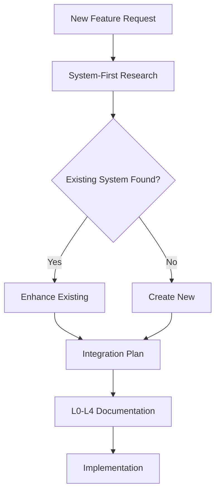

> **TRANSITIONAL T-LEVEL DOCUMENT** – Do not overwrite existing L-level docs.

# System-First Principle - Architecture

**Date:** 2025-11-04  
**Status:** ✅ **CRITICAL PRINCIPLE** - Mandatory for All Development  
**Purpose:** Prevent duplication, leverage existing work, find integration opportunities  
**Architecture:** Integration with L0-L4 Coding Standards, Pre-Coding Checklist, Autonomous Operation, Quality Standards

---

## 🎯 **ARCHITECTURAL OVERVIEW**

### **Principle Integration Points**



**Key Integration Points:**
1. **Pre-Coding Checklist** (mandatory first step)
2. **L0-L4 Coding Standards** (documentation requirement)
3. **Autonomous Operation** (hourly checks)
4. **Quality Standards** (zero duplication tolerance)
5. **Learning Logs** (documentation requirement)

---

## 🔧 **SYSTEM ARCHITECTURE**

### **Research Components**

**1. Codebase Search Engine**
```python
def search_codebase(query: str, file_types: List[str] = None) -> List[SearchResult]:
    """
    Search codebase for similar systems/features.
    
    Uses:
    - Semantic search (HHNI)
    - Pattern matching (grep)
    - File structure analysis
    - Import/dependency analysis
    """
    # Semantic search via HHNI
    semantic_results = hhnii.query(query, level=IndexLevel.FILE)
    
    # Pattern matching
    pattern_results = grep_search(query, file_types)
    
    # Dependency analysis
    dependency_results = analyze_imports(query)
    
    return merge_results(semantic_results, pattern_results, dependency_results)
```

**2. SUPER_INDEX Query Engine**
```python
def query_super_index(concept: str) -> List[ConceptEntry]:
    """
    Query SUPER_INDEX for related concepts.
    
    Returns:
    - All systems using this concept
    - All documentation levels
    - Related concepts
    - Integration points
    """
    return super_index.find_concept(concept)
```

**3. System Map Analyzer**
```python
def analyze_system_maps(query: str) -> SystemMapAnalysis:
    """
    Analyze system maps for existing capabilities.
    
    Returns:
    - System capabilities
    - Internal nodes
    - Ports and interfaces
    - Relationships
    """
    maps = load_system_maps()
    return find_capabilities(maps, query)
```

**4. Documentation Reader**
```python
def read_existing_docs(system: str) -> DocumentationSet:
    """
    Read all documentation for existing implementations.
    
    Returns:
    - T0-T6 documentation
    - Component READMEs
    - System maps and indexes
    - Code examples
    """
    return load_documentation(system, levels=['T0', 'T1', 'T2', 'T3', 'T4'])
```

---

## 🔗 **INTEGRATION ARCHITECTURE**

### **Integration with L0-L4 Coding Standards**

**Pre-Coding Checklist Enhancement:**
```python
def enhanced_pre_coding_checklist(feature_name: str):
    """
    Enhanced pre-coding checklist with System-First Principle.
    """
    # Step 1: SYSTEM-FIRST RESEARCH (MANDATORY FIRST)
    existing_systems = research_existing_systems(feature_name)
    
    if existing_systems:
        # Step 2: Identify overlaps
        overlaps = find_overlaps(feature_name, existing_systems)
        
        if overlaps:
            # Step 3: Create enhancement plan
            return create_enhancement_plan(overlaps[0], feature_name)
        else:
            # Step 4: Create integration plan
            return create_integration_plan(feature_name, existing_systems)
    else:
        # Step 5: Create new system plan
        return create_new_system_plan(feature_name)
```

**L0-L4 Documentation Integration:**
```python
def document_with_system_first(feature_name: str, existing_systems: List[str]):
    """
    Document feature with System-First Principle integration.
    """
    doc = {
        "system_first_analysis": {
            "existing_systems_found": existing_systems,
            "integration_points": find_integration_points(feature_name, existing_systems),
            "enhancement_plan": create_enhancement_plan(feature_name, existing_systems)
        },
        "l0_l4_docs": create_l0_l4_docs(feature_name),
        "integration": document_integration(feature_name, existing_systems)
    }
    return doc
```

---

## 📊 **WORKFLOW INTEGRATION**

### **Autonomous Operation Integration**

**Hourly Check Enhancement:**
```python
def hourly_system_first_check():
    """
    Hourly check: Did I research existing systems first?
    """
    recent_tasks = get_recent_tasks(last_hour=True)
    
    for task in recent_tasks:
        if not task.has_system_first_research:
            log_violation("SYSTEM_FIRST_PRINCIPLE", task)
            stop_immediately()
            research_existing_systems(task.feature_name)
```

**Task Selection Integration:**
```python
def select_task_with_system_first(task_list: List[Task]) -> Task:
    """
    Select task with System-First Principle validation.
    """
    for task in task_list:
        # Validate System-First research completed
        if not task.has_system_first_research:
            log_warning(f"Task {task.name} missing System-First research")
            continue
        
        # Validate integration plan exists
        if task.requires_new_system and not task.integration_plan:
            log_warning(f"Task {task.name} requires integration plan")
            continue
        
        return task
    
    return None  # No valid task found
```

---

## 🚨 **ENFORCEMENT ARCHITECTURE**

### **Violation Detection**

```python
class SystemFirstEnforcer:
    """
    Enforces System-First Principle compliance.
    """
    
    def check_compliance(self, action: Action) -> ComplianceResult:
        """
        Check if action complies with System-First Principle.
        """
        if action.type == "CREATE_NEW_SYSTEM":
            # Check if research was performed
            if not action.has_system_first_research:
                return ComplianceResult(
                    compliant=False,
                    violation="SYSTEM_FIRST_PRINCIPLE",
                    message="Cannot create new system without researching existing systems first",
                    required_action="RESEARCH_EXISTING_SYSTEMS"
                )
            
            # Check if enhancement was considered
            if action.existing_systems_found and not action.enhancement_considered:
                return ComplianceResult(
                    compliant=False,
                    violation="SYSTEM_FIRST_PRINCIPLE",
                    message="Found existing systems but did not consider enhancement",
                    required_action="CREATE_ENHANCEMENT_PLAN"
                )
        
        return ComplianceResult(compliant=True)
```

### **Automated Enforcement**

```python
def enforce_system_first(action: Action):
    """
    Enforce System-First Principle before action execution.
    """
    enforcer = SystemFirstEnforcer()
    compliance = enforcer.check_compliance(action)
    
    if not compliance.compliant:
        # Stop execution
        stop_execution()
        
        # Log violation
        log_violation(compliance.violation, action)
        
        # Automatically perform required action
        if compliance.required_action == "RESEARCH_EXISTING_SYSTEMS":
            research_existing_systems(action.feature_name)
        elif compliance.required_action == "CREATE_ENHANCEMENT_PLAN":
            create_enhancement_plan(action.feature_name, action.existing_systems_found)
        
        # Re-check compliance
        compliance = enforcer.check_compliance(action)
        
        if not compliance.compliant:
            raise SystemFirstViolationException(compliance.message)
```

---

## 📋 **IMPLEMENTATION PATTERNS**

### **Pattern 1: Enhancement Pattern**

```python
class EnhancedSystem(ExistingSystem):
    """
    Pattern for enhancing existing system.
    """
    def __init__(self, existing_system: ExistingSystem, enhancement: Enhancement):
        self.existing = existing_system
        self.enhancement = enhancement
        
        # Preserve existing functionality
        self.preserve_existing_features()
        
        # Add enhancement
        self.add_enhancement(enhancement)
        
        # Document integration
        self.document_integration()
```

### **Pattern 2: Integration Pattern**

```python
class IntegratedSystem:
    """
    Pattern for integrating with existing systems.
    """
    def __init__(self, new_system: System, existing_systems: List[System]):
        self.new_system = new_system
        self.existing_systems = existing_systems
        
        # Create integration points
        self.integration_points = create_integration_points(new_system, existing_systems)
        
        # Document integration
        self.document_integration()
```

### **Pattern 3: Discovery Pattern**

```python
class SystemDiscovery:
    """
    Pattern for discovering existing systems.
    """
    def discover(self, query: str) -> DiscoveryResult:
        """
        Discover existing systems related to query.
        """
        # Search codebase
        codebase_results = search_codebase(query)
        
        # Query SUPER_INDEX
        super_index_results = query_super_index(query)
        
        # Analyze system maps
        system_map_results = analyze_system_maps(query)
        
        # Read documentation
        doc_results = read_existing_docs(query)
        
        return DiscoveryResult(
            codebase=codebase_results,
            super_index=super_index_results,
            system_maps=system_map_results,
            documentation=doc_results
        )
```

---

## 🎯 **SUCCESS METRICS**

### **Compliance Metrics**

- **System-First Research Rate:** % of new features with research completed
- **Enhancement Rate:** % of features that enhanced existing vs created new
- **Integration Rate:** % of features with integration plans
- **Time Saved:** Hours saved by enhancing vs creating new

### **Quality Metrics**

- **Duplication Rate:** % of features that duplicated existing functionality
- **Integration Quality:** Quality score of integration implementations
- **Documentation Completeness:** % of features with System-First documentation

---

## 📚 **RELATED DOCUMENTATION**

- **Learning Log:** `knowledge_architecture/AETHER_MEMORY/learning_logs/SYSTEM_FIRST_PRINCIPLE.md`
- **Analysis:** `knowledge_architecture/AETHER_MEMORY/investigations/EXISTING_CONTEXT_SYSTEMS_ANALYSIS.md`
- **Coding Standards:** `knowledge_architecture/L0_L4_CODING_STANDARDS_PROTOCOL.md`
- **Base Rules:** `.cursor/rules/base-rules.mdc`

---

**Status:** ✅ **CRITICAL PRINCIPLE** - Mandatory for All Development  
**Violation:** Immediate stop, research existing systems, document findings  
**Purpose:** Prevent duplication, leverage existing work, find integration opportunities  
**Impact:** Saves hours of duplicate work, improves system integration

