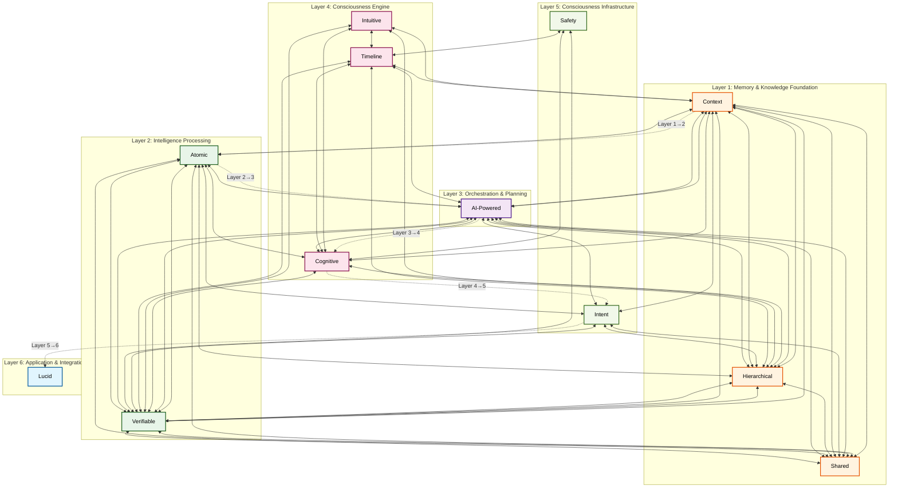

# AIM-OS Comprehensive System Architecture - Mermaid Diagram

**Generated by:** Sonnet
**Source:** `atlas.index.lucid.json5`
**Date:** 2025-01-27

This diagram shows the complete AIM-OS system architecture across 6 layers, with all systems and their relationships.

## Statistics

- **Total Systems:** 13
- **Total Nodes:** 101
- **Total Ports:** 69
- **Total Internal Edges:** 100
- **Total External Edges:** 69

