# AIM-OS Detailed System Architecture - Mermaid Diagram (With Components)

**Generated by:** Sonnet
**Source:** `atlas.index.lucid.json5`
**Date:** 2025-01-27

This diagram shows systems with their key internal components.

```mermaid
graph TB

    %% AIM-OS Detailed System Architecture with Components
    %% Generated by Sonnet - Detailed View

    subgraph L1["Layer 1: Memory & Knowledge Foundation"]
        subgraph cmc_contextMemoryCore["Context Memory Core"]
            cmc_contextMemoryCore_atomManager["Atommanager"]
            cmc_contextMemoryCore_snapshotEngine["Snapshotengine"]
            cmc_contextMemoryCore_storageManager["Storagemanager"]
            cmc_contextMemoryCore_writePipeline["Writepipeline"]
            cmc_contextMemoryCore_readPipeline["Readpipeline"]
        end
        subgraph hhni_hierarchicalHypergraph["Hierarchical Hypergraph Neural Index"]
            hhni_hierarchicalHypergraph_hierarchicalIndex["Hierarchicalindex"]
            hhni_hierarchicalHypergraph_dvnsPhysicsEngine["Dvnsphysicsengine"]
            hhni_hierarchicalHypergraph_coarseRetrieval["Coarseretrieval"]
            hhni_hierarchicalHypergraph_physicsRefinement["Physicsrefinement"]
            hhni_hierarchicalHypergraph_deduplicationEngine["Deduplicationengine"]
        end
        subgraph seg_sharedEvidenceGraph["Shared Evidence Graph"]
            seg_sharedEvidenceGraph_graphBuilder["Graphbuilder"]
            seg_sharedEvidenceGraph_contradictionDetector["Contradictiondetector"]
            seg_sharedEvidenceGraph_conflictResolver["Conflictresolver"]
            seg_sharedEvidenceGraph_knowledgeSynthesizer["Knowledgesynthesizer"]
            seg_sharedEvidenceGraph_evidenceValidator["Evidencevalidator"]
        end
    end

    subgraph L2["Layer 2: Intelligence Processing"]
        subgraph sdfcvf_atomicEvolution["Atomic Evolution Framework"]
            sdfcvf_atomicEvolution_quartetValidator["Quartetvalidator"]
            sdfcvf_atomicEvolution_atomicChangeManager["Atomicchangemanager"]
            sdfcvf_atomicEvolution_blastRadiusCalculator["Blastradiuscalculator"]
            sdfcvf_atomicEvolution_doraMetricsTracker["Dorametricstracker"]
            sdfcvf_atomicEvolution_qualityGateManager["Qualitygatemanager"]
        end
        subgraph vif_verifiableIntelligence["Verifiable Intelligence Framework"]
            vif_verifiableIntelligence_confidenceTracker["Confidencetracker"]
            vif_verifiableIntelligence_witnessManager["Witnessmanager"]
            vif_verifiableIntelligence_provenanceEngine["Provenanceengine"]
            vif_verifiableIntelligence_validationEngine["Validationengine"]
            vif_verifiableIntelligence_replayEngine["Replayengine"]
        end
    end

    subgraph L3["Layer 3: Orchestration & Planning"]
        subgraph apoe_aiPoweredOrchestration["AI-Powered Orchestration Engine"]
            apoe_aiPoweredOrchestration_aclCompiler["Aclcompiler"]
            apoe_aiPoweredOrchestration_dagExecutor["Dagexecutor"]
            apoe_aiPoweredOrchestration_roleDispatcher["Roledispatcher"]
            apoe_aiPoweredOrchestration_gateManager["Gatemanager"]
            apoe_aiPoweredOrchestration_budgetTracker["Budgettracker"]
        end
    end

    subgraph L4["Layer 4: Consciousness Engine"]
        subgraph cas_cognitiveAnalysis["Cognitive Analysis System"]
            cas_cognitiveAnalysis_activationTracker["Activationtracker"]
            cas_cognitiveAnalysis_categoryRecognizer["Categoryrecognizer"]
            cas_cognitiveAnalysis_attentionMonitor["Attentionmonitor"]
            cas_cognitiveAnalysis_failureModeDetector["Failuremodedetector"]
            cas_cognitiveAnalysis_learningExtractor["Learningextractor"]
        end
        subgraph iis_intuitiveIntelligence["Intuitive Intelligence System"]
            iis_intuitiveIntelligence_intuitionCalculator["Intuitioncalculator"]
            iis_intuitiveIntelligence_featureExtractor["Featureextractor"]
            iis_intuitiveIntelligence_learningEngine["Learningengine"]
            iis_intuitiveIntelligence_calibrationTracker["Calibrationtracker"]
            iis_intuitiveIntelligence_evolutionPredictor["Evolutionpredictor"]
        end
        subgraph tcs_timelineContext["Timeline Context System"]
            tcs_timelineContext_timelineTracker["Timelinetracker"]
            tcs_timelineContext_consciousnessJournaler["Consciousnessjournaler"]
            tcs_timelineContext_contextSummarizer["Contextsummarizer"]
            tcs_timelineContext_timelineIndexer["Timelineindexer"]
            tcs_timelineContext_dualPromptManager["Dualpromptmanager"]
        end
    end

    subgraph L5["Layer 5: Consciousness Infrastructure"]
        subgraph intent_classification_system["Intent Classification System"]
            intent_classification_system_classificationEngine["Classificationengine"]
            intent_classification_system_missionIntentModel["Missionintentmodel"]
            intent_classification_system_enforcementLayer["Enforcementlayer"]
            intent_classification_system_patternMatcher["Patternmatcher"]
            intent_classification_system_confidenceCalculator["Confidencecalculator"]
        end
        subgraph scor_safetyConsciousness["Safety Consciousness Operational Reliability"]
            scor_safetyConsciousness_scorInterface["Scorinterface"]
            scor_safetyConsciousness_invariantChecker["Invariantchecker"]
            scor_safetyConsciousness_baselineProbe["Baselineprobe"]
            scor_safetyConsciousness_socialSignalDetector["Socialsignaldetector"]
            scor_safetyConsciousness_redCellSimulator["Redcellsimulator"]
        end
    end

    subgraph L6["Layer 6: Application & Integration"]
        subgraph lucid_core_console["Lucid Core Console"]
            lucid_core_console_consoleUI["Consoleui"]
            lucid_core_console_rpcClient["Rpcclient"]
            lucid_core_console_voiceInput["Voiceinput"]
            lucid_core_console_voiceOutput["Voiceoutput"]
            lucid_core_console_phoneRemote["Phoneremote"]
        end
    end

```

