# 🌟 AIM-OS Epic System Architecture Atlas - Mermaid Diagram

**Generated by:** Sonnet
**Source:** `atlas.index.lucid.json5`
**Date:** 2025-01-27

## Overview

This epic diagram visualizes the complete AIM-OS consciousness substrate across 6 hierarchical layers, showing all systems and their relationships.

### Architecture Layers

1. **Layer 1: Memory & Knowledge Foundation** - Persistent storage and knowledge synthesis
2. **Layer 2: Intelligence Processing** - Core AI reasoning and verification
3. **Layer 3: Orchestration & Planning** - High-level coordination
4. **Layer 4: Consciousness Engine** - Meta-cognitive awareness
5. **Layer 5: Consciousness Infrastructure** - Supporting systems
6. **Layer 6: Application & Integration** - User-facing applications

### Statistics

- **Total Systems:** 13
- **Total Components:** 101
- **Total Integration Points:** 69
- **Total Internal Relationships:** 100
- **Total External Relationships:** 69

---

```mermaid
graph TB

    %% =========================================
    %% AIM-OS COMPREHENSIVE SYSTEM ARCHITECTURE
    %% Epic Atlas Map - Generated by Sonnet
    %% =========================================
    %% Systems: 13 | Nodes: 101 | Ports: 69

    subgraph L1["Layer 1: Memory & Knowledge Foundation"]
        cmc_contextMemoryCore["Context Memory Core"]
        hhni_hierarchicalHypergraph["Hierarchical Hypergraph Neural Index"]
        seg_sharedEvidenceGraph["Shared Evidence Graph"]
    end

    subgraph L2["Layer 2: Intelligence Processing"]
        sdfcvf_atomicEvolution["Atomic Evolution Framework"]
        vif_verifiableIntelligence["Verifiable Intelligence Framework"]
    end

    subgraph L3["Layer 3: Orchestration & Planning"]
        apoe_aiPoweredOrchestration["AI-Powered Orchestration Engine"]
    end

    subgraph L4["Layer 4: Consciousness Engine"]
        cas_cognitiveAnalysis["Cognitive Analysis System"]
        iis_intuitiveIntelligence["Intuitive Intelligence System"]
        tcs_timelineContext["Timeline Context System"]
    end

    subgraph L5["Layer 5: Consciousness Infrastructure"]
        intent_classification_system["Intent Classification System"]
        scor_safetyConsciousness["Safety Consciousness Operational Reliability"]
    end

    subgraph L6["Layer 6: Application & Integration"]
        lucid_core_console["Lucid Core Console"]
    end

    %% Primary Layer Flow
    cmc_contextMemoryCore -.->|Layer Flow| sdfcvf_atomicEvolution
    sdfcvf_atomicEvolution -.->|Layer Flow| apoe_aiPoweredOrchestration
    apoe_aiPoweredOrchestration -.->|Layer Flow| cas_cognitiveAnalysis
    cas_cognitiveAnalysis -.->|Layer Flow| intent_classification_system
    intent_classification_system -.->|Layer Flow| lucid_core_console

    %% System Integration Connections
    apoe_aiPoweredOrchestration <--> cas_cognitiveAnalysis
    apoe_aiPoweredOrchestration <--> cmc_contextMemoryCore
    apoe_aiPoweredOrchestration <--> hhni_hierarchicalHypergraph
    apoe_aiPoweredOrchestration <--> intent_classification_system
    apoe_aiPoweredOrchestration <--> scor_safetyConsciousness
    apoe_aiPoweredOrchestration <--> sdfcvf_atomicEvolution
    apoe_aiPoweredOrchestration <--> seg_sharedEvidenceGraph
    apoe_aiPoweredOrchestration <--> tcs_timelineContext
    apoe_aiPoweredOrchestration <--> vif_verifiableIntelligence
    cas_cognitiveAnalysis <--> cmc_contextMemoryCore
    cas_cognitiveAnalysis <--> hhni_hierarchicalHypergraph
    cas_cognitiveAnalysis <--> iis_intuitiveIntelligence
    cas_cognitiveAnalysis <--> scor_safetyConsciousness
    cas_cognitiveAnalysis <--> sdfcvf_atomicEvolution
    cas_cognitiveAnalysis <--> tcs_timelineContext
    cas_cognitiveAnalysis <--> vif_verifiableIntelligence
    cmc_contextMemoryCore <--> hhni_hierarchicalHypergraph
    cmc_contextMemoryCore <--> iis_intuitiveIntelligence
    cmc_contextMemoryCore <--> intent_classification_system
    cmc_contextMemoryCore <--> lucid_core_console
    cmc_contextMemoryCore <--> scor_safetyConsciousness
    cmc_contextMemoryCore <--> sdfcvf_atomicEvolution
    cmc_contextMemoryCore <--> seg_sharedEvidenceGraph
    cmc_contextMemoryCore <--> tcs_timelineContext
    cmc_contextMemoryCore <--> vif_verifiableIntelligence
    hhni_hierarchicalHypergraph <--> iis_intuitiveIntelligence
    hhni_hierarchicalHypergraph <--> intent_classification_system
    hhni_hierarchicalHypergraph <--> sdfcvf_atomicEvolution
    hhni_hierarchicalHypergraph <--> seg_sharedEvidenceGraph
    hhni_hierarchicalHypergraph <--> tcs_timelineContext
    hhni_hierarchicalHypergraph <--> vif_verifiableIntelligence
    iis_intuitiveIntelligence <--> vif_verifiableIntelligence
    intent_classification_system <--> lucid_core_console
    intent_classification_system <--> sdfcvf_atomicEvolution
    intent_classification_system <--> seg_sharedEvidenceGraph
    intent_classification_system <--> vif_verifiableIntelligence
    scor_safetyConsciousness <--> tcs_timelineContext
    scor_safetyConsciousness <--> vif_verifiableIntelligence
    sdfcvf_atomicEvolution <--> seg_sharedEvidenceGraph
    sdfcvf_atomicEvolution <--> vif_verifiableIntelligence
    seg_sharedEvidenceGraph <--> vif_verifiableIntelligence
    tcs_timelineContext <--> vif_verifiableIntelligence

    %% Layer Styling
    classDef L1Style fill:#fff3e0,stroke:#e65100,stroke-width:3px,color:#000
    class cmc_contextMemoryCore,hhni_hierarchicalHypergraph,seg_sharedEvidenceGraph L1Style
    classDef L2Style fill:#e8f5e9,stroke:#1b5e20,stroke-width:3px,color:#000
    class sdfcvf_atomicEvolution,vif_verifiableIntelligence L2Style
    classDef L3Style fill:#f3e5f5,stroke:#4a148c,stroke-width:3px,color:#000
    class apoe_aiPoweredOrchestration L3Style
    classDef L4Style fill:#fce4ec,stroke:#880e4f,stroke-width:3px,color:#000
    class cas_cognitiveAnalysis,iis_intuitiveIntelligence,tcs_timelineContext L4Style
    classDef L5Style fill:#f1f8e9,stroke:#33691e,stroke-width:3px,color:#000
    class intent_classification_system,scor_safetyConsciousness L5Style
    classDef L6Style fill:#e1f5fe,stroke:#01579b,stroke-width:3px,color:#000
    class lucid_core_console L6Style

```

## Diagram Legend

- **Solid lines with arrows (`-->`):** Unidirectional data flow
- **Double arrows (`<-->`):** Bidirectional integration
- **Dotted lines (`-.->`):** Layer flow relationships
- **Color coding:** Each layer has a distinct color scheme

## Usage

This diagram can be rendered in any Markdown viewer that supports Mermaid diagrams, including GitHub, GitLab, VS Code with Mermaid extensions, and many documentation platforms.

