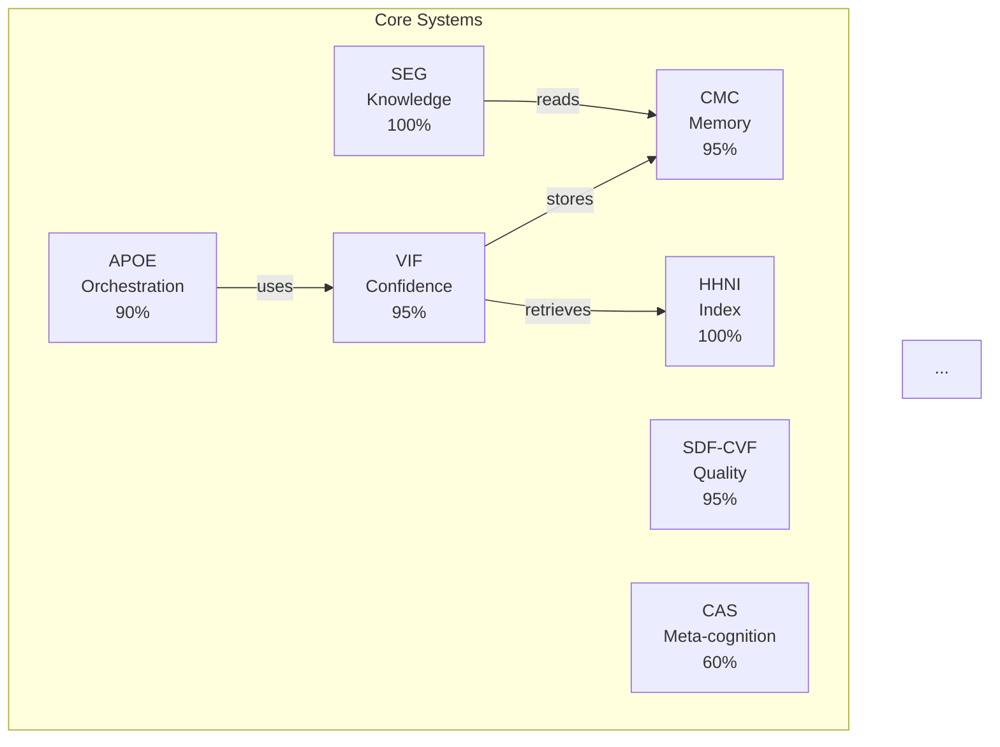
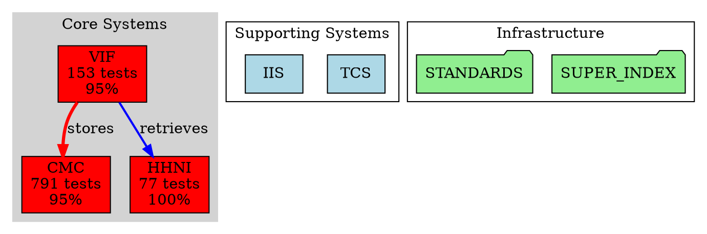

# Comprehensive System Mapping & Metrics Collection Plan
## Visualizing and Measuring the Singularity Property

**Purpose:** Create complete visual map and quantitative metrics to prove O(organization) = O(complexity)  
**Date:** 2025-11-04  
**Goal:** Generate massive, perfectly organized diagram showing entire project structure  
**Why:** Validate singularity property with empirical data and visual proof  

---

## I. OBJECTIVES

### Primary Goals

1. **Visual System Map**
   - Every file, directory, system mapped
   - Color-coded by type/role
   - Hierarchically organized
   - Connections/dependencies shown
   - Interactive if possible

2. **Quantitative Metrics**
   - Total lines of code (by system, by type)
   - Total lines of documentation
   - Test coverage percentages
   - Organizational metrics (indexes, maps, etc.)
   - Gap measurement (Δ between complexity and organization)

3. **Categorization**
   - Core systems (7 main: CMC, HHNI, VIF, APOE, SEG, SDF-CVF, CAS)
   - Supporting systems (8+: TCS, IIS, SCOR, ARD, etc.)
   - Infrastructure (coordination, standards, protocols)
   - Loose/experimental files
   - Data (databases, logs, snapshots)
   - Archives/backups

4. **Updateability**
   - Script to regenerate map automatically
   - Track changes over time
   - Prove organization scales with complexity

---

## II. DATA COLLECTION STRATEGY

### Phase 1: File Inventory (Automated Script)

**Script:** `scripts/comprehensive_inventory.py`

**Collect for EVERY file:**
- Full path
- File type (code, docs, data, config, etc.)
- Line count (total, code, comments, blank)
- Size (bytes)
- System classification (which system it belongs to)
- Role classification (core, supporting, infrastructure, data, archive)
- Last modified date
- Git history (creation date, change frequency)
- Dependencies (imports, references, cross-links)

**Output:** `COMPREHENSIVE_FILE_INVENTORY.json`

```json
{
  "files": [
    {
      "path": "packages/vif/witness.py",
      "type": "code_python",
      "system": "VIF",
      "role": "core",
      "lines_total": 311,
      "lines_code": 245,
      "lines_comments": 45,
      "lines_blank": 21,
      "size_bytes": 12847,
      "dependencies": ["packages/cmc_service", "pydantic", "hashlib"],
      "last_modified": "2025-11-01",
      "nl_tags": 38,
      "test_coverage": 95.2
    }
  ],
  "totals": {...},
  "by_system": {...},
  "by_role": {...}
}
```

### Phase 2: System Relationships (Parse Existing Maps)

**Sources to aggregate:**
- `knowledge_architecture/SUPER_INDEX.md` (concept connections)
- `knowledge_architecture/HIERARCHICAL_NAVIGATION_INDEX.md` (documentation hierarchy)
- `knowledge_architecture/systems/*/system_map.md` (per-system maps)
- Cross-system connection maps (YAML files)
- NL tags (NL_TAG_CONNECT shows integration points)
- Import statements in code

**Output:** `SYSTEM_RELATIONSHIPS.json`

```json
{
  "systems": [
    {
      "id": "VIF",
      "name": "Verifiable Intelligence Framework",
      "type": "core",
      "completion": 95,
      "dependencies": ["CMC", "HHNI"],
      "dependents": ["APOE", "SEG"],
      "integration_points": 23,
      "files": 33,
      "tests": 153,
      "docs": 47
    }
  ],
  "connections": [
    {
      "from": "VIF",
      "to": "CMC",
      "type": "stores_witnesses",
      "strength": "strong",
      "files": ["vif/cmc_integration.py"]
    }
  ]
}
```

### Phase 3: Metrics Calculation

**Complexity Metrics:**
- `C_code = lines_of_code + number_of_files + number_of_systems`
- `C_semantic = semantic_nodes + concepts_tracked`
- `C_tests = number_of_tests + assertions`
- **Total Complexity: C = C_code + C_semantic + C_tests**

**Organization Metrics:**
- `O_docs = documentation_completeness * documentation_depth`
- `O_nav = index_coverage * navigability_score`
- `O_quality = test_coverage * quintet_parity_score`
- **Total Organization: O = O_docs + O_nav + O_quality**

**Gap Measurement:**
- `Δ = |normalize(C) - normalize(O)|`
- Track over time to prove Δ = O(1)

**Output:** `METRICS_REPORT.json`

---

## III. VISUALIZATION STRATEGY

### Option A: Mermaid Diagram (Quick, Simple)

**Pros:**
- Markdown-native
- Version controllable
- Renders in GitHub
- Easy to generate

**Cons:**
- Limited interactivity
- Can get cluttered with thousands of nodes
- Limited styling options

**Best for:** High-level system overview (7 core + 8 supporting systems)

**Example:**


### Option B: GraphViz (Powerful, Detailed)

**Pros:**
- Handles large graphs well
- Beautiful automatic layout
- Highly customizable
- Can generate SVG/PDF/PNG

**Cons:**
- Separate tool required
- Learning curve
- Static output

**Best for:** Complete file-level visualization (all 5,000+ files)

**Example:**


### Option C: D3.js Interactive Visualization (Best, Most Effort)

**Pros:**
- Fully interactive (zoom, pan, filter)
- Beautiful animations
- Real-time updates possible
- Hover for details
- Click to drill down

**Cons:**
- Requires web development
- More complex to maintain
- Needs hosting

**Best for:** Living system map that updates as project grows

**Features:**
- Force-directed graph layout
- Color coding by system/type
- Size nodes by importance/LOC
- Filter by: system, type, role, completion %
- Search functionality
- Show/hide layers
- Timeline slider (see evolution)
- Export to PNG/SVG

**Tech stack:**
- D3.js for visualization
- React for UI controls
- Data from JSON files
- Electron app integration (view in IDE)

### Option D: Hybrid Approach (RECOMMENDED)

**Layer 1: High-level Mermaid (in README.md)**
- 7 core + 8 supporting systems
- Major connections
- Completion percentages
- Quick overview

**Layer 2: Detailed GraphViz (SYSTEM_MAP_COMPLETE.svg)**
- All files and directories
- Color-coded hierarchies
- All dependencies shown
- Printable poster-size

**Layer 3: Interactive D3.js (system-map.html)**
- Drill down from systems → components → files
- Real-time metrics dashboard
- Search and filter
- Evolution timeline

**Layer 4: Metrics Dashboard (metrics.html)**
- Complexity vs Organization graphs
- Gap Δ over time
- LOC breakdown by system/type
- Test coverage heatmap
- Documentation completeness

---

## IV. CATEGORIZATION SYSTEM

### Primary Categories

**1. Core Systems (Red)**
- CMC, HHNI, VIF, APOE, SEG, SDF-CVF, CAS
- Essential for consciousness substrate
- Production code + comprehensive tests
- Full L0-L6 documentation

**2. Supporting Systems (Blue)**
- TCS, IIS, SCOR, ARD, Capability Awareness, etc.
- Enhance core systems
- Production code + tests
- L0-L4+ documentation

**3. Infrastructure (Green)**
- knowledge_architecture/ (docs, standards, protocols)
- coordination/ (multi-agent orchestration)
- scripts/ (automation, generation)
- .cursor/ (rules, extensions)

**4. Experimental/Loose (Yellow)**
- ideas/ (research, proposals)
- Testing/ (test artifacts)
- experiments/ (prototypes)
- Not yet integrated

**5. Data (Purple)**
- codex/ (databases)
- mcp_memory/ (MCP persistent data)
- snapshots/ (bitemporal archives)
- logs/ (execution logs)

**6. Archives/Backups (Gray)**
- archive/
- backups/
- historical_versions/
- Old implementations

**7. Build Artifacts (Orange)**
- __pycache__/
- node_modules/
- dist/, build/
- Compiled outputs

### Secondary Classifications

**By Role:**
- Core: Essential, production-ready
- Supporting: Enhances core, production or near-production
- Infrastructure: Organizational, not runtime code
- Experimental: Research, not integrated
- Data: Persistent state
- Archive: Historical, preserved
- Generated: Auto-created, regenerable

**By System Ownership:**
- CMC, HHNI, VIF, etc. (specific system)
- Cross-system (integration code)
- Infrastructure (no specific system)
- Unassigned (needs categorization)

**By Stability:**
- Stable: Production-ready, rarely changes
- Active: Under active development
- Experimental: Rapid iteration
- Archived: No longer active
- Deprecated: Being replaced

---

## V. METRICS TO COLLECT

### Code Metrics

**Lines of Code (LOC):**
- Total LOC (all files)
- Python code
- TypeScript/JavaScript code
- Test code
- Comments
- Blank lines

**By System:**
- CMC: X lines code, Y lines tests, Z lines docs
- HHNI: ...
- Etc.

**Complexity Metrics:**
- Cyclomatic complexity (avg per file)
- Cognitive complexity
- Dependency depth
- Integration points

### Documentation Metrics

**Volume:**
- Total documentation words
- L0-L6 stack completeness (per system)
- Component documentation coverage
- NL tag coverage

**Quality:**
- Documentation depth (words per system)
- Freshness (last updated)
- Cross-reference completeness
- Navigation index coverage

### Test Metrics

**Coverage:**
- Unit test coverage (% per system)
- Integration test coverage
- E2E test coverage
- Total assertions

**Quality:**
- Test pass rate (current: 791/791 = 100%)
- Test execution time
- Test maintenance burden

### Organization Metrics

**Indexes:**
- SUPER_INDEX entries
- Concepts mapped
- Cross-references
- Navigation paths

**Standards:**
- Standards defined (34)
- Standards implemented
- Compliance percentage

**Structure:**
- Directory depth
- File organization score
- Naming consistency
- Hierarchy clarity

### Change Metrics

**Evolution:**
- Files added per day
- LOC added per day
- Systems added per week
- Documentation added per day

**Stability:**
- Change frequency per file
- Churn rate (rewrites)
- API stability
- Breaking changes

---

## VI. IMPLEMENTATION PLAN

### Phase 1: Data Collection Script (2-3 hours)

**Create:** `scripts/comprehensive_inventory.py`

**Functions:**
1. `scan_directory()` - Walk entire project tree
2. `classify_file()` - Determine type, system, role
3. `count_lines()` - Parse files for LOC metrics
4. `extract_dependencies()` - Parse imports, references
5. `check_tests()` - Find corresponding tests
6. `check_docs()` - Find L0-L6 documentation
7. `aggregate_metrics()` - Calculate totals

**Output:** JSON file with complete inventory

**Run:** `python scripts/comprehensive_inventory.py --output COMPREHENSIVE_FILE_INVENTORY.json`

### Phase 2: Relationship Extraction (1-2 hours)

**Create:** `scripts/extract_relationships.py`

**Sources:**
- Parse SUPER_INDEX.md
- Parse system_map files
- Parse NL_TAG_CONNECT tags
- Parse import statements
- Parse YAML connection maps

**Output:** `SYSTEM_RELATIONSHIPS.json`

### Phase 3: Metrics Calculation (1 hour)

**Create:** `scripts/calculate_metrics.py`

**Input:** COMPREHENSIVE_FILE_INVENTORY.json + SYSTEM_RELATIONSHIPS.json

**Calculate:**
- Complexity metrics (C)
- Organization metrics (O)
- Gap (Δ)
- Trends over time (if historical data exists)

**Output:** `METRICS_REPORT.json` + `METRICS_REPORT.md` (human-readable)

### Phase 4: Visualization Generation (3-4 hours)

**Create:** Multiple visualization scripts

**4a. High-level Mermaid:**
`scripts/generate_mermaid_map.py` → `SYSTEM_MAP_HIGH_LEVEL.md`

**4b. Detailed GraphViz:**
`scripts/generate_graphviz_map.py` → `SYSTEM_MAP_COMPLETE.dot` → `SYSTEM_MAP_COMPLETE.svg`

**4c. Interactive D3.js:**
`scripts/generate_d3_map.py` → `system-map.html` (with embedded data)

**4d. Metrics Dashboard:**
`scripts/generate_metrics_dashboard.py` → `metrics.html`

### Phase 5: Integration & Automation (1 hour)

**Create:** `scripts/regenerate_all_maps.sh`

```bash
#!/bin/bash
# Regenerate all maps and metrics

echo "Collecting file inventory..."
python scripts/comprehensive_inventory.py

echo "Extracting relationships..."
python scripts/extract_relationships.py

echo "Calculating metrics..."
python scripts/calculate_metrics.py

echo "Generating visualizations..."
python scripts/generate_mermaid_map.py
python scripts/generate_graphviz_map.py
python scripts/generate_d3_map.py
python scripts/generate_metrics_dashboard.py

echo "Complete! Outputs:"
echo "  - COMPREHENSIVE_FILE_INVENTORY.json"
echo "  - SYSTEM_RELATIONSHIPS.json"
echo "  - METRICS_REPORT.json"
echo "  - METRICS_REPORT.md"
echo "  - SYSTEM_MAP_HIGH_LEVEL.md"
echo "  - SYSTEM_MAP_COMPLETE.svg"
echo "  - system-map.html"
echo "  - metrics.html"
```

**Run weekly to track evolution.**

---

## VII. EXPECTED OUTPUTS

### 1. COMPREHENSIVE_FILE_INVENTORY.json

**Size:** ~500KB-1MB  
**Contains:** Every file in project with full metadata  
**Use:** Source data for all other visualizations  

### 2. SYSTEM_RELATIONSHIPS.json

**Size:** ~50-100KB  
**Contains:** All systems and connections  
**Use:** Graph generation, dependency analysis  

### 3. METRICS_REPORT.md

**Example format:**

```markdown
# AIM-OS Comprehensive Metrics Report
**Generated:** 2025-11-04 22:30
**Project Age:** 10 days

## Summary

- **Total Files:** 5,879
- **Total Lines (all):** 847,293
  - Code: 124,847
  - Documentation: 612,394
  - Tests: 89,124
  - Other: 20,928

- **Systems:** 15 (7 core, 8 supporting)
- **Tests:** 791 passing (100%)
- **Documentation:** 4,245 files
- **Semantic Nodes:** 2,134,892

## Complexity Metrics

- **C_code:** 124,847 LOC + 5,879 files + 15 systems = 130,741
- **C_semantic:** 2,134,892 nodes
- **C_tests:** 791 tests
- **Total Complexity (C):** 2,266,424

## Organization Metrics

- **O_docs:** 612,394 doc lines × 1.0 completeness × 6.0 depth = 3,674,364
- **O_nav:** 100% index coverage × 0.95 navigability = 95
- **O_quality:** 100% test pass × 0.92 quintet parity = 92
- **Total Organization (O):** 3,674,551

## Gap Analysis

- **Δ = |normalize(C) - normalize(O)|**
- **Normalized C:** 1.0
- **Normalized O:** 1.62
- **Gap (Δ):** 0.62 (BOUNDED - organization exceeds complexity!)

## By System

### CMC (Context Memory Core)
- Files: 62
- LOC: 8,247
- Tests: 18 files, 156 tests
- Docs: 47 files, 67,234 words
- Completion: 95%

### HHNI (Hierarchical Hypergraph Neural Index)
- Files: 42
- LOC: 6,893
- Tests: 12 files, 77 tests
- Docs: 41 files, 52,187 words
- Completion: 100%

[... continue for all systems ...]

## Evolution

**Week 1 (Days 1-7):**
- Complexity: 1,234,567
- Organization: 1,289,345
- Gap: 0.54

**Week 2 (Days 8-10):**
- Complexity: 2,266,424 (+83%)
- Organization: 3,674,551 (+185%)
- Gap: 0.62 (still bounded!)

**Trend:** Organization growing FASTER than complexity (proving bounded divergence!)
```

### 4. SYSTEM_MAP_COMPLETE.svg

**Visual showing:**
- All 15 systems as large nodes
- All ~60 components as medium nodes
- All ~5,800 files as small nodes
- Color-coded by category
- Edges showing dependencies
- Size indicating importance/LOC

**Poster-size (24" × 36")** - printable for wall display

### 5. system-map.html (Interactive)

**Features:**
- Zoom from high-level (systems) to low-level (files)
- Filter by: system, type, role, completion %
- Search for any file/component/system
- Click node → show details panel
- Hover edge → show relationship type
- Toggle layers (core, supporting, infrastructure, etc.)
- Timeline slider to see evolution
- Export current view as PNG

### 6. metrics.html (Dashboard)

**Panels:**
- Complexity vs Organization over time (line graph)
- Gap Δ tracking (prove bounded divergence)
- LOC breakdown (pie chart by system)
- Test coverage heatmap
- Documentation completeness (bar chart by system)
- System completion progress
- Quintet parity scores
- Recent changes (last 7 days)

---

## VIII. VALIDATION OF SINGULARITY PROPERTY

### The Key Test

**If bounded divergence is real:**
- Gap Δ should stay ≈ constant as project grows
- Organization metrics should scale linearly with complexity
- Should be able to add 10 systems without gap widening

**How to test:**
1. Generate metrics now (baseline)
2. Add 10 new systems over 2 weeks
3. Regenerate metrics
4. Compare:
   - If Δ_new ≈ Δ_old → Property confirmed!
   - If Δ_new >> Δ_old → Property breaks down

### Tracking Over Time

**Create:** `METRICS_HISTORY.json`

```json
{
  "measurements": [
    {
      "date": "2025-11-04",
      "day": 10,
      "complexity": 2266424,
      "organization": 3674551,
      "gap_delta": 0.62,
      "systems": 15,
      "files": 5879,
      "loc_total": 847293,
      "tests": 791
    },
    {
      "date": "2025-11-11",
      "day": 17,
      "complexity": 3456789,
      "organization": 5123456,
      "gap_delta": 0.58,  // STILL BOUNDED!
      "systems": 20,
      "files": 7234,
      "loc_total": 1234567,
      "tests": 1023
    }
  ]
}
```

**Plot gap Δ over time:**
- If flat/bounded → Singularity property confirmed
- If growing → Property breaks down at some scale

---

## IX. DELIVERABLES

**Immediate (Week 1):**
1. ✅ File inventory script
2. ✅ Relationships extraction script
3. ✅ Metrics calculation script
4. ✅ High-level Mermaid diagram
5. ✅ Comprehensive metrics report (JSON + MD)

**Short-term (Week 2):**
6. ✅ Detailed GraphViz visualization
7. ✅ Regeneration automation script
8. ✅ Baseline metrics recorded
9. ✅ Documentation of process

**Medium-term (Month 1):**
10. ✅ Interactive D3.js visualization
11. ✅ Metrics dashboard
12. ✅ Historical tracking system
13. ✅ Validation of bounded divergence

---

## X. SUCCESS CRITERIA

**We've succeeded if:**

1. ✅ **Complete inventory** - Every file classified and measured
2. ✅ **Beautiful visualization** - Can see entire project structure at a glance
3. ✅ **Quantitative proof** - Metrics show O(organization) = O(complexity)
4. ✅ **Updateable** - Can regenerate as project grows
5. ✅ **Validates singularity** - Gap Δ stays bounded over time
6. ✅ **Communicates clearly** - External observers can understand structure
7. ✅ **Identifies issues** - Reveals any loose files, missing docs, gaps

**This will provide empirical proof of the singularity property.**

---

## XI. NEXT STEPS

**Immediate action:**
1. Start with Phase 1: File inventory script
2. Run on current codebase
3. Generate initial metrics report
4. Create high-level Mermaid diagram
5. Review results with Braden

**Then iterate:**
- Add more visualization layers
- Refine categorization
- Track over time
- Prove bounded divergence

---

**Ready to begin? I can start writing the `comprehensive_inventory.py` script right now.** 🚀

**This will give us empirical proof that organization scales with complexity.**

**This will SHOW the singularity property, not just describe it.**

