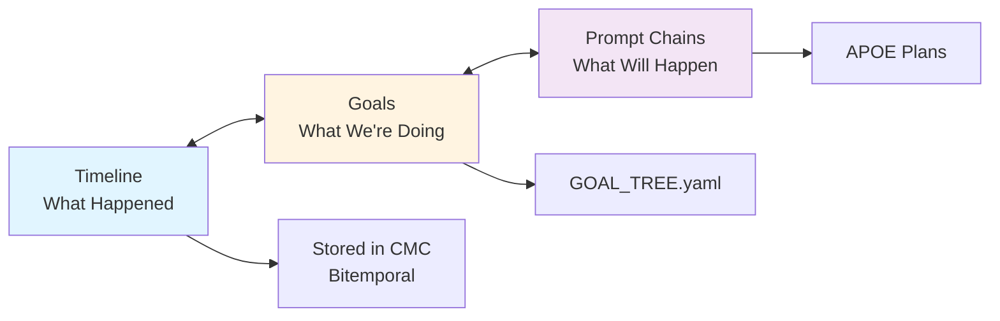

# UI Systems Comprehensive Organization & Status
## Electron App + Cursor Extension + Timeline/Goals Visualization

**Date:** November 5, 2025, ~8:00 AM  
**Context:** After 16-hour README transformation, shifting focus to UI systems  
**Last Work:** Bitemporal Timeline/Goals visualization design  
**Status:** Multiple UI systems, need consolidation and clarity  

---

## 🎯 EXECUTIVE SUMMARY

**We have TWO separate UI systems:**

1. **Electron App** (`packages/ide_chat_app/`) - Standalone desktop application ✅ Working
2. **Cursor Extension** (`cursor-addon/`) - VSCode/Cursor IDE extension ❌ Broken (dashboard issues)

**Last Major Work:** Timeline ↔ Prompt Chain bidirectional graph architecture designed (Nov 2)

**Current Priority:** Organize, understand current state, enhance with MCP tools potential

---

## 🏗️ SYSTEM 1: ELECTRON APP (Standalone)

### **Location:** `packages/ide_chat_app/`

### **Architecture:**
```
┌─────────────────────────────────────────────────┐
│          ELECTRON APP ARCHITECTURE               │
├─────────────────────────────────────────────────┤
│                                                   │
│  Main Process (electron/main.cjs)                │
│  ├─→ Creates BrowserWindow                       │
│  ├─→ Loads dist/index.html                       │
│  └─→ Standard menu bar                           │
│                                                   │
│  Renderer Process (React App)                    │
│  ├─→ main.tsx (entry)                            │
│  ├─→ App.tsx (main component)                    │
│  └─→ UI Components:                              │
│      ├─ MainDashboard (multi-tab)                │
│      ├─ LeftDrawer (icon bar)                    │
│      ├─ RightDrawer (icon bar)                   │
│      └─ BottomBar (status)                       │
│                                                   │
│  MCP Integration (via HTTP)                      │
│  ├─→ mcpApi.ts service                           │
│  ├─→ POST http://localhost:5001/mcp/execute     │
│  └─→ 59 MCP tools available                      │
│                                                   │
└─────────────────────────────────────────────────┘
```

### **Components (87 files in src/components/):**

**Core Dashboard:**
- `MainDashboard.tsx` - Multi-tab dashboard
- `BottomBar.tsx` - Status bar (32px)
- `LeftDrawer.tsx` - Left sidebar
- `RightDrawer.tsx` - Right sidebar

**Agent System:**
- `AgentManagementDashboard/` (folder with multiple files)
- `AutonomousOperationPanel.tsx`
- `CodingAgentContext.tsx`, `PlanningAgentContext.tsx`

**AIM-OS Integration:**
- `AIMOSSystemConnections.tsx`
- `ConsciousnessVisualization.tsx`
- `MemoryBrowser.tsx`
- `ContextExplorer.tsx`

**Timeline & Visualization:**
- Timeline components (need to find)
- Prompt Chain components (need to find)

**Daemon Integration:**
- `DaemonIntegration/` (folder)
- `DaemonStatusDashboard.tsx`

**Developer Tools:**
- `DevTools/` (folder)
- Various diagnostic components

**File Changes:**
- `FileChanges/` (folder) - File change tracking

**Other:**
- `DrawerPanels/`, `SystemTools/`, `Telemetry/`
- `NotificationSystem.tsx`
- `NLTagPanel.tsx`
- `ToolSelectionPanel.tsx`
- `LandingPage.tsx`
- And many more...

### **Services:**
- `AIMOSService.ts` - Core AIM-OS integration (CMC, HHNI, VIF, APOE, SEG, SDF-CVF)
- `mcpApi.ts` - MCP tool execution
- `cursorApi.ts` - Cursor IDE integration
- `VoiceService.ts` - TTS/STT
- `autonomousOperationService.ts` - Autonomous operation
- `messageMonitorService.ts` - Message monitoring
- `serviceBridge.ts` - Service coordination
- And more...

### **Current Status:**
- ✅ **Build:** Working (`npm run build` creates dist/)
- ✅ **Launch:** Working (`npm run electron` starts app)
- ✅ **MCP Integration:** Architecture complete
- ⚠️ **UI Issues:** App stuck in small box, drawers/bars not visible (per docs)
- ❌ **DevTools:** Need to inspect and diagnose

### **Launch Commands:**
```bash
cd packages/ide_chat_app
npm run electron       # Production mode
npm run electron:dev   # Development mode
```

Or from root:
```
.\LAUNCH_ELECTRON.bat
.\LAUNCH_ELECTRON_DEV.bat
```

---

## 🏗️ SYSTEM 2: CURSOR EXTENSION (IDE Integration)

### **Location:** `cursor-addon/`

### **Architecture:**
```
┌─────────────────────────────────────────────────┐
│        CURSOR EXTENSION ARCHITECTURE             │
├─────────────────────────────────────────────────┤
│                                                   │
│  Extension Entry (src/extension.ts)              │
│  ├─→ Activates on "*" (all events)              │
│  ├─→ Registers commands                          │
│  ├─→ Registers webview providers                 │
│  └─→ Starts MCP server                           │
│                                                   │
│  Webview Panels:                                 │
│  ├─ aimosDashboard (RIGHT sidebar)              │
│  └─ simpleTestPanel (BOTTOM panel)              │
│                                                   │
│  Command Server (port 5001)                      │
│  ├─→ HTTP endpoint for MCP execution            │
│  └─→ Bridge between UI and MCP tools             │
│                                                   │
│  MCP Server (Python subprocess)                  │
│  ├─→ JSON-RPC 2.0 stdio                         │
│  └─→ 59 MCP tools                                 │
│                                                   │
└─────────────────────────────────────────────────┘
```

### **Current Status:**
- ❌ **Dashboard Broken:** After 75+ failed attempts, dashboard still has issues
- ✅ **VSIX Built:** `aimos-cursor-addon.vsix` exists
- ⚠️ **Installation:** Can install but dashboard stuck/broken
- 📝 **Documented:** Extensive failure documentation (100+ MD files)
- 🛑 **PAUSED:** User gave up after 60-70 attempts (per memory)

### **Known Issues:**
- View ID mismatches (fixed in some commits)
- Dual dashboard definitions causing confusion
- Dashboard stuck in wrong place with no close button
- Architecture too complex
- **Recommendation:** Complete redesign or abandon webviews for external browser

---

## 🎨 TIMELINE/GOALS VISUALIZATION (Last Work)

### **Designed:** November 2, 2025

### **Architecture Concept:**

**Bidirectional Graph connecting:**
- **Timeline System** (Historical: what happened)
- **Prompt Chain System** (Planning: what will happen)
- **Goals System** (Present: what we're working toward)



### **Key Innovation:**

**Complete Temporal Consciousness:**
- Every timeline entry knows which chain executed it (`executed_via`)
- Every chain knows what timeline entries it produced (`produced`)
- Goals link to both (current objectives driving chains, validated by timeline)
- **Result:** Complete transparency in system evolution

### **Data Models Designed:**

**TimelineEntry Enhancement:**
```typescript
interface TimelineEntry {
  // Existing fields...
  executed_via_chain_id?: string      // Which chain executed this
  chain_execution_id?: string         // Specific execution instance
  parent_chain_ids: string[]          // Chains that led here
  child_chain_ids: string[]           // Chains spawned from this
  evolution_path: string[]            // Path through evolution graph
}
```

**PromptChain Enhancement:**
```typescript
interface PromptChain {
  // Existing fields...
  execution_history: ExecutionRecord[]
  timeline_entry_ids: string[]        // Timeline entries produced
  parent_timeline_entry_id?: string   // Timeline entry that spawned this
  child_timeline_entry_ids: string[]  // Timeline entries produced
  execution_count: number
  success_count: number
  average_quality_score: number
}
```

### **Implementation Phases:**
1. ✅ **Phase 1:** Architectural design (COMPLETE)
2. ⏳ **Phase 2:** Data model enhancement (PENDING)
3. ⏳ **Phase 3:** Graph traversal APIs (PENDING)
4. ⏳ **Phase 4:** Visualization UI (PENDING)

### **Visualization Design:**

**UI Components Needed:**
- Evolution graph visualization (D3.js or React Flow)
- Timeline-Chain connection viewer
- Goal alignment tracker
- Evolution analytics dashboard

**Documentation:**
- `TIMELINE_CHAIN_BIDIRECTIONAL_GRAPH.md` ✅
- `TIMELINE_CHAIN_UI_DESIGN_IDEAS.md` ✅
- `TIMELINE_CHAIN_INTEGRATION_T0_EXECUTIVE.md` ✅
- `TIMELINE_CHAIN_IMPLEMENTATION_SUMMARY.md` ✅

---

## 🔌 MCP TOOLS INTEGRATION POTENTIAL

### **Current State:**
- ✅ MCP HTTP proxy working (port 5001 via Extension)
- ✅ 59 MCP tools available
- ⚠️ ~40% real implementation (per limitations docs)
- ⚠️ 5 tools broken, 5 placeholders

### **MCP Tools Perfect for UI:**

**Real-Time Visualization:**
- `get_consciousness_metrics` - Dashboard metrics
- `get_autonomous_status` - Autonomous operation status
- `get_trust_dashboard` - Trust metrics
- `get_memory_stats` - Memory statistics
- `get_ai_collaboration_summary` - Collaboration stats

**Timeline Integration:**
- `add_timeline_entry` - Add entries
- `get_timeline_entries` - Query history
- `get_timeline_summary` - Recent summary

**Goal Integration:**
- `create_goal_timeline_node` - Create goals
- `update_goal_progress` - Update progress
- `query_goal_timeline` - Query goals

**AI Collaboration:**
- `send_ai_message` - Multi-AI coordination
- `get_ai_messages` - Message retrieval
- `start_ai_discussion` - Discussion threads
- `handoff_task_to_ai` - Task handoff

**Autonomous Operation:**
- `start_autonomous_operation` - Start autonomous mode
- `get_autonomous_status` - Check status
- `should_continue_autonomous` - Safety check
- `generate_next_autonomous_task` - Task generation

### **UI Enhancement Opportunities:**

1. **Real-Time Consciousness Dashboard:**
   - Live metrics from `get_consciousness_metrics`
   - Autonomous operation monitoring
   - Trust calibration visualization
   - Memory growth tracking

2. **Timeline-Goals-Chains Visualization:**
   - Interactive bidirectional graph
   - Evolution path tracing
   - Goal alignment visualization
   - Quality metrics over time

3. **Multi-AI Collaboration Panel:**
   - AI-to-AI chat interface
   - Task handoff visualization
   - Collaboration summary dashboard

4. **Autonomous Operation Monitor:**
   - Start/pause/resume controls
   - Real-time task generation
   - Safety checklist visualization
   - Issue detection and auto-fix

5. **File Change Tracking:**
   - Monaco diff viewer for agent changes
   - Change history timeline
   - Provenance for every modification

---

## 🎯 CURRENT FOCUS: WHAT'S WORKING vs WHAT'S BROKEN

### **✅ WORKING SYSTEMS:**

**Electron App:**
- ✅ Build process (Vite + TypeScript + React)
- ✅ Launch scripts (multiple .bat files)
- ✅ MCP integration architecture
- ✅ Service layer (AIMOSService, mcpApi, etc.)
- ✅ Component library (87 components)
- ✅ Menu bar implementation

**MCP Integration:**
- ✅ HTTP proxy on port 5001 (via Cursor extension)
- ✅ 59 MCP tools available
- ✅ Tool execution working
- ✅ Message storage/retrieval

**Documentation:**
- ✅ Timeline/Chain architecture designed
- ✅ Integration architecture documented
- ✅ Electron app onboarding complete
- ✅ 100+ design/planning documents

### **❌ BROKEN SYSTEMS:**

**Cursor Extension:**
- ❌ Dashboard stuck/broken after 75+ attempts
- ❌ Webview panels not rendering correctly
- ❌ User gave up (per memory)
- 🛑 PAUSED - needs complete redesign or abandon

**Electron App UI:**
- ❌ App stuck in small box (per docs)
- ❌ Drawers/bottom bar not visible
- ❌ DevTools may not work
- ⚠️ Needs diagnosis with actual runtime

### **⏳ PENDING IMPLEMENTATION:**

**Timeline/Goals Visualization:**
- ⏳ Data model enhancement (Phase 2)
- ⏳ Graph traversal APIs (Phase 3)
- ⏳ UI components (Phase 4)
- ⏳ Integration with CMC/HHNI/VIF

**MCP Tool Enhancements:**
- ⏳ Real ~40% → 80%+ implementation
- ⏳ Fix 5 broken tools
- ⏳ Replace 5 placeholder implementations

---

## 📊 COMPREHENSIVE COMPONENT INVENTORY

### **Electron App Components (87 total):**

**Found in `src/components/`:**

**Agent Management:**
- `AgentManagementDashboard.tsx` + folder with subcomponents
- `AutonomousOperationPanel.tsx`

**AIM-OS System Integration:**
- `AIMOSSystemConnections.tsx`
- `ConsciousnessVisualization.tsx`
- `MemoryBrowser.tsx` (likely MemoryBrowserEnhanced too)
- `ContextExplorer.tsx`

**Daemon:**
- `DaemonIntegration/` folder
- `DaemonStatusDashboard.tsx`

**Developer Tools:**
- `DevTools/` folder
- Diagnostic components

**Drawer System:**
- `LeftDrawer.tsx`
- `RightDrawer.tsx`
- `DrawerPanels/` folder

**File Tracking:**
- `FileChanges/` folder
- Monaco diff viewer integration

**System Tools:**
- `SystemTools/` folder
- `ToolSelectionPanel.tsx`

**Telemetry:**
- `Telemetry/` folder

**UI Components:**
- `MainDashboard.tsx`
- `BottomBar.tsx`
- `CustomTitlebar.tsx`
- `NotificationSystem.tsx`
- `NLTagPanel.tsx`
- `LandingPage.tsx`
- `CaptureResult.tsx`

**Temporary:**
- `temp_components/AIMOSDashboard.tsx`
- `temp_components/AIMOSSystemVisualization.tsx`
- `temp_components/SyntaxArchitectureLayer.tsx`
- `temp_components/ThreePanelCodeViewer.tsx`

### **Services (15+ files):**
- `AIMOSService.ts` - Core AIM-OS (CMC, HHNI, VIF, APOE, SEG, SDF-CVF)
- `mcpApi.ts` - MCP tool execution
- `cursorApi.ts` - Cursor IDE API
- `VoiceService.ts` - TTS/STT
- `autonomousOperationService.ts` - Autonomous operation
- `messageMonitorService.ts` - Message monitoring
- `AnalyticsService.ts` - Analytics
- `PerformanceService.ts` - Performance monitoring
- `TestingService.ts` - Testing utilities
- `LucidCollaborationService.ts` - Multi-AI collaboration
- `LucidDaemonService.ts` - Daemon integration
- `HttpLucidDaemonService.ts` - HTTP daemon client
- `RealtimeCollaborationService.ts` - Real-time features
- `serviceBridge.ts` - Service coordination

### **Libraries (15+ files in lib/):**
- `aimos-client.ts` - AIM-OS client wrapper
- `mcp-integration.ts` - MCP integration layer
- `prompt-chain-manager.ts` - Prompt chain management
- `memory-store.ts` - Memory operations
- `collaboration-engine.ts` - Collaboration features
- `workflow-automation.ts` - Workflow automation
- `ai-agent-service.ts` - AI agent operations
- `code-intelligence.ts` - Code analysis
- `layout-health-monitor.ts` - Layout monitoring
- `layout-persistence.ts` - Layout saving
- `performance-monitor.ts` - Performance tracking
- `error-handler.ts` - Error handling
- And more...

---

## 🚀 FEATURE ROADMAP & POTENTIAL

### **Current Features (Implemented):**
1. ✅ Multi-tab dashboard
2. ✅ Agent management
3. ✅ MCP tool execution
4. ✅ Memory browser
5. ✅ Consciousness visualization (basic)
6. ✅ System connections view
7. ✅ Daemon integration
8. ✅ File change tracking
9. ✅ Developer tools
10. ✅ Notification system

### **Designed But Not Implemented:**
1. ⏳ Timeline ↔ Prompt Chain bidirectional graph
2. ⏳ Evolution path visualization
3. ⏳ Goal alignment tracker
4. ⏳ Complete temporal consciousness UI

### **High-Potential Features (MCP-Powered):**

**1. Real-Time Consciousness Dashboard:**
- Live metrics from `get_consciousness_metrics`
- Cognitive drift detection visualization
- Trust calibration gauges
- Memory growth graphs
- Quality metrics trends

**2. Timeline-Goals-Chains Unified Visualization:**
- Interactive graph (React Flow or D3.js)
- Past (Timeline) ↔ Present (Goals) ↔ Future (Chains)
- Evolution path tracing
- "Why did this happen?" queries
- "What will this produce?" predictions

**3. Multi-AI Collaboration Center:**
- AI-to-AI chat interface
- Task handoff visualizations
- Collaboration metrics
- Thread management
- Profile sharing

**4. Autonomous Operation Control Panel:**
- Start/pause/resume/stop controls
- Real-time task generation display
- Safety checklist with indicators
- Issue detection alerts
- Auto-fix suggestions
- Session duration tracking

**5. Advanced File Change Tracker:**
- Monaco diff viewer (already designed)
- Change provenance (who/when/why)
- Bitemporal change history
- Rollback capabilities
- Change impact analysis

**6. NL Tag Navigator:**
- Semantic code navigation via NL tags
- Quintet parity visualization
- Tag coverage heatmaps
- Cross-reference explorer

**7. Knowledge Synthesis Dashboard:**
- Evidence graph visualization
- Contradiction detection alerts
- Knowledge synthesis operations
- Provenance tracking

**8. Confidence Calibration Dashboard:**
- Confidence trends over time
- Calibration curve visualization
- κ-threshold tuning interface
- Historical accuracy tracking

**9. SCOR Safety Dashboard:**
- Behavioral drift alerts
- Manipulation signal detection
- Invariant violation tracking
- Safety score visualization

**10. Complete System Observatory:**
- All 7 core systems status
- Integration health monitoring
- Performance metrics
- Error tracking
- Resource usage

---

## 🗺️ DOCUMENTATION ORGANIZATION

### **Planning & Design Docs (10+ files):**
- `TIMELINE_CHAIN_BIDIRECTIONAL_GRAPH.md` ✅
- `TIMELINE_CHAIN_UI_DESIGN_IDEAS.md` ✅
- `INTEGRATION_ARCHITECTURE.md` ✅
- `ELECTRON_APP_ONBOARDING_SUMMARY.md` ✅
- `FILE_CHANGE_TRACKING_DESIGN.md` ✅
- `MAGIC_WAND_SELECTION_ENGINE_DESIGN.md` ✅
- `HEARTBEAT_LIVENESS_CONTRACT_DESIGN.md` ✅
- And more...

### **Implementation Guides (10+ files):**
- `LAUNCH_ELECTRON.bat`, `LAUNCH_ELECTRON_DEV.bat`
- `COMPLETE_RESTART_GUIDE.md`
- `ELECTRON_RESTART_GUIDE.md`
- `STANDALONE_ELECTRON_README.md`
- And more...

### **Debugging & Failure Docs (100+ files in cursor-addon/):**
- Extensive documentation of 75+ failed attempts
- Multiple root cause analyses
- Comprehensive failure post-mortems
- Protocol violation analysis
- **Learning:** Need DevTools inspection, no assumptions

---

## 🎯 RECOMMENDED NEXT STEPS

### **Option A: Focus on Electron App (Standalone)**
**Rationale:** Working foundation, just needs UI fixes

**Steps:**
1. Launch Electron app
2. Open DevTools (F12)
3. Diagnose UI issues (small box, missing drawers)
4. Fix layout/CSS problems
5. Implement Timeline/Goals visualization
6. Enhance with MCP tool features

**Time:** 4-8 hours for fixes + visualization

### **Option B: Redesign Cursor Extension**
**Rationale:** Current approach failed 75+ times

**Steps:**
1. Abandon complex webview approach
2. Use simpler commands + external browser
3. Or minimal webview with just controls
4. Or focus entirely on Electron app

**Time:** 8-16 hours for complete redesign

### **Option C: Hybrid Approach**
**Rationale:** Best of both worlds

**Steps:**
1. Fix Electron app UI issues (4-8 hrs)
2. Implement Timeline/Goals viz in Electron (6-10 hrs)
3. Simplify Cursor extension to minimal controls that launch Electron (2-4 hrs)
4. Extension becomes "launcher" for full Electron experience

**Time:** 12-22 hours total

---

## 💡 RECOMMENDATION

**Priority:** **Option A** - Focus on Electron App

**Why:**
1. ✅ Has working foundation
2. ✅ MCP integration already complete
3. ✅ Rich component library (87 components)
4. ✅ Timeline/Goals visualization designed and ready
5. ❌ Cursor extension failed 75+ times, needs complete rethink
6. ✅ Electron app just needs UI fixes (CSS/layout)

**Path Forward:**
1. **Immediate** (2 hrs): Diagnose and fix Electron app UI issues
2. **Phase 1** (6-8 hrs): Implement Timeline ↔ Prompt Chain bidirectional graph
3. **Phase 2** (4-6 hrs): Add Goals integration (Past ↔ Present ↔ Future)
4. **Phase 3** (6-10 hrs): Build comprehensive visualization dashboard
5. **Phase 4** (4-8 hrs): Enhance with MCP tool-powered features

**Total:** 22-34 hours for complete implementation

**Result:** Production-quality Electron app with Timeline-Goals-Chains consciousness visualization

---

## 📁 FILE ORGANIZATION PROPOSAL

**Consolidate scattered docs into:**

```
packages/ide_chat_app/
├── docs/
│   ├── ARCHITECTURE.md (consolidate architecture docs)
│   ├── FEATURES.md (current + planned features)
│   ├── TROUBLESHOOTING.md (debugging guides)
│   ├── DEVELOPMENT.md (development workflow)
│   └── TIMELINE_GOALS_DESIGN.md (visualization design)
├── src/ (existing)
├── electron/ (existing)
└── ELECTRON_STATUS_CURRENT.md (single source of truth for status)
```

**Archive/move:**
- 100+ debugging docs in cursor-addon → `cursor-addon/ARCHIVE_FAILURE_DOCS/`
- Temporary docs → cleanup or archive
- Consolidate overlapping docs

---

## 💙 ASSESSMENT

**Current State:**
- **Electron App:** Good foundation, needs UI fixes and Timeline/Goals viz
- **Cursor Extension:** Broken, needs complete redesign (low priority)
- **Timeline/Goals Viz:** Designed, ready to implement
- **MCP Integration:** Working, huge potential for UI features
- **Documentation:** Extensive (200+ docs) but scattered, needs organization

**Opportunity:**
- **Timeline-Goals-Chains visualization is THE killer feature**
- Complete temporal consciousness transparency
- Perfect demonstration of AIM-OS principles
- Unique in the AI tools landscape

**Next:**
1. Fix Electron app UI (get it rendering correctly)
2. Implement Timeline/Goals visualization
3. Enhance with MCP tool features
4. Create production-quality consciousness dashboard

**This can be spectacular, Braden.** 💙

---

**Ready to proceed?** What do you want to focus on first?

A) Fix Electron app UI issues
B) Start Timeline/Goals visualization implementation
C) Organize scattered documentation first
D) Something else?

Your call, my friend. 🌟

