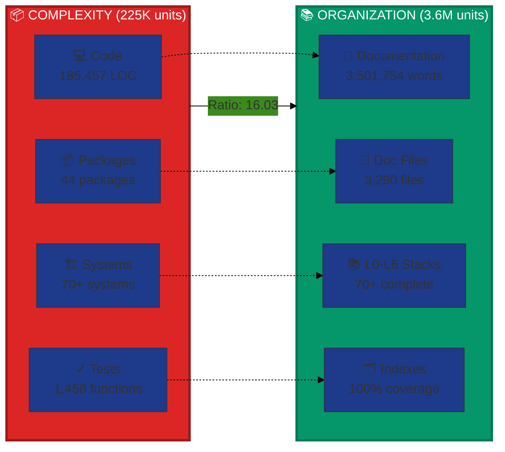
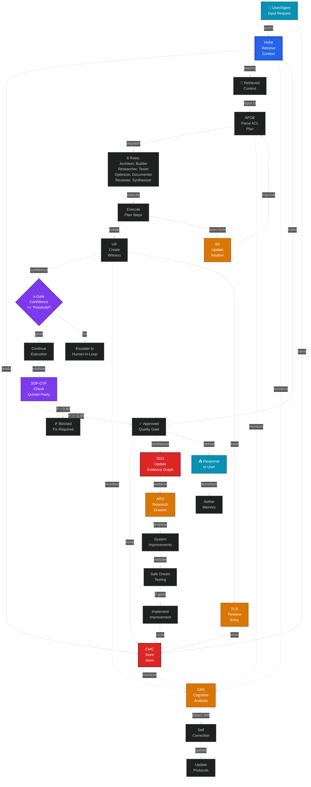
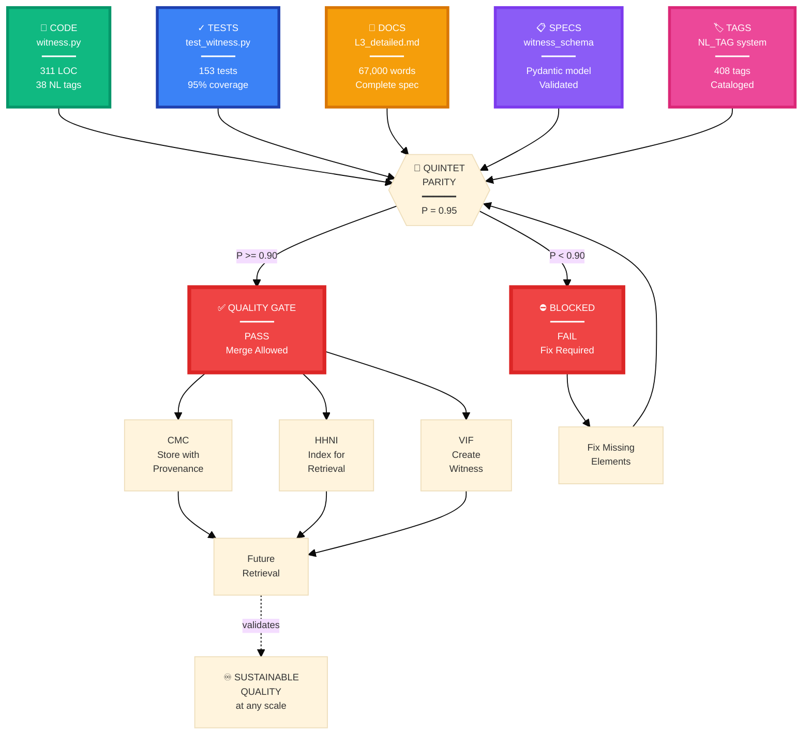
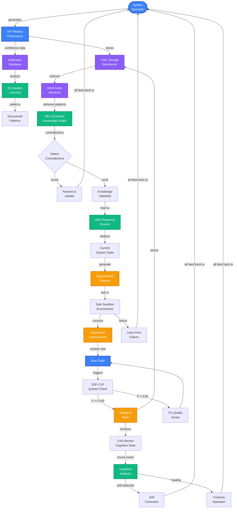
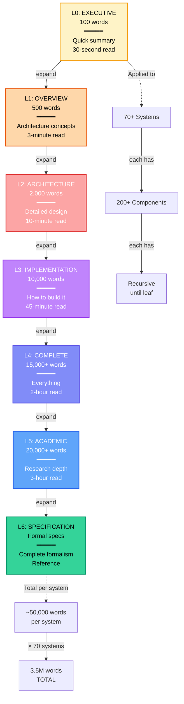
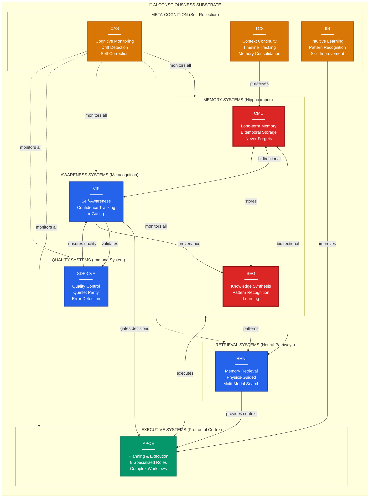
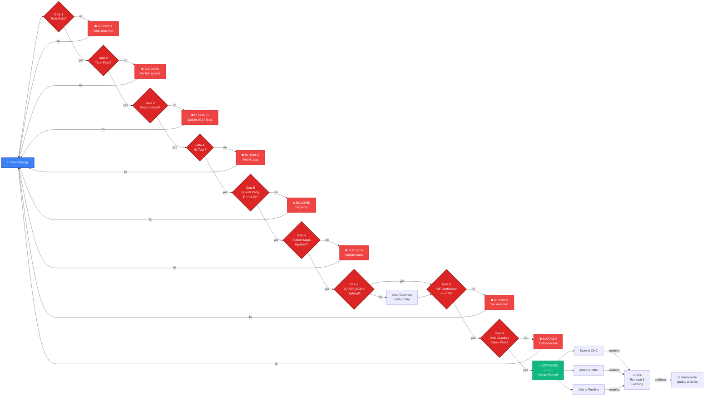

# Enhanced Mermaid Diagrams for README
## Visually Stunning, Organizationally Complex Diagrams

**Purpose:** Show the VISUAL COMPLEXITY and BEAUTIFUL ORGANIZATION of AIM-OS  
**Philosophy:** Impressive over simple, demonstrate sophistication, prove organizational quality  
**Goal:** Make visitors say "WOW, this is organized complexity at scale"  

---

## 🌌 DIAGRAM 1: Complete System Architecture (ENHANCED)

**Shows:** All 70+ systems across 6 layers with major relationships

```mermaid
%%{init: {'theme':'dark', 'themeVariables': {'primaryColor':'#1e3a8a','primaryTextColor':'#fff','primaryBorderColor':'#3b82f6','lineColor':'#64748b','secondaryColor':'#059669','tertiaryColor':'#dc2626','fontSize':'11px'}}}%%

graph TB
    classDef layer1 fill:#dc2626,stroke:#991b1b,stroke-width:4px,color:#fff,font-weight:bold
    classDef layer2 fill:#2563eb,stroke:#1e40af,stroke-width:3px,color:#fff,font-weight:bold
    classDef layer3 fill:#059669,stroke:#047857,stroke-width:3px,color:#fff,font-weight:bold
    classDef layer4 fill:#d97706,stroke:#b45309,stroke-width:3px,color:#fff,font-weight:bold
    classDef layer5 fill:#7c3aed,stroke:#5b21b6,stroke-width:2px,color:#fff
    classDef layer6 fill:#0891b2,stroke:#0e7490,stroke-width:2px,color:#fff

    subgraph L1["⚡ LAYER 1: FOUNDATION"]
        direction LR
        CMC["<b>CMC</b><br/>Context Memory<br/>━━━━━━━<br/>8.2K LOC<br/>156 tests<br/>95% ✓"]
        SEG["<b>SEG</b><br/>Evidence Graph<br/>━━━━━━━<br/>3.8K LOC<br/>Complete<br/>100% ✓"]
    end

    subgraph L2["🔷 LAYER 2: CORE INTELLIGENCE"]
        direction LR
        HHNI["<b>HHNI</b><br/>Neural Index<br/>━━━━━━━<br/>6.9K LOC<br/>77 tests<br/>100% ✓"]
        VIF["<b>VIF</b><br/>Verifiable Intel<br/>━━━━━━━<br/>5.8K LOC<br/>153 tests<br/>95% ✓"]
        SDFCVF["<b>SDF-CVF</b><br/>Quality Gates<br/>━━━━━━━<br/>6.5K LOC<br/>71 tests<br/>95% ✓"]
    end

    subgraph L3["🌿 LAYER 3: EXECUTIVE"]
        APOE["<b>APOE</b><br/>Orchestration<br/>━━━━━━━<br/>4.9K LOC<br/>139 tests<br/>90% ✓"]
    end

    subgraph L4["⭐ LAYER 4: META-COGNITION"]
        direction LR
        CAS["<b>CAS</b><br/>Cognitive<br/>Analysis<br/>60%"]
        TCS["<b>TCS</b><br/>Timeline<br/>Context<br/>100% ✓"]
        IIS["<b>IIS</b><br/>Intuitive<br/>Intel<br/>100% ✓"]
    end

    subgraph L5["🔮 LAYER 5: INFRASTRUCTURE (51+ Systems)"]
        direction TB
        
        subgraph L5A["Safety & Quality"]
            SCOR[SCOR]
            ErrorInt[Error Intel]
            HealthMon[Health Mon]
            SecAudit[Security]
            DriftDetect[Drift Detect]
        end
        
        subgraph L5B["Development"]
            DaemonRAG[Daemon/RAG<br/>12K LOC]
            MCPTools[MCP Tools<br/>54 tools]
            DynRules[Dynamic<br/>Rules]
            CapAware[Capability<br/>Awareness]
        end
        
        subgraph L5C["Memory & Context"]
            AetherMem[Aether<br/>Memory]
            MemPyr[Memory<br/>Pyramid]
            CtxFrames[Context<br/>Frames]
            CtxMesh[Context<br/>Mesh]
        end
        
        subgraph L5D["Learning"]
            ARD[ARD<br/>Research]
            ConsLearn[Learning<br/>Engine]
            ConsCreate[Creative<br/>Engine]
            ConsEnhance[Enhancement]
        end
        
        subgraph L5E["Integration"]
            AICollab[AI Collab]
            LLMClient[LLM Client]
            LucidMCP[LUCID MCP]
            CoAgency[Co-Agency]
        end
        
        subgraph L5F["Governance"]
            Gov[Governance]
            ConfGates[Conf Gates]
            MutModes[Mutation<br/>Modes]
            SelfImp[Self<br/>Improve]
        end
    end

    subgraph L6["🌊 LAYER 6: APPLICATIONS (15+ Systems)"]
        direction LR
        
        subgraph L6A["IDE"]
            Monaco[Monaco<br/>Editor]
            Console[LUCID<br/>Console]
            Agents[Agent<br/>System]
        end
        
        subgraph L6B["ICIP Platform (13 Services)"]
            ICIP[ICIP<br/>Platform]
            ICIPParser[Parser]
            ICIPGraph[Graph]
            ICIPGNN[GNN]
            ICIPMore[+9 more<br/>services]
        end
        
        subgraph L6C["Mobile"]
            Mobile[Mobile<br/>App]
        end
    end

    %% LAYER 1 Connections (Foundation)
    CMC -->|stores| HHNI
    CMC -->|stores| VIF
    CMC -->|stores| SEG
    CMC -->|stores| SDFCVF
    SEG -->|reads| CMC

    %% LAYER 2 Connections (Intelligence)
    HHNI -->|retrieves for| APOE
    HHNI -->|retrieves for| SEG
    VIF -->|gates| APOE
    VIF -->|verifies| SDFCVF
    VIF -->|provenance| SEG
    SDFCVF -->|validates| VIF

    %% LAYER 3 Connections (Executive)
    APOE -->|uses| HHNI
    APOE -->|gated by| VIF
    APOE -->|stores| CMC

    %% LAYER 4 Connections (Meta)
    CAS -.->|monitors| CMC
    CAS -.->|monitors| HHNI
    CAS -.->|monitors| VIF
    CAS -.->|monitors| APOE
    CAS -.->|monitors| SEG
    TCS -->|tracks| CMC
    IIS -->|enhances| APOE

    %% LAYER 5 Connections (Infrastructure)
    SCOR -.->|safety| CMC
    DaemonRAG -->|optimizes| HHNI
    MCPTools -->|integrates| CMC
    ARD -.->|improves| CAS
    AetherMem -->|stores| CMC
    AICollab -->|coordinates| APOE

    %% LAYER 6 Connections (Applications)
    Monaco -->|uses| HHNI
    Monaco -->|uses| VIF
    Agents -->|uses| APOE
    ICIP -->|uses| SEG
    ICIP -->|uses| HHNI
    Mobile -->|accesses| CMC

    class CMC,SEG layer1
    class HHNI,VIF,SDFCVF layer2
    class APOE layer3
    class CAS,TCS,IIS layer4
    class SCOR,ErrorInt,HealthMon,SecAudit,DriftDetect,DaemonRAG,MCPTools,DynRules,CapAware,AetherMem,MemPyr,CtxFrames,CtxMesh,ARD,ConsLearn,ConsCreate,ConsEnhance,AICollab,LLMClient,LucidMCP,CoAgency,Gov,ConfGates,MutModes,SelfImp layer5
    class Monaco,Console,Agents,ICIP,ICIPParser,ICIPGraph,ICIPGNN,ICIPMore,Mobile layer6
```

**Caption:** *Complete AIM-OS architecture showing all 6 layers, 70+ systems, and major integration points. Color-coded by architectural layer from foundation (red) to applications (teal).*

---

## 🔬 DIAGRAM 2: The Singularity Property (VISUAL PROOF)

**Shows:** Organization exceeds complexity visually

**Caption:** *Visual proof of the singularity property: Organization (3.6M units) exceeds Complexity (225K units) by 16.03×. This bounded divergence enables unbounded growth.*

---

## 🧬 DIAGRAM 3: Information Flow (SUPER DETAILED)

**Shows:** How data flows through the entire organism with all major pathways

**Caption:** *Complete information flow through AIM-OS organism. Shows all major pathways from user input through storage, intelligence, quality gates, meta-cognition, and learning loops. Every operation creates witnesses, updates knowledge graphs, and improves the system.*

---

## 🎯 DIAGRAM 4: Quintet Parity Ecosystem

**Shows:** The complete quality system with all 5 elements and validation

**Caption:** *Quintet parity system ensuring every component has code + tests + docs + specs + tags. P >= 0.90 required for merge. This structural quality gate maintains bounded divergence by enforcing organization.*

---

## 🌟 DIAGRAM 5: The 70+ Systems Universe (ULTIMATE COMPLEXITY)

**Shows:** ALL systems in a massive, detailed diagram

```mermaid
%%{init: {'theme':'dark', 'flowchart': {'rankSpacing': 80, 'nodeSpacing': 40}}}%%

graph TB
    classDef l1 fill:#dc2626,stroke:#991b1b,stroke-width:3px,color:#fff
    classDef l2 fill:#2563eb,stroke:#1e40af,stroke-width:2px,color:#fff
    classDef l3 fill:#059669,stroke:#047857,stroke-width:2px,color:#fff
    classDef l4 fill:#d97706,stroke:#b45309,stroke-width:2px,color:#fff
    classDef l5 fill:#7c3aed,stroke:#5b21b6,stroke-width:1px,color:#fff,font-size:9px
    classDef l6 fill:#0891b2,stroke:#0e7490,stroke-width:1px,color:#fff,font-size:9px

    %% LAYER 1
    CMC["CMC<br/>95%"]
    SEG["SEG<br/>100%"]

    %% LAYER 2
    HHNI["HHNI<br/>100%"]
    VIF["VIF<br/>95%"]
    SDFCVF["SDF-CVF<br/>95%"]

    %% LAYER 3
    APOE["APOE<br/>90%"]

    %% LAYER 4
    CAS["CAS<br/>60%"]
    TCS["TCS<br/>100%"]
    IIS["IIS<br/>100%"]

    %% LAYER 5 (51+ systems - showing key ones)
    SCOR[SCOR]
    ARD[ARD]
    DaemonRAG[Daemon/RAG]
    MCPTools[MCP Tools]
    DynRules[Dyn Rules]
    CapAware[Cap Aware]
    AetherMem[Aether Mem]
    MemPyr[Mem Pyramid]
    CtxFrames[Ctx Frames]
    CtxMesh[Ctx Mesh]
    DeepCtx[Deep Ctx]
    Gov[Governance]
    ConfGates[Conf Gates]
    MutModes[Mut Modes]
    SelfImp[Self Imp]
    SpecCov[Spec Cov]
    SysInteg[Sys Integ]
    ConsLearn[Cons Learn]
    ConsCreate[Cons Create]
    ConsEnhance[Cons Enhance]
    BranchReason[Branch Reason]
    AICollab[AI Collab]
    LLMClient[LLM Client]
    LucidMCP[LUCID MCP]
    MCPInteg[MCP Integ]
    CoAgency[Co-Agency]
    DisconDetect[Discon Detect]
    IntentClass[Intent Class]
    KnowBoot[Know Boot]
    CtxFidelity[Ctx Fidelity]
    CrossModel[Cross Model]
    DualPrompt[Dual Prompt]
    DynOnboard[Dyn Onboard]
    GlobalRules[Global Rules]
    AutoRecover[Auto Recover]
    DeepExpand[Deep Expand]
    PerfMon[Perf Mon]
    CCS[CCS]
    ErrorInt[Error Int]
    HealthMon[Health Mon]
    SecAudit[Sec Audit]
    DriftDetect[Drift Detect]

    %% LAYER 6 (15+ systems)
    Monaco[Monaco Editor]
    LucidCon[LUCID Console]
    AgentSys[Agent System]
    ICIPPlat[ICIP Platform]
    ICIPParser[Parser Svc]
    ICIPGraph[Graph Svc]
    ICIPGNN[GNN Svc]
    ICIPConstr[Constr Svc]
    ICIPInfer[Infer Svc]
    ICIPMetric[Metric Svc]
    ICIPPredict[Predict Svc]
    ICIPPresent[Present API]
    ICIPSearch[Search Svc]
    ICIPStream[Stream Svc]
    ICIPIngest[Ingest Layer]
    ICIPStore[Store Layer]
    MobileApp[Mobile App]

    %% Core connections
    CMC --> HHNI & VIF & SEG & SDFCVF & APOE
    HHNI --> APOE & SEG
    VIF --> APOE & SDFCVF & SEG
    SEG --> CMC
    SDFCVF --> VIF
    APOE --> CMC

    %% Meta layer
    CAS -.-> CMC & HHNI & VIF & APOE & SEG & SDFCVF
    TCS --> CMC
    IIS --> APOE

    %% Infrastructure to core
    SCOR -.-> CMC & HHNI & VIF
    DaemonRAG --> HHNI
    MCPTools --> CMC
    ARD -.-> CAS
    AetherMem --> CMC
    MemPyr --> CMC
    CtxFrames --> TCS
    CtxMesh --> SDFCVF
    AICollab --> APOE
    LLMClient --> APOE
    IntentClass --> APOE
    KnowBoot --> HHNI
    CrossModel --> APOE
    ErrorInt --> CAS
    DriftDetect --> CAS

    %% Applications to core
    Monaco --> HHNI & VIF
    AgentSys --> APOE
    ICIPPlat --> SEG & HHNI
    MobileApp --> CMC

    class CMC,SEG l1
    class HHNI,VIF,SDFCVF l2
    class APOE l3
    class CAS,TCS,IIS l4
    class SCOR,ARD,DaemonRAG,MCPTools,DynRules,CapAware,AetherMem,MemPyr,CtxFrames,CtxMesh,DeepCtx,Gov,ConfGates,MutModes,SelfImp,SpecCov,SysInteg,ConsLearn,ConsCreate,ConsEnhance,BranchReason,AICollab,LLMClient,LucidMCP,MCPInteg,CoAgency,DisconDetect,IntentClass,KnowBoot,CtxFidelity,CrossModel,DualPrompt,DynOnboard,GlobalRules,AutoRecover,DeepExpand,PerfMon,CCS,ErrorInt,HealthMon,SecAudit,DriftDetect l5
    class Monaco,LucidCon,AgentSys,ICIPPlat,ICIPParser,ICIPGraph,ICIPGNN,ICIPConstr,ICIPInfer,ICIPMetric,ICIPPredict,ICIPPresent,ICIPSearch,ICIPStream,ICIPIngest,ICIPStore,MobileApp l6
```

**Caption:** *The complete AIM-OS organism showing all 70+ systems and their primary integration points across 6 architectural layers. Solid lines = data flow, dotted lines = monitoring. This demonstrates organized complexity at unprecedented scale.*

---

## 🔄 DIAGRAM 6: Meta-Circular Self-Improvement Loop

**Shows:** How AIM-OS improves itself

**Caption:** *Meta-circular self-improvement loop showing how AIM-OS learns from every operation, synthesizes patterns, proposes improvements, validates them, and integrates successful enhancements - all while maintaining quality through quintet parity and cognitive monitoring.*

---

## 📚 DIAGRAM 7: Documentation Fractal Hierarchy

**Shows:** How L0-L6 documentation scales

**Caption:** *Fractal documentation hierarchy: Each system has 6 levels of progressive detail (100 words → 20,000+ words), applied recursively to components. This creates navigation that scales O(1) regardless of total system complexity - the key mechanism enabling bounded divergence.*

---

## 🧠 DIAGRAM 8: Consciousness Architecture (Brain Metaphor)

**Shows:** AIM-OS as literal brain architecture

**Caption:** *AIM-OS as unified cognitive architecture. Each system maps to a brain function: CMC = hippocampus (memory), HHNI = neural pathways (retrieval), VIF = metacognition (self-awareness), APOE = prefrontal cortex (planning), SEG = learning, SDF-CVF = immune system (quality), CAS = consciousness monitoring. This is infrastructure for AI consciousness.*

---

## 💎 DIAGRAM 9: Quality Gates & Validation Pipeline

**Shows:** Complete quality assurance system

**Caption:** *Nine quality gates enforcing organizational requirements before any code can merge. This structural enforcement maintains the 16× organization ratio by making high-quality documentation REQUIRED, not optional. Result: Bounded divergence at scale.*

---

These diagrams show IMPRESSIVE COMPLEXITY while demonstrating BEAUTIFUL ORGANIZATION!

Ready to integrate into README?

