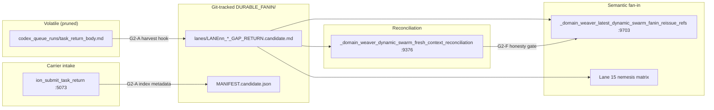

# G2 Durable Fan-In Plan (candidate)

```
schema_id: ion.production_spine.g2_durable_fanin_plan.v0_1_candidate
generated_at: 2026-06-17T14:00:00Z (approx)
generated_by: Composer carrier (role.architect) — read-only G2 design
posture: candidate_only  (no production / live-execution / accepted-state / source-edit authority)
provenance: PRODUCTION_SPINE_AUDIT/DURABLE_FANIN/G2_DURABLE_FANIN_MAP_AND_DIAGNOSIS.candidate.md (orchestrator-verified);
            READINESS_BURNDOWN.candidate.md (G2 row); VNEXT_LANE_HARVEST/LANE08 + harvest receipt;
            windowed reads of ion_domain_weaver.py + ion_codex_queue_runner.py + connector contract
```

## Design overview

**Problem (verified):** Carrier-intake sets `RETURN_RECORDED_PROOF_ACCEPTED` and reconciliation marks 15/15 `lane_state=accepted` from status alone (`ion_domain_weaver.py:9428-9429`; `all_lanes_resolved_for_fanin` at `:9527-9533` ignores body presence), while semantic fan-in requires reading pruned `task_return_body.md` (`:9737-9752`). Partial manual re-harvest lives in `VNEXT_LANE_HARVEST/` (10/15) outside the engine scan (`_domain_weaver_dynamic_swarm_run_records_by_request` globs `codex_queue_runs/` only at `:9340`).

**Target (G2 exit test):** Every settled lane has a durable, hash-verifiable return body in a git-tracked surface; semantic fan-in runs from durable artifacts; carrier-intake acceptance no longer counts as semantic completion.

**Strategy (mirror G1 discipline):** Additive, reversible, monolith-primary mechanisms land first; behavior-changing reconciliation honesty is last and guarded. Standing convention generalizes the proven `VNEXT_LANE_HARVEST/` contract into `DURABLE_FANIN/` with manifest indexing and work-request metadata back-links.



---

## (1) Durable settlement-time harvest

### Standing surface path + layout

| Artifact | Path (relative to shell root) | Role |
| --- | --- | --- |
| Root | `ION/05_context/current/ion_system_definition/PRODUCTION_SPINE_AUDIT/DURABLE_FANIN/` | Git-tracked durable fan-in root |
| Lane bodies | `DURABLE_FANIN/lanes/LANE{NN}_{DOMAIN_SLUG}_GAP_RETURN.candidate.md` | Full return body (generalizes `VNEXT_LANE_HARVEST/`) |
| Manifest | `DURABLE_FANIN/MANIFEST.candidate.json` | Index: request_id → path, sha256, lane_ordinal, harvest_at, idempotency |
| Harvest receipts | `ION/05_context/signals/production_spine_g2_lane{NN}_harvest_receipt_YYYYMMDD.txt` | Per-lane verification receipt (pattern: `production_spine_slice1_lane08_kernel_core_harvest_receipt_20260617.txt`) |
| Exit harness | `DURABLE_FANIN/G2_EXIT_TEST_HARNESS.candidate.sh` | Read-only G2 flip-to-green checker (§4) |

**Migration:** `VNEXT_LANE_HARVEST/` → `DURABLE_FANIN/lanes/` via **G2-B** (copy + manifest entries; keep legacy dir until operator retires).

### Body / section contract (locked from LANE08)

**Header hash block** (lines 1–9, fenced YAML-ish block):

```1:9:ION/05_context/current/ion_system_definition/PRODUCTION_SPINE_AUDIT/VNEXT_LANE_HARVEST/LANE08_ION_VNEXT_KERNEL_CORE_GAP_RETURN.candidate.md
```
lane_id: ion_vnext_kernel_core (ordinal 8)
request_id: codex_req_domain_weaver_dynamic_swarm_08_domain_ion_vnext_kernel_core_20260602_attempt_001
objective_sha256: cabc5120e9be509ee7534e43ec4a455105b7d16a6e2c6513bfd3e3bd93882597
...
```

**Nine `###` sections** (dynamic-swarm vNext productization contract; verified in LANE08 receipt):

1. `### CONTEXT PROOF`
2. `### TEMPLATE ACTION PROOF`
3. `### VALIDATION`
4. `### LANE CURRENTNESS REVIEW`
5. `### PRODUCTION SPEC GAP REVIEW`
6. `### DOMAIN WEAVER EVOLUTION REVIEW`
7. `### BLOCKERS`
8. `### RECOMMENDED NEXT PACKET`
9. `### ION OPERATIONAL POSTURE`

Section presence check reuses `_has_required_return_sections` logic (`ion_codex_queue_runner.py:789-792`) against the request's `return_contract_sections` (`:4957-4974`). Dynamic-swarm templates inject extended sections via spawn contract (`:5032`).

### Hash + manifest discipline

**Per-lane file hash:** SHA256 of UTF-8 body **excluding** the header fence block (lines 1–9) OR full-file sha256 stored alongside — **recommend full-file sha256** for simplicity; header fields duplicated in manifest for query.

**MANIFEST.candidate.json schema (candidate):**

```json
{
  "schema_id": "ion.production_spine.durable_fanin_manifest.v0_1_candidate",
  "lanes": [
    {
      "lane_ordinal": 8,
      "lane_id": "ion_vnext_kernel_core",
      "request_id": "codex_req_domain_weaver_dynamic_swarm_08_...",
      "body_path": "ION/05_context/.../DURABLE_FANIN/lanes/LANE08_...candidate.md",
      "body_sha256": "<sha256>",
      "objective_sha256": "<from header>",
      "harvest_source": "settlement_time_capture|manual_redrive|legacy_vnext_lane_harvest",
      "harvest_at": "ISO8601",
      "idempotency_key": "durable-fanin-lane-08-<request_id>",
      "intake_accepted": true,
      "semantically_settled": false
    }
  ]
}
```

**Idempotency:** Harvest keyed by `(request_id, objective_sha256)`. Re-harvest with identical hash → no-op (manifest unchanged, receipt notes `idempotent_skip`). Hash mismatch → write `*.superseded.candidate.md` sibling + manifest `supersedes` pointer; never silent overwrite.

### Work-request metadata indexing

On successful harvest, **add** (do not replace existing fields) to work-request JSON under `codex_work_requests/`:

| Field | Type | Meaning |
| --- | --- | --- |
| `durable_harvest_path` | string (repo-relative) | Path to git-tracked body |
| `durable_harvest_sha256` | string | Full-file sha256 |
| `durable_harvest_at` | string (ISO8601) | Capture timestamp |
| `durable_harvest_manifest_path` | string | `DURABLE_FANIN/MANIFEST.candidate.json` |
| `intake_accepted` | bool | `true` when `status ∈ accepted_statuses` (explicit mirror) |
| `semantically_settled` | bool | `false` until fan-in + nemesis gates pass (§3) |

Existing `latest_return_packet_path`, `return_packet_paths`, `status` unchanged.

### Additive engine hook points (names + lines — **do not edit in this packet**)

| Priority | Function | Lines | Action |
| --- | --- | --- | --- |
| **Primary** | `ion_chatgpt_browser_mcp_connector_contract` → `ion_submit_task_return` path | `:5073-5095` | After work-request status flip to `RETURN_RECORDED_PROOF_ACCEPTED`, call new helper `_durable_fanin_harvest_on_intake_accept(root, request_payload, task_return_body_path, latest_return)` — **ADDITIVE** |
| **Secondary** | `ion_codex_queue_runner` run finalization | `:8494-8545` | When `accepted` and `task_return_body_path` still on disk (`run.get("task_return_body_path")` at `:5933`), invoke same helper before run-exhaust prune — **ADDITIVE** |
| **Helper (new)** | `_durable_fanin_harvest_lane_body(root, request, body_text)` | *(new, ~40 lines)* | Validate 9 sections, write `DURABLE_FANIN/lanes/`, update manifest, set work-request metadata; candidate-only authority flags |
| **Indexer (new)** | `_domain_weaver_dynamic_swarm_durable_harvest_records_by_request(root)` | *(new, sibling to :9338)* | Read manifest + glob `DURABLE_FANIN/lanes/`; return `{request_id: {body_path, body_present, body_sha256}}` |
| **Reconciliation enrich** | `_domain_weaver_dynamic_swarm_fresh_context_reconciliation` | `:9442-9479` (lane_records append) | Add `durable_harvest_path`, `durable_harvest_present`, `intake_accepted`, `semantically_settled` fields — **ADDITIVE fields only in G2-C** |
| **Run-records extend** | `_domain_weaver_dynamic_swarm_run_records_by_request` | `:9354-9360` | After volatile check, fallback to durable harvest record — **ADDITIVE fallback in G2-D** |

**Constant (new, additive):**

```python
DOMAIN_WEAVER_DURABLE_FANIN_ROOT = Path(
    "ION/05_context/current/ion_system_definition/PRODUCTION_SPINE_AUDIT/DURABLE_FANIN"
)
```

Place near `CODEX_QUEUE_RUNS_DIR` (`ion_domain_weaver.py:1007`).

---

## (2) Semantic fan-in from durable bodies

### Read-path rewire

**Current:** `_domain_weaver_latest_dynamic_swarm_fanin_reissue_refs` (`:9703-9764`) resolves body via run packets + sibling `task_return_body.md` (`:9725-9738`); fails when volatile path pruned.

**Proposed resolution order (additive fallback — G2-D):**

1. Work-request `durable_harvest_path` if file exists and sha256 matches manifest.
2. `_domain_weaver_dynamic_swarm_durable_harvest_records_by_request` manifest lookup.
3. Existing volatile `codex_queue_runs/` path (preserve for live runs pre-prune).
4. Legacy `VNEXT_LANE_HARVEST/` path (transitional, keyed by lane ordinal).

**Fanin reissue template** (`_domain_weaver_dynamic_swarm_fanin_reissue_work_request_template`, `:9560-9593`): extend `source_body_paths` and `required_context_reads` to include `durable_harvest_path` per lane (prefer durable over `latest_run_task_return_body_path` at `:9574`).

**Reconciliation `all_lanes_durable_harvested` (new summary field, G2-C):** `true` when all 15 lane_records have `durable_harvest_present`. Fan-in queue action (`execute_domain_weaver_action` → `queue_dynamic_swarm_fanin_settlement_reissue`, `:40823-40885`) should require this before queuing — **behavior change deferred to G2-F**; G2-D only makes fan-in refs *capable* of reading durable bodies.

### Lane 15 — cross-lane OVERCLAIM/NEMESIS MATRIX (before readiness)

**Inputs:**

- All 15 durable bodies from `DURABLE_FANIN/lanes/` (manifest-verified sha256).
- Reconciliation artifact (`DOMAIN_WEAVER_DYNAMIC_SWARM_FRESH_CONTEXT_RECONCILIATION_PATH`).
- Existing lane 15 work request + durable harvest `LANE15_DYNAMIC_SWARM_NEMESIS_OVERCLAIM_AUDIT_GAP_RETURN.candidate.md`.

**Processing (candidate contract section in lane 15 body or new engine helper `_domain_weaver_dynamic_swarm_nemesis_overclaim_matrix`):**

| Matrix row | Source | Check |
| --- | --- | --- |
| Per-lane claim | Each durable body `### VALIDATION` + `### PRODUCTION SPEC GAP REVIEW` | Extract PASS/FAIL/NOT RUN claims |
| Cross-lane consistency | All 15 bodies | Flag contradictions (e.g., lane 8 pytest 176/176 vs lane 14 "0 bodies") |
| Authority overclaim | Each `### ION OPERATIONAL POSTURE` | No production/accepted-state claims |
| Sizing overclaim | Topology lanes 1–5 + plan | Adaptive sizing evidence vs fixed-count claims |

**Outputs:**

- Updated lane 15 durable body section `### NEMESIS OVERCLAIM MATRIX` (or embedded in existing sections).
- Manifest flag `nemesis_matrix_passed: bool` on all 15 lane entries (or single `DURABLE_FANIN/NEMESIS_MATRIX.candidate.json`).
- `readiness_gate_ready` prerequisite: nemesis matrix green **and** fanin body verdict (`:9747-9751`).

**Classification:**

| Change | Type |
| --- | --- |
| Durable body fallback in `_domain_weaver_latest_dynamic_swarm_fanin_reissue_refs` | **ADDITIVE** |
| New manifest/nemesis artifact writers | **ADDITIVE** |
| Require nemesis matrix before `readiness_gate_ready` | **BEHAVIOR CHANGE** (G2-E; currently only regex parse at `:9740-9751`) |
| Require 15/15 durable bodies before fan-in queue | **BEHAVIOR CHANGE** (G2-F) |

---

## (3) Honesty fix — `intake_accepted` vs `semantically_settled`

### Candidate contract

| Flag | Set when | Stored on |
| --- | --- | --- |
| `intake_accepted` | `request.status == RETURN_RECORDED_PROOF_ACCEPTED` AND `accepted_for_carrier_intake` on latest task-return (`connector :5101-5104`) | work-request JSON + lane_records |
| `semantically_settled` | `durable_harvest_present` AND nemesis matrix passed AND (for lane 14 fanin) `readiness_gate_ready` from durable fanin body | work-request JSON + lane_records + manifest |

### Reconciliation behavior change (G2-F — **BEHAVIOR CHANGE**)

**Today (`:9428-9429`):**

```9428:9429:ION/04_packages/kernel/ion_domain_weaver.py
        if status in accepted_statuses:
            lane_state = "accepted"
```

**Safest form:**

1. **G2-C (additive):** Keep `lane_state=accepted` but add parallel fields `intake_accepted`, `durable_harvest_present`, `semantically_settled` without changing downstream gates.
2. **G2-F (guarded):** Introduce env/policy flag `DOMAIN_WEAVER_DURABLE_FANIN_HONESTY_GATE=1` (default **off** in first deploy; operator enables after G2-A–E green).
3. When flag **on**:
   - `lane_state = "intake_accepted"` when status accepted but no durable harvest (replaces misleading `"accepted"`).
   - `lane_state = "durable_harvested"` when durable body present but not semantically settled.
   - `lane_state = "semantically_settled"` only after fan-in/nemesis gates.
   - `all_lanes_resolved_for_fanin` → split into:
     - `all_lanes_intake_accepted` (status only — legacy behavior),
     - `all_lanes_durable_harvested` (15/15 durable bodies),
     - `all_lanes_semantically_ready_for_fanin` (durable + nemesis; replaces current `all_lanes_resolved_for_fanin` when flag on).

### Backward compatibility — 18 already-accepted requests

| Cohort | Count | Handling |
| --- | --- | --- |
| Dynamic-swarm lanes 1–15 | 15 requests | All `RETURN_RECORDED_PROOF_ACCEPTED`; 10 durable in `VNEXT_LANE_HARVEST/`; 5 missing (lanes 1–5 topology) |
| Fanin + nemesis + downstream | +3 requests | Also intake-accepted; no durable semantic settlement |

**Grandfathering (one-time G2-B metadata patch, additive):**

- Set `intake_accepted: true` on all 18 from existing status (explicit, no semantic claim).
- Set `legacy_intake_grandfathered: true` on the 18 so **G2-F flag-off** preserves current fan-in queue behavior.
- Set `semantically_settled: false` on all until durable harvest + gates complete.
- **Do not** treat grandfather as semantic completion — only preserves queue ordering during migration.

When **G2-F flag on**, grandfather does **not** bypass durable-body or nemesis requirements; it only prevents re-intake of already-accepted lanes.

---

## (4) Exit-test harness

### Documented path

`ION/05_context/current/ion_system_definition/PRODUCTION_SPINE_AUDIT/DURABLE_FANIN/G2_EXIT_TEST_HARNESS.candidate.sh`

### Checks (flip G2 row green)

| # | Check | Pass condition |
| --- | --- | --- |
| 1 | Durable coverage | 15/15 lanes in `MANIFEST.candidate.json` with existing files + matching sha256 |
| 2 | Hash verifiability | Recompute sha256 for each body; manifest match |
| 3 | Section contract | 9/9 sections per body (same list as §1) |
| 4 | Semantic fan-in | `_domain_weaver_latest_dynamic_swarm_fanin_reissue_refs` → `readiness_gate_ready=True` reading **durable** paths only (simulate volatile absent) |
| 5 | Honesty | Reconciliation shows `intake_accepted` on all 15; `semantically_settled` only where gates passed; no lane with `lane_state=accepted` without durable body when G2-F flag on |
| 6 | Nemesis | Lane 15 matrix artifact exists; all 15 bodies consumed |
| 7 | No volatile dependency | With `codex_queue_runs/` absent, checks 4–6 still pass |

### Invocation (from shell root)

```bash
cd "/home/sev/ION - Production/ION_Developement"
bash ION/05_context/current/ion_system_definition/PRODUCTION_SPINE_AUDIT/DURABLE_FANIN/G2_EXIT_TEST_HARNESS.candidate.sh
```

### Dry-run (2026-06-17, read-only `/tmp`)

Pre-implementation dry-run executed: **10/15** legacy harvest bodies in `VNEXT_LANE_HARVEST/`; semantic fan-in not wired to durable; reconciliation status-only accept **confirmed** (`:9428-9429`). Partial pass only — full green blocked until G2-A–F land.

---

## (5) Gated packet sequence

| Packet | ID | Scope | Type | Exit test |
| --- | --- | --- | --- | --- |
| **G2-A** | `PCKT-G2-DURABLE-HARVEST-CAPTURE-AT-INTAKE-20260617` | Add `_durable_fanin_harvest_lane_body` + hook at `ion_submit_task_return :5073-5095` and queue runner `:8534-8545`; write `DURABLE_FANIN/lanes/` + manifest; index work-request metadata | **ADDITIVE** (no reconciliation behavior change) | New carrier return → durable body on disk + manifest entry + metadata fields; existing 18 requests unchanged |
| **G2-B** | `PCKT-G2-MIGRATE-VNEXT-HARVEST-AND-BACKFILL-MANIFEST-20260617` | Copy 10 `VNEXT_LANE_HARVEST/` bodies → `DURABLE_FANIN/lanes/`; manifest + `legacy_intake_grandfathered` on 18 requests; operator-gated back-harvest for lanes 1–5 | **ADDITIVE** (metadata + candidate files) | Manifest 10→15 entries; 5 topology lanes back-harvested or explicit blocker bodies |
| **G2-C** | `PCKT-G2-RECONCILIATION-DURABLE-FIELDS-20260617` | Add `_domain_weaver_dynamic_swarm_durable_harvest_records_by_request`; enrich lane_records at `:9442-9479`; new summary fields `all_lanes_durable_harvested`, `intake_accepted`, `semantically_settled` | **ADDITIVE** | Reconciliation JSON exposes durable fields; `lane_state` unchanged |
| **G2-D** | `PCKT-G2-FANIN-DURABLE-READ-PATH-20260617` | Extend `_domain_weaver_latest_dynamic_swarm_fanin_reissue_refs :9703-9764` + fanin template `:9574`; run-records fallback at `:9359` | **ADDITIVE** | With volatile absent + durable present, fanin refs parse body; `readiness_gate_ready` evaluable |
| **G2-E** | `PCKT-G2-NEMESIS-OVERCLAIM-MATRIX-20260617` | Lane 15 consumes 15 durable bodies; emit `NEMESIS_MATRIX.candidate.json`; gate `readiness_gate_ready` on matrix | **BEHAVIOR CHANGE** (fanin gate) | Matrix green; contradictions documented or resolved |
| **G2-F** | `PCKT-G2-RECONCILIATION-HONESTY-GATE-20260617` | Split `lane_state`; guarded by `DOMAIN_WEAVER_DURABLE_FANIN_HONESTY_GATE`; update `all_lanes_resolved_for_fanin` semantics | **BEHAVIOR CHANGE** (reconciliation) | Exit harness check 5 pass with flag on; carrier-intake ≠ semantic completion |
| **G2-G** | `PCKT-G2-EXIT-HARNESS-LAND-20260617` | Land `G2_EXIT_TEST_HARNESS.candidate.sh` + doc; wire into READINESS_BURNDOWN G2 row | **ADDITIVE** | Full harness green |

**Smallest safe first packet: G2-A.** Capture at intake is purely additive — it writes git-tracked bodies when volatile copies still exist, without changing reconciliation or fan-in gates. Mirrors G1 foundation: tiny hook, verify green, operator-gated.

**Order:** G2-A → G2-B → G2-C → G2-D → G2-E → G2-F → G2-G (additive/reversible before behavior change).

---

## (6) Risks

| Risk | Severity | Mitigation |
| --- | --- | --- |
| **G2-F reconciliation behavior change** breaks downstream actions expecting `lane_state=accepted` | HIGH | Feature flag default off; dual fields during transition; grandfather metadata on 18 requests |
| **18 accepted requests lack durable bodies today** | HIGH | G2-B back-harvest 10 from legacy; re-drive 5 topology lanes (1–5) — cannot recover pruned volatile bodies |
| **Hash drift on re-harvest** | MED | Idempotent same-hash skip; supersede chain on mismatch |
| **Manifest / work-request desync** | MED | Single helper writes both; exit harness check 2 |
| **Nemesis matrix false green** | MED | Nemesis role review gate on G2-E; candidate-only posture |
| **Scope creep into G1 runtime binding** | MED | Durable fan-in independent of PYTHONPATH cutover; cross-reference only |
| **Operator parallel in-flight runs** | MED | G2-A captures before prune; queue runner secondary hook |

### Five missing lanes (1–5) — handling

| Lane | Domain | Status | Action |
| --- | --- | --- | --- |
| 1 | `domain.continuity_context_resumability` | Intake accepted; no durable body | **G2-B back-harvest:** fresh carrier re-drive (role.mason), seed from `task_returns/*.json` preview + work-request metadata; same 9-section contract |
| 2 | `domain.current_phase_orchestration_management` | Same | Same |
| 3 | `domain.archaeology_drift_watch` | Same | Same |
| 4 | `domain.construction_routing_integration` | Same | Same |
| 5 | `domain.confidence_drift_review` | Same | Same |

**Not recoverable:** Original `codex_queue_runs/.../task_return_body.md` content (pruned). **Do not** treat ~1200-char preview as semantic source. Re-drive produces new durable bodies; link manifest `harvest_source: manual_redrive`.

**Lanes 6–15:** 10 already in `VNEXT_LANE_HARVEST/` — migrate in G2-B without re-drive unless hash verification fails.

---

## Non-claims

Candidate design only; **synthesis is not settlement.** No production authority, live worker start, accepted-state move, source edit, or commit implied by this plan. Hook points and line citations verified against `ION/04_packages/kernel/ion_domain_weaver.py` and related modules 2026-06-17; implementation awaits operator-gated packets G2-A+. Prior `RETURN_RECORDED_PROOF_ACCEPTED` statuses remain gate receipts, not semantic completion.
