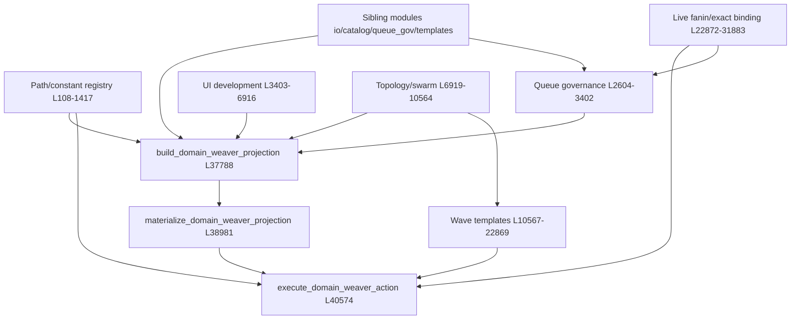

# MONOLITH SEAM AUDIT (candidate)

**Class:** candidate / read-only reconnaissance — **no production-readiness claims**, no accepted-state authority.  
**Date:** 2026-06-17  
**Repo root:** `ION_Developement/`  
**Auditor role:** code-archaeology / strangler-fig seam mapping (proposes only; does not mutate product code).

## Measured line counts

| File | Lines (`wc -l`) |
|------|-----------------|
| `ION/04_packages/kernel/ion_domain_weaver.py` | **49,513** |
| `ION/04_packages/kernel/ion_domain_weaver_swarm_control_plane.py` | **11,330** |
| `ION/04_packages/kernel/ion_codex_queue_runner.py` | **8,651** |
| `ION/04_packages/kernel/ion_cockpit_view_model.py` | **6,970** |
| `ION/04_packages/kernel/ion_runtime_service_control.py` | **6,864** |

Primary monolith internal metrics (from `DOMAIN_WEAVER_MONOLITH_INDEX.latest.json`, generated 2026-06-11 era navigation index):

- Top-level functions: **366** (`rg -c '^def '` → 366)
- Module-level `ALL_CAPS` assignments: **227** (`rg -c '^[A-Z_][A-Z0-9_]* = '` → 227)
- Path constants: **184**; packet constants: **15** (index summary)
- Operator actions (`DOMAIN_WEAVER_ALLOWED_OPERATOR_ACTIONS`): **107** (L1418–L1526)
- Dispatcher (`execute_domain_weaver_action`): **L40574–L49513** (~8,939 lines, 107 branches)
- Existing partial extractions: **38** sibling `ion_domain_weaver*.py` modules under `ION/04_packages/kernel/`

---

## 1. Primary file verdict: hand-written vs generated

**Verdict: hand-written incremental growth** — not autogenerated source.

| Evidence | Finding |
|----------|---------|
| L1–L6 module docstring | Human operational description (“joins the existing domain registry…”) |
| L7–L106 imports | 87 import lines pulling from **already-extracted** sibling modules (`ion_domain_weaver_io`, `_catalog`, `_queue_governance`, `_packet_templates`, etc.) — extraction-in-progress pattern |
| `rg -i 'generated\|DO NOT EDIT\|autogenerate\|AUTO.?GENERATED\|codegen'` | **No file-level codegen markers.** Hits are (a) JSON field `"generated_at": _now()` in payloads, (b) work-request template prose (“Do not edit cockpit UI…”), (c) runtime keys like `generated_artifact_authority` |
| AST / structure | **0 classes**, 366 top-level `def`s; repetitive `_domain_weaver_waveN_*_work_request_template` naming = mission-driven copy-paste expansion, not template-engine output |
| `ion_domain_weaver_monolith_index.py` | **Indexes** the monolith (navigation only); index docstring L641: “does not import or execute ion_domain_weaver.py” — not a generator |
| Thin re-export shims | L2513–L2594 re-export queue-governance symbols already implemented in `ion_domain_weaver_queue_governance.py` — manual compatibility layer |

**Conclusion:** Organic, operator/mission-driven Python. Repetition is domain pattern duplication (waves, fanin/fanout, readiness gates), not mechanical codegen.

---

## 2. Structural map — responsibility regions in `ion_domain_weaver.py`

Regions below combine **measured line spans** from `DOMAIN_WEAVER_MONOLITH_INDEX.latest.json` `source_regions` (11 contiguous blocks) and `category_regions` (16 semantic categories). Symbol counts from index.

### Region A — Bootstrap, constants, path registry (~L108–L1417)

- **~227** module constants: schema IDs (L108–L126), `DOMAIN_WEAVER_ROOT` tree (L339+), queue-ledger paths, wave-ledger paths, UI proof paths, topology/swarm artifact paths
- `DOMAIN_WEAVER_ALLOWED_OPERATOR_ACTIONS` (L1418–L1526): 107 action strings
- `DOMAIN_WEAVER_POLICY_GOVERNED_*` action policy sets (L1528–L1534)
- **Coupling hub:** every downstream region imports these paths by name

### Region B — Context gates & public template facades (~L129–L336)

| Lines | Symbols (sample) | Responsibility |
|-------|------------------|----------------|
| L129–L209 | `_domain_weaver_worker_start_context_gate`, `_domain_weaver_worker_start_context_block_result` | Worker-start context gate (delegates to `resolve_domain_active_context`) |
| L210–L336 | `domain_weaver_objective_sha256`, `denied_domain_weaver_authority`, `domain_weaver_root_envelope`, `build_domain_weaver_*_template` (×3) | Public facades → `ion_domain_weaver_packet_templates` |

### Region C — Materialization pointers & lineage (~L1537–L2222)

| Lines | Symbols | Responsibility |
|-------|---------|----------------|
| L1537–L1737 | `_domain_weaver_materialize_latest_with_snapshot` | Latest-pointer snapshot writes |
| L1738–L2212 | `_domain_weaver_latest_pointer_lineage_summary`, `_domain_weaver_bind_latest_pointer_self_lineage`, … | Pointer lineage reconciliation |
| L2213–L2222 | `_domain_weaver_first_int_after_label`, `_domain_weaver_ui_canon_context_reads` | Parsing / UI canon reads |

*(Partial overlap with extracted `ion_domain_weaver_materialization_pointers.py` — monolith retains orchestration.)*

### Region D — Core projection record helpers (~L2230–L2601) — **source region_01 tail**

| Lines | Symbols | Responsibility |
|-------|---------|----------------|
| L2230–L2358 | `_latest_package`, `_agent_record`, `_communication_profiles`, `_edge`, `_promotion_review_for_domain` | Agent/domain row shaping (uses `ion_domain_weaver_projection_records`) |
| L2359–L2512 | `build_domain_weaver_promotion_review`, `_load_promotion_review`, `_promotion_gate_for_decision` | Promotion review builders |
| L2513–L2594 | `queue_lane_for_domain_weaver_request`, `classify_domain_weaver_queue_request`, `shape_domain_weaver_queue_*` | **Re-export shims** to `ion_domain_weaver_queue_governance` |
| L2596–L2601 | `_queue_lane_for_request`, `_classify_queue_request` | Internal queue delegates → `ion_queue_governor` |

### Region E — Queue governance orchestration (~L2604–L3402) — **source region_02**

| Lines | Symbols | Responsibility |
|-------|---------|----------------|
| L2604–L3192 | `_domain_weaver_*_backlog*`, `_domain_weaver_reconcile_*`, `_domain_weaver_queue_governance` | Terminal backlog, waiting/successor reconciliation, stale-waiting policy |
| L2649 | `_refresh_codex_work_queue_and_lane_projection` | Codex work-queue refresh |
| L3303–L3402 | `_recommended_worker_for_lane`, `_select_dogfood_next_packet`, `_domain_weaver_cockpit_panel_ready` | Lane recommendation, dogfood packet selection |

**Category span:** `queue_governance` L2513–L36998 (21 symbols — scattered calls beyond this block)

### Region F — UI development & cockpit projection (~L3403–L6916) — **source region_02 bulk**

| Lines | Symbols | Responsibility |
|-------|---------|----------------|
| L3424–L4360 | `_source_readiness`, `_domain_weaver_ui_native_capability`, `_domain_weaver_ui_operator_feedback`, `_domain_weaver_ui_surface_quality`, `_domain_weaver_request_carrier_intake_status`, `_domain_weaver_ui_declared_route_execution_gate`, … | UI canon contracts, route gates, specialist fanin/retry refs |
| L4360–L6916 | `_domain_weaver_ui_development_projection` | **Large** UI-development projection builder (~2,556 lines) |

**Category span:** `ui_and_visual_proof` L2223–L32926 (**78 symbols** — largest category)

### Region G — Activation, topology, dynamic swarm (~L6919–L10564) — **source region_03**

| Lines | Symbols | Responsibility |
|-------|---------|----------------|
| L6919–L7052 | `_activation_request_schema`, `_activation_decision_schema`, `_write_activation_plane_candidate_artifacts` | Activation plane schemas |
| L7053–L7888 | `_domain_weaver_active_invocable_binding_proof_rows`, `_domain_weaver_specialist_activation_records`, `_domain_weaver_activation_plane_candidate` | Active binding / activation |
| L7889–L8836 | `_domain_weaver_path_fission_bucket`, `_domain_weaver_fission_dryrun_candidate`, `_domain_weaver_topology_audit_candidate`, `_domain_weaver_adaptive_topology_controls` | Fission dry-run, topology audit |
| L8837–L10564 | `_domain_weaver_dynamic_swarm_operation_plan`, `_domain_weaver_dynamic_swarm_*`, `_domain_weaver_topology_child_ownership_preflight`, `_domain_weaver_topology_evolution_readiness_work_request_template` | Dynamic swarm planning, topology evolution gates |

**Category span:** `topology_and_swarm` L7103–L34497 (43 symbols)

### Region H — Wave packet template factories (~L10567–L22869) — **source regions_04–07**

Repetitive `_domain_weaver_waveN_*` / `_domain_weaver_foundation_*` / `_domain_weaver_founding_*` triplets:

- `*_attempt_index` → `*_work_request_template(s)` → `*_latest_*_refs`
- Covers: topology evolution, foundation wave0, wave1 bounded draft / fanout / fanin / steward, wave2 implementation gate / source patch / preview settlement / accepted-state movement, UI semantic redesign, operator-rejection preserved quality flows

**Category span:** `wave_packet_templates` L2734–L19132 (**52 symbols**)

| Source region | Lines | Dominant categories |
|---------------|-------|---------------------|
| region_04 | L10567–L13699 | topology_and_swarm, wave_packet_templates |
| region_05 | L13702–L16514 | wave_packet_templates |
| region_06 | L16517–L19524 | wave_packet_templates, ui_and_visual_proof |
| region_07 | L19527–L22869 | ui_and_visual_proof, queue_governance |

### Region I — Live fanin, semantic settlement, exact-active binding (~L22872–L31883) — **source regions_08–09**

| Lines | Symbols | Responsibility |
|-------|---------|----------------|
| L22872–L26797 | UI semantic fanin, `_domain_weaver_queue_20260601b_reissues`, recursive live fanout | Live queue reissues, UI fanin chains |
| L26800–L31883 | `_domain_weaver_request_run_packets`, exact-active specialist binding repair templates (×many), five-specialist activation gate, kernel repair fanout/fanin | **Exact active binding** repair orchestration |

**Categories:** `live_binding_and_fanin` L12023–L34094 (9 symbols); `exact_active_binding` L7053–L33362 (18 symbols)

### Region J — Founding assembly, operating loop, projection wall (~L31886–L40542) — **source region_10**

| Lines | Symbols | Responsibility |
|-------|---------|----------------|
| L31886–L34537 | `_domain_weaver_five_specialist_*`, `_domain_weaver_visual_proof_*`, `_domain_weaver_live_return_monitor`, `_domain_weaver_live_fanin_settlement`, `_domain_weaver_founding_domain_assembly` | Live monitors, fanin settlement, founding assembly |
| L34538–L36740 | `_domain_weaver_original_plan_compliance` | Compliance checker |
| L36741–L37787 | `_self_hydrate_domain_weaver_inputs`, `build_domain_weaver_dogfood_context_capsule`, `build_domain_weaver_steward_ready_review`, `build_domain_weaver_promotion_gate`, `_domain_weaver_operating_loop` | Self-hydration, dogfood/steward/gate builders, operating loop |
| L37788–L38847 | **`build_domain_weaver_projection`** | **Central projection aggregator** (~1,060 lines) |
| L38848–L40542 | Markdown emitters, **`materialize_domain_weaver_projection`**, phase/promotion materializers, operator action history | Materialization + promotion writes |

**Category span:** `projection_builders` L2254–L40542 (7 symbols); `promotion_and_reviews` L1738–L40483 (27 symbols)

### Region K — Operator action dispatcher (~L40574–L49513) — **source region_11 / `action_dispatcher`**

| Lines | Symbol | Responsibility |
|-------|--------|----------------|
| L40574–L49513 | **`execute_domain_weaver_action`** | 107-branch operator dispatcher; confirmation/authority gates; calls materialize + queue + worker-start paths per action |

---

## 3. Internal coupling

### Dependency graph (simplified)



### Most-entangled regions

1. **`execute_domain_weaver_action` (L40574–L49513)** — fans into all regions; **always** calls `materialize_domain_weaver_projection` at L40715 before most branches
2. **`build_domain_weaver_projection` (L37788–L38847)** — aggregates queue governance, UI development, topology/swarm, activation, approval governor, operating loop
3. **`ui_and_visual_proof` (78 symbols, L2223–L32926)** — cross-cuts wave templates and live settlement
4. **Path constant registry (L339–L1417)** — 184 paths referenced by templates, materializers, tests

### Most-separable regions (already partially extracted)

| Region | Separability | Notes |
|--------|--------------|-------|
| Public template facades L210–L336 | **High** | Duplicate of `ion_domain_weaver_packet_templates` |
| Queue re-export shims L2513–L2594 | **High** | Duplicate of `ion_domain_weaver_queue_governance` |
| Operator action history L40433–L40527 | **High** | 2 symbols, narrow file I/O |
| Path/constant registry L108–L1417 | **Medium-high** | Wide reference surface but no logic |
| Wave template triplets L10567–L22869 | **Medium** | Repetitive pattern; shared helpers + constants |
| Action dispatcher L40574–L49513 | **Low** | Must remain facade until all branches relocated |

### Shared global state

- **No mutable module-level runtime state** observed — pattern is pure functions + filesystem reads/writes under `ION/05_context/current/domain_weaver/`
- **Shared immutable module constants:** 227 `ALL_CAPS` bindings (paths, schema IDs, action lists) — primary hidden coupling mechanism
- **Filesystem as coordination layer:** projection JSON, queue ledgers, latest pointers — regions coordinate via artifact paths defined in Region A

---

## 4. External public surface (contract to preserve)

### Import sites (measured `rg` across `ION/04_packages`, `ION/tests`, `ION/06_intelligence`)

| Consumer | Imports |
|----------|---------|
| `ion_agent_control_plane.py` L40 | `build_domain_weaver_projection` |
| `ion_automation_control_plane.py` L22–L33 | path constants + `materialize_domain_weaver_*` (×5) |
| `ion_codex_agent_mount.py` L29–L33 | `DOMAIN_WEAVER_PROJECTION_PATH`, `DOMAIN_WEAVER_PROMOTION_REVIEW_*` |
| `ion_local_cockpit_app.py` L82 | `execute_domain_weaver_action` |
| `ion_chatgpt_browser_mcp_http_preview.py` L82 | `execute_domain_weaver_action` |
| `test_kernel_ion_agent_control_plane.py` L12–L184 | **~150+** path constants, 8 public functions, 6 private test hooks |
| `test_kernel_ion_domain_weaver_context_active_resolver.py` | `execute_domain_weaver_action`, `CODEX_WORK_REQUESTS_DIR`, private queue helpers |

**Total distinct externally referenced symbols: ~175** (automated import parse of production + test importers).

### Public functions (27 — no leading underscore)

```
domain_weaver_objective_sha256
denied_domain_weaver_authority
domain_weaver_root_envelope
build_domain_weaver_codex_work_request_template
build_domain_weaver_next_packet_candidate_template
build_domain_weaver_source_seam_packet_template
build_domain_weaver_promotion_review
queue_lane_for_domain_weaver_request
classify_domain_weaver_queue_request
actionable_domain_weaver_duplicate_group_count
domain_weaver_duplicate_group_count
shape_domain_weaver_queue_projection_row
shape_domain_weaver_queue_ledger_row
shape_domain_weaver_queue_governance_rows
build_domain_weaver_dogfood_context_capsule
build_domain_weaver_steward_ready_review
build_domain_weaver_promotion_gate
build_domain_weaver_projection
materialize_domain_weaver_projection
materialize_domain_weaver_founding_domain_assembly
materialize_domain_weaver_dogfood_context_capsule
materialize_domain_weaver_steward_ready_review
build_domain_weaver_phase_closure_review
materialize_domain_weaver_phase_closure_review
materialize_domain_weaver_promotion_review
materialize_domain_weaver_promotion_gate
execute_domain_weaver_action
```

### Externally imported private symbols (tests / tight coupling)

```
_domain_weaver_bind_latest_pointer_self_lineage
_domain_weaver_five_specialist_exact_active_binding_request_materialization_templates
_domain_weaver_latest_exact_active_specialist_binding_kernel_repair_fanin_settlement_result
_domain_weaver_latest_pointer_lineage_summary
_domain_weaver_latest_pointer_self_lineage_summary
_domain_weaver_materialize_latest_with_snapshot
_domain_weaver_queue_live_carrier_work_requests
_domain_weaver_start_repin_plan_nemesis_reaudit
```

### Example call sites

```40:40:ION/04_packages/kernel/ion_agent_control_plane.py
from .ion_domain_weaver import build_domain_weaver_projection
```

```82:82:ION/04_packages/kernel/ion_local_cockpit_app.py
from .ion_domain_weaver import execute_domain_weaver_action
```

```40715:40717:ION/04_packages/kernel/ion_domain_weaver.py
    projection_result = materialize_domain_weaver_projection(shell_root)
    projection = _read_json_file(shell_root / DOMAIN_WEAVER_PROJECTION_PATH)
    results: dict[str, Mapping[str, Any]] = {"projection": projection_result}
```

**Preservation strategy:** keep `ion_domain_weaver.py` as a **facade module** re-exporting moved symbols until all 175 external references are migrated.

---

## 5. Proposed decomposition — bounded modules + extraction order

Building on **38 existing sibling modules**, candidate splits for remaining monolith mass:

| # | Candidate module | Responsibility | Approx. monolith lines | Risk |
|---|------------------|----------------|------------------------|------|
| 1 | `ion_domain_weaver_paths` | Path/schema/action constant registry | L108–L1534 | Low — wide refs, no logic |
| 2 | `ion_domain_weaver_template_facade` | Remove duplicate public template + queue shims | L210–L336, L2513–L2594 | Low — siblings exist |
| 3 | `ion_domain_weaver_operator_history` | Operator action history read/write | L40433–L40527 | Low |
| 4 | `ion_domain_weaver_promotion_pipeline` | Promotion review/gate/steward/phase closure materializers | L1738–L2415, L36823–L40432 | Medium |
| 5 | `ion_domain_weaver_queue_orchestration` | Reconcile/backlog/governor refresh (beyond sibling) | L2604–L3402 | Medium |
| 6 | `ion_domain_weaver_projection_core` | `_self_hydrate_*`, `build_domain_weaver_projection`, `_domain_weaver_operating_loop` | L36741–L38847 | **High** — aggregation hub |
| 7 | `ion_domain_weaver_ui_projection` | UI development projection + visual proof helpers | L2223–L6916 (UI portions) | **High** — 78 symbols |
| 8 | `ion_domain_weaver_topology_swarm` | Activation, fission, dynamic swarm, topology evolution | L6919–L10564 | Medium |
| 9 | `ion_domain_weaver_wave_templates` | Wave0/1/2 + founding template factories | L10567–L22869 | Medium — repetitive |
| 10 | `ion_domain_weaver_live_settlement` | Live fanin, semantic repin, exact-active binding chains | L12023–L31883 | **High** |
| 11 | `ion_domain_weaver_action_dispatch` | `execute_domain_weaver_action` + branch table | L40574–L49513 | **Highest** — extract last |

### Suggested extraction order (least-coupled / highest-value first)

1. **Path constant registry** → shrinks file ~1,400 lines; enables other modules to import one place
2. **Remove duplicate facades** (templates L210–L336, queue shims L2513–L2594) — siblings already own logic
3. **Operator action history** — isolated I/O
4. **Promotion pipeline materializers** — clearer bounded writes
5. **Queue orchestration** — merge with / adjacent to `ion_domain_weaver_queue_governance.py`
6. **Topology/swarm planning** — candidate overlap with `ion_domain_weaver_swarm_control_plane.py` (downstream synthesis)
7. **Wave template factories** — bulk volume (~12k lines), repetitive; good strangler target
8. **UI projection region** — high test value; keep projection schema stable
9. **Projection core** — extract after upstream regions expose stable builder inputs
10. **Live settlement / exact-active binding** — deep cross-deps with queue + context resolver
11. **Action dispatcher** — **last**; replace body with registry dict mapping action → handler in extracted modules

### Risk notes

- **Do not extract dispatcher first** — 107 actions assume monolith-local helper visibility
- **`test_kernel_ion_agent_control_plane.py` (18,597 lines)** imports ~150 path constants — any path move requires re-export shim or test refactor
- **Projection JSON schema** is the cockpit contract (`ion_cockpit_view_model.py` reads `DOMAIN_WEAVER_PROJECTION.json` L83+, L127–L178) — internal splits must not change emitted shape without coordinated UI tests
- Monolith index (`ion_domain_weaver_monolith_index.py`) must be regenerated after each slice (already expected workflow per mission038 seat docs)

---

## 6. Secondary monoliths (one paragraph each)

### `ion_domain_weaver_swarm_control_plane.py` (11,330 lines; 212 top-level defs)

Candidate-only swarm **control-plane synthesis** above existing pressure/proposal waves: builds watch matrices, fleet plans, global queue hygiene, metadata identity repair, and exact-reissue dispatch readiness (`build_swarm_control_plane` L755+, `write_*` materializers throughout). Imports from **already-extracted** modules (`ion_domain_weaver_pressure_wave`, `_proposal_wave`, `_queue_governance`, `_worker_start_readiness`) — relatively clean layering. **Separable unit:** yes — already its own file; further split could isolate queue-hygiene apply paths (~L1417–L3346) from read-only plan builders. Not a tangle with the primary monolith except via shared queue-governance semantics and domain_weaver artifact paths.

### `ion_codex_queue_runner.py` (8,651 lines; 197 top-level defs)

Bounded **Codex CLI carrier adapter** over the ChatGPT connector work queue: runner state, lane locks, preflight, spawn-dispatch detection (`_is_domain_weaver_spawn_dispatch_request` L1261), domain-weaver agent-comms sync (`_sync_domain_weaver_agent_comms_task_return` L6661). Imports `resolve_domain_active_context` from extracted resolver — **not** the primary monolith. **Separable unit:** mostly yes; could split preflight/AI-movement gate vs run loop vs domain-weaver relay sync. Coupling to monolith is **contractual** (spawn dispatch request shape, carrier paths) not code-import tangle.

### `ion_cockpit_view_model.py` (6,970 lines; 118 top-level defs)

**Cockpit aggregation layer** — reads runtime JSON packets and kernel projections into one view model for Cursor/VS Code + JOC shell. Domain Weaver appears as **read-only projection consumer** (`DOMAIN_WEAVER_PROJECTION` L83, `_domain_weaver_surface_agent_control_plane` L127–L178); does not import `ion_domain_weaver.py`. **Separable unit:** yes — natural split by cockpit panel (agent control plane, codex queue, service console sections already imported as builders). Lower extraction priority than domain weaver monolith.

### `ion_runtime_service_control.py` (6,864 lines; 210 top-level defs)

Branch-gated **local runtime service control** (start/stop/health/test receipts). Domain Weaver coupling is **read-path intelligence** — hardcoded projection paths L49–L78, swarm expansion read roots, wave0 return expectations — plus context resolver imports (`apply_active_context_gated_refresh`, etc.). Does not import primary monolith. **Separable unit:** yes; domain-weaver-specific local intelligence could move to a small companion module. Another tangle risk is low compared to `execute_domain_weaver_action`.

---

## 7. Test coverage notes

| Pattern | Count |
|---------|-------|
| `test_kernel_ion_domain_weaver*.py` files | **36** (glob `**/test*domain_weaver*`) |
| Test function defs (`def test_`) across those + agent control plane | **~410** |
| Largest dedicated file | `test_kernel_ion_domain_weaver_swarm_control_plane.py` — **2,789** lines |
| Primary monolith integration harness | `test_kernel_ion_agent_control_plane.py` — **18,597** lines; imports monolith heavily |

**Coverage shape:**

- **Extracted siblings well-tested:** `_io`, `_catalog`, `_queue_governance`, `_packet_templates`, `_projection_records`, `_context_active_resolver`, `_materialization_pointers`, `_monolith_index`, orchestrator modules, swarm control plane, spawn dispatcher, etc. each have dedicated test files
- **Primary monolith:** no dedicated `test_kernel_ion_domain_weaver.py`; covered **indirectly** through agent control plane integration tests exercising `execute_domain_weaver_action`, materializers, and path constants
- **Gaps (candidate):** individual wave-template triplets (52 symbols), exact-active binding repair chain, and many dispatcher branches likely rely on integration tests only — monolith index lists 107 actions but branch-level unit coverage is uneven

**Strangler implication:** each extraction should move tests co-located with the new module; keep facade re-exports until `test_kernel_ion_agent_control_plane.py` import surface is migrated.

---

## Appendix — source region line index (from monolith index)

| Region | Lines | First → last symbol |
|--------|-------|---------------------|
| region_01 | L129–L2601 | `_domain_weaver_worker_start_context_gate` → `_classify_queue_request` |
| region_02 | L2604–L6916 | `_is_actionable_duplicate_candidate` → `_domain_weaver_ui_development_projection` |
| region_03 | L6919–L10564 | `_activation_request_schema` → `_domain_weaver_topology_evolution_readiness_work_request_template` |
| region_04 | L10567–L13699 | `_domain_weaver_latest_topology_evolution_readiness_refs` → `_domain_weaver_wave1_bounded_draft_work_request_template` |
| region_05 | L13702–L16514 | `_domain_weaver_latest_wave1_bounded_draft_refs` → `_domain_weaver_wave2_implementation_preview_settlement_attempt_index` |
| region_06 | L16517–L19524 | `_domain_weaver_wave2_implementation_preview_settlement_work_request_template` → `_domain_weaver_ui_implementation_retry_attempt_index` |
| region_07 | L19527–L22869 | `_domain_weaver_ui_implementation_retry_work_request_template` → `_domain_weaver_supersede_duplicate_semantic_redesign_requests` |
| region_08 | L22872–L26797 | `_domain_weaver_ui_semantic_redesign_fanin_attempt_index` → `_domain_weaver_queue_20260601b_reissues` |
| region_09 | L26800–L31883 | `_domain_weaver_request_run_packets` → `_domain_weaver_latest_exact_active_specialist_binding_five_specialist_fanin_settlement_result` |
| region_10 | L31886–L39994 | `_domain_weaver_five_specialist_exact_active_binding_fanin_blocker_repair_plan` → `materialize_domain_weaver_founding_domain_assembly` |
| region_11 | L39997–L49513 | `materialize_domain_weaver_dogfood_context_capsule` → `execute_domain_weaver_action` |

---

*End of candidate audit. No product files were modified except this report.*
