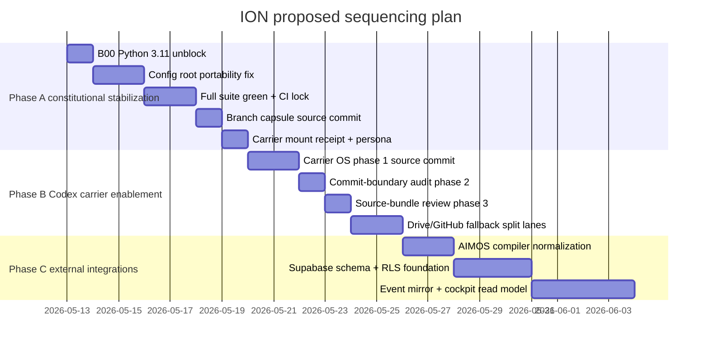
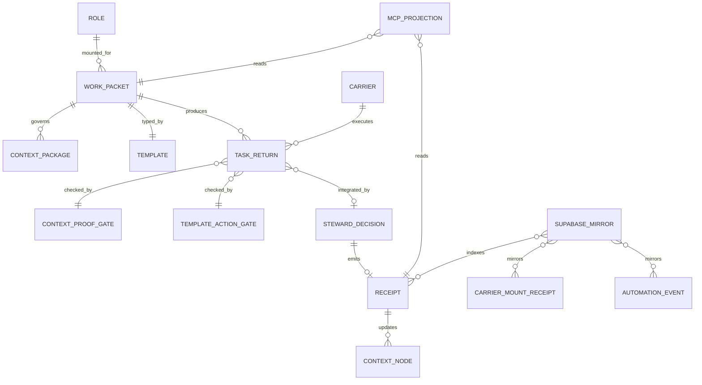
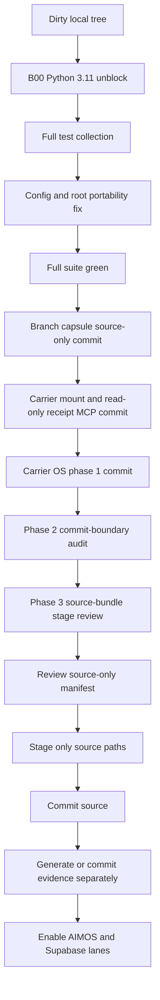

# ION Meta-Architecture Blueprint and Consolidation Plan

## Executive summary

Enabled connector inventory: **GitHub**. I used the GitHub connector for `ION-operations/ION`, then reconciled that public repository with the uploaded local branch package and the sandbox artifacts in `Needs_Routed/`, the SEV-002 review materials, the CODEX Carrier OS Phase 2/3 patches, the AIMOS/WisdomNET/Living Encyclopedia package, and the Supabase migration/RLS planning bundles.

The repository’s governing architecture is already unusually coherent. It is explicitly built around a **lawful state-transition model** rather than prompt-only execution: AI output is candidate state until it passes packet, context, template, proof, gate, Steward decision, and receipt. The public README, repo authority, mount contract, operating packet, context system, and template law all reinforce the same stack: ION is the governing runtime; carriers execute bounded work; GitHub is a collaboration/data plane rather than runtime authority. fileciteturn7file0 fileciteturn11file0 fileciteturn12file0 fileciteturn22file0 fileciteturn16file0 fileciteturn17file0

The local uploaded branch is ahead of the public branch in a meaningful way. It contains substantial uncommitted source work for branch capsules, carrier mount/persona presentation, Codex Carrier OS, commit-boundary auditing, source-bundle staging review, Drive/GitHub fallback surfaces, and related tests. The strongest immediate result is that the local branch already contains a **working source-boundary discipline**: the generated local manifest marks **57 candidate source paths**, **43 generated evidence/projection paths**, **3 runtime-residue paths**, and **46 untracked owner-review paths**, which is exactly the kind of boundary control ION needs before any merge. That is strategically correct.

The main structural problem is not lack of architecture. It is **sequencing contamination**. Constitutional work, carrier-control work, runtime projections, generated evidence, and external integration packages are all sitting in the same dirty tree. SEV-002 correctly identified the first hard gate: the **Python 3.11 f-string unblock** must land first, because Python 3.12 formally relaxed f-string grammar in ways that can break 3.11 collection, and ION’s current local branch still has portability/config drift and test failures behind that gate. fileciteturn0file0 citeturn0search0

My highest-confidence recommendation is therefore:

1. **Finish Phase A before any external integration merge.**
2. Land **B00 Python 3.11 compatibility** immediately.
3. Resolve **Codex config contract drift** and **root portability** immediately after B00.
4. Then commit, in source-only lanes, **branch capsule**, **carrier mount/persona + read-only receipt MCP tool**, **Codex Carrier OS phase 1**, **commit-boundary audit phase 2**, and **source-bundle stage review phase 3**.
5. Only after that, enable multi-lane external work: **AIMOS/WisdomNET/Living Encyclopedia**, **Supabase runtime mirror**, **RLS authority model**, and later cross-plane event bridges.

That sequencing matches the repo’s own law: mount order is explicit, carriers are bounded, templates define work types, receipts define inheritance, and GitHub never grants runtime truth by itself. fileciteturn12file0 fileciteturn15file0 fileciteturn18file0

Immediate next steps should be:

```bash
git apply --check Needs_Routed/SEV002_B00_PY311_FSTRING_UNBLOCK_20260513.patch
git apply Needs_Routed/SEV002_B00_PY311_FSTRING_UNBLOCK_20260513.patch

PYTHONDONTWRITEBYTECODE=1 \
PYTHONPATH=ION/04_packages \
PYTEST_DISABLE_PLUGIN_AUTOLOAD=1 \
python3 -m pytest ION/tests --collect-only -q

PYTHONDONTWRITEBYTECODE=1 \
PYTHONPATH=ION/04_packages \
PYTEST_DISABLE_PLUGIN_AUTOLOAD=1 \
python3 -m pytest -q \
  ION/tests/test_codex_project_config_and_hook.py \
  ION/tests/test_kernel_ion_github_data_plane_audit.py \
  ION/tests/test_kernel_ion_operator_queue_human_gate_status.py \
  ION/tests/test_kernel_ion_skill_activation.py \
  ION/tests/test_kernel_ion_chatgpt_browser_connector_e2e_flow.py
```

Then fix the remaining failures before any state-bearing packet is committed.

## Evidence base and current repository posture

The public repository defines a very clear authority chain. `ION/REPO_AUTHORITY.md` says the canonical content root is `ION/`, distinguishes shell root from content root, and explicitly names repo authority, mount contract, current operating packet, carrier profiles, templates, packets, gates, and tests as live authority surfaces. fileciteturn11file0 The mount contract then fixes mount order, forces pre-read sequencing, requires status/continuation before work, and defines RELAY-first, STEWARD-next orchestration with explicit phase sequencing and receipt closure. fileciteturn12file0 The current operating packet states the working target is bounded carrier onboarding and connector work, with production authority and live execution authority both `false`; it also defines bounded MCP tool families and forbids arbitrary shell, arbitrary file write, delete, push, credential access, browser control, and direct acceptance of unproofed worker output. fileciteturn22file0

The conceptual model is also internally consistent. The README defines ION as a continuity substrate where lawful acts, not prompts, are the primitive, and where accepted deltas require proof, decision, and receipt. It also frames GitHub as a collaboration/data plane rather than runtime authority. fileciteturn7file0 Template law formalizes templates as the type system of work; context law formalizes bounded, inherited context packages rather than ambient memory; and the roles/carriers document explicitly separates roles from carriers, with Codex CLI, Cursor, ChatGPT Browser, MCP, and GitHub all remaining carriers rather than identities. fileciteturn16file0 fileciteturn17file0 fileciteturn15file0

The repo’s governance posture for collaboration is also already aligned with the consolidation work you need to do now. `CONTRIBUTING.md` instructs contributors to keep changes narrow, reuse owner surfaces, run the smallest meaningful validation, and separate public docs, runtime implementation, and active-state evidence into different PRs wherever possible. `SECURITY.md` forbids secrets, production-only operational state, browser profiles, tunnel credentials, private logs, and hidden upload/send behavior. The GitHub live-state policy explicitly distinguishes stable, review, and `volatile/*` branches, and says volatile branches are useful but **not trusted ION state**. fileciteturn13file0 fileciteturn14file0 fileciteturn18file0

The local uploaded branch is consistent with that architecture, but not yet with that governance discipline. Sandbox inspection of the uploaded `ION_CODEX FULL2.zip` shows the working tree is on `feature/codex-capsule-chat-active-root`, with a mix of modified tracked files, 100+ untracked files, current-context runtime artifacts, `Needs_Routed/`, `diffs/`, `workpackets/`, and untracked source additions for:

- branch capsule infrastructure,
- carrier mount/persona presentation,
- carrier mount receipt MCP projection,
- Codex Carrier OS phase 1,
- commit-boundary audit phase 2,
- source-bundle stage review phase 3,
- Google Drive context mirror,
- GitHub fallback,
- AIMOS/WisdomNET/Living Encyclopedia inputs,
- local generated evidence under `ION/05_context/current/`.

This mixed posture is precisely why the local commit-boundary tooling matters: the local stage manifest now distinguishes source paths from generated/runtime/private/untracked surfaces rather than treating the tree as one merge unit.

The current test posture is materially improved but not done. Local sandbox validation now shows:

- targeted Phase 2/3/MCP tests: **21 passed**,
- full test collection: **561 tests collected, exit 0**,
- current targeted failure probe: **9 failing tests**, concentrated in:
  - Codex config contract drift and parent-bridge assumptions,
  - root portability in the session-start hook,
  - GitHub data-plane audit expecting accepted posture,
  - operator queue classification,
  - skill activation recovery selection,
  - ChatGPT browser connector end-to-end return acceptance.

SEV-002 independently reached the same structural conclusion: B00 first, then branch capsule, then carrier mount/persona with the missing read-only MCP receipt tool, then broader Carrier OS work. fileciteturn0file0

The external integration artifacts are valuable but are not yet ready to merge into constitutional/runtime lanes. The AIMOS package clearly positions AIMOS/AIM-ION as lineage witness, WisdomNET as structural learning, and the Living Encyclopedia as a compiler of lawful movement rather than current law. The Supabase migration and RLS bundles clearly position Supabase as a **mirror/index/cockpit backend**, not as truth or Steward authority. That external framing is conceptually sound and should be retained. fileciteturn0file1

## Meta-architecture blueprint

### Layer model

The repository and local artifacts support a six-layer meta-architecture.

| Layer | Function | Primary surfaces | Truth status |
|---|---|---|---|
| Constitutional authority plane | Declares what counts as law, mount order, and state transition legitimacy | `README.md`, `ION/REPO_AUTHORITY.md`, `ION/02_architecture/ION_MOUNT_CONTRACT.md`, current operating packet | Canonical operational authority |
| Typed workflow plane | Defines lawful act types, context rules, receipts, and gates | `ION/docs/TEMPLATE_LAW.md`, `ION/docs/CONTEXT_SYSTEM.md`, packets, templates, proof gates | Canonical workflow authority |
| Role/carrier orchestration plane | Separates roles from carriers and bounds carrier capabilities | role registries and boots, carrier profiles, `ION/docs/AGENTS_ROLES_CARRIERS.md`, `CODEX_CLI_CARRIER_PROTOCOL.md` | Canonical role/carrier authority |
| Runtime state plane | Stores packets, receipts, queues, current context, generated projections | `ION/05_context/current/` and current packets | State/evidence, not necessarily source truth |
| Control/projection plane | Exposes bounded MCP tools, audits, views, and read-only projections | `ion_mcp_local_bridge`, cockpit, audits, local stage manifests | Read-only or confirmation-gated operational surfaces |
| Mirror/integration plane | Mirrors selected events into queryable systems and external lanes | GitHub, planned Supabase mirror, Drive mirror, Slack/dAimon/GitHub bridges | Witness/index plane, never primary authority |

This is a strong architecture because it treats **state truth**, **control truth**, and **visibility truth** as different things. The repo explicitly says GitHub is a data plane, not runtime authority. The same logic should govern Supabase: it can be a powerful index, query, and cockpit backend, but not the inheritance source. fileciteturn7file0 fileciteturn14file0

### Authority model

The authority model is already explicit and should remain explicit.

At the ION layer, lawful change requires: packet, compiled context, governing template, bounded carrier execution, proof-bearing return, gate, Steward decision, and receipt. That is the core constitutional loop. fileciteturn7file0

At the carrier layer, carriers are bounded execution hosts. The mount contract and operating packet make clear that carriers start unmounted, that mount order is explicit, and that default ceilings are no production authority and no live execution authority. The Codex CLI protocol reiterates that Codex is a bounded worker carrier and must not claim ION identity, Steward authority, or production authority. fileciteturn12file0 fileciteturn19file0

At the control-plane layer, MCP should be treated as a **capability surface** rather than as a general remote shell. That matches the MCP specification itself: MCP separates **resources**, **prompts**, and **tools**, and explicitly warns implementers to preserve user consent, user control, and careful security boundaries for data access and operations. citeturn0search5turn0search6

At the mirror plane, Supabase should remain an operational mirror with strict authorization. Supabase’s own guidance is to enable RLS on exposed tables, map requests to roles, and avoid exposing service keys in clients; PostgreSQL itself enforces default-deny behavior when RLS is enabled but no policy exists, and `CREATE POLICY` distinguishes `USING` from `WITH CHECK`. PostgreSQL also warns that functions, triggers, and row-security policies are sensitive code-in-the-backend surfaces and must be tightly controlled. citeturn1search0turn2search0turn2search3turn2search7

### Data flows

The architecture implies three critical flows.

The first is the **constitutional work loop**:

```text
intent
→ work packet
→ context package
→ template
→ bounded carrier execution
→ proof-bearing return
→ gate
→ Steward decision
→ receipt
→ inherited next context
```

That flow is stated directly in the README and restated in the template/context docs. fileciteturn7file0 fileciteturn16file0 fileciteturn17file0

The second is the **control-plane projection loop**:

```text
current packets / receipts / queues
→ audit / view-model / MCP read projection
→ operator or coordinator view
→ bounded follow-up action
→ new packet / receipt
```

This is the repo’s lawful way to make state inspectable without collapsing visibility into truth. It is also the correct place for the new read-only MCP surfaces from the local branch: mount receipts, commit-boundary audits, and source-bundle stage review all belong here.

The third is the **mirror/index loop** for Phase C:

```text
local ION receipt or validated event
→ event extractor / adapter
→ Supabase mirror
→ realtime cockpit / query layer
→ operator acts
→ new ION receipt remains the source of inheritance
```

That matches the uploaded Supabase migration plan exactly and is also aligned with Supabase Edge Functions being server-side adapters rather than primary governance logic. citeturn1search1

### Sequencing constraints

The most important sequencing constraint is architectural, not logistical:

**constitutional surfaces must land before mirror surfaces, and source surfaces must land before generated/runtime evidence.**

That implies the following non-negotiables:

- Python 3.11 compatibility before full-suite confidence,
- config contract and root portability before branch-capsule settlement,
- carrier mount receipt MCP projection before mount/persona can be considered complete,
- source-only commit lanes before generated/current-context evidence,
- external AIMOS/Supabase/WisdomNET work after branch/capsule/carrier/Codex OS constitutional stabilization,
- read-only MCP projections before broader write-capability growth,
- no raw Codex/session/runtime/private paths committed in source bundles.

Those constraints are not arbitrary. They are direct consequences of ION’s own law, and they also align with external platform reality: MCP requires explicit consent/control around tool boundaries, Supabase exposed schemas require RLS discipline, and Python 3.11/3.12 f-string differences are real compatibility edges. fileciteturn12file0 fileciteturn13file0 fileciteturn14file0 citeturn0search0turn1search0turn0search6

## Gap analysis and consolidation map

### Blueprint-to-artifact mapping

| Lane | Current artifacts | Blueprint fit | Blockers | Owner | Recommended phase |
|---|---|---|---|---|---|
| Constitutional authority | README, repo authority, mount contract, V119 packet | Strong; the law is coherent and explicit | None; use as baseline | Core ION | Active baseline |
| Branch capsule | local untracked protocol docs, `ion_agent_branch_capsule.py`, tests, settlement artifacts, SEV-002 review | Strong fit to role/context/state plane | root portability, settlement consistency, generated branch evidence mixed into tree | MASON / orchestration | Phase A |
| Carrier mount/persona | local protocol/registry/templates/kernel + MCP bridge changes | Strong fit to control plane | mount receipt tool must land; shared `ion_mcp_local_bridge.py` hunks mixed with other lanes | MASON / control plane | Phase A |
| B00 Python compatibility | `SEV002_B00_PY311_FSTRING_UNBLOCK_20260513.patch` | Mandatory baseline gate | not yet committed; full suite still not green | MASON / test stability | Phase A |
| Codex config portability | `.codex/config.toml`, `.codex/hooks/ion_session_start_context.py`, failing tests | Necessary bridge between role/carrier and local execution plane | `features.hooks` vs `features.codex_hooks`, absolute root lock, parent `.codex` assumption outside repo | MASON / local execution | Phase A |
| Codex Carrier OS phase 1 | Phase1 patch in `diffs/`, local source files/tests, local generated projections | Strong fit to control/projection plane | mixed with generated evidence and other lanes | MASON / local execution | Phase B |
| Commit-boundary audit | Phase2 patch + local manifests | Strong fit; exactly the right anti-contamination tool | not yet commit-separated from other lanes | MASON / governance kernel | Phase B |
| Source-bundle stage review | Phase3 patch + local stage manifest | Strong fit; best current consolidation mechanism | still bundles too many conceptually separate lanes; requires operator review | MASON / governance kernel | Phase B |
| Drive mirror | local protocol/registry/templates/kernel/tests | Fit to mirror plane | should not land before constitutional Phase A/B | MASON / visibility | Late Phase B |
| GitHub fallback | protocol/kernel/tests + patch | Fit to data-plane witness role | couple only after constitutional stabilization | MASON / integration | Late Phase B |
| AIMOS/WisdomNET/Living Encyclopedia | diff, bundle zip, workpacket zip, dossier docs | Strategically valuable Phase C expansion | packet naming/schema mismatch; `ION/05_context/current/living_encyclopedia/README.md` should not ride with source-law commit by default | research + MASON | Phase C |
| Supabase runtime migration | migration plan zip, RLS model zip, prompt | Strong fit to mirror/index plane | must remain mirror-not-authority; RLS and typed RPC need local law stable first | MASON / platform | Phase C |
| Runtime evidence / current context | local queue files, patch receipts, generated manifests, current-context projections | Correct as evidence surfaces | must not ride with source commits | local runtime / Steward review | Exclude from source commits |

### Current concrete blockers

The most actionable gaps are these.

First, **Python compatibility and config portability**. The local probe still fails on `test_codex_project_config_and_hook.py` because `.codex/config.toml` uses `features.hooks` rather than `features.codex_hooks`, `.codex/hooks/ion_session_start_context.py` hard-binds the active root to `/home/sev/ION - Production/ION_CODEX FULL`, and tests expect parent bridge files outside the packaged repo root. This is the most important remaining Phase A blocker because it combines **portability**, **test contract drift**, and **carrier bootstrap truth** in one place.

Second, **dirty-tree-sensitive tests** still fail. The GitHub data-plane audit test expects an accepted/current repo posture; the operator queue test classifies a queued message differently than expected; the skill activation test fails to return a recovery `skill_id`; and the ChatGPT browser connector E2E flow is rejecting a bounded return that the test expects to accept. Those are not random failures; they are exactly the kind of state-classification regressions that appear when governance code and runtime evidence evolve together.

Third, **source and evidence are still mixed**. The local source-bundle manifest is useful, but its 57-path source bundle still spans multiple conceptual packets. It includes branch capsule, carrier mount, Carrier OS, commit-boundary, source-bundle review, GitHub fallback, local PC readiness, and some `.codex`/`.gitignore` changes in one lane. That is better than committing everything, but it is still too broad for clean constitutional sequencing.

Fourth, **AIMOS/Living Encyclopedia packet drift** is real. The Living Encyclopedia workpacket expects one packet family and one set of canonical file names, while the provided GPT diff implements a broader AIMOS/WisdomNET integration surface with different file names and a `current/living_encyclopedia` README under a runtime path. That is not a reason to reject the work; it is a reason to normalize it before any merge.

### Needs_Routed consolidation posture

`Needs_Routed/` is useful as an intake buffer, but it is not commit-ready as-is.

| Path class | Examples | Action |
|---|---|---|
| Keep as intake only | zipped bundles, evidence zips, patch bundles, review markdown | Keep local or volatile; do not commit into source branch |
| Apply then discard from source lane | B00 patch, Phase2 patch, Phase3 patch, AIMOS diff | Use as reviewed patch inputs; do not commit the patch files themselves to protected source branches |
| Normalize into source files | AIMOS/Living Encyclopedia source additions, Supabase SQL/docs/tests when implemented | Commit only normalized repo paths under `ION/`, `supabase/`, tests |
| Exclude entirely from source commits | generated manifests, runtime receipts, current-context JSON, private/raw context bundles | leave local or commit only as explicit evidence bundles on volatile lanes |

That posture is consistent with `CONTRIBUTING.md`, `SECURITY.md`, and the local stage-review manifests. fileciteturn13file0 fileciteturn14file0

## Prioritized action plan and CI checklist

### Immediate plan

The correct immediate sequence is:

1. **Apply B00 or verify it is already materially present.**
2. **Run collection and the current failure probe.**
3. **Create one narrow portability/config patch.**
4. **Re-run the probe and then the full suite.**
5. **Only after that, cut source-only commits in constitutional order.**

This is the exact order I recommend:

| Order | Packet / objective | Exact files | Validation |
|---|---|---|---|
| First | `PCKT-SEV002-B00-PY311-FSTRING-UNBLOCK-001` | `ION/04_packages/kernel/ion_codex_chat_memory_visualization_ui.py` | `py_compile`, memory-visualization subset, full collect-only |
| Second | `PCKT-ION-CODEX-CONFIG-PORTABILITY-AND-TEST-CONTRACT-001` | `.codex/config.toml`, `.codex/hooks/ion_session_start_context.py`, `ION/tests/test_codex_project_config_and_hook.py` | config/hook tests, collect-only, targeted queue/connector tests |
| Third | `PCKT-ION-BRANCH-CAPSULE-CONSOLIDATION-006` | `ION/02_architecture/ION_AGENT_BRANCH_CAPSULE_BOOTSTRAP_BINDING_PROTOCOL_V0_1.md`; `ION/02_architecture/ION_AGENT_BRANCH_CAPSULE_MATERIAL_WORK_GUARD_PROTOCOL_V0_1.md`; `ION/02_architecture/ION_AGENT_BRANCH_CAPSULE_REGISTRY_RECONCILIATION_PROTOCOL_V0_1.md`; `ION/02_architecture/ION_AGENT_BRANCH_CAPSULE_SETTLEMENT_INTAKE_PROTOCOL_V0_1.md`; `ION/04_packages/kernel/ion_agent_branch_capsule.py`; `ION/tests/test_kernel_ion_agent_branch_capsule.py` | targeted branch-capsule tests; real-root reconcile check |
| Fourth | `PCKT-ION-CARRIER-MOUNT-AND-PERSONA-PRESENTATION-001` + receipt tool | `ION/02_architecture/ION_CARRIER_MOUNT_AND_PERSONA_PRESENTATION_PROTOCOL_V0_1.md`; `ION/03_registry/ion_carrier_mount_registry.yaml`; `ION/03_registry/ion_persona_presentation_registry.yaml`; `ION/04_packages/kernel/ion_carrier_mount_receipt.py`; `ION/07_templates/carrier_mount/ION_CARRIER_MOUNT_RECEIPT_TEMPLATE_V0_1.yaml`; `ION/07_templates/carrier_mount/ION_PERSONA_PRESENTATION_TEMPLATE_V0_1.yaml`; selective hunks in `ION/04_packages/kernel/ion_mcp_local_bridge.py`; `ION/tests/test_kernel_ion_carrier_mount_receipt.py`; selective hunks in `ION/tests/test_kernel_ion_mcp_local_bridge.py` | mount receipt tests + MCP bridge tests |
| Fifth | `PCKT-ION-CODEX-CARRIER-OPERATING-SYSTEM-CARTOGRAPHY-001` phase 1 | exact 24 files from `diffs/SEV_CODEX_CARRIER_OS_PHASE1_SOURCE_20260512.patch` | phase1 targeted tests |
| Sixth | `PCKT-ION-CODEX-COMMIT-BOUNDARY-AUDIT-001` | `ION/02_architecture/CODEX_COMMIT_BOUNDARY_AUDIT_PROTOCOL.md`; `ION/03_registry/ion_codex_commit_boundary_audit.schema.json`; `ION/04_packages/kernel/ion_codex_carrier_os.py`; `ION/04_packages/kernel/ion_codex_commit_boundary_audit.py`; selective MCP bridge hunks; `ION/tests/test_kernel_ion_codex_commit_boundary_audit.py` | phase2 targeted tests |
| Seventh | `PCKT-ION-CODEX-SOURCE-BUNDLE-STAGE-REVIEW-003` | `ION/02_architecture/CODEX_SOURCE_BUNDLE_STAGE_REVIEW_PROTOCOL.md`; `ION/03_registry/ion_codex_source_bundle_stage_review.schema.json`; `ION/04_packages/kernel/ion_codex_carrier_os.py`; `ION/04_packages/kernel/ion_codex_source_bundle_stage_review.py`; selective MCP bridge hunks; `ION/tests/test_kernel_ion_codex_source_bundle_stage_review.py` | phase3 targeted tests and manifest generation |
| Eighth | `PCKT-ION-AIMOS-WISDOMNET-LIVING-ENCYCLOPEDIA-INTEGRATION-001` normalized source-only | `ION/02_architecture/ION_AIMOS_WISDOMNET_LIVING_ENCYCLOPEDIA_INTEGRATION_PROTOCOL_V0_1.md`; `ION/03_registry/ion_living_encyclopedia_compiler_registry.yaml`; `ION/07_templates/documentation_delta/ION_DOCUMENTATION_DELTA_TEMPLATE_V0_1.yaml`; `ION/07_templates/wisdomnet/ION_WISDOMNET_STRUCTURAL_SIGNAL_TEMPLATE_V0_1.yaml`; `ION/04_packages/kernel/ion_living_encyclopedia_compiler.py`; `ION/tests/test_kernel_ion_living_encyclopedia_compiler.py` | compiler tests + YAML parse |
| Ninth | Supabase schema and authority foundation | `supabase/migrations/001_initial_ion_ops.sql`; `supabase/migrations/002_dev_private_cockpit_read_policies.sql`; `supabase/migrations/003_ion_ops_authority_and_rpc.sql`; docs and SQL validation tests | SQL validators, no `.env.local`, no service-role exposure |

### Exact patch/apply/test sequence

For Phase A, I would use a **clean worktree per packet** so shared files like `ion_mcp_local_bridge.py` and `ion_codex_carrier_os.py` do not force hunk surgery inside one dirty tree.

```bash
git worktree add ../ion-phaseA-clean feature/codex-capsule-chat-active-root
cd ../ion-phaseA-clean
```

Then:

```bash
git apply --check ../ION_CODEX\ FULL/Needs_Routed/SEV002_B00_PY311_FSTRING_UNBLOCK_20260513.patch
git apply ../ION_CODEX\ FULL/Needs_Routed/SEV002_B00_PY311_FSTRING_UNBLOCK_20260513.patch

PYTHONDONTWRITEBYTECODE=1 \
PYTHONPATH=ION/04_packages \
PYTEST_DISABLE_PLUGIN_AUTOLOAD=1 \
python3 -m pytest ION/tests --collect-only -q
```

Then the current failure probe:

```bash
PYTHONDONTWRITEBYTECODE=1 \
PYTHONPATH=ION/04_packages \
PYTEST_DISABLE_PLUGIN_AUTOLOAD=1 \
python3 -m pytest -q \
  ION/tests/test_codex_project_config_and_hook.py \
  ION/tests/test_kernel_ion_github_data_plane_audit.py \
  ION/tests/test_kernel_ion_operator_queue_human_gate_status.py \
  ION/tests/test_kernel_ion_skill_activation.py \
  ION/tests/test_kernel_ion_chatgpt_browser_connector_e2e_flow.py
```

After the portability/config fix lands, re-run:

```bash
PYTHONDONTWRITEBYTECODE=1 \
PYTHONPATH=ION/04_packages \
PYTEST_DISABLE_PLUGIN_AUTOLOAD=1 \
python3 -m pytest ION/tests -q
```

If the full suite is still too slow locally, keep a CI-equivalent sequence:

```bash
python3 -m py_compile $(git diff --name-only -- '*.py')
git diff --check
PYTHONDONTWRITEBYTECODE=1 PYTHONPATH=ION/04_packages PYTEST_DISABLE_PLUGIN_AUTOLOAD=1 python3 -m pytest ION/tests --collect-only -q
PYTHONDONTWRITEBYTECODE=1 PYTHONPATH=ION/04_packages PYTEST_DISABLE_PLUGIN_AUTOLOAD=1 python3 -m pytest -q <packet-targeted-tests>
```

### Consolidation plan for Needs_Routed and AIMOS integration

The correct consolidation strategy is **apply-and-normalize**, not **commit-the-bundle**.

| Artifact | Include in source commit | Exclude from source commit | Rationale |
|---|---|---|---|
| `Needs_Routed/SEV002_B00_PY311_FSTRING_UNBLOCK_20260513.patch` | No | Yes | Apply patch; do not commit patch file |
| `Needs_Routed/SEV_CODEX_CARRIER_OS_PHASE2_COMMIT_BOUNDARY_AUDIT_INCREMENTAL_20260512.patch` | No | Yes | Apply patch; commit normalized repo files only |
| `Needs_Routed/SEV_CODEX_CARRIER_OS_PHASE3_SOURCE_BUNDLE_STAGE_REVIEW_INCREMENTAL_20260512.patch` | No | Yes | Same as above |
| `Needs_Routed/ion_aimos_wisdomnet_living_encyclopedia_integration_001.diff` | No | Yes | Normalize into repo source files, then discard patch from source lane |
| `Needs_Routed/*.zip` bundles | No | Yes | Keep as intake/evidence; do not commit bundles into source branch |
| `SEV_002_ION_BRANCH_REVIEW_20260512.md` | No | Yes | Review evidence, not source |
| `ION/05_context/current/living_encyclopedia/README.md` from AIMOS patch | Prefer separate context/evidence commit | Yes in constitutional source commit | It lives under current context and should not ride with source-law commit by default |
| `ION/05_context/current/codex_carrier/**` manifests | No | Yes | generated evidence / review artifacts |
| `ION/05_context/current/chatgpt_connector/runtime/**` | No | Yes | runtime residue |
| `.ion_private/**` | No | Yes | private/raw context boundary |

The AIMOS integration should be **split into two commits**:

- **source-law/compiler commit**: 6 source files under `ION/02_architecture`, `ION/03_registry`, `ION/07_templates`, `ION/04_packages/kernel`, and tests;
- **optional context-scaffold commit**: `ION/05_context/current/living_encyclopedia/README.md` only if you deliberately want it as a repo-tracked scaffold.

That split is faithful to ION’s source/evidence separation and avoids promoting a hot runtime path into constitutional source by accident. It also resolves the mismatch between the workpacket’s intended compiler foundation and the GPT branch’s broader AIMOS integration draft.

### Secrets gating and private-path controls

Every consolidation pass should run a secrets boundary before staging:

```bash
git grep -nE 'service_role|SUPABASE_SERVICE_ROLE_KEY|sk-[A-Za-z0-9]|ghp_[A-Za-z0-9]|cloudflared|refresh_token|session_cookie' -- . ':!Needs_Routed/*.zip' || true
git diff --check
git status --porcelain=v1 -uall
```

Operational rules:

- never stage `.env*`, browser profiles, tunnel credentials, service-role keys, or raw session exports;
- keep `.ion_private/codex_raw_context/` ignored and uncommitted;
- never stage `ION/05_context/current/chatgpt_connector/runtime/**`;
- never stage `ION/05_context/current/codex_carrier/raw_context_manifests/**` or `sessions/**` into source commits;
- if review evidence must be retained, place it on `volatile/*` or a dedicated evidence branch, not in the protected source lane. fileciteturn14file0 fileciteturn18file0

### Test matrix and CI checklist

| Test lane | Command | Pass criterion | Current status |
|---|---|---|---|
| Root/mount smoke | `python3 -S -m kernel.ion_status --ion-root . --json` | `ION_STATUS_READY` and root proof | public packet says ready; local should remain baseline |
| Collection gate | `python3 -m pytest ION/tests --collect-only -q` | exit 0 | passes locally at 561 collected |
| B00 compatibility | `python3 -m pytest ION/tests/test_kernel_ion_dual_codex_chat.py -k memory_visualization -q` | pass | expected after B00 |
| Config/root portability | `python3 -m pytest ION/tests/test_codex_project_config_and_hook.py -q` | pass | **failing now** |
| Branch capsule | `python3 -m pytest ION/tests/test_kernel_ion_agent_branch_capsule.py -q` | pass | source present locally |
| Mount/persona receipt | `python3 -m pytest ION/tests/test_kernel_ion_carrier_mount_receipt.py ION/tests/test_kernel_ion_mcp_local_bridge.py -q` | pass | targeted subset passes locally once receipt patch is included |
| Carrier OS phase 1 | `python3 -m pytest ION/tests/test_kernel_ion_codex_carrier_domain.py ION/tests/test_kernel_ion_codex_carrier_os.py ION/tests/test_kernel_ion_codex_raw_context_sync.py ION/tests/test_kernel_ion_codex_local_pc_readiness.py -q` | pass | targeted set passes in local phase validation |
| Commit-boundary / stage review | `python3 -m pytest ION/tests/test_kernel_ion_codex_commit_boundary_audit.py ION/tests/test_kernel_ion_codex_source_bundle_stage_review.py -q` | pass | passes locally |
| Queue/skill semantics | `python3 -m pytest ION/tests/test_kernel_ion_operator_queue_human_gate_status.py ION/tests/test_kernel_ion_skill_activation.py -q` | pass | **failing now** |
| Connector E2E | `python3 -m pytest ION/tests/test_kernel_ion_chatgpt_browser_connector_e2e_flow.py -q` | pass | **failing now** |
| Diff hygiene | `python3 -m py_compile $(git diff --name-only -- '*.py') && git diff --check` | pass | required on every packet |

CI checklist:

- use Python 3.11 as the conservative baseline for collection,
- run collection before full suite,
- run packet-targeted tests before full suite on every commit,
- run `git diff --check` and `py_compile` on touched Python modules,
- reject commits containing `ION/05_context/current/chatgpt_connector/runtime/**`,
- reject commits containing `.ion_private/**`,
- reject commits containing `Needs_Routed/*.zip` or raw evidence bundles on source branches,
- require source-only staging for protected branches,
- allow evidence bundles only on `volatile/*` or explicitly labeled evidence branches. fileciteturn18file0

## Timeline, milestones, and recommended diagrams

### Proposed schedule

The fastest realistic schedule is a short constitutional stabilization, then bounded Carrier OS enablement, then external integrations.



### Suggested system-layer ER diagram



### Suggested sequencing flowchart



### Milestones

| Milestone | Definition of done |
|---|---|
| Constitutional baseline restored | B00 merged, config/root portability fixed, full collection and full suite green |
| Carrier authority stabilized | branch capsule merged, carrier mount/persona merged, mount receipt MCP projection live and tested |
| Codex commit governance active | phase 1/2/3 Carrier OS packets merged, source/evidence separation operational |
| External integrations unlocked | AIMOS compiler foundation normalized and merged, Supabase schema/RLS foundation ready |
| Multi-lane enablement safe | mirror/index lanes active without replacing ION source truth |

### Open questions and limitations

The main limitation in this report is that the local full suite did not complete within sandbox time; I therefore treat **additional failures beyond the identified failing probe set as unknown**. The local branch also contains some zip-only planning artifacts whose full internal content was not exhaustively traced line-by-line here; where that matters, I have based recommendations on the extracted executive plans, patch manifests, and diffs rather than pretending complete certainty. The most important unresolved design choice is how to solve the parent `.codex` bridge expectation: the strongest option is to remove the requirement that tests depend on files outside the repo root, rather than trying to recreate parent-workspace state in packaged branches.